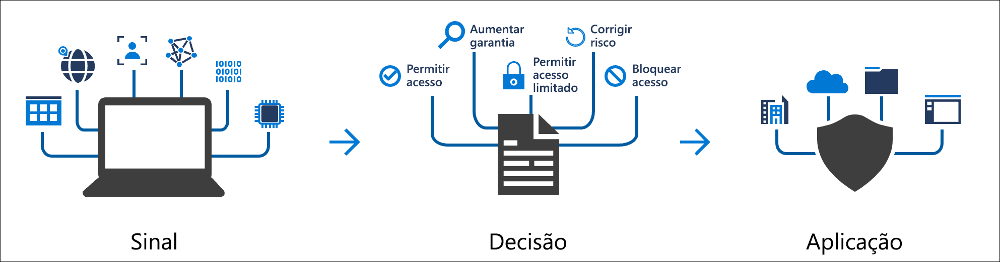
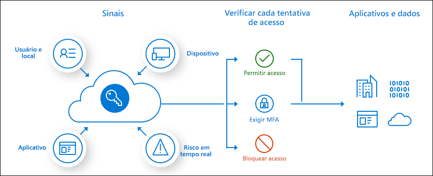

# O que é Acesso Condicional?

O perímetro de segurança moderno agora se estende para além da rede de uma organização para incluir a identidade do usuário e do dispositivo. As organizações podem utilizar esses sinais de identidade como parte de suas decisões de controle de acesso. 

O acesso condicional é a ferramenta usada pelo Azure Active Directory para reunir sinais, tomar decisões e impor políticas organizacionais. O acesso condicional está no centro do novo plano de controle controlado por identidade.

Em sua definição mais simples, as políticas de acesso condicional são instruções if-then, se um usuário quiser acessar um recurso, então ele deverá concluir uma ação. Exemplo: Um gerente de folha de pagamento deseja acessar o aplicativo de folha de pagamento e deve executar a autenticação multifator para acessá-lo.

Os administradores enfrentam dois objetivos principais:

- Capacitar os usuários para serem produtivos sempre e em qualquer lugar
- Proteger os ativos da organização

Usando as políticas de acesso condicional, você pode aplicar os controles de acesso certos, quando necessário, para manter sua organização segura e não atrapalhar o usuário quando não for necessário.

As políticas de Acesso Condicional são impostas após a conclusão da autenticação multifator. O acesso condicional não se destina à primeira linha de defesa de uma organização para cenários como ataques de DoS (negação de serviço), mas pode usar sinais desses eventos para determinar o acesso.

## Sinais comuns

Os sinais comuns que o acesso condicional pode levar em conta ao tomar uma decisão sobre política incluem os seguintes sinais:

- Associação de usuário ou grupo
   - As políticas podem ser direcionadas a usuários e grupos específicos, proporcionando aos administradores um controle refinado sobre o acesso.
- Informações de localização de IP
   - As organizações podem criar intervalos de endereços IP confiáveis que podem ser usados ao tomar decisões sobre política. 
   - Os administradores podem especificar intervalos de IP de países inteiros para bloquear ou permitir o tráfego.
- Dispositivo
   - Os usuários com dispositivos de plataformas específicas ou marcados com um estado específico podem ser usados ao impor políticas de acesso condicional.
- Aplicativo
   - Os usuários que tentam acessar aplicativos específicos podem disparar diferentes políticas de acesso condicional. 
- Detecção de risco calculado e em tempo real
   - A integração de sinais ao Azure AD Identity Protection permite que as políticas de acesso condicional identifiquem o comportamento de entrada de risco. As políticas podem então forçar os usuários a realizar alterações de senha ou a autenticação multifator para reduzir seu nível de risco ou ter o acesso bloqueado até que um administrador execute uma ação manual.
- MCAS (Microsoft Cloud App Security)
   - Permite que o acesso e as sessões do aplicativo do usuário sejam monitorados e controlados em tempo real, aumentando a visibilidade e o controle sobre o acesso e as atividades executadas no ambiente de nuvem.

## Decisões comuns

- Acesso bloqueado
   - Decisão mais restritiva
- Conceder acesso
   - Decisão menos restritiva; ainda pode exigir uma ou mais das seguintes opções:
      - Exigir autenticação multifator
      - Exigir que o dispositivo seja marcado como em conformidade
      - Exigir um dispositivo ingressado no Azure AD Híbrido
      - Exigir um aplicativo cliente aprovado
      - Exigir uma política de proteção do aplicativo (versão prévia)

## Políticas comumente aplicadas

Muitas organizações têm preocupações comuns sobre o acesso, com as quais as políticas de acesso condicional podem ajudar, como:

- Exigir a autenticação multifator para usuários com funções administrativas
- Exigir a autenticação multifator para tarefas de gerenciamento do Azure
- Bloquear entradas de usuários que tentam usar protocolos de autenticação herdados
- Exigir localizações confiáveis para o registro da Autenticação Multifator do Azure
- Bloquear ou permitir acesso em localizações específicas
- Bloquear comportamentos de entrada de risco
- Exigir dispositivos gerenciados pela organização para aplicativos específicos

## Requisitos de licença

[!INCLUDE [Active Directory P1 license](../../../includes/active-directory-p1-license.md)]

Os clientes com [licenças do Microsoft 365 Business](https://docs.microsoft.com/office365/servicedescriptions/microsoft-365-service-descriptions/microsoft-365-business-service-description) também têm acesso a recursos de Acesso Condicional. 

## Próximas etapas

[Como criar uma política de acesso condicional por partes](concept-conditional-access-policies.md)

Para saber como implementar o Acesso Condicional em seu ambiente, confira [Planejar a implantação do Acesso Condicional no Azure Active Directory](plan-conditional-access.md).

[Sais mais sobre o Identity Protection](../identity-protection/overview-v2.md)

[Saiba mais sobre o Microsoft Cloud App Security](https://docs.microsoft.com/cloud-app-security/what-is-cloud-app-security)

[Saiba mais sobre o Microsoft Intune](https://docs.microsoft.com/intune/index)