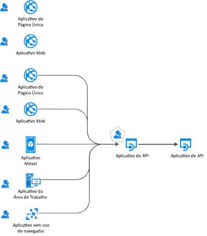
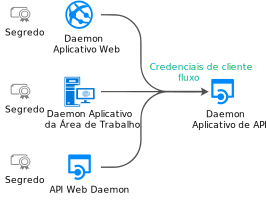

# Fluxos de autenticação e cenários de aplicativos

O ponto de extremidade da plataforma de identidade da Microsoft (v2.0) dá suporte à autenticação para diversas arquiteturas de aplicativos modernas, todas baseadas em protocolos padrão da indústria [OAuth 2.0 ou OpenID Connect](active-directory-v2-protocols.md).  Usando as [bibliotecas de autenticação](reference-v2-libraries.md), os aplicativos autenticam identidades e adquirem tokens para acessar APIs protegidas. Este artigo descreve os diferentes fluxos de autenticação e os cenários de aplicativos nos quais eles são usados.  Este artigo também fornece listas de [cenários de aplicativos e fluxos de autenticação com suporte](#scenarios-and-supported-authentication-flows) e [cenários de aplicativos e plataformas e idiomas com suporte](#scenarios-and-supported-platforms-and-languages).

## Categorias de aplicativo

Os tokens podem ser adquiridos de vários tipos de aplicativos: aplicativos Web, aplicativos móveis ou da área de trabalho, APIs Web e aplicativos em execução em dispositivos que não tenham um navegador (ou IoT). Os aplicativos podem ser categorizados pelo seguinte:

- [Recursos protegidos comparados com aplicativos cliente](#protected-resources-vs-client-applications). Alguns cenários são sobre a proteção de recursos (aplicativos Web ou APIs Web) e outros são sobre a aquisição de um token de segurança para chamar uma API Web protegida.
- [Com usuários ou sem usuários](#with-users-or-without-users). Alguns cenários envolvem um usuário conectado; já outros não envolvem um usuário (cenários de daemon).
- [Aplicativos de página única, aplicativos cliente públicos e aplicativos cliente confidenciais](#single-page-applications-public-client-applications-and-confidential-client-applications). Essas três são grandes categorias de tipos de aplicativos. As bibliotecas e os objetos usados para manipulá-los serão diferentes.
- [Conectar o público](v2-supported-account-types.md#certain-authentication-flows-dont-support-all-the-account-types). Alguns fluxos de autenticação não estão disponíveis para determinados públicos-alvo. Alguns fluxos estão disponíveis apenas para contas corporativas ou de estudante; outros estão disponíveis para contas corporativas ou de estudante e para contas Microsoft pessoais. O público permitido depende dos fluxos de autenticação.
- [Fluxos OAuth 2.0 com suporte](#scenarios-and-supported-authentication-flows).  Os fluxos de autenticação são usados para implementar os cenários de aplicativos que exigem tokens.  Não há um mapeamento individualizado entre cenários de aplicativos e fluxos de autenticação.
- [Plataformas com suporte](#scenarios-and-supported-platforms-and-languages). Nem todos os cenários de aplicativos estão disponíveis para todas as plataformas.

### Recursos protegidos comparados com aplicativos cliente

Os cenários de autenticação envolvem duas atividades:

- **Aquisição de tokens de segurança** para uma API Web protegida. A Microsoft recomenda que você use [bibliotecas de autenticação](reference-v2-libraries.md#microsoft-supported-client-libraries) para adquirir tokens, especialmente a família MSAL (bibliotecas de autenticação da Microsoft)
- **Proteção de uma API Web** (ou um aplicativo Web). Um dos desafios de proteger um recurso (aplicativo Web ou API Web) é a validação do token de segurança. A Microsoft oferece, em algumas plataformas, [bibliotecas de middleware](reference-v2-libraries.md#microsoft-supported-server-middleware-libraries).

### Com usuários ou sem usuários

A maioria dos cenários de autenticação adquire tokens em nome de um **usuário** (conectado).

No entanto, também há cenários (aplicativos daemon) em que os aplicativos adquirirão tokens em seus próprios nomes (sem usuário).

### Aplicativos de página única, aplicativos cliente públicos e aplicativos cliente confidenciais

Os tokens de segurança podem ser adquiridos de vários tipos de aplicativos. Os aplicativos tendem a ser divididos em três categorias:

- Os **SPAs** (aplicativos de página única) são um formulário de aplicativos Web em que os tokens são adquiridos do aplicativo em execução no navegador (codificado em JavaScript ou Typescript). Muitos aplicativos modernos têm um aplicativo de página única front-end que é escrito principalmente em JavaScript. Geralmente, o aplicativo é codificado usando uma estrutura como Angular, React ou Vue. MSAL.js é a única biblioteca de autenticação da Microsoft que dá suporte a aplicativos de página única.

- Os **aplicativos cliente públicos** sempre conectam usuários. Os aplicativos são:
  - Aplicativos da área de trabalho que chamam APIs Web em nome do usuário conectado.
  - Aplicativos móveis.
  - Uma terceira categoria de aplicativos, em execução em dispositivos que não tenham um navegador (aplicativos sem navegador em execução no IoT, por exemplo).

  Eles são representados pela classe MSAL chamada [PublicClientApplication](msal-client-applications.md).

- **Aplicativos cliente confidenciais**
  - Aplicativos Web que chamam uma API Web
  - APIs Web que chamam uma API Web
  - Aplicativos daemon (mesmo quando implementados como um serviço de console, como um daemon no Linux ou um serviço do Windows)
 
  Esses tipos de aplicativos usam o [ConfidentialClientApplication](msal-client-applications.md)

## Cenários de aplicativos

O ponto de extremidade da plataforma de identidade da Microsoft dá suporte à autenticação de várias arquiteturas de aplicativo: aplicativos de página única, aplicativos Web, APIs Web, aplicativos móveis e nativos, além de daemons e aplicativos do lado do servidor.  Os aplicativos usam os vários fluxos de autenticação para conectar usuários e obter tokens para chamar APIs protegidas.

### Aplicativo de página única

Muitos aplicativos Web modernos são criados como aplicativos de página única do lado do cliente escritos usando JavaScript ou uma estrutura SPA, tal como Angular, Vue.js e React.js. Esses aplicativos são executados em um navegador da Web e têm características de autenticação diferentes dos aplicativos Web do lado do servidor tradicionais. A plataforma de identidade da Microsoft permite que aplicativos de página única conectem usuários e obtenham tokens para acessar serviços de back-end ou APIs Web.

Para obter mais informações, consulte [Aplicativos de página única](scenario-spa-overview.md).

### Aplicativo Web que conecta um usuário

Para **proteger um aplicativo Web** (conectando o usuário), você usará:

- No mundo do .NET, ASP.NET ou ASP.NET Core com o middleware ASP.NET Open ID Connect. Nos bastidores, a proteção de um recurso envolve validar o token de segurança, o que é feito pela biblioteca [Extensões IdentityModel para .NET](https://github.com/AzureAD/azure-activedirectory-identitymodel-extensions-for-dotnet/wiki), não por bibliotecas MSAL

- Se você desenvolve em Node.js, use o Passport.js.

Para obter mais informações, consulte [Aplicativo Web que faz logon de usuários](scenario-web-app-sign-user-overview.md).

### Aplicativo Web que conecta um usuário e chama uma API Web em nome dele

No aplicativo Web, para **chamar a API Web** em nome do usuário, você usa a MSAL `ConfidentialClientApplication`. Você usará o fluxo de código de autorização, armazenando o token adquirido no cache de token. Em seguida, o controlador adquirirá tokens silenciosamente do cache sempre que necessário. A MSAL atualiza o token, se necessário.

Para obter mais informações, consulte [Aplicativo Web chama APIs Web](scenario-web-app-call-api-overview.md).

### Aplicativo da área de trabalho que chama uma API Web em nome do usuário conectado

Para chamar uma API Web de um aplicativo da área de trabalho que conecta usuários, você usará os métodos de aquisição de tokens interativos do PublicClientApplication da MSAL. Esses métodos interativos permitem que você controle a experiência de interface do usuário de entrada. Para permitir essa interação, a MSAL aproveita um navegador da Web.

Para aplicativos hospedados do Windows em execução em computadores ingressados em um domínio do Windows ou ingressado no AAD, há outra possibilidade. Esses aplicativos podem adquirir um token silenciosamente usando a [Autenticação Integrada do Windows](https://aka.ms/msal-net-iwa).

Os aplicativos em execução em um dispositivo sem um navegador continuarão podendo chamar uma API em nome de um usuário. Para autenticar, o usuário precisará entrar em outro dispositivo que tenha um navegador da Web. Para habilitar esse cenário, você precisará usar o [Fluxo de código do dispositivo](https://aka.ms/msal-net-device-code-flow)

Por fim, embora não seja recomendado, você pode usar o [Nome de Usuário/Senha](https://aka.ms/msal-net-up) em aplicativos cliente públicos. Esse fluxo ainda é necessário em alguns cenários (como DevOps), mas lembre-se de que seu uso imporá restrições ao aplicativo. Por exemplo, os aplicativos que usam esse fluxo não poderão conectar um usuário que precise realizar a autenticação multifator (acesso condicional). Ele também não permitirá que seu aplicativo se beneficie de logon único. A autenticação com nome de usuário/senha vai contra os princípios da autenticação moderna e só é oferecido por ser herdado.

Em aplicativos da área de trabalho, se você quiser que o cache de token seja persistente, precisará [personalizar a serialização do cache de token](https://aka.ms/msal-net-token-cache-serialization). Você pode até mesmo habilitar caches de token compatíveis com versões anteriores e posteriores que tenham gerações anteriores de bibliotecas de autenticação (ADAL.NET 3.x e 4.x) pela implementação da [serialização de cache de token duplo](https://aka.ms/msal-net-dual-cache-serialization).

Para obter mais informações, consulte [Aplicativo da área de trabalho que chama APIs Web](scenario-desktop-overview.md).

### Aplicativo móvel que chama uma API Web em nome do usuário conectado de maneira interativa

Assim como nos aplicativos da área de trabalho, um aplicativo móvel usará os métodos de aquisição de tokens interativos PublicClientApplication da MSAL para adquirir um token a fim de chamar uma API Web.

A MSAL iOS e a MSAL Android usam, por padrão, o navegador da Web do sistema. No entanto, você pode instruí-lo a usar a exibição da Web inserida. Existem especificidades, dependendo da plataforma móvel: (UWP, iOS, Android).

Alguns cenários que envolvem o acesso condicional relacionado à ID do dispositivo ou um dispositivo que esteja sendo registrado exigem a instalação de um [agente](https://github.com/AzureAD/azure-activedirectory-library-for-dotnet/wiki/leveraging-brokers-on-Android-and-iOS) em um dispositivo. Alguns exemplos de agentes incluem o portal da empresa Microsoft (no Android) e o Microsoft Authenticator (Android e iOS). A MSAL agora é capaz de interagir com os agentes.

> [!NOTE]
> Seu aplicativo móvel (usando MSAL.iOS, MSAL.Android ou MSAL.NET/Xamarin) pode ter políticas de proteção de aplicativo aplicadas a ele (por exemplo, que impeça que o usuário copie texto protegido). Ele é [gerenciado pelo Intune](https://docs.microsoft.com/intune/app-sdk) e reconhecido pelo Intune como um aplicativo gerenciado. O [SDK do Intune](https://docs.microsoft.com/intune/app-sdk-get-started) é separado das bibliotecas MSAL e se comunica com o AAD por conta própria.

Para obter mais informações, consulte [Aplicativo móvel que chama APIs Web](scenario-mobile-overview.md).

### API Web protegida

Você pode usar o ponto de extremidade da plataforma de identidade da Microsoft para proteger serviços Web, como a API Web RESTful do seu aplicativo. Uma API Web protegida é chamada com um token de acesso para proteger seus dados e autenticar solicitações de entrada. O chamador de uma API Web acrescenta um token de acesso ao cabeçalho de autorização de uma solicitação HTTP. Se você quiser proteger sua API Web ASP.NET ou ASP.NET Core, será necessário validar o token de acesso. Para isso, você usará o middleware JWT ASP.NET. Nos bastidores, a validação é feita pela biblioteca [Extensões IdentityModel para .NET](https://github.com/AzureAD/azure-activedirectory-identitymodel-extensions-for-dotnet/wiki), não por MSAL.NET

Para obter mais informações, consulte [API Web protegida](scenario-protected-web-api-overview.md).

### A API Web que chama outra API Web downstream em nome do usuário para o qual ela foi chamada

Se, além disso, você quiser que sua API Web protegida por ASP.NET ou ASP.NET Core chame outra API Web em nome do usuário, o aplicativo precisará adquirir um token para a API Web downstream usando o método de ConfidentialClientApplication Como adquirir um token em [nome de um usuário](https://aka.ms/msal-net-on-behalf-of). Isso também é chamado de chamadas serviço a serviço.
As APIs Web que chamam outra API Web também precisarão fornecer uma serialização de cache personalizada

  

Para obter mais informações, confira [API Web que chama APIs Web](scenario-web-api-call-api-overview.md).

### Aplicativo da área de trabalho/de serviço ou daemon Web que chama a API Web sem um usuário (em seu próprio nome)

Os aplicativos com processos de longa duração ou que operam sem interação com um usuário também precisam de uma maneira de acessar APIs Web protegidas. Esses aplicativos podem autenticar e obter tokens usando a identidade do aplicativo em vez da identidade delegada de um usuário. Eles provam sua identidade usando um segredo ou certificado do cliente.
Você pode codificar tais aplicativos (aplicativo daemon) adquirindo um token para o aplicativo junto com o uso dos métodos de aquisição de [credenciais de cliente](https://aka.ms/msal-net-client-credentials) do ConfidentialClientApplication da MSAL. Eles pressupõem que o aplicativo registrou anteriormente um segredo (senha de aplicativo ou certificado ou declaração de cliente) no Azure AD, que é compartilhado nessa chamada.

Para obter mais informações, consulte [Aplicativo daemon que chama APIs Web](scenario-daemon-overview.md).

## Cenários e fluxos de autenticação com suporte

Os cenários que envolvem a aquisição de tokens também são mapeados para os fluxos de autenticação OAuth 2.0 descritos em detalhes nos [Protocolos da plataforma de identidade da Microsoft](active-directory-v2-protocols.md)

|Cenário | Passo a passo detalhado do cenário | Fluxo/concessão do OAuth 2.0 | Público-alvo |
|--|--|--|--|
|  | [Aplicativo de página única](scenario-spa-overview.md) | [Implícito](v2-oauth2-implicit-grant-flow.md) | Contas corporativas ou de estudante e contas pessoais, B2C
|  | [Aplicativo Web que conecta os usuários](scenario-web-app-sign-user-overview.md) | [Código de autorização](v2-oauth2-auth-code-flow.md) | Contas corporativas ou de estudante e contas pessoais, B2C |
|  | [Aplicativo Web que chama as APIs Web](scenario-web-app-call-api-overview.md) | [Código de autorização](v2-oauth2-auth-code-flow.md) | Contas corporativas ou de estudante e contas pessoais, B2C |
|  | [Aplicativo da área de trabalho que chama APIs Web](scenario-desktop-overview.md)| Interativo ([Código de Autorização](v2-oauth2-auth-code-flow.md) com PKCE) | Contas corporativas ou de estudante e contas pessoais, B2C |
| | | Windows integrado | Contas corporativas ou de estudante |
| | | [Senha de proprietário do recurso](v2-oauth-ropc.md)  | Contas corporativas ou de estudante, B2C |
| | [Aplicativo da área de trabalho que chama APIs Web](scenario-desktop-overview.md) | [Código do dispositivo](v2-oauth2-device-code.md)  | Contas corporativas ou de estudante* |
|  | [Aplicativo móvel que chama as APIs Web](scenario-mobile-overview.md) | Interativo ([Código de Autorização](v2-oauth2-auth-code-flow.md) com PKCE)  |   Contas corporativas ou de estudante e contas pessoais, B2C
| | | Senha de proprietário do recurso  | Contas corporativas ou de estudante, B2C |
|  | [Aplicativo daemon](scenario-daemon-overview.md) | [Credenciais do cliente](v2-oauth2-client-creds-grant-flow.md)  |   Permissões somente do aplicativo (sem usuário) somente em organizações do AAD
|  | [API Web que chama as APIs Web](scenario-web-api-call-api-overview.md)| [Em nome de](v2-oauth2-on-behalf-of-flow.md) | Contas corporativas ou de estudante e contas pessoais |

## Cenários e plataformas e idiomas com suporte

Nem todo tipo de aplicativo está disponível em todas as plataformas. Você também pode usar várias linguagens para compilar seus aplicativos. As bibliotecas de autenticação da Microsoft dão suporte a várias **plataformas** (JavaScript, .NET Framework, .NET Core, Windows 10/UWP, Xamarin.iOS, Xamarin.Android, iOS nativo, Android nativo, Java, Python)

|Cenário  | Windows | Linux | Mac | iOS | Android
|--|--|--|--|--|--|--|
| [Aplicativo de página única](scenario-spa-overview.md)   |  MSAL.js |  MSAL.js |  MSAL.js |  MSAL.js |  MSAL.js
| [Aplicativo Web que conecta os usuários](scenario-web-app-sign-user-overview.md)   |   ASP.NET ASP.NET Core | ASP.NET Core | ASP.NET Core
| [Aplicativo Web que chama as APIs Web](scenario-web-app-call-api-overview.md)    |    ASP.NET + MSAL.NET   ASP.NET Core + MSAL.NET  msal4j  Flask + MSAL Python| ASP.NET Core + MSAL.NET  msal4j  Flask + MSAL Python| ASP.NET Core + MSAL.NET  msal4j  Flask + MSAL Python
| [Aplicativo da área de trabalho que chama APIs Web](scenario-desktop-overview.md)     |   MSAL.NET  MSAL.NET  msal4j  MSAL Python| MSAL.NET  msal4j  MSAL Python|  MSAL.NET  msal4j  MSAL Python
| [Aplicativo móvel que chama as APIs Web](scenario-mobile-overview.md)    |  MSAL.NET  MSAL.NET | | |  MSAL.iOS |  MSAL.Android
| [Aplicativo daemon](scenario-daemon-overview.md)    |  MSAL.NET MSAL.NET  msal4j  MSAL Python|  MSAL.NET  msal4j  MSAL Python| MSAL.NET  msal4j  MSAL Python
| [API Web que chama as APIs Web](scenario-web-api-call-api-overview.md)    |    ASP.NET + MSAL.NET    ASP.NET Core + MSAL.NET|    ASP.NET Core + MSAL.NET|   ASP.NET Core + MSAL.NET

Confira também [Bibliotecas compatíveis com a Microsoft por sistema operacional/linguagem de programação](reference-v2-libraries.md#microsoft-supported-libraries-by-os--language)

## Próximas etapas
Saiba mais sobre as [noções básicas de autenticação](authentication-scenarios.md) e os [tokens de acesso](access-tokens.md).