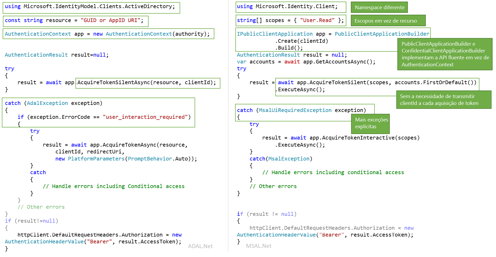

# <a name="migrating-applications-to-msalnet"></a>Migrar aplicativos para MSAL.NET

Tanto a Biblioteca de Autenticação da Microsoft para .NET (MSAL.NET) quanto a Biblioteca de Autenticação do Active Directory para .NET (ADAL.NET) são usadas para autenticar as entidades do Azure AD e solicitar tokens a partir do Azure AD. Até agora, a maioria dos desenvolvedores trabalhava com o Azure AD para plataforma de desenvolvedores (v1.0) a fim de autenticar identidades do Azure AD (contas corporativas e de estudante) por meio da solicitação de tokens usando a Biblioteca de Autenticação do Active Directory (ADAL). Agora, com a MSAL.NET, você consegue autenticar um conjunto mais amplo de identidades da Microsoft (identidades do Azure AD e contas da Microsoft, além de contas sociais e locais por meio do Azure AD B2C) usando o ponto de extremidade da plataforma de identidade da Microsoft. 

Este artigo descreve como escolher entre a Biblioteca de Autenticação da Microsoft para .NET (MSAL.NET) e a Biblioteca de Autenticação do Active Directory para .NET (ADAL.NET) e compara as duas bibliotecas.  

## <a name="differences-between-adal-and-msal-apps"></a>Diferenças entre aplicativos ADAL e MSAL
Na maioria dos casos, convém usar a MSAL.NET e o ponto de extremidade da plataforma de identidade da Microsoft, que é a última geração de bibliotecas de autenticação da Microsoft. Ao usar a MSAL.NET, você adquire tokens para que os usuários acessem seu aplicativo por meio do Azure AD (contas corporativas e de estudante), conta Microsoft (pessoal) (MSA) ou Azure AD B2C. 

Se já estiver familiarizado com o ponto de extremidade do Azure AD para desenvolvedores (v1.0) (e a ADAL.NET), leia o artigo  [Qual é a diferença entre o ponto de extremidade da plataforma (v2.0) da identidade da Microsoft?](active-directory-v2-compare.md).

No entanto, ainda será necessário usar a ADAL.NET se o aplicativo precisar conectar usuários com versões anteriores dos [Serviços de Federação do Active Directory (AD FS)](/windows-server/identity/active-directory-federation-services). Para obter mais detalhes, consulte o [suporte ADFS](https://aka.ms/msal-net-adfs-support).

A figura a seguir resume algumas das diferenças entre ADAL.NET e MSAL.NET 

### <a name="nuget-packages-and-namespaces"></a>Pacotes NuGet e Namespaces

A ADAL.NET é consumida do pacote NuGet [Microsoft.IdentityModel.Clients.ActiveDirectory](https://www.nuget.org/packages/Microsoft.IdentityModel.Clients.ActiveDirectory). Namespace a ser usado: `Microsoft.IdentityModel.Clients.ActiveDirectory`.

Para usar a MSAL.NET, você precisará adicionar o pacote NuGet [Microsoft.Identity.Client](https://www.nuget.org/packages/Microsoft.Identity.Client) e usar o namespace `Microsoft.Identity.Client`

### <a name="scopes-not-resources"></a>Escopos não recursos

A ADAL.NET adquire tokens para *recursos*, já a MSAL.NET adquire tokens para *escopos*. Algumas substituições de AcquireToken da MSAL.NET exigem um parâmetro chamado scopes (`IEnumerable<string> scopes`). Esse parâmetro é uma lista simples de cadeias de caracteres que declaram as permissões e os recursos desejados que são solicitados. Os [escopos do Microsoft Graph](/graph/permissions-reference) são bem conhecidos.

Na MSAL.NET, também é possível acessar recursos da versão 1.0. Consulte os detalhes em [Escopos para um aplicativo v1.0](#scopes-for-a-web-api-accepting-v10-tokens). 

### <a name="core-classes"></a>Classes de núcleo

- A ADAL.NET usa [AuthenticationContext](https://github.com/AzureAD/azure-activedirectory-library-for-dotnet/wiki/AuthenticationContext:-the-connection-to-Azure-AD) como representação de sua conexão com o STS (Serviço de Token de Segurança) ou servidor de autorização, por meio de uma autoridade. Já a MSAL.NET é desenvolvida com base em [aplicativos cliente](https://github.com/AzureAD/microsoft-authentication-library-for-dotnet/wiki/Client-Applications). Ela fornece duas classes separadas: `PublicClientApplication` e `ConfidentialClientApplication`

- Adquirir tokens: A ADAL.NET e MSAL.NET têm as mesmas chamadas de autenticação (`AcquireTokenAsync` e `AcquireTokenSilentAsync` para ADAL.NET, e `AqquireTokenInteractive` e `AcquireTokenSilent` na MSAL.NET), mas com parâmetros diferentes necessários. Uma diferença é o fato de que, na MSAL.NET, não é mais necessário passar por `ClientID` do aplicativo em todas as chamadas AcquireTokenXX. Na verdade, `ClientID` é definido apenas uma vez ao criar (`IPublicClientApplication` ou `IConfidentialClientApplication`).

### <a name="iaccount-not-iuser"></a>IAccount não IUser

Usuários manipulados da ADAL.NET. No entanto, um usuário é um agente de software ou um humano, mas pode ter/possuir/ser responsável por uma ou mais contas no sistema de identidade da Microsoft (várias contas do Azure AD B2C, Azure AD B2C, contas pessoais da Microsoft). 

A MSAL.NET 2.x agora define o conceito de Conta (por meio da interface de IAccount). Essa alteração da falha fornece a semântica correta: o fato de que o mesmo usuário pode ter várias contas, em diferentes diretórios do Azure AD. A MSAL.NET também fornece melhores informações nos cenários de convidado, já que as informações da conta inicial são fornecidas.

Para obter mais informações sobre as diferenças entre IUser e IAccount, consulte [MSAL.NET 2.x](https://aka.ms/msal-net-2-released).

### <a name="exceptions"></a>Exceções

#### <a name="interaction-required-exceptions"></a>Exceções de interação necessária

A MSAL.NET tem exceções mais explícitas. Por exemplo, quando a autenticação silenciosa falha na ADAL, o procedimento é capturar a exceção e procurar o código de erro `user_interaction_required`:

```csharp
catch(AdalException exception)
{
 if (exception.ErrorCode == “user_interaction_required”)
 {
  try
  {“try to authenticate interactively”}}
 }
}
```

Consulte os detalhes em [Padrão recomendado para adquirir um token](https://github.com/AzureAD/azure-activedirectory-library-for-dotnet/wiki/AcquireTokenSilentAsync-using-a-cached-token#recommended-pattern-to-acquire-a-token) com a ADAL.NET

Usando a MSAL.NET, você captura `MsalUiRequiredException` conforme descrito em [AcquireTokenSilent](https://github.com/AzureAD/microsoft-authentication-library-for-dotnet/wiki/AcquireTokenSilentAsync-using-a-cached-token).

```csharp
catch(MsalUiRequiredException exception)
{
 try {“try to authenticate interactively”}
}
```

#### <a name="handling-claim-challenge-exceptions"></a>Tratamento das exceções de desafio de declaração

Na ADAL.NET, as exceções de desafio de declaração são tratadas da seguinte forma:

- `AdalClaimChallengeException` é uma exceção (derivada de `AdalServiceException`) lançada pelo serviço no caso de um recurso exigir mais declarações do usuário (por exemplo, autenticação de dois fatores). O membro `Claims` contém algum fragmento JSON com as declarações, que são esperadas.
- Ainda na ADAL.NET, o aplicativo cliente público que recebe essa exceção precisa chamar a substituição `AcquireTokenInteractive` com um parâmetro de declaração. Essa substituição de `AcquireTokenInteractive` não tenta atingir o cache, pois isso não é necessário. O motivo é que o token no cache não tem as declarações corretas (caso contrário, um `AdalClaimChallengeException` não teria sido lançado). Portanto, não há necessidade de examinar o cache. Observe que `ClaimChallengeException` pode ser recebido em uma API Web fazendo OBO, enquanto `AcquireTokenInteractive` precisa ser chamado em um aplicativo cliente público que chama essa API Web.
- Para obter detalhes, incluindo exemplos, consulte Tratar [AdalClaimChallengeException](https://github.com/AzureAD/azure-activedirectory-library-for-dotnet/wiki/Exceptions-in-ADAL.NET#handling-adalclaimchallengeexception)

Na MSAL.NET, as exceções de desafio de declaração são tratadas da seguinte forma:

- `Claims` são apresentados em `MsalServiceException`.
- Há um método `.WithClaim(claims)` que pode ser aplicado ao construtor `AcquireTokenInteractive`. 

### <a name="supported-grants"></a>Concessões com suporte

Nem todas as concessões ainda têm suporte na MSAL.NET e no ponto de extremidade v 2.0. A seguir, é apresentado um resumo comparando as concessões com suporte da ADAL.NET e MSAL.NET.

#### <a name="public-client-applications"></a>Aplicativos cliente públicos

Veja as seguintes concessões com suporte na ADAL.NET e MSAL.NET para aplicativos Móveis e da Área de Trabalho

Concessão | ADAL.NET | MSAL.NET
----- |----- | -----
Interativo | [Autenticação Interativa](https://github.com/AzureAD/azure-activedirectory-library-for-dotnet/wiki/Acquiring-tokens-interactively---Public-client-application-flows) | [Adquirir tokens interativamente na MSAL.NET](https://github.com/AzureAD/microsoft-authentication-library-for-dotnet/wiki/Acquiring-tokens-interactively)
Autenticação Integrada do Windows | [Autenticação integrada no Windows (Kerberos)](https://github.com/AzureAD/azure-activedirectory-library-for-dotnet/wiki/AcquireTokenSilentAsync-using-Integrated-authentication-on-Windows-(Kerberos)) | [Autenticação Integrada do Windows](msal-authentication-flows.md#integrated-windows-authentication)
Nome de usuário + senha | [Adquirir tokens com nome de usuário e senha](https://github.com/AzureAD/azure-activedirectory-library-for-dotnet/wiki/Acquiring-tokens-with-username-and-password)| [Autenticação de Senha do Nome de Usuário](msal-authentication-flows.md#usernamepassword)
Fluxo de código do dispositivo | [Perfil de dispositivo para dispositivos sem navegadores web](https://github.com/AzureAD/azure-activedirectory-library-for-dotnet/wiki/Device-profile-for-devices-without-web-browsers) | [Fluxo de código do dispositivo](msal-authentication-flows.md#device-code)

#### <a name="confidential-client-applications"></a>Aplicativos cliente confidenciais

Aqui estão as concessões com suporte no ADAL.NET e MSAL.NET para aplicativos Web, APIs Web e aplicativos daemon:

Tipo de aplicativo | Concessão | ADAL.NET | MSAL.NET
----- | ----- | ----- | -----
Aplicativo Web, API Web, daemon | Credenciais do cliente | [Fluxos de credencial do cliente na ADAL.NET](https://github.com/AzureAD/azure-activedirectory-library-for-dotnet/wiki/Client-credential-flows) | [Fluxos de credencial do cliente na MSAL.NET](msal-authentication-flows.md#client-credentials))
API Web | Em nome de | [Serviço para chamadas de serviço em nome do usuário com ADAL.NET](https://github.com/AzureAD/azure-activedirectory-library-for-dotnet/wiki/Service-to-service-calls-on-behalf-of-the-user) | [On-Behalf-Of (em nome de) na MSAL.NET](msal-authentication-flows.md#on-behalf-of)
Aplicativo Web | Código de Autenticação | [Adquirir tokens com códigos de autorização em aplicativos Web com ADAL.NET](https://github.com/AzureAD/azure-activedirectory-library-for-dotnet/wiki/Acquiring-tokens-with-authorization-codes-on-web-apps) | [Adquirir tokens com códigos de autorização em aplicativos Web com uma MSAL.NET](msal-authentication-flows.md#authorization-code)

### <a name="cache-persistence"></a>Persistência de cache

A ADAL.NET permite que você estenda a classe `TokenCache` para implementar a funcionalidade de persistência desejada nas plataformas sem um armazenamento seguro (.NET Framework e .NET Core) usando os métodos `BeforeAccess` e `BeforeWrite`. Para obter detalhes, consulte [Serialização de Cache de Token em ADAL.NET](https://github.com/AzureAD/azure-activedirectory-library-for-dotnet/wiki/Token-cache-serialization).

A MSAL.NET torna o cache de token uma classe selada, removendo a capacidade de estendê-la. Portanto, a implementação de persistência de cache de token deve estar na forma de uma classe auxiliar que interage com o cache de token selado. Essa interação é descrita em [Serialização de Cache de Token em MSAL.NET](https://github.com/AzureAD/microsoft-authentication-library-for-dotnet/wiki/token-cache-serialization).

## <a name="signification-of-the-common-authority"></a>Significado da autoridade comum

Na v1.0, se você usar a autoridade https://login.microsoftonline.com/common , permitirá que os usuários entrem com qualquer conta do AAD (para qualquer organização). Consulte [Validação de autoridade na ADAL.NET](https://github.com/AzureAD/azure-activedirectory-library-for-dotnet/wiki/AuthenticationContext:-the-connection-to-Azure-AD#authority-validation)

Se você usar a autoridade https://login.microsoftonline.com/common na v2.0, permitirá que os usuários entrem com qualquer conta pessoal da Microsoft (MSA) ou da organização do AAD. Na MSAL.NET, se você quiser restringir logon a qualquer conta do AAD (Azure Active Directory) (mesmo comportamento da ADAL.NET), será necessário usar https://login.microsoftonline.com/organizations. Para obter detalhes, consulte o parâmetro `authority` no [aplicativo cliente público](https://github.com/AzureAD/microsoft-authentication-library-for-dotnet/wiki/Client-Applications#publicclientapplication).

## <a name="v10-and-v20-tokens"></a>Tokens v1.0 e v2.0

Há duas versões de tokens:
- Tokens v1.0
- Tokens v2.0 

O ponto de extremidade v1.0 (usado pela ADAL) só emite tokens v1.0.

No entanto, o ponto de extremidade v2.0 (usado pela MSAL) emite a versão do token que aceita a API Web. Uma propriedade de manifesto do aplicativo de API Web permite que os desenvolvedores escolham qual versão do token é aceita. Consulte `accessTokenAcceptedVersion` na documentação de referência do [Manifesto do aplicativo](reference-app-manifest.md).

Para obter mais informações sobre tokens v1.0 e v2.0, consulte [Tokens de acesso do Azure Active Directory](access-tokens.md)

## <a name="scopes-for-a-web-api-accepting-v10-tokens"></a>Escopos para uma API Web que aceita tokens v1.0

As permissões do OAuth2 são escopos de permissão que um aplicativo de API Web v1.0 (recurso) expõe a aplicativos cliente. Os escopos de permissões podem ser concedidos a aplicativos cliente durante o consentimento. Consulte a seção sobre oauth2Permissions no [manifesto do aplicativo do Azure Active Directory](active-directory-application-manifest.md).

### <a name="scopes-to-request-access-to-specific-oauth2-permissions-of-a-v10-application"></a>Escopos para solicitar acesso a permissões específicas do OAuth2 de um aplicativo v1.0

Se você quiser adquirir tokens para escopos específicos de um aplicativo v1.0 (por exemplo, a API do Graph do AAD que é https://graph.windows.net) , será necessário criar `scopes` concatenando um identificador de recurso desejado com uma permissão do OAuth2 desejada para esse recurso.

Por exemplo, para acessar em nome do usuário uma API Web v1.0 cujo URI da ID do Aplicativo é `ResourceId`, convém usar:

```csharp
var scopes = new [] {  ResourceId+"/user_impersonation"};
```

Se você quiser ler e gravar com a MSAL.NET do Azure Active Directory usando a API do Graph do AAD (https://graph.windows.net/) , crie uma lista de escopos, como no snippet a seguir:

```csharp
ResourceId = "https://graph.windows.net/";
var scopes = new [] { ResourceId + “Directory.Read”, ResourceID + “Directory.Write”}
```

#### <a name="warning-should-you-have-one-or-two-slashes-in-the-scope-corresponding-to-a-v10-web-api"></a>Aviso: É necessário ter uma ou duas barras no escopo correspondente a uma API Web v1.0

Se você quiser gravar o escopo correspondente à API do Azure Resource Manager (https://management.core.windows.net/) , será necessário solicitar o seguinte escopo (observe as duas barras) 

```csharp
var scopes = new[] {"https://management.core.windows.net//user_impersonation"};
var result = await app.AcquireTokenInteractive(scopes).ExecuteAsync();

// then call the API: https://management.azure.com/subscriptions?api-version=2016-09-01
```

Isso porque a API do Resource Manager espera uma barra na declaração da audiência (`aud`) e, em seguida, haverá uma barra para separar o nome da API do escopo.

A lógica usada pelo Azure AD é a seguinte:
- Para ponto de extremidade da ADAL (v1.0) com um token de acesso v1.0 (o único possível), aud=resource
- Para MSAL (ponto de extremidade v2.0) solicitando um token de acesso para um recurso que aceita tokens v2.0, aud=resource.AppId
- Para MSAL (ponto de extremidade v2.0) solicitando um token de acesso para um recurso que aceita um token de acesso v1.0 (que é o caso acima), o Azure AD analisa a audiência desejada do escopo solicitado, assumindo tudo antes da última barra e usando como identificador de recursos. Portanto, se https:\//database.windows.net espera um público de "https://database.windows.net/ ", você precisará solicitar um escopo de https:\/ /database.windows.net//.default. Consulte também o problema #[747](https://github.com/AzureAD/microsoft-authentication-library-for-dotnet/issues/747): A barra à direita do recurso da url foi omitida, o que causou falha de autenticação de sql #747


### <a name="scopes-to-request-access-to-all-the-permissions-of-a-v10-application"></a>Escopos para solicitar acesso a todas as permissões de um aplicativo v1.0

Por exemplo, se você quiser adquirir um token para todos os escopos estáticos de um aplicativo de v1.0, será necessário usar

```csharp
ResourceId = "someAppIDURI";
var scopes = new [] {  ResourceId+"/.default"};
```

### <a name="scopes-to-request-in-the-case-of-client-credential-flow--daemon-app"></a>Escopos a serem solicitados no caso de fluxo de credencial do cliente/aplicativo daemon

No caso do fluxo de credencial do cliente, o escopo a ser aprovado também seria `/.default`. Isso informa ao Azure AD: "todas as permissões no nível de aplicativo que o administrador consentiu no registro do aplicativo.

## <a name="adal-to-msal-migration"></a>Migração de ADAL para MSAL

Na ADAL.NET v2. X, os tokens de atualização foram expostos, permitindo que você desenvolva soluções em torno do uso desses tokens, armazenando-os em cache e usando os métodos `AcquireTokenByRefreshToken` fornecidos pela ADAL 2. x. Algumas dessas soluções foram usadas em cenários como:
* Serviços de execução prolongada que realizam ações, incluindo a atualização de painéis em nome dos usuários, enquanto os usuários não estão mais conectados. 
* Cenários WebFarm para permitir que o cliente traga o RT (gatilho direto) para o serviço Web (o cache é feito no lado do cliente, cookie criptografado, e não do servidor)

Esse não é o caso da MSAL.NET, no entanto, não é mais recomendável utilizar tokens de atualização dessa maneira  por motivos de segurança. Isso dificultaria a migração para a MSAL 3.x, pois a API não fornece uma maneira de aprovar tokens de atualização adquiridos anteriormente. 

Felizmente, a MSAL.NET agora tem uma API que permite migrar os tokens de atualização anteriores para `IConfidentialClientApplication` 

```CSharp
/// <summary>
/// Acquires an access token from an existing refresh token and stores it and the refresh token into 
/// the application user token cache, where it will be available for further AcquireTokenSilent calls.
/// This method can be used in migration to MSAL from ADAL v2 and in various integration 
/// scenarios where you have a RefreshToken available. 
/// (see https://aka.ms/msal-net-migration-adal2-msal2)
/// </summary>
/// <param name="scopes">Scope to request from the token endpoint. 
/// Setting this to null or empty will request an access token, refresh token and ID token with default scopes</param>
/// <param name="refreshToken">The refresh token from ADAL 2.x</param>
IByRefreshToken.AcquireTokenByRefreshToken(IEnumerable<string> scopes, string refreshToken);
```
 
Com esse método, é possível fornecer o token de atualização usado anteriormente junto com todos os escopos (recursos) desejados. O token de atualização será trocado por um novo e armazenado em cache no aplicativo.  

Como esse método é destinado a cenários atípicos, ele não estará prontamente acessível com `IConfidentialClientApplication` sem primeiro convertê-lo para `IByRefreshToken`.

Esse snippet de código mostra alguns códigos de migração em um aplicativo cliente confidencial. `GetCachedRefreshTokenForSignedInUser` recupera o token de atualização que foi armazenado em algum armazenamento por uma versão anterior do aplicativo que usava ADAL 2.x. `GetTokenCacheForSignedInUser` desserializa um cache do usuário conectado (já que aplicativos cliente confidenciais devem ter um cache por usuário).

```csharp
TokenCache userCache = GetTokenCacheForSignedInUser();
string rt = GetCachedRefreshTokenForSignedInUser();

IConfidentialClientApplication app;
app = ConfidentialClientApplicationBuilder.Create(clientId)
 .WithAuthority(Authority)
 .WithRedirectUri(RedirectUri)
 .WithClientSecret(ClientSecret)
 .Build();
IByRefreshToken appRt = app as IByRefreshToken;
         
AuthenticationResult result = await appRt.AcquireTokenByRefreshToken(null, rt)
                                         .ExecuteAsync()
                                         .ConfigureAwait(false);
```

Você verá um token de acesso e um token de ID retornado no AuthenticationResult, enquanto o novo token de atualização é armazenado no cache.

Além disso, também é possível usar esse método para vários cenários de integração nos quais você tem um token de atualização disponível.

## <a name="next-steps"></a>Próximas etapas

Encontre mais informações sobre os escopos em [Escopos, permissões e consentimento no ponto de extremidade da plataforma de identidade da Microsoft](v2-permissions-and-consent.md)