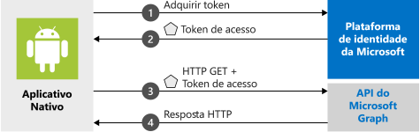

# <a name="quickstart-sign-in-users-and-call-the-microsoft-graph-api-from-an-android-app"></a>Início Rápido: Entrada de usuários e chamada à API do Microsoft Graph em um aplicativo Android

[!INCLUDE [active-directory-develop-applies-v2-msal](../../../includes/active-directory-develop-applies-v2-msal.md)]

Este início rápido contém um exemplo de código que demonstra como um aplicativo Android pode conectar contas corporativas, pessoais ou de estudante, obter um token de acesso e chamar a API do Microsoft Graph.



> [!NOTE]
> **Pré-requisitos**
> * Android Studio 
> * É necessário ter o Android 16+ 


> [!div renderon="docs"]
> ## <a name="register-and-download-your-quickstart-app"></a>Registrar e baixar o aplicativo de início rápido
> Você tem duas opções para iniciar o aplicativo de início rápido:
> * [Express] [Opção 1: Registrar e configurar o aplicativo automaticamente e, em seguida, baixar seu exemplo de código](#option-1-register-and-auto-configure-your-app-and-then-download-your-code-sample)
> * [Manual] [Opção 2: Registrar e configurar manualmente o aplicativo e o exemplo de código](#option-2-register-and-manually-configure-your-application-and-code-sample)
>
> ### <a name="option-1-register-and-auto-configure-your-app-and-then-download-your-code-sample"></a>Opção 1: Registrar e configurar o aplicativo automaticamente e, em seguida, baixar seu exemplo de código
> #### <a name="step-1-register-your-application"></a>Etapa 1: Registre seu aplicativo
> Para registrar seu aplicativo,
> 1. Acesse o novo painel do [portal do Azure – Registros de aplicativo](https://portal.azure.com/#blade/Microsoft_AAD_RegisteredApps/applicationsListBlade/quickStartType/AndroidQuickstartPage/sourceType/docs).
> 1. Insira um nome para seu aplicativo e selecione **Registrar**.
> 1. Siga as instruções para baixar e configurar automaticamente o novo aplicativo com apenas um clique.
>
> ### <a name="option-2-register-and-manually-configure-your-application-and-code-sample"></a>Opção 2: Registrar e configurar manualmente o aplicativo e o exemplo de código
>
> #### <a name="step-1-register-your-application"></a>Etapa 1: Registre seu aplicativo
> Para registrar seu aplicativo e adicionar as informações de registro do aplicativo à solução manualmente, siga estas etapas:
>
> 1. Navegue até a página [Registros de aplicativo](https://aka.ms/MobileAppReg) da plataforma de identidade da Microsoft para desenvolvedores.
> 1. Selecione **Novo registro**.
> 1. Quando a página **Registrar um aplicativo** for exibida, insira as informações de registro do aplicativo:
>      - Na seção **Nome**, insira um nome de aplicativo relevante que será exibido aos usuários do aplicativo, por exemplo, `AndroidQuickstart`.
>      - É possível ignorar outras configurações nesta página. 
>      - Pressione o `Register` botão.
> 1. Clique no novo aplicativo > acesse `Authentication` > `Add Platform` > `Android`.    
>      - Insira o Nome do Pacote em seu projeto do Android Studio. 
>      - Gere um Hash de Assinatura. Veja o portal para obter instruções.
> 1. Selecione `Configure` e salve o JSON ***Configuração de MSAL*** para uso posterior. 

> [!div renderon="portal" class="sxs-lookup"]
> #### <a name="step-1-configure-your-application"></a>Etapa 1: Configurar seu aplicativo
> Para que o exemplo de código deste Início Rápido funcione, é necessário adicionar um URI de redirecionamento compatível com o Agente de autenticação. 
> > [!div renderon="portal" id="makechanges" class="nextstepaction"]
> > [Fazer essa alteração para mim]()
>
> > [!div id="appconfigured" class="alert alert-info"]
> >  Seu aplicativo já está configurado com esses atributos

#### <a name="step-2-download-the-project"></a>Etapa 2: Baixe o projeto

* [Baixe o exemplo de código](https://github.com/Azure-Samples/active-directory-android-native-v2/archive/master.zip)

#### <a name="step-3-configure-your-project"></a>Etapa 3: Configurar seu projeto

> [!div renderon="docs"]
> Se você tiver selecionado a Opção 1 acima, poderá ignorar essas etapas. 

> [!div renderon="portal" class="sxs-lookup"]
> 1. Extraia e abra o projeto no Android Studio.
> 1. Em **app** > **src** > **main** > **res** > **raw**, abra **auth_config.json**.
> 1. Edite **auth_config.json** e substitua-o pelo JSON do portal do Azure. Se, em vez disso, você desejar fazer as alterações manualmente:
>    ```javascript
>    {
>       "client_id" : "Enter_the_Application_Id_Here",
>       "authorization_user_agent" : "DEFAULT",
>       "redirect_uri" : "Enter_the_Redirect_Uri_Here",
>       "authorities" : [
>          {
>             "type": "AAD",
>             "audience": {
>                "type": "Enter_the_Audience_Info_Here",
>                "tenant_id": "Enter_the_Tenant_Info_Here"
>             }
>          }
>       ]
>    }
>    ```
> 
> 1. Dentro de **app** > **manifests**, abra **AndroidManifest.xml**.
> 1. Cole a seguinte atividade no nó **manifest\application**: 
>    ```xml
>    <!--Intent filter to catch Microsoft's callback after Sign In-->
>    <activity
>        android:name="com.microsoft.identity.client.BrowserTabActivity">
>        <intent-filter>
>            <action android:name="android.intent.action.VIEW" />
>            <category android:name="android.intent.category.DEFAULT" />
>            <category android:name="android.intent.category.BROWSABLE" />
>            <data android:scheme="msauth"
>                android:host="Enter_the_Package_Name"
>                android:path="/Enter_the_Signature_Hash" />
>        </intent-filter>
>    </activity>
>    ```
> 1. Execute o aplicativo. 

> [!div class="sxs-lookup" renderon="portal"]
> > [!NOTE]
> > Este início rápido dá suporte a Enter_the_Supported_Account_Info_Here.

> [!div renderon="docs"]
> 1. Extraia e abra o projeto no Android Studio.
> 1. Dentro de **app** > **res** > **raw**, abra **auth_config.json**.
> 1. Edite **auth_config.json** e substitua-o pelo JSON do portal do Azure. Se, em vez disso, você desejar fazer estas alterações manualmente:
>    ```javascript
>    "client_id" : "ENTER_YOUR_APPLICATION_ID",
>    "redirect_uri": "ENTER_YOUR_REDIRECT_URI", 
>     ```
> 1. Dentro de **app** > **manifests**, abra **AndroidManifest.xml**.
> 1. Adicione a seguinte atividade ao nó **manifest\application**. Esse snippet de código registra um **BrowserTabActivity** para permitir que o sistema operacional continue executando o aplicativo depois de concluir a autenticação:
>    ```xml
>    <!--Intent filter to catch Microsoft's callback after Sign In-->
>    <activity
>        android:name="com.microsoft.identity.client.BrowserTabActivity">
>        <intent-filter>
>            <action android:name="android.intent.action.VIEW" />
>            <category android:name="android.intent.category.DEFAULT" />
>            <category android:name="android.intent.category.BROWSABLE" />
>            <data android:scheme="msauth"
>                android:host="Enter_the_Package_Name"
>                android:path="/Enter_the_Decoded_Signature_Hash" />
>        </intent-filter>
>    </activity>
>    ```
> 1. Substitua `Enter_the_Package_Name` e `Enter_the_Signature_Hash` pelos valores que você registrou no portal do Azure. 
> 1. Execute o aplicativo. 

## <a name="more-information"></a>Mais informações

Leia as seções a seguir para obter mais informações sobre este início rápido.

### <a name="getting-msal"></a>Como obter o MSAL

MSAL ([com.microsoft.identity.client](https://javadoc.io/doc/com.microsoft.identity.client/msal)) é a biblioteca usada para conectar usuários e solicitar tokens usados para acessar uma API protegida pela plataforma de identidade da Microsoft. É possível usar o Gradle 3.0+ para instalá-lo adicionando o seguinte nos **Scripts Gradle** > **build.gradle (módulo: aplicativo)** em **Dependências**:

```gradle  
implementation 'com.android.volley:volley:1.1.1'
implementation 'com.microsoft.identity.client:msal:0.3.+'
```

### <a name="msal-initialization"></a>Inicialização da MSAL

Você pode adicionar a referência da MSAL adicionando o seguinte código:

```java
import com.microsoft.identity.client.*;
```

Em seguida, inicialize a MSAL usando o seguinte código:

```java
    sampleApp = new PublicClientApplication(
        this.getApplicationContext(),
        R.raw.auth_config);
```

> |Em que: ||
> |---------|---------|
> |`R.raw.auth_config` | Esse arquivo contém as configurações para seu aplicativo, incluindo a ID do aplicativo/cliente, Público-alvo de conexão, URI de Redirecionamento e várias outras opções de personalização. |

### <a name="requesting-tokens"></a>Solicitando tokens

A MSAL tem dois métodos para adquirir tokens: `acquireToken` e `acquireTokenSilentAsync`

#### <a name="acquiretoken-getting-a-token-interactively"></a>acquireToken: como obter um token de maneira interativa

Algumas situações exigem que os usuários interajam com a plataforma de identidade da Microsoft. Nesses casos, o usuário final talvez precise selecionar sua conta, inserir suas credenciais ou dar consentimento às permissões que seu aplicativo solicitou. Por exemplo, 

* A primeira vez que os usuários entram no aplicativo
* Se um usuário redefinir sua senha, ele precisará inserir suas credenciais 
* Se o consentimento for revogado 
* Se seu aplicativo exigir consentimento explicitamente. 
* Quando seu aplicativo estiver solicitando acesso a um recurso pela primeira vez
* Quando a MFA ou outras políticas de Acesso Condicional forem necessárias

```java
sampleApp.acquireToken(this, SCOPES, getAuthInteractiveCallback());
```

> |Em que:||
> |---------|---------|
> | `SCOPES` | Contém os escopos que estão sendo solicitados (ou seja, `{ "user.read" }` para o Microsoft Graph ou `{ "<Application ID URL>/scope" }` para as APIs Web personalizadas (ou seja, `api://<Application ID>/access_as_user`) |
> | `getAuthInteractiveCallback` | Controle de chamada executado quando o controle é dado de volta ao aplicativo após a autenticação |

#### <a name="acquiretokensilent-getting-a-user-token-silently"></a>acquireTokenSilent: Obtendo um token de usuário no modo silencioso

Os aplicativos não deverão exigir que seus usuários entrem sempre que solicitarem um token. Se o usuário já está conectado, esse método permite que os aplicativos solicitem tokens silenciosamente.

```java
    sampleApp.getAccounts(new PublicClientApplication.AccountsLoadedCallback() {
        @Override
        public void onAccountsLoaded(final List<IAccount> accounts) {

            if (!accounts.isEmpty()) {
                sampleApp.acquireTokenSilentAsync(SCOPES, accounts.get(0), getAuthSilentCallback());
            } else {
                /* No accounts */
            }
        }
    });
```

> |Em que:||
> |---------|---------|
> | `SCOPES` | Contém os escopos que estão sendo solicitados (ou seja, `{ "user.read" }` para o Microsoft Graph ou `{ "<Application ID URL>/scope" }` para as APIs Web personalizadas (ou seja, `api://<Application ID>/access_as_user`) |
> | `getAccounts(...)` | Contém a conta para a qual você está tentando obter tokens silenciosamente |
> | `getAuthSilentCallback()` | Controle de chamada executado quando o controle é dado de volta ao aplicativo após a autenticação |

## <a name="next-steps"></a>Próximas etapas

### <a name="learn-the-steps-to-create-the-application-used-in-this-quickstart"></a>Conheça as etapas para criar o aplicativo usado neste início rápido

Experimente o tutorial do Android para um guia passo a passo completo sobre a criação de aplicativos e novos recursos, incluindo uma explicação completa deste início rápido.

> [!div class="nextstepaction"]
> [Tutorial Chamar a API do Graph para Android](https://docs.microsoft.com/azure/active-directory/develop/guidedsetups/active-directory-android)

### <a name="msal-for-android-library-wiki"></a>MSAL para wiki da biblioteca do Android

Leia mais informações sobre a biblioteca MSAL para Android:

> [!div class="nextstepaction"]
> [MSAL para wiki da biblioteca do Android](https://github.com/AzureAD/microsoft-authentication-library-for-android/wiki)

[!INCLUDE [Help and support](../../../includes/active-directory-develop-help-support-include.md)]

Ajude-nos a melhorar a plataforma de identidade da Microsoft. Deixe sua opinião respondendo a uma breve pesquisa de duas perguntas.

> [!div class="nextstepaction"]
> [Pesquisa da plataforma de identidade da Microsoft](https://forms.office.com/Pages/ResponsePage.aspx?id=v4j5cvGGr0GRqy180BHbRyKrNDMV_xBIiPGgSvnbQZdUQjFIUUFGUE1SMEVFTkdaVU5YT0EyOEtJVi4u)