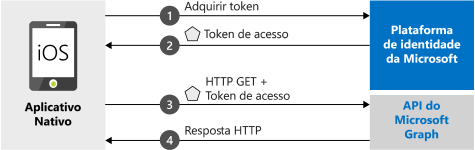

# <a name="quickstart-sign-in-users-and-call-the-microsoft-graph-api-from-an-ios-app"></a>Início Rápido: Conectar usuários e chamar a API do Microsoft Graph de um aplicativo iOS

[!INCLUDE [active-directory-develop-applies-v2-msal](../../../includes/active-directory-develop-applies-v2-msal.md)]

Este início rápido contém um exemplo de código que demonstra como um aplicativo nativo iOS pode conectar contas corporativas, pessoais ou de estudante, obter um token de acesso e chamar a API do Microsoft Graph.



> [!NOTE]
> **Pré-requisitos**
> * XCode 10+
> * iOS 10+ 

> [!div renderon="docs"]
> ## <a name="register-and-download-your-quickstart-app"></a>Registrar e baixar o aplicativo de início rápido
> Você tem duas opções para iniciar o aplicativo de início rápido:
> * [Express] [Opção 1: Registrar e configurar o aplicativo automaticamente e, em seguida, baixar seu exemplo de código](#option-1-register-and-auto-configure-your-app-and-then-download-your-code-sample)
> * [Manual] [Opção 2: Registrar e configurar manualmente o aplicativo e o exemplo de código](#option-2-register-and-manually-configure-your-application-and-code-sample)
>
> ### <a name="option-1-register-and-auto-configure-your-app-and-then-download-your-code-sample"></a>Opção 1: Registrar e configurar o aplicativo automaticamente e, em seguida, baixar seu exemplo de código
> #### <a name="step-1-register-your-application"></a>Etapa 1: Registre seu aplicativo
> Para registrar seu aplicativo,
> 1. Acesse o novo painel do [portal do Azure – Registros de aplicativo](https://portal.azure.com/#blade/Microsoft_AAD_RegisteredApps/applicationsListBlade/quickStartType/IosQuickstartPage/sourceType/docs).
> 1. Insira um nome para seu aplicativo e selecione **Registrar**.
> 1. Siga as instruções para baixar e configurar automaticamente o novo aplicativo com apenas um clique.
>
> ### <a name="option-2-register-and-manually-configure-your-application-and-code-sample"></a>Opção 2: Registrar e configurar manualmente o aplicativo e o exemplo de código
>
> #### <a name="step-1-register-your-application"></a>Etapa 1: Registre seu aplicativo
> Para registrar seu aplicativo e adicionar as informações de registro do aplicativo à solução manualmente, siga estas etapas:
>
> 1. Navegue até a página [Registros de aplicativo](https://aka.ms/MobileAppReg) da plataforma de identidade da Microsoft para desenvolvedores.
> 1. Selecione **Novo registro**.
> 1. Quando a página **Registrar um aplicativo** for exibida, insira as informações de registro do aplicativo:
>      - Na seção **Nome**, insira um nome de aplicativo relevante que será exibido aos usuários do aplicativo, quando eles se conectarem ou derem consentimento ao aplicativo, por exemplo, `iOSQuickstart`.
>      - Ignore outras configurações nesta página. 
>      - Pressione o `Register` botão.
> 1. Clique no novo aplicativo > acesse `Authentication` > `Add Platform` > `iOS`.    
>      - Insira o ***Identificador de pacote*** para seu aplicativo. 
> 1. Selecione `Configure` e salve os detalhes da ***Configuração de MSAL*** para uso posterior. 

> [!div renderon="portal" class="sxs-lookup"]
>
> #### <a name="step-1-configure-your-application"></a>Etapa 1: Configurar seu aplicativo
> Para que o exemplo de código deste Início Rápido funcione, é necessário adicionar um URI de redirecionamento compatível com o Agente de autenticação. 
> > [!div renderon="portal" id="makechanges" class="nextstepaction"]
> > [Fazer essa alteração para mim]()
>
> > [!div id="appconfigured" class="alert alert-info"]
> >  Seu aplicativo já está configurado com esses atributos

#### <a name="step-2-download-your-web-server-or-project"></a>Etapa 2: Baixar o servidor Web ou o projeto

- [Baixe o exemplo de código](https://github.com/Azure-Samples/active-directory-ios-swift-native-v2/archive/master.zip)

#### <a name="step-3-configure-your-project"></a>Etapa 3: Configurar seu projeto

> [!div renderon="docs"]
> Se você tiver selecionado a Opção 1 acima, poderá ignorar essas etapas. 

> [!div renderon="portal" class="sxs-lookup"]
> 1. Extraia o arquivo zip e abra o projeto no XCode.
> 1. Edite **ViewController.swift** e substitua a linha que começa com 'let kClientID' pelo seguinte snippet de código:
>    ```swift
>    let kClientID = "Enter_the_Application_Id_here"
>    let kAuthority = "https://login.microsoftonline.com/Enter_the_Tenant_Info_Here"
>    ``` 
> 1. Clique com botão direito do mouse em **Info. plist** e selecione **Abrir como** > **Código-fonte**.
> 1. No nó raiz dict, substitua pela sua ***Id do pacote***:
>
>    ```xml
>    <key>CFBundleURLTypes</key>
>    <array>
>       <dict>
>          <key>CFBundleURLSchemes</key>
>          <array>
>             <string>msauth.Enter_the_Bundle_Id_Here</string>
>          </array>
>       </dict>
>    </array>
> 
>    ```
> 1. Compile e execute o aplicativo. 

> [!div class="sxs-lookup" renderon="portal"]
> > [!NOTE]
> > Este início rápido dá suporte a Enter_the_Supported_Account_Info_Here.

> [!div renderon="docs"]
>
> 1. Extraia o arquivo zip e abra o projeto no XCode.
> 1. Edite **ViewController.swift** e substitua a linha que começa com 'let kClientID' pelo seguinte snippet de código:
>
>    ```swift
>    let kClientID = "<ENTER_YOUR_APPLICATION/CLIENT_ID>"
> 
>    ```
> 1. Clique com botão direito do mouse em **Info. plist** e selecione **Abrir como** > **Código-fonte**.
> 1. No nó raiz dict, substitua pela sua ***Id do pacote***:
>
>    ```xml
>    <key>CFBundleURLTypes</key>
>    <array>
>       <dict>
>          <key>CFBundleURLSchemes</key>
>          <array>
>             <string>msauth.<ENTER_YOUR_BUNDLE_ID></string>
>          </array>
>       </dict>
>    </array>
>
>    ```
> 1. Compile e execute o aplicativo. 

## <a name="more-information"></a>Mais informações

Leia estas seções para saber mais sobre este guia de início rápido.

### <a name="getting-msal"></a>Como obter o MSAL

MSAL ([MSAL.framework](https://github.com/AzureAD/microsoft-authentication-library-for-objc)) é a biblioteca usada para conectar usuários e solicitar tokens usados para acessar uma API protegida pela plataforma de identidade da Microsoft. Você pode adicionar s MSAL ao seu aplicativo usando o seguinte processo:

```
$ vi Podfile

```
Adicione o seguinte a esse podfile (com o destino do seu projeto):

```
use_frameworks!

target 'MSALiOS' do
   pod 'MSAL', '~> 0.4.0'
end

```

### <a name="msal-initialization"></a>Inicialização da MSAL

Você pode adicionar a referência da MSAL adicionando o seguinte código:

```swift
import MSAL
```

Em seguida, inicialize a MSAL usando o seguinte código:

```swift
let authority = try MSALAADAuthority(url: URL(string: kAuthority)!)
            
let msalConfiguration = MSALPublicClientApplicationConfig(clientId: kClientID, redirectUri: nil, authority: authority)
self.applicationContext = try MSALPublicClientApplication(configuration: msalConfiguration)

```

> |Em que: ||
> |---------|---------|
> | `clientId` | A ID do aplicativo registrado em *portal.azure.com* |
> | `authority` | O ponto de extremidade da plataforma de identidade da Microsoft. Na maioria dos casos ele será *https<span/>://login.microsoftonline.com/common* |
> | `redirectUri` | O URI de redirecionamento do aplicativo. Você pode passar “nulo” para usar o valor padrão ou o URI de redirecionamento personalizado. |

### <a name="additional-app-requirements"></a>Requisitos adicionais do aplicativo  

Seu aplicativo também deve ter o seguinte no `AppDelegate`. Isso permite que o SDK da MSAL lide com a resposta de token do aplicativo do agente de autenticação quando você executar a autenticação.

 ```swift
 func application(_ app: UIApplication, open url: URL, options: [UIApplication.OpenURLOptionsKey : Any] = [:]) -> Bool {
         guard let sourceApplication = options[UIApplication.OpenURLOptionsKey.sourceApplication] as? String else {
             return false
         }
         
         return MSALPublicClientApplication.handleMSALResponse(url, sourceApplication: sourceApplication)
     }

```

Por fim, seu aplicativo deve ter uma entrada `LSApplicationQueriesSchemes` no ***Info.plist*** junto com `CFBundleURLTypes`. A amostra vem com isso incluído. 

   ```xml 
   <key>LSApplicationQueriesSchemes</key>
   <array>
      <string>msauth</string>
      <string>msauthv2</string>
   </array>
   ```

### <a name="sign-in-users--request-tokens"></a>Conectar usuários e solicitar tokens

A MSAL tem dois métodos usados para adquirir tokens: `acquireToken` e `acquireTokenSilent`.

#### <a name="acquiretoken-getting-a-token-interactively"></a>acquireToken: como obter um token de maneira interativa

Algumas situações exigem que os usuários interajam com a plataforma de identidade da Microsoft. Nesses casos, o usuário final talvez precise selecionar sua conta, inserir suas credenciais ou dar consentimento às permissões do seu aplicativo. Por exemplo, 

* A primeira vez que os usuários entram no aplicativo
* Se um usuário redefinir sua senha, ele precisará inserir suas credenciais 
* Quando seu aplicativo estiver solicitando acesso a um recurso pela primeira vez
* Quando a MFA ou outras políticas de Acesso Condicional forem necessárias

```swift
let parameters = MSALInteractiveTokenParameters(scopes: kScopes)
applicationContext.acquireToken(with: parameters) { (result, error) in /* Add your handling logic */}
```

> |Em que:||
> |---------|---------|
> | `scopes` | Contém os escopos que estão sendo solicitados (ou seja, `[ "user.read" ]` para o Microsoft Graph ou `[ "<Application ID URL>/scope" ]` para as APIs Web personalizadas (`api://<Application ID>/access_as_user`)) |

#### <a name="acquiretokensilent-getting-an-access-token-silently"></a>acquireTokenSilent: Acessando um token de acesso silenciosamente

Os aplicativos não deverão exigir que seus usuários entrem sempre que solicitarem um token. Se o usuário já está conectado, esse método permite que os aplicativos solicitem tokens silenciosamente. 

```swift
let parameters = MSALSilentTokenParameters(scopes: kScopes, account: applicationContext.allAccounts().first)
applicationContext.acquireTokenSilent(with: parameters) { (result, error) in /* Add your handling logic */}
```

> |Em que: ||
> |---------|---------|
> | `scopes` | Contém os escopos que estão sendo solicitados (ou seja, `[ "user.read" ]` para o Microsoft Graph ou `[ "<Application ID URL>/scope" ]` para as APIs Web personalizadas (`api://<Application ID>/access_as_user`)) |
> | `account` | A conta para a qual um token está sendo solicitado. Este Início Rápido traz um aplicativo de única conta. Se você quiser criar um aplicativo de várias contas, precisará definir a lógica para identificar qual conta usar em solicitações de token `applicationContext.account(forHomeAccountId: self.homeAccountId)` |

## <a name="next-steps"></a>Próximas etapas

Experimente o tutorial do iOS para obter um guia passo a passo completo sobre a criação de aplicativos, incluindo uma explicação completa sobre este Início Rápido.

### <a name="learn-the-steps-to-create-the-application-used-in-this-quickstart"></a>Conheça as etapas para criar o aplicativo usado neste início rápido

> [!div class="nextstepaction"]
> [Tutorial Chamar a API do Graph do iOS](https://docs.microsoft.com/azure/active-directory/develop/guidedsetups/active-directory-ios)

[!INCLUDE [Help and support](../../../includes/active-directory-develop-help-support-include.md)]

Ajude-nos a melhorar a plataforma de identidade da Microsoft. Deixe sua opinião respondendo a uma breve pesquisa de duas perguntas.

> [!div class="nextstepaction"]
> [Pesquisa da plataforma de identidade da Microsoft](https://forms.office.com/Pages/ResponsePage.aspx?id=v4j5cvGGr0GRqy180BHbRyKrNDMV_xBIiPGgSvnbQZdUQjFIUUFGUE1SMEVFTkdaVU5YT0EyOEtJVi4u)