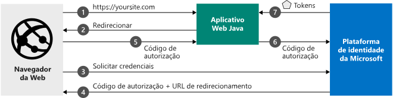

# <a name="quickstart-add-sign-in-with-microsoft-to-a-java-web-app"></a>Início Rápido: Adicionar uma entrada com a Microsoft a um aplicativo Web Java

[!INCLUDE [active-directory-develop-applies-v2](../../../includes/active-directory-develop-applies-v2.md)]

Neste início rápido, você aprenderá a integrar um aplicativo Web Java à plataforma de identidade da Microsoft. Seu aplicativo conectará um usuário, obterá um token de acesso para chamar a API do Microsoft Graph e fará uma solicitação para a API do Microsoft Graph. 

Após concluir este guia, seu aplicativo aceitará conexões de contas Microsoft pessoais (incluindo outlook.com, live.com e outras) e contas corporativas ou de estudante de qualquer empresa ou organização que utilize o Azure Active Directory.



## <a name="prerequisites"></a>Pré-requisitos

Para executar esta amostra, você precisará do seguinte: 
- JDK (Java Development Kit) 8 ou superior e o Maven.

> [!div renderon="docs"]
> ## <a name="register-and-download-your-quickstart-app"></a>Registrar e baixar o aplicativo de início rápido
> Você tem duas opções para iniciar o aplicativo de início rápido: expressa (opção 1) ou manual (opção 2)
> 
> ### <a name="option-1-register-and-auto-configure-your-app-and-then-download-your-code-sample"></a>Opção 1: Registrar e configurar o aplicativo automaticamente e, em seguida, baixar seu exemplo de código
>
> 1. Acesse o [portal do Azure – Registros de aplicativo](https://portal.azure.com/#blade/Microsoft_AAD_IAM/ActiveDirectoryMenuBlade/RegisteredApps).
> 1. Insira um nome para seu aplicativo e selecione **Registrar**.
> 1. Siga as instruções para baixar e configurar automaticamente o novo aplicativo.
>
> ### <a name="option-2-register-and-manually-configure-your-application-and-code-sample"></a>Opção 2: Registrar e configurar manualmente o aplicativo e o exemplo de código
> 
>
> #### <a name="step-1-download-the-code-sample"></a>Etapa 1: Baixar o exemplo de código
> 
> - [Baixe o exemplo de código](https://github.com/Azure-Samples/ms-identity-java-webapp/archive/master.zip)
>
> #### <a name="step-2-open-applicationproperties"></a>Etapa 2: Abrir application.properties
>
> 1. Extraia o arquivo zip para uma pasta local.
> 1. (Opcional) Se você usar um ambiente de desenvolvimento integrado, abra a amostra em seu IDE favorito.
> 1. Abra o arquivo *application.properties*. Você inserirá valores para `aad.clientId`, `aad.authority` e `aad.secretKey` quando registrar o aplicativo na próxima etapa.


> #### <a name="step-3-register-your-application"></a>Etapa 3: Registre seu aplicativo
> Para registrar seu aplicativo e adicionar manualmente as informações de registro do aplicativo à solução, execute estas etapas:
>
> 1. Entre no [portal do Azure](https://portal.azure.com) usando uma conta corporativa ou de estudante ou uma conta pessoal da Microsoft.
> 1. Se sua conta fornecer acesso a mais de um locatário, selecione sua conta no canto superior direito e defina sua sessão do portal para o locatário desejado do Azure AD.
> 1. Navegue até a página [Registros de aplicativo](https://go.microsoft.com/fwlink/?linkid=2083908) da plataforma de identidade da Microsoft para desenvolvedores.
> 1. Selecione **Novo registro**.
> 1. Quando a página **Registrar um aplicativo** for exibida, insira as informações de registro do aplicativo:
>    - Na seção **Nome**, insira um nome de aplicativo relevante que será exibido aos usuários do aplicativo, por exemplo, `java-webapp`.
>    - Deixe **URI de Redirecionamento** em branco por enquanto e selecione **Registrar**.
> 1. Localize o valor da **ID do Aplicativo (cliente)** do aplicativo. Atualize o valor de `Enter_the_Application_Id_here` no arquivo *application.properties*.
> 1. Localize o valor da **ID de Diretório (locatário)** do aplicativo. Atualize o valor de `Enter_the_Tenant_Info_Here` no arquivo *application.properties*. 
> 1. Selecione o menu **Autenticação** e, em seguida, adicione as seguintes informações:
>    - Em **URIs de Redirecionamento**, adicione `http://localhost:8080/msal4jsamples/secure/aad` e `https://localhost:8080/msal4jsamples/graph/users`.
>    - Clique em **Salvar**.
> 1. No menu à esquerda, escolha **Certificados e segredos** e clique em **Novo segredo do cliente** na seção **Segredos do Cliente**:
>     
>    - Digite uma descrição de chave (do segredo do aplicativo da instância).
>    - Selecione uma duração de chave igual a **Em 1 ano**.
>    - Quando você clicar em **Adicionar**, o valor da chave será exibido. 
>    - Copie o valor da chave. Abra o arquivo *application.properties* baixado anteriormente e atualize o valor de `Enter_the_Client_Secret_Here` com o valor da chave. 
>
> [!div class="sxs-lookup" renderon="portal"]
> #### <a name="step-1-configure-your-application-in-the-azure-portal"></a>Etapa 1: Configurar seu aplicativo no portal do Azure
> Para o exemplo de código deste início rápido funcionar, você precisará:
> 1. Adicionar URLs de resposta como `http://localhost:8080/msal4jsamples/secure/aad` e `https://localhost:8080/msal4jsamples/graph/users`.
> 1. Criar um segredo do cliente.
> > [!div renderon="portal" id="makechanges" class="nextstepaction"]
> > [Fazer essa alteração para mim]()
>
> > [!div id="appconfigured" class="alert alert-info"]
> >  Seu aplicativo já está configurado com esses atributos.
> 
> #### <a name="step-2-download-the-code-sample"></a>Etapa 2: Baixar o exemplo de código
> 
> - [Baixe o exemplo de código](https://github.com/Azure-Samples/ms-identity-java-webapp/archive/master.zip)
> 
> #### <a name="step-3-configure-the-code-sample"></a>Etapa 3: Configurar o exemplo de código 
> 
> 1. Extraia o arquivo zip para uma pasta local.
> 1. Se você usar um ambiente de desenvolvimento integrado, abra a amostra em seu IDE favorito (opcional).
> 1. Abra o arquivo **application.properties**, que pode ser encontrado em *src/main/resources/* .
> 1. Substitua as propriedades do aplicativo.
>   1. Localize `aad.clientId` e atualize o valor de `Enter_the_Application_Id_here` com o valor da **ID do Aplicativo (cliente)** do aplicativo que você registrou. 
>   1. Localize `aad.authority` e atualize o valor de `Enter_the_Tenant_Name_Here` com o valor da **ID de Diretório (locatário)** do aplicativo registrado.
>   1. Localize `aad.secretKey` e atualize o valor de `Enter_the_Client_Secret_Here` com o **Segredo do Cliente** criado em **Certificados e Segredos** para o aplicativo registrado.

#### <a name="step-4-run-the-code-sample"></a>Etapa 4: Executar o exemplo de código
1. Execute o exemplo de código, abra um navegador e navegue até *http://localhost:8080* .
1. A página frontal contém um botão de **entrada**. Clique no botão de **entrada** para o redirecionamento para o Azure Active Directory. O usuário deverá inserir suas credenciais.  
1. Após a autenticação bem-sucedida no Azure Active Directory, ele será redirecionado para *http://localhost:8080/msal4jsamples/secure/aad* . Ele estará oficialmente conectado ao aplicativo, e a página deverá mostrar informações da conta conectada. Ela também conterá botões para: 
    - *Sair*: Desconectará o usuário atual do aplicativo e o redirecionará para a home page.
    - *Mostrar Usuários*: Adquirirá um token para o Microsoft Graph e, em seguida, chamará o Microsoft Graph com o token anexado à solicitação para obter todos os usuários do locatário.


## <a name="more-information"></a>Mais informações

### <a name="getting-msal"></a>Como obter o MSAL
MSAL4J é a biblioteca usada para conectar usuários e solicitar tokens usados para acessar uma API protegida pela plataforma de identidade da Microsoft. Adicione a MSAL4J ao seu aplicativo usando o Maven ou o Gradle para gerenciar as dependências fazendo as alterações a seguir no arquivo pom.xml ou build.gradle no aplicativo. 

```XML
<dependency>
    <groupId>com.microsoft.azure</groupId>
    <artifactId>msal4j</artifactId>
    <version>0.5.0-preview</version>
</dependency>
```

```$xslt
compile group: 'com.microsoft.azure', name: 'msal4j', version: '0.5.0-preview'
```


### <a name="msal-initialization"></a>Inicialização da MSAL
Adicione a referência à MSAL4J adicionando o seguinte código ao início do arquivo no qual você usará a MSAL4J: 

```Java
import com.microsoft.aad.msal4j.*;
```

## <a name="next-steps"></a>Próximas etapas

Saiba mais sobre permissões e consentimento:

> [!div class="nextstepaction"]
> [Permissões e consentimento](https://docs.microsoft.com/en-us/azure/active-directory/develop/v2-permissions-and-consent)

Para saber mais sobre o fluxo de autenticação para este cenário, confira o fluxo do código de autorização OAuth 2.0:

> [!div class="nextstepaction"]
> [Fluxo do código de autorização OAuth](https://docs.microsoft.com/en-us/azure/active-directory/develop/v2-oauth2-auth-code-flow)

Ajude-nos a melhorar a plataforma de identidade da Microsoft. Deixe sua opinião respondendo a uma breve pesquisa de duas perguntas.

> [!div class="nextstepaction"]
> [Pesquisa da plataforma de identidade da Microsoft](https://forms.office.com/Pages/ResponsePage.aspx?id=v4j5cvGGr0GRqy180BHbRyKrNDMV_xBIiPGgSvnbQZdUQjFIUUFGUE1SMEVFTkdaVU5YT0EyOEtJVi4u)

[!INCLUDE [Help and support](../../../includes/active-directory-develop-help-support-include.md)]
