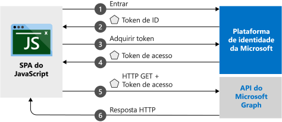

# <a name="quickstart-sign-in-users-and-acquire-an-access-token-from-a-javascript-single-page-application"></a>Início Rápido: Conectar usuários e adquirir um token de acesso de um aplicativo de página única do JavaScript

Neste início rápido, você aprenderá como usar um exemplo de código que demonstra como um SPA (aplicativo de página única) do JavaScript pode conectar usuários de contas pessoais, contas corporativas e de estudante. Um SPA JavaScript também pode obter um token de acesso para chamar a API do Microsoft Graph ou qualquer API Web.



## <a name="prerequisites"></a>Pré-requisitos

Este início rápido requer a seguinte configuração:
* Para executar o projeto com um servidor Node.js, baixe e instale o [Node.js](https://nodejs.org/en/download/).
* Para editar os arquivos de projeto, baixe e instale o [Visual Studio Code](https://code.visualstudio.com/download).
* Para executar o projeto como uma solução do Visual Studio, baixe e instale o [Visual Studio 2019](https://visualstudio.microsoft.com/downloads/).

> [!div renderon="docs"]
> ## <a name="register-and-download-your-quickstart-application"></a>Registrar e baixar o aplicativo de início rápido
> Para iniciar seu aplicativo de início rápido, use qualquer uma das opções a seguir.
>
> ### <a name="option-1-express-register-and-auto-configure-your-app-and-then-download-your-code-sample"></a>Opção 1 (Expresso): Registrar e configurar o aplicativo automaticamente e, em seguida, baixar seu exemplo de código
>
> 1. Entre no [portal do Azure](https://portal.azure.com) usando uma conta corporativa ou de estudante, ou uma conta pessoal da Microsoft.
> 1. Se sua conta fornecer acesso a mais de um locatário, selecione a conta na parte superior direita e defina sua sessão do portal para o locatário do Azure Active Directory que deseja usar.
> 1. Acesse o novo painel do [portal do Azure – Registros de aplicativo](https://portal.azure.com/#blade/Microsoft_AAD_RegisteredApps/ApplicationsListBlade/quickStartType/JavascriptSpaQuickstartPage/sourceType/docs).
> 1. Insira um nome para seu aplicativo e selecione **Registrar**.
> 1. Siga as instruções para baixar e configurar automaticamente o novo aplicativo.
>
> ### <a name="option-2-manual-register-and-manually-configure-your-application-and-code-sample"></a>Opção 2 (Manual): Registrar e configurar manualmente o aplicativo e o exemplo de código
>
> #### <a name="step-1-register-your-application"></a>Etapa 1: Registre seu aplicativo
>
> 1. Entre no [portal do Azure](https://portal.azure.com) usando uma conta corporativa ou de estudante, ou uma conta pessoal da Microsoft.
>
> 1. Se sua conta fornecer acesso a mais de um locatário, selecione sua conta na parte superior direita e defina sua sessão do portal para o locatário Azure AD que deseja usar.
> 1. Vá até a página [Registros de aplicativo](https://go.microsoft.com/fwlink/?linkid=2083908) da plataforma de identidade da Microsoft para desenvolvedores.
> 1. Selecione **Novo registro**.
> 1. Quando a página **Registrar um aplicativo** aparecer, insira um nome para o seu aplicativo.
> 1. Em **Tipos de conta com suporte**, selecione **Contas em qualquer diretório organizacional e contas pessoais da Microsoft**.
> 1. Na seção **URI de Redirecionamento**, na lista suspensa, selecione a plataforma **Web** e defina o valor para `http://localhost:30662/`.
> 1. Selecione **Registrar**. Na página **Visão geral** do aplicativo, anote o valor de **ID do aplicativo (cliente)** para uso posterior.
> 1. Este início rápido requer que o [fluxo de concessão implícita](v2-oauth2-implicit-grant-flow.md) seja ativado. No painel esquerdo do aplicativo registrado, selecione **Autenticação**.
> 1. Na seção **Configurações avançadas**, em **Concessão implícita**, marque as caixas de seleção **Tokens de ID** e **Tokens de Acesso**. Os tokens de ID e tokens de acesso são necessários porque esse aplicativo precisa conectar usuários e chamar uma API.
> 1. Na parte superior do painel, selecione **Salvar**.

> [!div class="sxs-lookup" renderon="portal"]
> #### <a name="step-1-configure-your-application-in-the-azure-portal"></a>Etapa 1: Configurar seu aplicativo no portal do Azure
> Para que o exemplo de código deste início rápido funcione, você precisa adicionar um URI de redirecionamento como `http://localhost:30662/` e habilitar o recurso **Concessão implícita**.
> > [!div renderon="portal" id="makechanges" class="nextstepaction"]
> > [Fazer essas alterações para mim]()
>
> > [!div id="appconfigured" class="alert alert-info"]
> >  Seu aplicativo já está configurado com esses atributos.

#### <a name="step-2-download-the-project"></a>Etapa 2: Baixe o projeto

Selecione a opção mais adequada ao seu ambiente de desenvolvimento:

* Para executar o projeto com um servidor Web usando Node.js, [baixe os arquivos de projeto de núcleo](https://github.com/Azure-Samples/active-directory-javascript-graphapi-v2/archive/quickstart.zip). Para abrir os arquivos, use um editor como o [Visual Studio Code](https://code.visualstudio.com/).

* (Opcional) [Baixe o projeto do Visual Studio](https://github.com/Azure-Samples/active-directory-javascript-graphapi-v2/archive/vsquickstart.zip) para executar o projeto com o servidor IIS. Extraia o arquivo zip para uma pasta local (por exemplo, *C:\Azure-Samples*).


#### <a name="step-3-configure-your-javascript-app"></a>Etapa 3: Configurar o aplicativo JavaScript

> [!div renderon="docs"]
> Na pasta *JavaScriptSPA*, edite *index.html* e defina os valores `clientID` e `authority` em `msalConfig`.

> [!div class="sxs-lookup" renderon="portal"]
> Na pasta *JavaScriptSPA*, edite *index.html* e substitua `msalConfig` pelo seguinte código:

```javascript
var msalConfig = {
    auth: {
        clientId: "Enter_the_Application_Id_here",
        authority: "https://login.microsoftonline.com/Enter_the_Tenant_info_here"
    },
    cache: {
        cacheLocation: "localStorage",
        storeAuthStateInCookie: true
    }
};

```
> [!div renderon="portal"]
> > [!NOTE]
> > Este início rápido é compatível com Insira_Informações_da_Conta_com_Suporte_Aqui.


> [!div renderon="docs"]
>
> Em que:
> - *\<Insira_Informações_da_Conta_com_Suporte_Aqui>* é a **ID do Aplicativo (cliente)** para o aplicativo que você registrou.
> - *\<Insira_as_informações_de_Locatário_aqui>* é definido para uma das seguintes opções:
>    - Se o seu aplicativo for compatível com as *contas neste diretório organizacional*, substitua esse valor pela **ID do locatário** ou **Nome do locatário** (por exemplo, *contoso.microsoft.com*).
>    - Se o aplicativo for compatível com as *contas em qualquer diretório organizacional*, substitua esse valor por **organizações**.
>    - Se o seu aplicativo for compatível com as *contas em qualquer diretório organizacional e contas pessoais da Microsoft*, substitua esse valor por **comum**. Para restringir o suporte a *contas pessoais da Microsoft*, substitua esse valor por **consumidores**.
>
> > [!TIP]
> > Para encontrar os valores de **ID do aplicativo (cliente)** , **ID de diretório (locatário)** e **Tipos de conta com suporte**, vá para a página **Visão Geral** do aplicativo no portal do Azure.
>

#### <a name="step-4-run-the-project"></a>Etapa 4: Executar o projeto

* Se você estiver usando [Node.js](https://nodejs.org/en/download/):

    1. Para iniciar o servidor, execute o seguinte comando no diretório do projeto:

        ```batch
        npm install
        node server.js
        ```

    1. Abra um navegador da Web e vá para `http://localhost:30662/`.
    1. Selecione **Entrar** para iniciar a conexão e chame a API do Microsoft Graph.


* Se você estiver usando o [Visual Studio](https://visualstudio.microsoft.com/downloads/), selecione a solução do projeto e, em seguida, F5 para executar o projeto.

Depois que o navegador carregar o aplicativo, selecione **Entrar**. Na primeira vez em que entrar, será solicitado que você forneça seu consentimento para permitir que o aplicativo acesse seu perfil e faça logon. Depois que você se conectar com êxito, as informações do seu perfil de usuário deverão ser exibidas na página.

## <a name="more-information"></a>Mais informações

### <a name="msaljs"></a>msal.js

A biblioteca MSAL conecta usuários e solicita os tokens que são usados para acessar uma API protegida pela plataforma de identidade da Microsoft. O arquivo *index.html* do início rápido contém uma referência à biblioteca:

```html
<script src="https://secure.aadcdn.microsoftonline-p.com/lib/1.0.0/js/msal.min.js"></script>
```
> [!TIP]
> É possível substituir a versão anterior pela mais recente em [versões MSAL.js](https://github.com/AzureAD/microsoft-authentication-library-for-js/releases).


Como alternativa, se tiver instalado o Node.js, você poderá baixar a versão mais recente por meio do npm (Gerenciador de Pacotes do Node.js):

```batch
npm install msal
```

### <a name="msal-initialization"></a>Inicialização da MSAL

O código de início rápido também mostra como inicializar a biblioteca MSAL:

```javascript
var msalConfig = {
    auth: {
        clientId: "Enter_the_Application_Id_here",
        authority: "https://login.microsoftonline.com/Enter_the_Tenant_Info_Here"
    },
    cache: {
        cacheLocation: "localStorage",
        storeAuthStateInCookie: true
    }
};

var myMSALObj = new Msal.UserAgentApplication(msalConfig);
```

> |Where  |  |
> |---------|---------|
> |`ClientId`     | A ID do aplicativo que está registrado no portal do Azure.|
> |`authority`    | (Opcional) A URL da autoridade que dá suporte aos tipos de conta, conforme descrito na seção de configuração. A autoridade padrão é `https://login.microsoftonline.com/common`. |
> |`cacheLocation`  | (Opcional) Define o armazenamento do navegador para o estado de autenticação. O padrão é sessionStorage.   |
> |`storeAuthStateInCookie`  | (Opcional) A biblioteca que armazena o estado de solicitação da autenticação exigido para validação dos fluxos de autenticação nos cookies do navegador. Esse cookie é definido para os navegadores IE e Edge reduzirem determinados [problemas conhecidos](https://github.com/AzureAD/microsoft-authentication-library-for-js/wiki/Known-issues-on-IE-and-Edge-Browser#issues). |

Para saber mais sobre opções configuráveis disponíveis, confira [Inicializar aplicativos cliente](msal-js-initializing-client-applications.md).

### <a name="sign-in-users"></a>Conectar usuários

O trecho de código a seguir mostra como realizar a conexão de usuários:

```javascript
var requestObj = {
    scopes: ["user.read"]
};

myMSALObj.loginPopup(requestObj).then(function (loginResponse) {
    //Login Success callback code here
}).catch(function (error) {
    console.log(error);
});
```

> |Where  |  |
> |---------|---------|
> | `scopes`   | (Opcional) Contém os escopos que estão sendo solicitados para o consentimento do usuário no momento da conexão. Por exemplo, `[ "user.read" ]` para o Microsoft Graph ou `[ "<Application ID URL>/scope" ]` para as APIs Web personalizadas (ou seja, `api://<Application ID>/access_as_user`). |

> [!TIP]
> Como alternativa, talvez você queira usar o método `loginRedirect` para redirecionar a página atual para a página de entrada, em vez de uma janela pop-up.

### <a name="request-tokens"></a>Solicitar tokens

A MSAL usa três métodos para adquirir tokens: `acquireTokenRedirect`, `acquireTokenPopup` e `acquireTokenSilent`

#### <a name="get-a-user-token-silently"></a>Obter um token de usuário no modo silencioso

O método `acquireTokenSilent` manipula as aquisições e a renovação de tokens sem nenhuma interação do usuário. Após o método `loginRedirect` ou `loginPopup` ser executado pela primeira vez, `acquireTokenSilent` é o método normalmente usado para obter tokens usados para acessar recursos protegidos nas próximas chamadas. As chamadas para solicitar ou renovar tokens são feitas no modo silencioso.

```javascript
var requestObj = {
    scopes: ["user.read"]
};

myMSALObj.acquireTokenSilent(requestObj).then(function (tokenResponse) {
    // Callback code here
    console.log(tokenResponse.accessToken);
}).catch(function (error) {
    console.log(error);
});
```

> |Where  |  |
> |---------|---------|
> | `scopes`   | Contém os escopos solicitados para retorno no token de acesso da API. Por exemplo, `[ "user.read" ]` para o Microsoft Graph ou `[ "<Application ID URL>/scope" ]` para as APIs Web personalizadas (ou seja, `api://<Application ID>/access_as_user`).|

#### <a name="get-a-user-token-interactively"></a>Obter um token de usuário interativamente

Há situações em que é necessário forçar os usuários a interagir com o ponto de extremidade da plataforma de identidade da Microsoft. Por exemplo:
* Os usuários podem precisar reinserir as credenciais porque a senha expirou.
* Seu aplicativo está solicitando acesso a escopos de recursos adicionais com os quais o usuário precisa concordar.
* A autenticação de dois fatores é necessária.

O padrão usual recomendado para a maioria dos aplicativos é chamar `acquireTokenSilent` primeiro, depois capturar a exceção e, em seguida, chamar `acquireTokenPopup` (ou `acquireTokenRedirect`) para iniciar uma solicitação interativa.

Chamar o `acquireTokenPopup` resulta em uma janela pop-up para entrada. (Ou `acquireTokenRedirect` resulta no redirecionamento dos usuários para o ponto de extremidade da plataforma de identidade da Microsoft). Nessa janela, os usuários precisam interagir confirmando suas credenciais, dando consentimento ao recurso necessário ou concluindo a autenticação de dois fatores.

```javascript
var requestObj = {
    scopes: ["user.read"]
};

myMSALObj.acquireTokenPopup(requestObj).then(function (tokenResponse) {
    // Callback code here
    console.log(tokenResponse.accessToken);
}).catch(function (error) {
    console.log(error);
});
```

> [!NOTE]
> Este início rápido usa os métodos `loginRedirect` e `acquireTokenRedirect` com o Microsoft Internet Explorer devido a um [problema conhecido](https://github.com/AzureAD/microsoft-authentication-library-for-js/wiki/Known-issues-on-IE-and-Edge-Browser#issues) relacionado ao tratamento de janelas pop-up pelo Internet Explorer.

## <a name="next-steps"></a>Próximas etapas

Para obter um guia passo a passo mais detalhado sobre como criar aplicativo para este início rápido, confira:

> [!div class="nextstepaction"]
> [Tutorial para entrar e chamar o MS Graph](https://docs.microsoft.com/azure/active-directory/develop/guidedsetups/active-directory-javascriptspa)

Para navegar pelo repositório da MSAL em busca de documentos, perguntas frequentes, problemas e muito mais, confira:

> [!div class="nextstepaction"]
> [Repositório GitHub do MSAL.js](https://github.com/AzureAD/microsoft-authentication-library-for-js)

Ajude-nos a melhorar a plataforma de identidade da Microsoft. Deixe sua opinião respondendo a uma breve pesquisa de duas perguntas.

> [!div class="nextstepaction"]
> [Pesquisa da plataforma de identidade da Microsoft](https://forms.office.com/Pages/ResponsePage.aspx?id=v4j5cvGGr0GRqy180BHbRyKrNDMV_xBIiPGgSvnbQZdUQjFIUUFGUE1SMEVFTkdaVU5YT0EyOEtJVi4u)