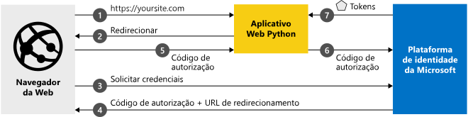

# <a name="quickstart-add-sign-in-with-microsoft-to-a-python-web-app"></a>Início Rápido: Adicionar a opção Entrar com a conta da Microsoft a um aplicativo Web do Python

[!INCLUDE [active-directory-develop-applies-v2](../../../includes/active-directory-develop-applies-v2.md)]

Neste início rápido, você aprenderá a integrar um aplicativo Web do Python à plataforma de identidade da Microsoft. Seu aplicativo conectará um usuário, obterá um token de acesso para chamar a API do Microsoft Graph e fará uma solicitação para a API do Microsoft Graph.

Após concluir este guia, seu aplicativo aceitará conexões de contas Microsoft pessoais (incluindo outlook.com, live.com e outras) e contas corporativas ou de estudante de qualquer empresa ou organização que utilize o Azure Active Directory.



## <a name="prerequisites"></a>Pré-requisitos

Para executar esta amostra, você precisará do seguinte:

- [Python 2.7 e posterior](https://www.python.org/downloads/release/python-2713) ou [Python 3 e posterior](https://www.python.org/downloads/release/python-364/)
- [Flask](http://flask.pocoo.org/), [Flask-Session](https://pythonhosted.org/Flask-Session/), [solicitações](https://2.python-requests.org/en/master/)
- [MSAL Python](https://github.com/AzureAD/microsoft-authentication-library-for-python) 
- Um locatário do Azure AD (Azure Active Directory). Para obter mais informações sobre como obter um locatário do Azure AD, confira [como obter um locatário do Azure AD.](https://docs.microsoft.com/azure/active-directory/develop/quickstart-create-new-tenant)

> [!div renderon="docs"]
>
> ## <a name="register-and-download-your-quickstart-app"></a>Registrar e baixar o aplicativo de início rápido
>
> Você tem duas opções para iniciar o aplicativo de início rápido: expresso (opção 1) ou manual (opção 2)
>
> ### <a name="option-1-register-and-auto-configure-your-app-and-then-download-your-code-sample"></a>Opção 1: Registrar e configurar o aplicativo automaticamente e, em seguida, baixar seu exemplo de código
>
> 1. Acesse o [portal do Azure – Registros de aplicativo](https://portal.azure.com/#blade/Microsoft_AAD_IAM/ActiveDirectoryMenuBlade/RegisteredApps).
> 1. Selecione **Novo registro**.
> 1. Insira um nome para seu aplicativo e selecione **Registrar**.
> 1. Siga as instruções para baixar e configurar automaticamente o novo aplicativo.
>
> ### <a name="option-2-register-and-manually-configure-your-application-and-code-sample"></a>Opção 2: Registrar e configurar manualmente o aplicativo e o exemplo de código
>
> #### <a name="step-1-register-your-application"></a>Etapa 1: Registre seu aplicativo
>
> Para registrar seu aplicativo e adicionar as informações de registro do aplicativo à solução manualmente, siga estas etapas:
>
> 1. Entre no [portal do Azure](https://portal.azure.com) usando uma conta corporativa ou de estudante ou uma conta pessoal da Microsoft.
> 1. Se sua conta fornecer acesso a mais de um locatário, selecione sua conta no canto superior direito e defina sua sessão do portal para o locatário desejado do Azure AD.
> 1. Navegue até a página [Registros de aplicativo](https://go.microsoft.com/fwlink/?linkid=2083908) da plataforma de identidade da Microsoft para desenvolvedores.
> 1. Selecione **Novo registro**.
> 1. Quando a página **Registrar um aplicativo** for exibida, insira as informações de registro do aplicativo:
>      - Na seção **Nome**, insira um nome de aplicativo relevante que será exibido aos usuários do aplicativo, por exemplo, `python-webapp`.
>      - Em **Tipos de conta com suporte**, selecione **Contas em qualquer diretório organizacional e contas pessoais da Microsoft**.
>      - Na seção **URI de Redirecionamento**, na lista suspensa, selecione a plataforma **Web** e defina o valor para `http://localhost:5000/getAToken`.
>      - Selecione **Registrar**. Na página **Visão geral** do aplicativo, anote o valor de **ID do aplicativo (cliente)** para uso posterior.
> 1. No menu à esquerda, escolha **Certificados e segredos** e clique em **Novo segredo do cliente** na seção **Segredos do Cliente**:
>
>      - Digite uma descrição de chave (do segredo do aplicativo da instância).
>      - Selecione uma duração de chave igual a **Em 1 ano**.
>      - Quando você clicar em **Adicionar**, o valor da chave será exibido.
>      - Copie o valor da chave. Você precisará dela mais tarde.
>
> [!div class="sxs-lookup" renderon="portal"]
>
> #### <a name="step-1-configure-your-application-in-azure-portal"></a>Etapa 1: Configurar seu aplicativo no portal do Azure
>
> Para o exemplo de código deste início rápido funcionar, você precisará:
>
> 1. Adicione uma URL de resposta como `http://localhost:5000/getAToken`.
> 1. Criar um segredo do cliente.
>
> > [!div renderon="portal" id="makechanges" class="nextstepaction"]
> > [Fazer essa alteração para mim]()
> > [!div id="appconfigured" class="alert alert-info"]
> >  Seu aplicativo já está configurado com esse atributo

#### <a name="step-2-download-your-project"></a>Etapa 2: Baixar o seu projeto

[Baixe o exemplo de código](https://github.com/Azure-Samples/ms-identity-python-webapp/archive/master.zip)

#### <a name="step-3-configure-the-application"></a>Etapa 3: Configurar o aplicativo

1. Extraia o arquivo zip para uma pasta local mais próxima da pasta raiz, por exemplo, **C:\Azure-Samples**
1. Se você usar um ambiente de desenvolvimento integrado, abra a amostra em seu IDE favorito (opcional).
1. Abra o arquivo **app_config.py**, que pode ser encontrado na pasta raiz, e substitua-o pelo seguinte snippet de código:

```python
AUTHORITY = "https://login.microsoftonline.com/Enter_the_Tenant_Name_Here"
CLIENT_ID = "Enter_the_Application_Id_here"
CLIENT_SECRET = "Enter_the_Client_Secret_Here"
SCOPE = ["https://graph.microsoft.com/User.Read"]
REDIRECT_URI = "http://localhost:5000/getAToken"
```

> [!div renderon="docs"]
> Em que:
>
> - `Enter_the_Application_Id_here`: é a ID do aplicativo que você registrou.
> - `Enter_the_Tenant_Info_Here`: é uma das opções abaixo:
>   - Se seu aplicativo dá suporte a **Somente minha organização**, substitua esse valor pela **ID do Locatário** ou pelo **Nome do locatário** (por exemplo, contoso.onmicrosoft.com)
>   - Se seu aplicativo dá suporte a **Contas em qualquer diretório organizacional**, substitua esse valor por `organizations`
>   - Se seu aplicativo dá suporte a **Todos os usuários de contas da Microsoft**, substitua esse valor por `common`
> - `Enter_the_Client_Secret_Here` – é o **Segredo do Cliente** criado em **Certificados e Segredos** para o aplicativo registrado.

#### <a name="step-4-run-the-code-sample"></a>Etapa 4: Executar o exemplo de código

- Você precisará instalar a biblioteca MSAL Python, a estrutura Flask, o Flask-Sessions para gerenciamento de sessão do servidor e solicitações usando o PIP da seguinte maneira:

```Shell
pip install msal
pip install flask
pip install Flask-Session
pip install requests
```

- Se a variável de ambiente do Flask já estiver definida: Execute app.py no shell ou na linha de comando:

```Shell
python app.py
```

- Se a variável de ambiente do Flask não estiver definida:

    1. Digite os seguintes comandos no shell ou na linha de comando navegando até o diretório do projeto:

```Shell
export FLASK_APP=app.py
export FLASK_DEBUG=1
flask run
```

[!INCLUDE [Help and support](../../../includes/active-directory-develop-help-support-include.md)]
