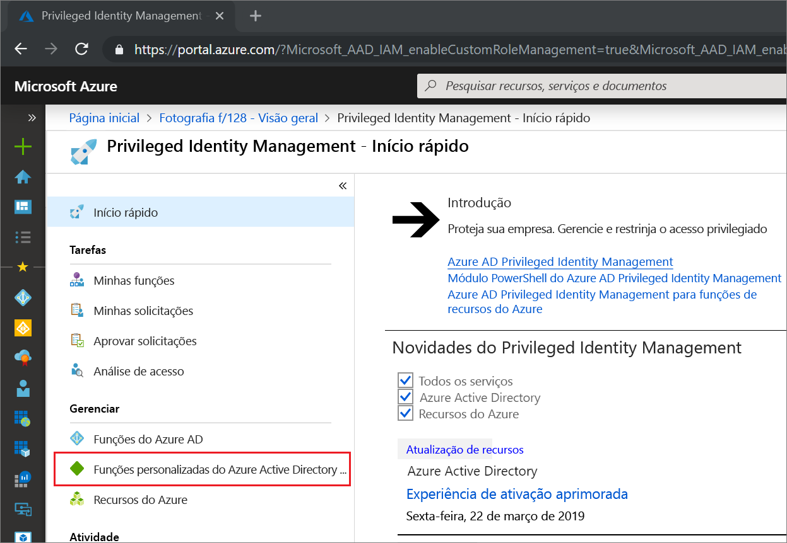
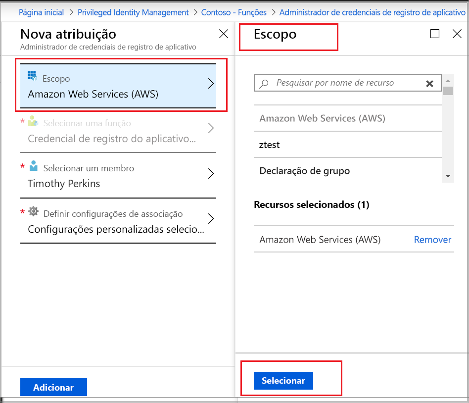

# Ativar uma função personalizada do Azure AD no PIM (Privileged Identity Management)

O Privileged Identity Management no Azure AD (Active Directory) agora dá suporte à atribuição Just-In-Time e de limite de tempo a funções personalizadas criadas para Gerenciamento de Aplicativos na experiência administrativa de Gerenciamento de Identidades e Acesso. Para saber mais sobre como criar funções personalizadas para delegar o gerenciamento de aplicativos no Azure AD, confira [Funções Administrador personalizadas no Azure Active Directory (versão prévia)](../users-groups-roles/roles-custom-overview.md).

> [!NOTE]
> As funções personalizadas do Azure AD não são integradas às funções de diretório internas durante a versão prévia. Depois que a funcionalidade estiver em disponibilidade geral, o gerenciamento de função ocorrerá na experiência de funções internas.

## Ativar uma função

Quando você precisa ativar uma função personalizada do Azure AD, solicite ativação selecionando a opção de navegação Minhas funções no PIM.

1. Entre no [Portal do Azure](https://portal.azure.com).
1. Abra o [Privileged Identity Management](https://portal.azure.com/?Microsoft_AAD_IAM_enableCustomRoleManagement=true&Microsoft_AAD_IAM_enableCustomRoleAssignment=true&feature.rbacv2roles=true&feature.rbacv2=true&Microsoft_AAD_RegisteredApps=demo#blade/Microsoft_Azure_PIMCommon/CommonMenuBlade/quickStart) do Azure AD.

1. Selecione **funções personalizadas do Azure AD** para ver uma lista de atribuições de função personalizadas do Azure AD elegíveis.

   

1. Na página **funções personalizadas do Azure AD (versão prévia)** , localize a atribuição de que você precisa.
1. Selecione **Ativar sua função** para abrir a página **Ativar**.
1. Se sua função exigir autenticação multifator, selecione **Verificar sua identidade antes de prosseguir**. Você precisa se autenticar apenas uma vez por sessão.
1. Selecione **Verificar minha identidade** e siga as instruções para fornecer qualquer verificação de segurança adicional.
1. Para especificar um escopo de aplicativo personalizado, selecione **Escopo** para abrir o painel de filtro. Você deve solicitar acesso a uma função no escopo mínimo necessário. Se sua atribuição estiver em um escopo de aplicativo, você poderá ativar somente nesse escopo.

   

1. Se necessário, especifique uma hora de início de ativação. Quando usado, o membro da função é ativado na hora especificada.
1. Na caixa **Motivo**, insira o motivo da solicitação de ativação. Eles podem ser tornados obrigatórios ou não na configuração da função.
1. Selecione **Ativar**.

Se a função não exigir aprovação, ela já estará ativada de acordo com suas configurações e será adicionada à lista de funções ativas. Se desejar usar a função ativada, comece com as etapas em [Atribuir uma função personalizada do Azure AD no Privileged Identity Management](azure-ad-custom-roles-assign.md).

Se a função exigir aprovação para ser ativada, você receberá uma notificação do Azure informando-o de que a solicitação está com aprovação pendente.

## Próximas etapas

- [Atribuir uma função personalizada do Azure AD](azure-ad-custom-roles-assign.md)
- [Remover ou atualizar uma atribuição de função personalizada do Azure AD](azure-ad-custom-roles-update-remove.md)
- [Configurar uma atribuição de função personalizada do Azure AD](azure-ad-custom-roles-configure.md)
- [Definições de função no Azure AD](../users-groups-roles/directory-assign-admin-roles.md)
