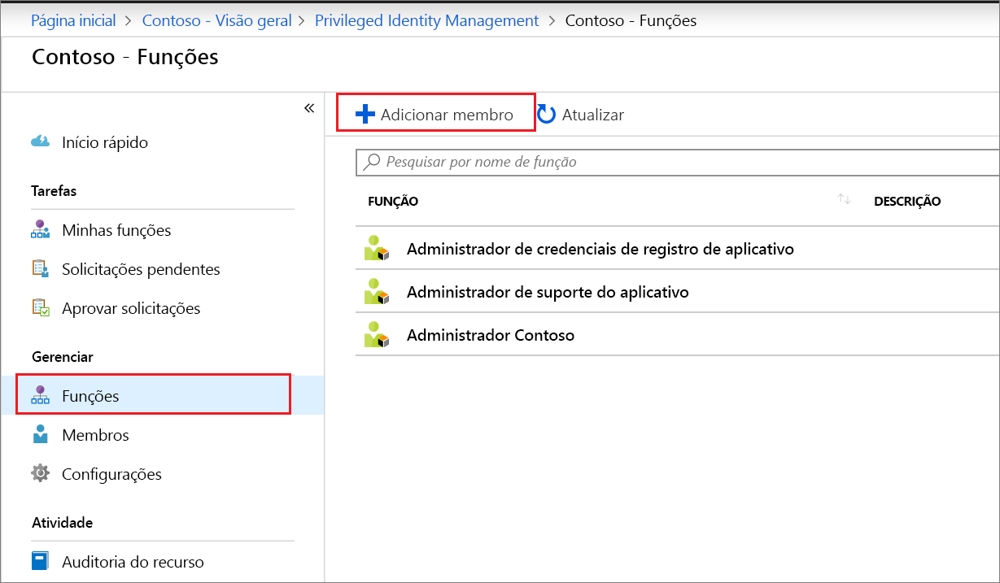
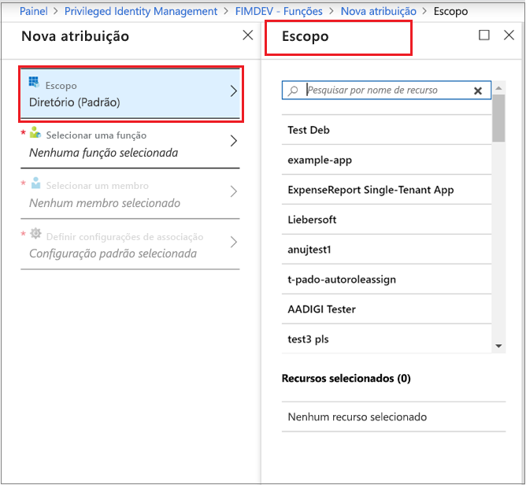
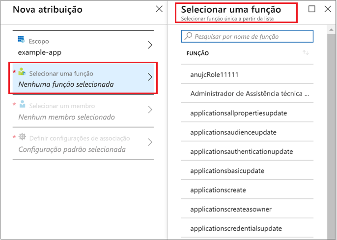
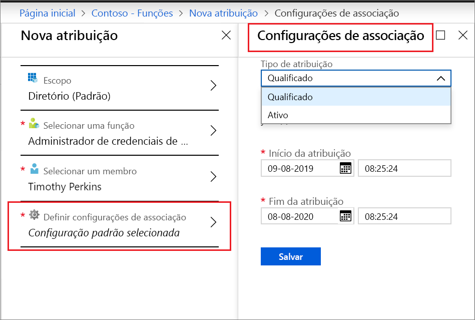
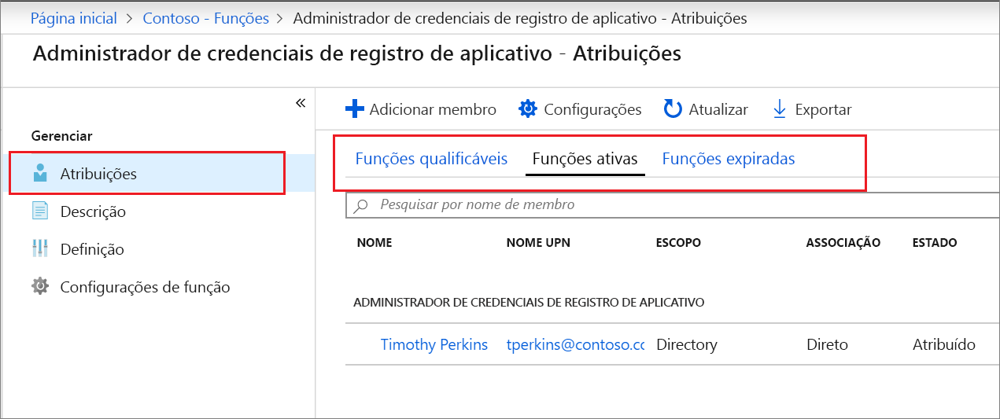

# Atribuir uma função personalizada do Azure AD no PIM (Privileged Identity Management)

Este artigo informa como usar o PIM (Privileged Identity Management) para criar a atribuição Just-In-Time e com limite de tempo a funções personalizadas criadas para gerenciar aplicativos na experiência administrativa do Azure AD (Azure Active Directory).

- Para saber mais sobre como criar funções personalizadas para delegar o gerenciamento de aplicativos no Azure AD, confira [Funções Administrador personalizadas no Azure Active Directory (versão prévia)](../users-groups-roles/roles-custom-overview.md).
- Se você ainda não usou o Privileged Identity Management, obtenha mais informações em [Começar a usar o PIM](pim-getting-started.md).
- Para obter informações sobre como permitir acesso para que outro administrador gerencie o Privileged Identity Management, confira [Permitir acesso a outros administradores para gerenciar o PIM](pim-how-to-give-access-to-pim.md).

> [!NOTE]
> As funções personalizadas do Azure AD não são integradas às funções de diretório internas durante a versão prévia. Depois que a funcionalidade estiver em disponibilidade geral, o gerenciamento de função ocorrerá na experiência de funções internas.

## Atribuir uma função

O Privileged Identity Management pode gerenciar funções personalizadas que você cria no gerenciamento de aplicativos do Azure AD (Active Directory).  As etapas a seguir fazem uma atribuição qualificada para uma função do diretório personalizada.

1. Entre no [Privileged Identity Management](https://portal.azure.com/?Microsoft_AAD_IAM_enableCustomRoleManagement=true&Microsoft_AAD_IAM_enableCustomRoleAssignment=true&feature.rbacv2roles=true&feature.rbacv2=true&Microsoft_AAD_RegisteredApps=demo#blade/Microsoft_Azure_PIMCommon/CommonMenuBlade/quickStart) no portal do Azure com uma conta de usuário atribuída à função de administrador de funções com privilégios.
1. Selecione **funções personalizadas do Azure AD (versão prévia)** .

    

1. Selecione **Funções** para ver a lista de funções personalizadas para aplicativos do Azure AD.

    

1. Selecione **Adicionar membro** para abrir a página de atribuição.
1. Para restringir o escopo da atribuição de função para um único aplicativo, selecione **Escopo** para especificar um escopo de aplicativo.

    

1. Selecione **Selecionar uma função** para abrir a lista **Selecionar uma função**.

    

1. Selecione uma função que você deseja atribuir e clique em **Selecionar**. A lista **Selecionar um membro** é aberta.

    

1. Selecione um usuário a quem você deseja atribuir a função e, em seguida, clique em **Selecionar**. A lista **Configurações de Associação** é aberta.

    

1. Na página **Configurações de associação**, selecione **Qualificada** ou **Ativa**:

    - Atribuições **Qualificadas** exigem que o usuário atribuído à função execute uma ação antes de poder usar a função. As ações podem incluir a passagem de uma verificação de autenticação multifator, o fornecimento de uma justificativa comercial ou a solicitação da aprovação de aprovadores designados.
    - Atribuições **Ativas** não exigem que o usuário atribuído execute nenhuma ação para usar a função. Usuários ativos têm os privilégios atribuídos à função sempre.

1. Se a caixa de seleção **Permanente** estiver presente e disponível (dependendo das configurações de função), você poderá especificar se a atribuição é permanente. Marque a caixa de seleção para tornar a atribuição permanentemente qualificada ou permanentemente atribuída. Desmarque a caixa de seleção para especificar a duração de uma atribuição.
1. Para criar a atribuição de função, clique em **Salvar** e, em seguida, em **Adicionar**. Uma notificação do status do processo da atribuição é exibida.

Para verificar a atribuição de função, em uma função aberta, selecione **Atribuições** > **Atribuir** e verifique se sua atribuição de função é identificada adequadamente como qualificada ou ativa.

 

## Próximas etapas

- [Ativar uma função personalizada do Azure AD](azure-ad-custom-roles-assign.md)
- [Remover ou atualizar uma atribuição de função personalizada do Azure AD](azure-ad-custom-roles-update-remove.md)
- [Configurar uma atribuição de função personalizada do Azure AD](azure-ad-custom-roles-configure.md)
- [Definições de função no Azure AD](../users-groups-roles/directory-assign-admin-roles.md)
