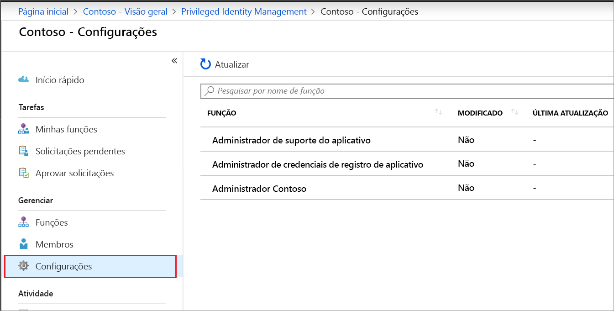
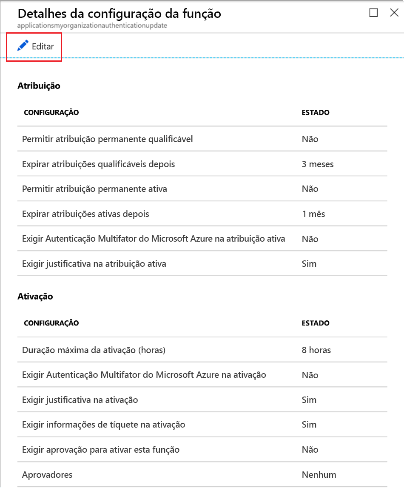
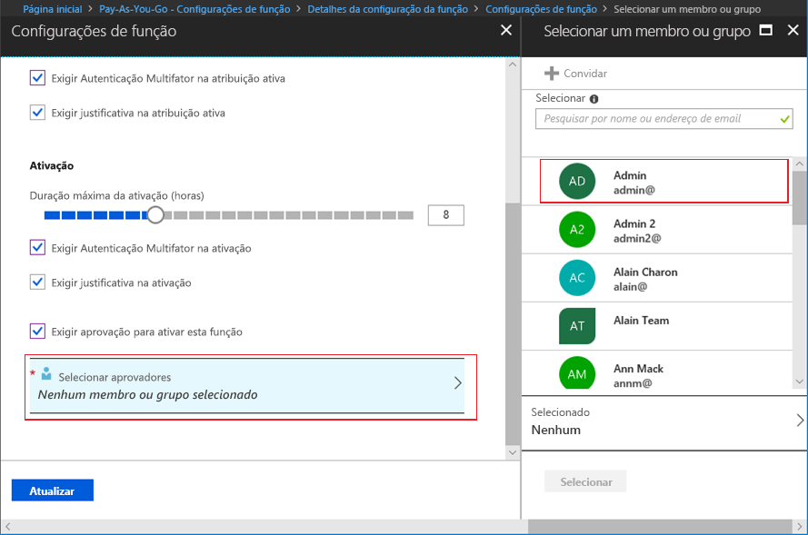

# Configurar funções personalizadas do Azure AD no Privileged Identity Management

Um administrador de funções com privilégios pode alterar as configurações de função que se aplicam a um usuário quando eles ativam sua atribuição a uma função personalizada e a outros administradores de aplicativo que estão atribuindo funções personalizadas.

## Abrir configurações de função

Siga estas etapas para abrir as configurações de uma função do Azure AD.

1. Entre no [Privileged Identity Management](https://portal.azure.com/?Microsoft_AAD_IAM_enableCustomRoleManagement=true&Microsoft_AAD_IAM_enableCustomRoleAssignment=true&feature.rbacv2roles=true&feature.rbacv2=true&Microsoft_AAD_RegisteredApps=demo#blade/Microsoft_Azure_PIMCommon/CommonMenuBlade/quickStart) no portal do Azure com uma conta de usuário atribuída à função de administrador de funções com privilégios.
1. Selecione **funções personalizadas do Azure AD (versão prévia)** .

    

1. Selecione **Configuração** para abrir a página **Configurações**. Selecione a função para as configurações que você deseja definir.
1. Selecione **Editar** para abrir a página **Configurações da função**.

    

## Configurações de função

Há várias configurações que você pode definir.

### Duração dae atribuição

É possível escolher entre duas opções de duração de atribuição para cada tipo de atribuição (qualificada ou ativa) ao definir as configurações de uma função. Essas opções passam a ter a duração máxima padrão quando um membro é atribuído à função no Privileged Identity Management.

É possível escolher uma destas opções de duração de atribuição *qualificada*.

- **Permitir atribuição qualificada permanente**: os administradores podem atribuir uma associação qualificada permanente.
- **Expirar atribuição qualificada após**: os administradores de recursos podem exigir que todas as atribuições qualificadas tenham uma data de início e de término especificadas.

Além disso, você pode escolher uma destas opções de duração da atribuição *ativa*:

- **Permitir atribuição ativa permanente**: os administradores podem atribuir uma associação ativa permanente.
- **Expirar atribuição ativa após**: os administradores podem exigir que todas as atribuições ativas tenham uma data de início e de término especificadas.

### Exigir autenticação multifator do Azure

O Privileged Identity Management fornece imposição opcional da Autenticação Multifator do Azure para dois cenários diferentes.

- **Exigir Autenticação Multifator na atribuição ativa**

  Se você quiser atribuir um membro a uma função por uma curta duração (por exemplo, um dia), poderá demorar muito para exigir que os membros atribuídos solicitem a ativação. Nesse cenário, o Privileged Identity Management não pode impor a autenticação multifator quando o usuário ativa sua atribuição de função, pois já está ativo na função desde o momento em que ele é atribuído. Para verificar se o administrador que atende à atribuição é quem ele diz que é, marque a caixa **Exigir Autenticação Multifator na atribuição ativa**.

- **Exigir a Autenticação Multifator na ativação**

  Você pode exigir que usuários qualificados atribuídos a uma função se inscrevam na Autenticação Multifator do Azure antes de poderem ativar. Esse processo garante que o usuário solicitando ativação seja quem diz ser com uma certeza razoável. A imposição dessa opção protege funções críticas em situações em que a conta do usuário pode ter sido comprometida. Para solicitar que um membro qualificado execute a Autenticação Multifator do Azure antes da ativação, marque a caixa **Exigir Autenticação Multifator na ativação**.

Para saber mais, confira [Autenticação multifator e Privileged Identity Management](pim-how-to-require-mfa.md).

### Duração máxima de ativação

Use o controle deslizante **Duração máxima da ativação** para definir o tempo máximo, em horas, que uma função permanecerá ativa antes de expirar. Esse valor pode ser de 1 a 24 horas.

### Exigir justificativa

É possível exigir que os membros insiram uma justificativa na atribuição ativa ou quando são ativados. Para exigir justificativa, marque a caixa de seleção **Exigir justificativa na atribuição ativa** ou a caixa **Exigir justificativa na ativação**.

### Exigir aprovação para ativar

Se você quiser exigir aprovação para ativar uma função, siga estas etapas.

1. Marque a caixa de seleção **Exigir aprovação para ativar**.
1. Selecione **Selecionar aprovadores** para abrir a lista **Selecionar um membro ou grupo**.

    

1. Selecione pelo menos um membro ou grupo e clique em **Selecionar**. É necessário selecionar pelo menos um aprovador. Não há nenhum aprovador padrão. Suas seleções serão exibidas na lista de aprovadores selecionados.
1. Após especificar as configurações de função, selecione **Atualizar** para salvar suas alterações.

## Próximas etapas

- [Ativar uma função personalizada do Azure AD](azure-ad-custom-roles-assign.md)
- [Atribuir uma função personalizada do Azure AD](azure-ad-custom-roles-assign.md)
- [Remover ou atualizar uma atribuição de função personalizada do Azure AD](azure-ad-custom-roles-update-remove.md)
- [Definições de função no Azure AD](../users-groups-roles/directory-assign-admin-roles.md)
