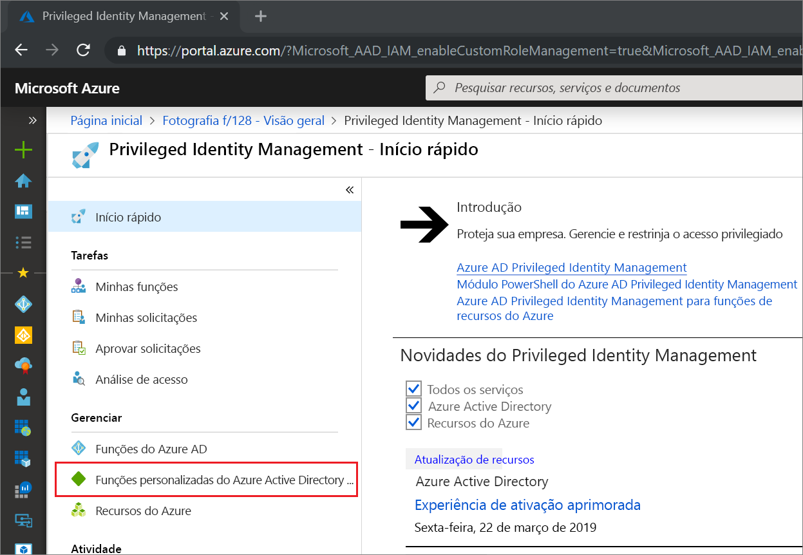
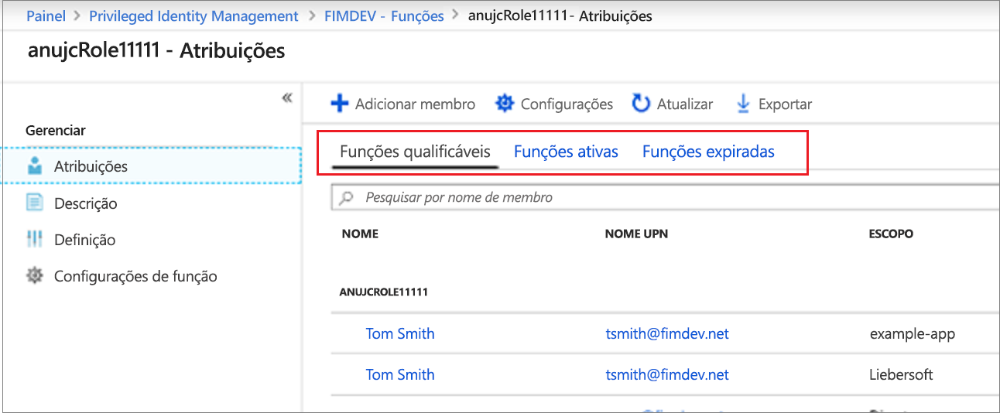
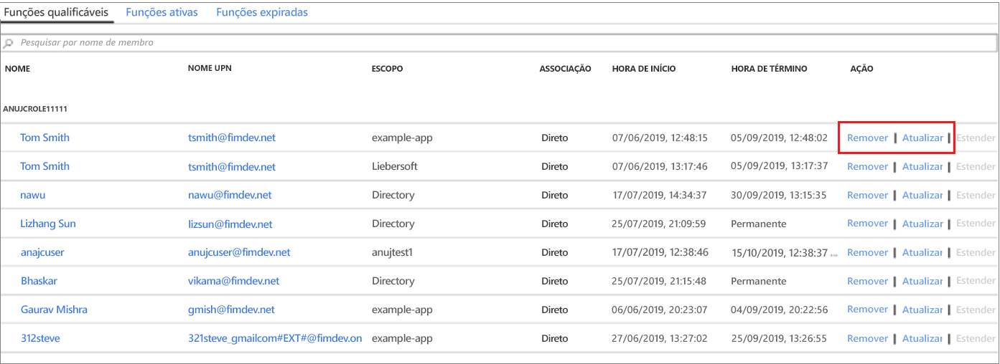

# Atualizar ou remover uma função personalizada do Azure AD atribuída no Privileged Identity Management

Este artigo informa como usar o PIM (Privileged Identity Management) para atualizar ou remover a atribuição Just-In-Time e com limite de tempo a funções personalizadas criadas para gerenciamento de aplicativos na experiência administrativa do Azure AD (Azure Active Directory). 

- Para saber mais sobre como criar funções personalizadas para delegar o gerenciamento de aplicativos no Azure AD, confira [Funções Administrador personalizadas no Azure Active Directory (versão prévia)](../users-groups-roles/roles-custom-overview.md). 
- Se você ainda não usou o Privileged Identity Management, obtenha mais informações em [Começar a usar o Privileged Identity Management](pim-getting-started.md).

> [!NOTE]
> As funções personalizadas do Azure AD não são integradas às funções de diretório internas durante a versão prévia. Depois que a funcionalidade estiver em disponibilidade geral, o gerenciamento de função ocorrerá na experiência de funções internas.

## Atualizar ou remover uma atribuição

Siga estas etapas para atualizar ou remover uma atribuição de função personalizada existente.

1. Entre no [Privileged Identity Management](https://portal.azure.com/?Microsoft_AAD_IAM_enableCustomRoleManagement=true&Microsoft_AAD_IAM_enableCustomRoleAssignment=true&feature.rbacv2roles=true&feature.rbacv2=true&Microsoft_AAD_RegisteredApps=demo#blade/Microsoft_Azure_PIMCommon/CommonMenuBlade/quickStart) no portal do Azure com uma conta de usuário atribuída à função de administrador de funções com privilégios.
1. Selecione **funções personalizadas do Azure AD (versão prévia)** .

    

1. Selecione **Funções** para ver a lista de **Atribuições** de funções personalizadas para aplicativos do Azure AD.

    

1. Selecione a função que você deseja atualizar ou remover.
1. Localize a atribuição de função nas guias **Funções qualificadas** ou **Funções ativas**.
1. Selecione **Atualizar** ou **Remover** para atualizar ou remover a atribuição de função.

    

## Próximas etapas

- [Ativar uma função personalizada do Azure AD](azure-ad-custom-roles-assign.md)
- [Atribuir uma função personalizada do Azure AD](azure-ad-custom-roles-assign.md)
- [Configurar uma atribuição de função personalizada do Azure AD](azure-ad-custom-roles-configure.md)
