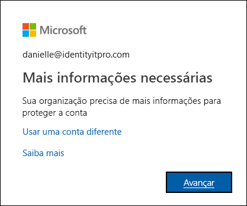

# Visão geral sobre como configurar métodos de verificação de dois fatores

Sua organização ativou a verificação de dois fatores. Isso significa que suas credenciais da conta corporativa ou de estudante agora exigem uma combinação do seu nome de usuário, da sua senha e um telefone ou dispositivo móvel. Sua organização ativou essa verificação adicional porque é mais seguro do que apenas uma senha, porque se baseia em duas formas de autenticação: algo que você sabe e algo que você tem com você. A verificação de dois fatores pode ajudar a evitar a ação de hackers mal-intencionados fingindo ser você, porque, mesmo que eles tenham sua senha, provavelmente eles não têm seu dispositivo.

>[!Important]
>Este conteúdo destina-se aos usuários. Se você for um administrador, é possível encontrar mais informações sobre como configurar e gerenciar seu ambiente do Azure Active Directory (Azure AD) na [Documentação do Azure Active Directory](https://docs.microsoft.com/azure/active-directory).

## Quem decide se você usa esse recurso?

Dependendo do tipo de conta, sua organização pode decidir o que você deve usar a verificação de dois fatores ou talvez você possa decidir por conta própria.

- **Conta corporativa ou de estudante.** Se você estiver usando uma conta corporativa ou de estudante (por exemplo, alain@contoso.com), ficará a critério da sua organização decidir se você deverá usar a verificação de dois fatores, juntamente com os métodos de verificação específicos. Como sua organização decidiu que você deve usar esse recurso, não há como desativá-lo individualmente.

- **Conta Microsoft pessoal.** Você pode optar por configurar a verificação de dois fatores para suas contas Microsoft pessoais (por exemplo, alain@outlook.com). Se você tiver problemas com a verificação de dois fatores e sua conta Microsoft pessoal, confira [Ativar ou desativar a verificação de dois fatores para sua conta Microsoft](https://support.microsoft.com/help/4028586/microsoft-account-turning-two-step-verification-on-or-off). Como você pode escolhe se quer usar esse recurso, é possível ativá-lo e desativá-lo sempre que desejar.

## Acesse a página de Verificação de segurança adicional

Após sua organização ativar e configurar a verificação de dois fatores, você receberá uma mensagem solicitando mais informações para ajudar a manter sua conta segura.

### Para acessar a página de Verificação de segurança adicional

1. Clique em **Próximo** na solicitação **Mais informações necessárias**.

    A página **Verificação de segurança adicional** será exibida.

2. Na página **Verificação de segurança adicional**, você precisa decidir qual método de verificação de dois fatores será usado para confirmar sua identidade após se conectar à sua conta corporativa ou de estudante. Você pode selecionar:

    | Método de contato | DESCRIÇÃO |
    | --- | --- |
    | Aplicativo móvel | <ul><li>**Receber notificações de verificação.** Essa opção envia uma notificação por push ao aplicativo autenticador no seu smartphone ou tablet. Veja a notificação e, se ela for legítima, selecione **Autenticar** no aplicativo. Seu trabalho ou escola pode exigir que você insira um PIN antes de se autenticar.</li><li>**Usar o código de verificação.** Nesse modo, o aplicativo autenticador gera um código de verificação que é atualizado a cada 30 segundos. Insira o código de verificação mais recente na tela de credenciais. O aplicativo Microsoft Authenticator está disponível para [Android](https://go.microsoft.com/fwlink/?linkid=866594) e [iOS](https://go.microsoft.com/fwlink/?linkid=866594).</li></ul> |
    | Telefone de autenticação | <ul><li>**Chamada telefônica** faz uma chamada de voz automática para o número de telefone que você fornecer. Atenda a chamada e pressione # no teclado do telefone para autenticar.</li><li>**SMS** envia uma mensagem de texto com um código de verificação. Após o prompt no texto, responda à mensagem de texto ou insira o código de verificação fornecido na interface de entrada.</li></ul> |
    | Telefone comercial | Faz uma chamada de voz automática para o número de telefone que você fornecer. Atenda a chamada e pressione # no teclado do telefone para autenticar. |

## Próximas etapas

Após acessar a página **Verificação de segurança adicional**, você deve selecionar e configurar seu método de verificação de dois fatores:

- [Configurar seu dispositivo móvel como método de verificação](multi-factor-authentication-setup-phone-number.md)

- [Configurar seu telefone comercial como método de verificação](multi-factor-authentication-setup-office-phone.md)

- [Configurar o aplicativo Microsoft Authenticator como método de verificação](multi-factor-authentication-setup-auth-app.md)

## Recursos relacionados

- [Gerenciar as configurações do método de verificação de dois fatores](multi-factor-authentication-end-user-manage-settings.md)

- [Gerenciar senhas de aplicativo](multi-factor-authentication-end-user-app-passwords.md)

- [Entrar usando a verificação de dois fatores](multi-factor-authentication-end-user-signin.md)

- [Obter ajuda com a verificação de dois fatores](multi-factor-authentication-end-user-troubleshoot.md) 
