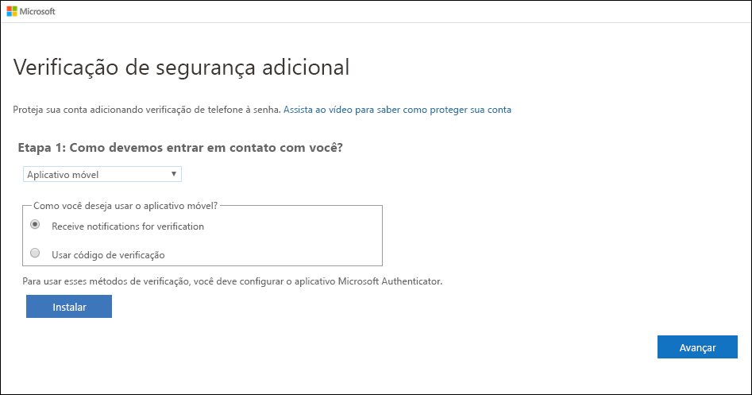
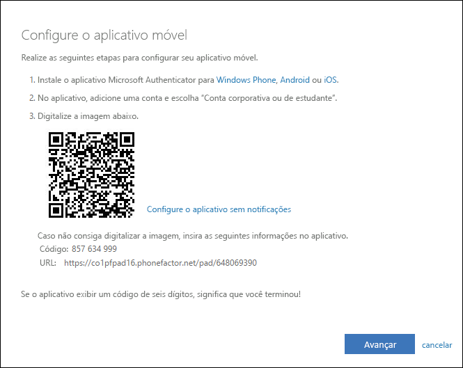
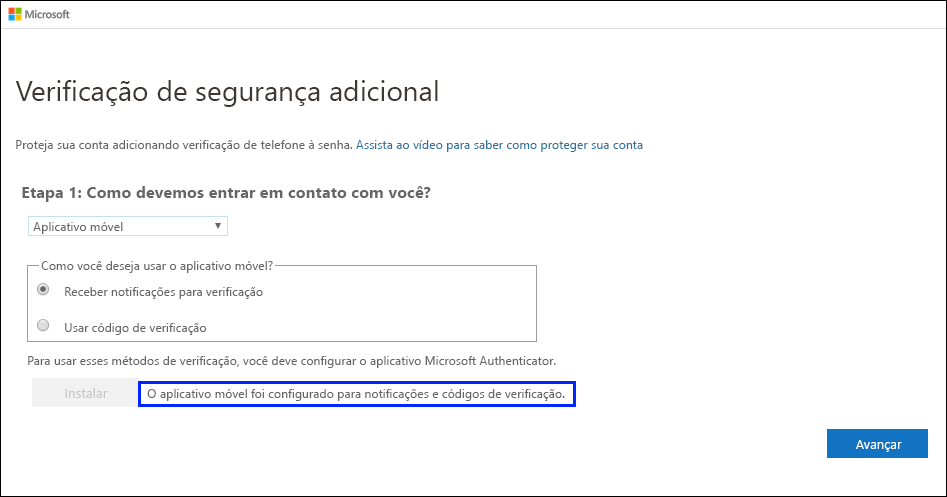
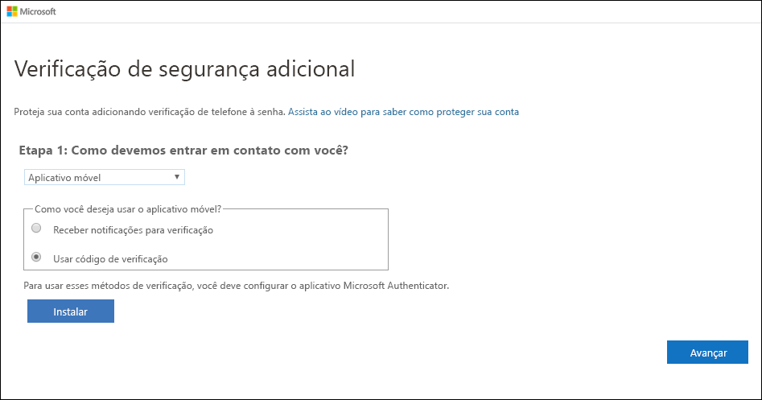
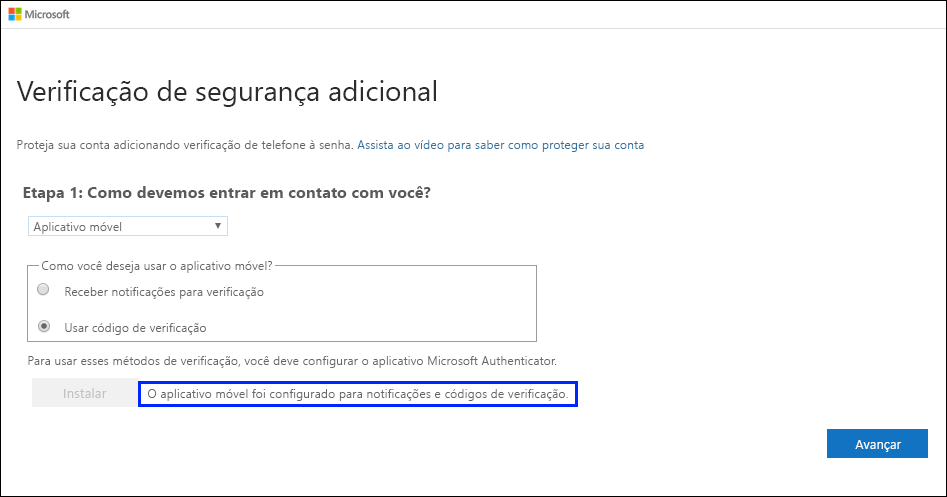
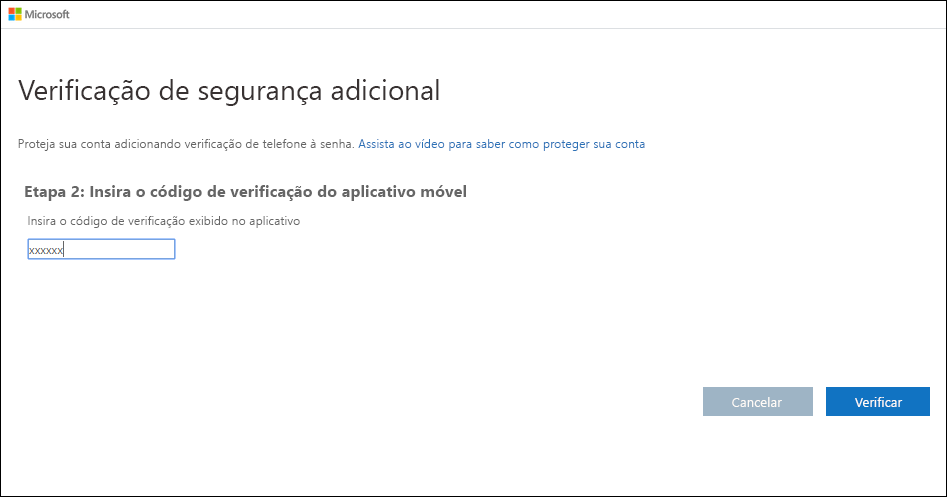

# Configurar um aplicativo autenticador como seu método de verificação de dois fatores

Você pode configurar um aplicativo autenticador para enviar uma notificação ao seu dispositivo móvel ou enviar um código de verificação como seu método de verificação de segurança. Não é obrigatório usar o aplicativo Microsoft Authenticator. Você poderá selecionar um aplicativo diferente durante o processo de configuração. No entanto, este artigo usa o aplicativo Microsoft Authenticator.

>[!Important]
>Antes de poder adicionar sua conta, você deverá baixar e instalar o aplicativo Microsoft Authenticator. Se você ainda não tiver feito isso, siga as etapas no artigo [Baixar e instalar o aplicativo](user-help-auth-app-download-install.md).

>[!Note]
> Caso a opção de Aplicativo móvel esteja esmaecida, é possível que sua organização não permita que você use um aplicativo de autenticação para verificação. Nesse caso, você precisará selecionar outro método ou contatar o administrador para obter mais ajuda.

## Configurar o aplicativo Microsoft Authenticator para enviar notificações

1. Na página **Verificação de segurança adicional**, selecione **Aplicativo móvel** na área **Etapa 1: como devemos entrar em contato com você**.

2. Selecione **Receber notificações para verificação** na área **Como você deseja usar o aplicativo móvel** e, em seguida, selecione **Configurar**.

    

    A página **Configurar aplicativo móvel** é exibida.

    

3. Abra o aplicativo Microsoft Authenticator, selecione **adicionar conta** da **personalizar e controle** ícone no canto superior direito e, em seguida, selecione **trabalho ou conta de escola**.

    >[!Note]
    >Se esta for a primeira vez que está configurando o aplicativo Microsoft Authenticator, você poderá receber um prompt perguntando se deseja permitir que o aplicativo acesse sua câmera (iOS) ou que o aplicativo tire fotos e grave vídeo (Android). Você precisa selecionar **Permitir** para que o aplicativo autenticador possa acessar sua câmera para tirar uma foto do código QR na próxima etapa. Se não permitir acesso da câmera, você ainda poderá configurar o aplicativo autenticador, mas precisará adicionar as informações de código manualmente. Para obter informações sobre como adicionar o código manualmente, confira [Adicionar uma conta manualmente ao aplicativo](user-help-auth-app-add-account-manual.md).

4. Use a câmera do dispositivo para digitalizar o código QR da tela **Configurar aplicativo móvel** em seu computador e, em seguida, escolha **Avançar**.

5. Volte para o computador e para a página **Verificação de segurança adicional**, verifique se você recebeu a mensagem dizendo que sua configuração foi bem-sucedida e, em seguida, selecione **Avançar**.

    

    O aplicativo autenticador enviará uma notificação ao dispositivo móvel como um teste.

6. No dispositivo móvel, selecione **Aprovar**.

7. No computador, adicione o número de telefone do seu dispositivo móvel na área **Etapa 3: caso você perca o acesso ao aplicativo móvel** e, em seguida, selecione **Avançar**.

    É recomendável adicionar o número de telefone do seu dispositivo móvel para atuar como um backup se você não conseguir acessar ou usar o aplicativo móvel por algum motivo.

8. Na área **Etapa 4: continuar usando os aplicativos existentes**, copie a senha do aplicativo fornecida e cole-a em um local seguro.

    

    >[!Note]
    >Para obter informações sobre como usar a senha de aplicativo com os aplicativos mais antigos, confira [Gerenciar senhas de aplicativo](multi-factor-authentication-end-user-app-passwords.md). Você só precisará usar senhas de aplicativo se continuar usando aplicativos mais antigos incompatíveis com a verificação de dois fatores.

9. Selecione **Concluído**.

## Configurar o aplicativo Microsoft Authenticator para usar códigos de verificação

1. Na página **Verificação de segurança adicional**, selecione **Aplicativo móvel** na área **Etapa 1: como devemos entrar em contato com você**.

2. Selecione **Usar código de verificação** na área **Como você deseja usar o aplicativo móvel** e, em seguida, selecione **Configurar**.

    

    A página **Configurar aplicativo móvel** é exibida.

    

3. Abra o aplicativo Microsoft Authenticator, selecione **adicionar conta** da **personalizar e controle** ícone no canto superior direito e, em seguida, selecione **trabalho ou conta de escola**.

    >[!Note]
    >Se esta for a primeira vez que está configurando o aplicativo Microsoft Authenticator, você poderá receber um prompt perguntando se deseja permitir que o aplicativo acesse sua câmera (iOS) ou que o aplicativo tire fotos e grave vídeo (Android). Você precisa selecionar **Permitir** para que o aplicativo autenticador possa acessar sua câmera para tirar uma foto do código QR na próxima etapa. Se não permitir acesso da câmera, você ainda poderá configurar o aplicativo autenticador, mas precisará adicionar as informações de código manualmente. Para obter informações sobre como adicionar o código manualmente, confira [Adicionar uma conta manualmente ao aplicativo](user-help-auth-app-add-account-manual.md).

4. Use a câmera do dispositivo para digitalizar o código QR da tela **Configurar aplicativo móvel** em seu computador e, em seguida, escolha **Avançar**.

5. Volte para o computador e para a página **Verificação de segurança adicional**, verifique se você recebeu a mensagem dizendo que sua configuração foi bem-sucedida e, em seguida, selecione **Avançar**.

    

    O aplicativo autenticador solicitará um código de verificação como um teste.

6. No aplicativo Microsoft Authenticator, role para baixo até sua conta corporativa ou de estudante, copie e cole o código de seis dígitos do aplicativo na caixa **Etapa 2: insira o código de verificação do aplicativo móvel** no seu computador e, em seguida, selecione **Verificar**.

    

7. No computador, adicione o número de telefone do seu dispositivo móvel na área **Etapa 3: caso você perca o acesso ao aplicativo móvel** e, em seguida, selecione **Avançar**.

    É recomendável adicionar o número de telefone do seu dispositivo móvel para atuar como um backup se você não conseguir acessar ou usar o aplicativo móvel por algum motivo.

8. Na área **Etapa 4: continuar usando os aplicativos existentes**, copie a senha do aplicativo fornecida e cole-a em um local seguro.

    

    >[!Note]
    >Para obter informações sobre como usar a senha de aplicativo com os aplicativos mais antigos, confira [Gerenciar senhas de aplicativo](multi-factor-authentication-end-user-app-passwords.md). Você só precisará usar senhas de aplicativo se continuar usando aplicativos mais antigos incompatíveis com a verificação de dois fatores.

9. Selecione **Concluído**.

## Próximas etapas

Depois de configurar o método de verificação de dois fatores, adicione outros métodos, gerencie as configurações e as senhas de aplicativo, entre ou obtenha ajuda com alguns problemas comuns relacionados à verificação de dois fatores.

- [Gerenciar as configurações do método de verificação de dois fatores](multi-factor-authentication-end-user-manage-settings.md)

- [Gerenciar senhas de aplicativo](multi-factor-authentication-end-user-app-passwords.md)

- [Entrar usando a verificação de dois fatores](multi-factor-authentication-end-user-signin.md)

- [Obter ajuda com a verificação de dois fatores](multi-factor-authentication-end-user-troubleshoot.md)
