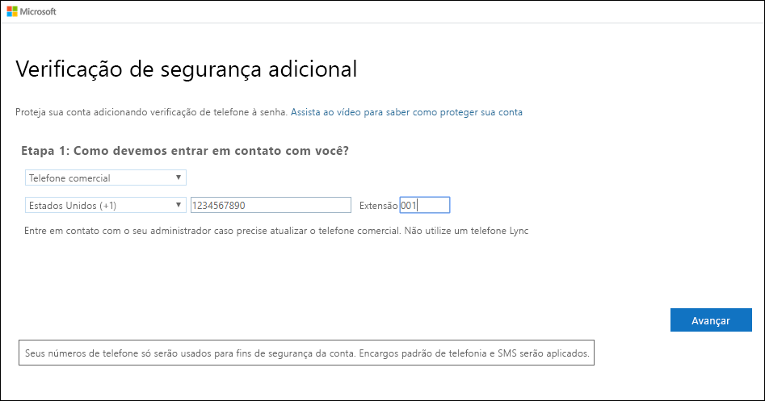
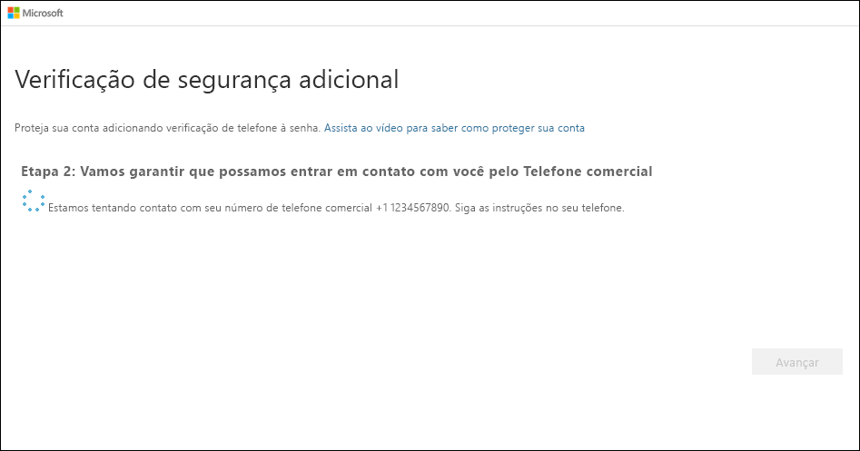

# Configurar um telefone do escritório como o método de verificação de dois fatores

Configure seu telefone do escritório para funcionar como o método de verificação de dois fatores.

>[!Note]
> Se a opção Telefone do escritório estiver esmaecida, será possível que sua organização não permita que você use um número de telefone do escritório para verificação. Nesse caso, você precisará selecionar outro método ou contatar o administrador para obter mais ajuda.

## Configurar seu telefone do escritório como o método de verificação

1. Na página **Verificação de segurança adicional**, selecione **Telefone do escritório** na área **Etapa 1: Como devemos entrar em contato com você**, selecione o país ou a região na lista suspensa, digite o número de telefone do escritório e, em seguida, o ramal, se houver.

    

2. Você receberá uma chamada telefônica da Microsoft, solicitando que pressione a tecla jogo da velha (#) no telefone do escritório para verificar sua identidade.

    

3. Na área **Etapa 3: Continuar usando os aplicativos existentes**, copie a senha do aplicativo fornecida e cole-a em um local seguro.

    

    >[!Note]
    >Para obter informações sobre como usar a senha de aplicativo com os aplicativos mais antigos, confira [Gerenciar senhas de aplicativo](multi-factor-authentication-end-user-app-passwords.md). Você só precisará usar senhas de aplicativo se continuar usando aplicativos mais antigos incompatíveis com a verificação de dois fatores.

4. Selecione **Concluído**.

## Próximas etapas

Depois de configurar o método de verificação de dois fatores, adicione outros métodos, gerencie as configurações e as senhas de aplicativo, entre ou obtenha ajuda com alguns problemas comuns relacionados à verificação de dois fatores.

- [Gerenciar as configurações do método de verificação de dois fatores](multi-factor-authentication-end-user-manage-settings.md)

- [Gerenciar senhas de aplicativo](multi-factor-authentication-end-user-app-passwords.md)

- [Entrar usando a verificação de dois fatores](multi-factor-authentication-end-user-signin.md)

- [Obter ajuda com a verificação de dois fatores](multi-factor-authentication-end-user-troubleshoot.md)
