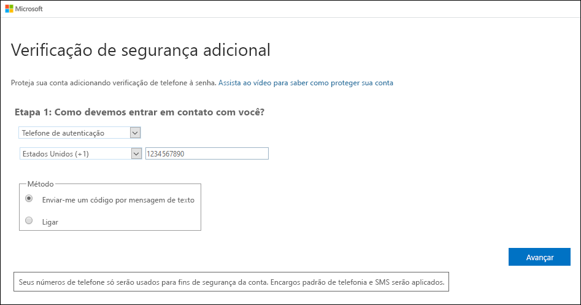
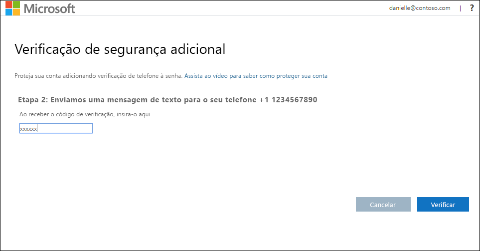
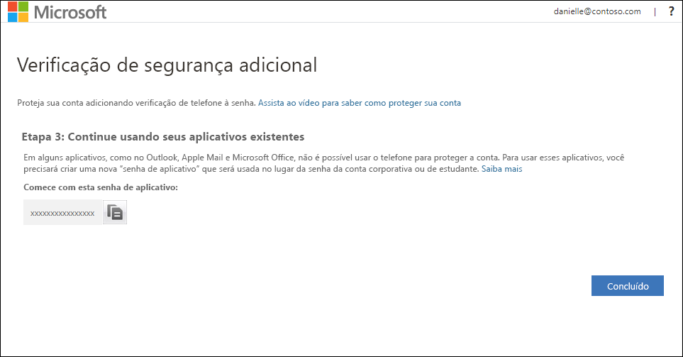
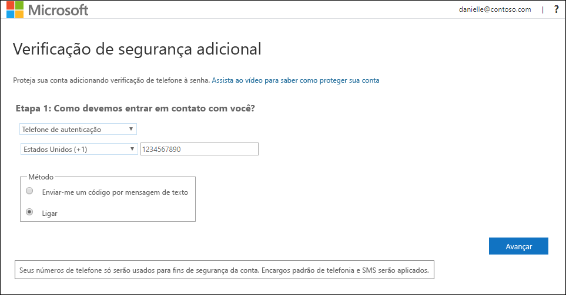
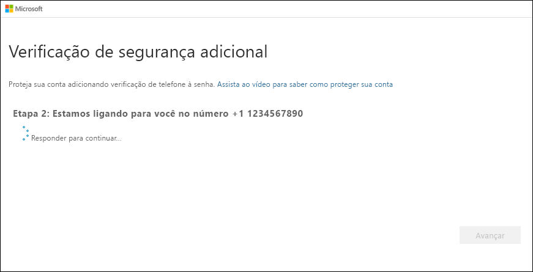

# Configurar um dispositivo móvel como o método de verificação de dois fatores

Configure seu dispositivo móvel para funcionar como o método de verificação de dois fatores. Seu celular pode receber uma mensagem de texto com um código de verificação ou uma chamada telefônica.

>[!Note]
> Se a opção de telefone de autenticação estiver esmaecida, será possível que sua organização não permita que você use um número de telefone ou uma mensagem de texto para verificação. Nesse caso, você precisará selecionar outro método ou contatar o administrador para obter mais ajuda.

## Configurar seu dispositivo móvel para usar uma mensagem de texto como o método de verificação

1. Na página **Verificação de segurança adicional**, selecione **Telefone de autenticação** na área **Etapa 1: Como devemos entrar em contato com você**, selecione o país ou a região na lista suspensa e, em seguida, digite o número de telefone do dispositivo móvel.

2. Selecione **Enviar-me um código por mensagem de texto** na área **Método** e, em seguida, selecione **Avançar**.

    

3. Digite o código de verificação da mensagem de texto enviada da Microsoft na área **Etapa 2: Enviamos uma mensagem de texto para o seu telefone** e, em seguida, selecione **Verificar**.

    

4. Na área **Etapa 3: Continuar usando os aplicativos existentes**, copie a senha do aplicativo fornecida e cole-a em um local seguro.

    

    >[!Note]
    >Para obter informações sobre como usar a senha de aplicativo com os aplicativos mais antigos, confira [Gerenciar senhas de aplicativo](multi-factor-authentication-end-user-app-passwords.md). Você só precisará usar senhas de aplicativo se continuar usando aplicativos mais antigos incompatíveis com a verificação de dois fatores.

5. Selecione **Concluído**.

## Configurar seu dispositivo móvel para receber uma chamada telefônica

1. Na página **Verificação de segurança adicional**, selecione **Telefone de autenticação** na área **Etapa 1: Como devemos entrar em contato com você**, selecione o país ou a região na lista suspensa e, em seguida, digite o número de telefone do dispositivo móvel.

2. Selecione **Telefonar para mim** na área **Método** e, em seguida, selecione **Avançar**.

    

3. Você receberá uma chamada telefônica da Microsoft, solicitando que você pressione a tecla jogo da velha (#) no dispositivo móvel para verificar sua identidade.

    

4. Na área **Etapa 3: Continuar usando os aplicativos existentes**, copie a senha do aplicativo fornecida e cole-a em um local seguro.

    

    >[!Note]
    >Para obter informações sobre como usar a senha de aplicativo com os aplicativos mais antigos, confira [Gerenciar senhas de aplicativo](multi-factor-authentication-end-user-app-passwords.md). Você só precisará usar senhas de aplicativo se continuar usando aplicativos mais antigos incompatíveis com a verificação de dois fatores.

5. Selecione **Concluído**.

## Próximas etapas

Depois de configurar o método de verificação de dois fatores, adicione outros métodos, gerencie as configurações e as senhas de aplicativo, entre ou obtenha ajuda com alguns problemas comuns relacionados à verificação de dois fatores.

- [Gerenciar as configurações do método de verificação de dois fatores](multi-factor-authentication-end-user-manage-settings.md)

- [Gerenciar senhas de aplicativo](multi-factor-authentication-end-user-app-passwords.md)

- [Entrar usando a verificação de dois fatores](multi-factor-authentication-end-user-signin.md)

- [Obter ajuda com a verificação de dois fatores](multi-factor-authentication-end-user-troubleshoot.md)
