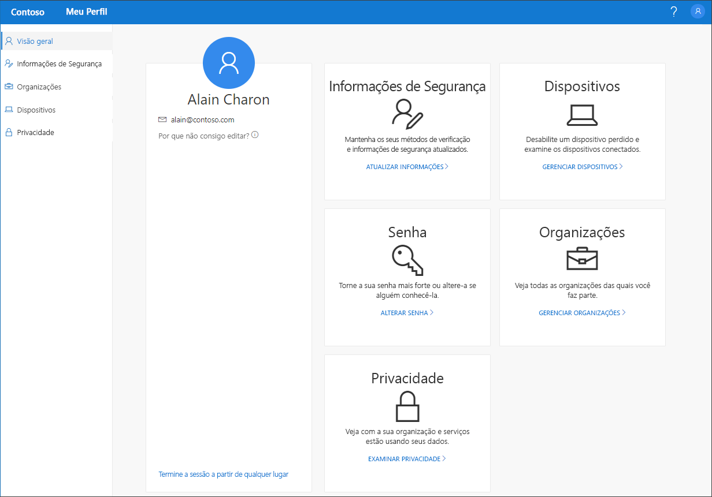

# Visão geral do portal Meu Perfil (versão prévia)

[!INCLUDE [preview-notice](../../../includes/active-directory-end-user-preview-notice-myprofile.md)]

O portal **Meu Perfil** (versão prévia) ajuda você a gerenciar sua conta corporativa ou de estudante configurando e gerenciando suas informações de segurança, gerenciando suas organizações e dispositivos conectados e exibindo como sua organização usa seus dados.

>[!Important]
>Este conteúdo destina-se aos usuários. Se você for um administrador, é possível encontrar mais informações sobre como configurar e gerenciar seu ambiente do Azure Active Directory (Azure AD) na [Documentação do Azure Active Directory](https://docs.microsoft.com/azure/active-directory).

## Acessar o portal Meu Perfil

Acesse o portal **Meu Perfil** (https://myprofile.microsoft.com), da versão atual de um dos seguintes navegadores:

- Chrome
- Microsoft Edge
- Safari
- Firefox
- Internet Explorer 11

## Artigos do portal Meu Perfil

Para obter informações detalhadas e instruções sobre o que está disponível no portal **Meu Perfil**, confira os seguintes artigos:

|Artigo |DESCRIÇÃO |
|------|------------|
| [Adicionar suas informações de segurança](user-help-security-info-overview.md) | Vários artigos com instruções sobre como configurar o aplicativo Microsoft Authenticator, mensagens de texto ou chamadas telefônicas como o método de verificação. Também inclui artigos sobre como adicionar um endereço de email ou perguntas de segurança predefinidas, de modo que você possa redefinir sua própria senha esquecida, se necessário.|
| [Exibir ou deixar suas organizações conectadas](myprofile-portal-organizations-page.md) | Instruções sobre como exibir e deixar as organizações conectadas à sua conta corporativa ou de estudante.|
| [Exibir ou desabilitar seus dispositivos conectados](myprofile-portal-devices-page.md) | Instruções sobre como exibir ou desabilitar os dispositivos que você conectou à sua conta corporativa ou de estudante.|
| [Exibir suas informações de privacidade](myprofile-portal-privacy-page.md) | Instruções sobre como exibir quais serviços online estão conectados à sua conta corporativa ou de estudante, juntamente com a declaração de termos de uso de sua organização.|
