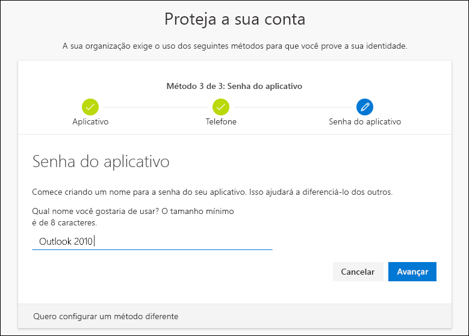
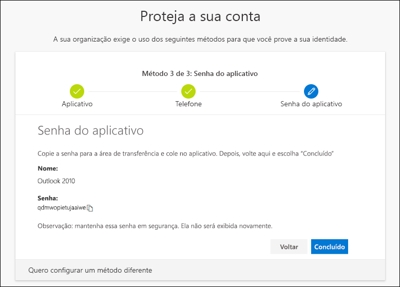
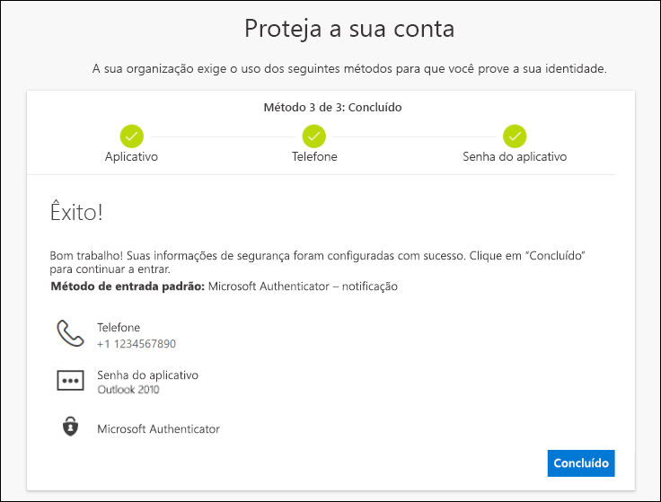

# Configure suas informações de segurança (versão prévia) no aviso na página de entrada

Você poderá seguir estas etapas se for solicitado a você que configure suas informações de segurança imediatamente após entrar na sua conta corporativa ou de estudante.

Você verá esse prompt apenas se não tiver configurado as informações de segurança exigidas pela sua organização. Se já tiver configurado suas informações de segurança mas quiser fazer alterações, você poderá seguir as etapas nos diversos artigos explicativos baseados em método. Para obter mais informações, confira [Adicionar ou atualizar sua visão de geral de informações de segurança](security-info-add-update-methods-overview.md).

[!INCLUDE [preview-notice](../../../includes/active-directory-end-user-preview-notice-security-info.md)]

## Entrar em sua conta corporativa ou de estudante

Depois de entrar na sua conta corporativa ou de estudante, você verá um aviso solicitando que você forneça mais informações antes de permitir seu acesso à conta.

## Configurar suas informações de segurança usando o assistente

Siga estas etapas para configurar suas informações de segurança para sua conta corporativa ou de estudante por meio do aviso.

>[!Important]
>Isso é apenas um exemplo do processo. Dependendo dos requisitos da sua organização, o administrador pode ter definido métodos de verificação diferentes que você precisará configurar durante esse processo. Neste exemplo, estamos exigindo dois métodos, o aplicativo Microsoft Authenticator e um número de telefone celular para mensagens de texto ou chamadas de verificação.

1. Depois de selecionar **Avançar** no aviso, um **assistente Mantenha sua conta segura** é exibido, mostrando o primeiro método que o administrador e a organização exigem que você configure. Neste exemplo, trata-se do aplicativo Microsoft Authenticator.

   > [!Note]
   > Se você não quiser usar o aplicativo Microsoft Authenticator, selecione o link **Desejo usar um aplicativo autenticador diferente**.
   >
   > Se a sua organização permitir que você escolha um método que não seja o aplicativo autenticador, você poderá selecionar o link **Desejo configurar um método diferente**.

    

2. Selecione **Baixar agora** para baixar e instalar o aplicativo Microsoft Authenticator em seu dispositivo móvel e, em seguida, selecione **Avançar**. Para obter mais informações sobre como baixar e instalar o aplicativo, confira [Baixar e instalar o aplicativo Microsoft Authenticator](user-help-auth-app-download-install.md).

    

3. Permaneça na página **Configurar sua conta** enquanto configura o aplicativo Microsoft Authenticator em seu dispositivo móvel.

4. Abra o aplicativo Microsoft Authenticator, permita notificações (se solicitado), selecione **Adicionar conta** pelo ícone **Personalizar e controlar** no canto superior direito e, em seguida, selecione **Conta corporativa ou de estudante**.

5. Volte para a página **Configurar sua conta** em seu computador e selecione **Avançar**.

    A página **Digitalizar o código QR** será exibida.

    

6. Digitalize o código fornecido com o leitor de código QR do aplicativo Microsoft Authenticator, que aparecerá em seu dispositivo móvel depois que você criar sua conta corporativa ou de estudante na etapa 5.

    O aplicativo autenticador adicionará sua conta corporativa ou de estudante com sucesso, sem a necessidade de qualquer informação adicional sobre você. No entanto, se o leitor de código QR não puder ler o código, você poderá selecionar **Não é possível verificar o link do código QR** e inserir manualmente o código e o URL no aplicativo Microsoft Authenticator. Para obter mais informações sobre como adicionar um código manualmente, confira [Adicionar uma conta ao aplicativo manualmente](user-help-auth-app-add-account-manual.md).

7. Selecione **Avançar** na página **Digitalizar o código QR** em seu computador.

    Uma notificação será enviada ao aplicativo Microsoft Authenticator em seu dispositivo móvel, para testar a sua conta.

    

8. Aprove a notificação no aplicativo Microsoft Authenticator e selecione **Avançar**.

    

    Por padrão, suas informações de segurança são atualizadas para usar o aplicativo Microsoft Authenticator a fim de verificar sua identidade ao usar a verificação em duas etapas ou a redefinição de senha.

9. Na página de configuração **Telefone**, escolha se deseja receber uma mensagem de texto ou uma chamada telefônica e, em seguida, selecione **Avançar**. Para os fins deste exemplo, estamos usando mensagens de texto, portanto, você deve usar um número de telefone para um dispositivo que pode aceitar mensagens de texto.

    

    Uma mensagem de texto é enviada ao número de telefone. Se preferir receber uma chamada telefônica, o processo será o mesmo. No entanto, você receberá uma chamada telefônica com instruções, em vez de uma mensagem de texto.

10. Insira o código fornecido pela mensagem de texto enviada ao seu dispositivo móvel e, em seguida, selecione **Avançar**.

    

11. Examine a notificação de êxito e, em seguida, selecione **Concluído**.

    

    Suas informações de segurança são atualizadas para usar mensagens de texto como um método de backup para confirmar sua identidade ao usar a verificação em duas etapas ou a redefinição de senha.

12. Examine a página **Sucesso** para confirmar que você configurou com êxito o aplicativo Microsoft Authenticator e um método de telefone (mensagem de texto ou chamada telefônica) para suas informações de segurança e, em seguida, selecione **Concluído**.

    

    >[!Note]
    >Se a sua organização exigir o uso de senhas de aplicativo, poderá haver uma seção adicional neste assistente, em que será possível configurar isso. Se você vir uma terceira seção chamada **Senhas de aplicativo**, será necessário preenchê-la antes de poder concluir o assistente. Para ver as etapas necessárias para adicionar uma senha de aplicativo, consulte a seção [Gerenciar suas senhas de aplicativo](#manage-your-app-passwords) deste artigo.

### Gerenciar suas senhas de aplicativo

Alguns aplicativos, como o Outlook 2010, não dão suporte à verificação em duas etapas. Essa falta de suporte significa que, se você estiver usando a verificação em duas etapas, o aplicativo não funcionará. Para contornar este problema, você pode criar uma senha gerada automaticamente para usar com cada aplicativo que não seja o navegador, separado da sua senha normal.

>[!Note]
>Caso você não veja essa opção no assistente, isso significa que o administrador não a configurou. Se ela não estiver configurada, mas você souber que precisa usar senhas de aplicativo, siga as etapas em [Configurar senhas de aplicativo da página Informações de segurança (versão prévia)](security-info-app-passwords.md).

Ao usar senhas de aplicativos, é importante lembrar:

- As senhas de aplicativos são geradas automaticamente e inseridas apenas uma vez por aplicativo.

- Há um limite de 40 senhas por usuário. Se você tentar criar um após esse limite, será solicitado que você exclua uma senha existente antes de poder criar a nova.

- Use uma senha de aplicativo por dispositivo, não por aplicativo. Por exemplo, crie uma única senha para todos os aplicativos em seu laptop e, em seguida, outra senha única para todos os aplicativos em sua área de trabalho.

#### Para adicionar senhas de aplicativo no assistente de entrada

1. Após concluir as seções anteriores do assistente, selecione **Avançar** e conclua a seção **Senhas de aplicativo**.

2. Digite o nome do aplicativo que necessita da senha, por exemplo `Outlook 2010` e, em seguida, selecione **Avançar**.

    

3. Copie o código da senha da tela **Senha de aplicativo** e cole-o na área de **Senha** do aplicativo (neste exemplo, Outlook 2010).

    

4. Depois de copiar a senha e colar no aplicativo, volte para esse assistente para verificar se todas as informações do método de entrada estão corretas e, em seguida, selecione **Concluído**.

    

## Próximas etapas

- Para alterar, excluir ou atualizar métodos de informações de segurança padrão, confira:

    - [Configurar informações de segurança de um aplicativo autenticador](security-info-setup-auth-app.md).

    - [Configurar informações de segurança para mensagens de texto](security-info-setup-text-msg.md).

    - [Configurar informações de segurança para usar chamadas telefônicas](security-info-setup-phone-number.md).

    - [Configurar informações de segurança para usar email](security-info-setup-email.md).

    - [Configurar informações de segurança para usar perguntas de segurança predefinidas](security-info-setup-questions.md).

- Para obter informações sobre como entrar usando seu método especificado, confira [Como entrar](user-help-sign-in.md).

- Redefina sua senha se você a perdeu ou esqueceu, do [portal de redefinição de senha](https://passwordreset.microsoftonline.com/) ou siga as etapas no artigo [Redefinir sua senha de trabalho ou escola](user-help-reset-password.md).

- Obter solução de problemas e ajuda para problemas de logon na [não pode entrar sua conta da Microsoft](https://support.microsoft.com/help/12429/microsoft-account-sign-in-cant) artigo.
