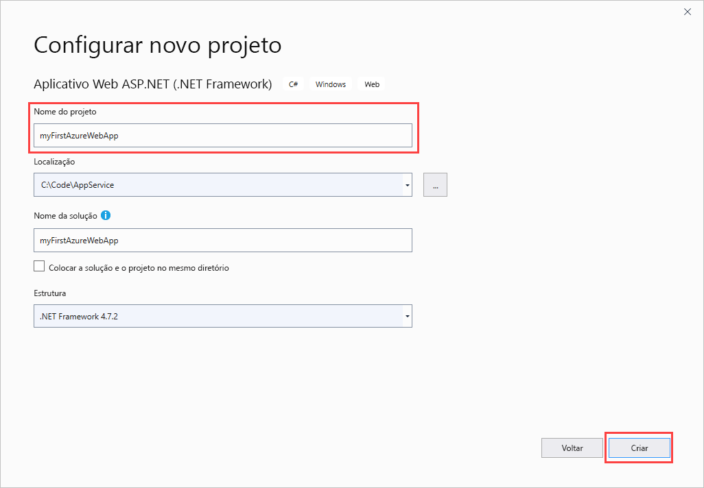
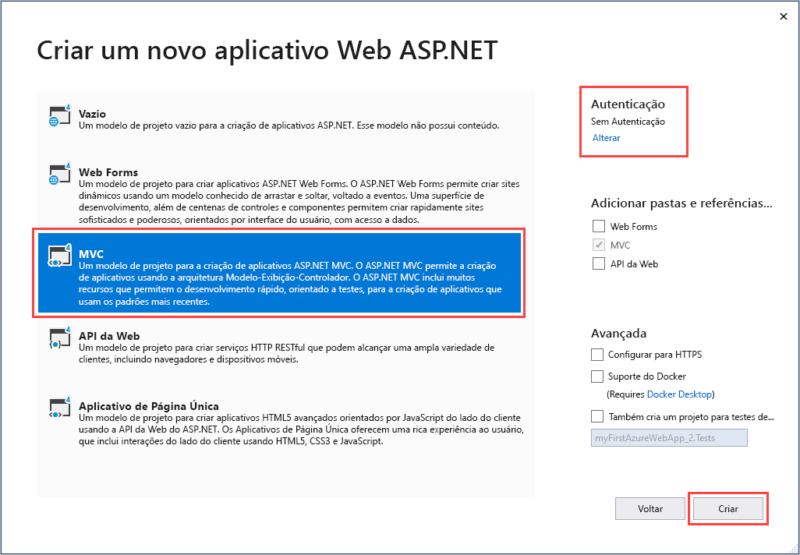
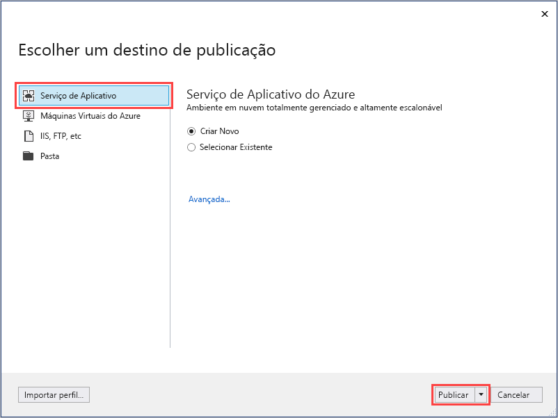
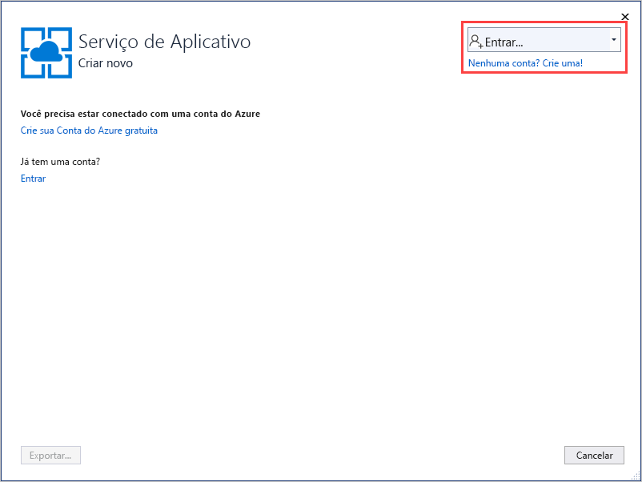
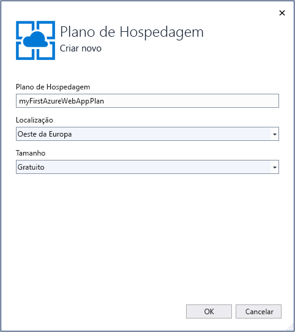
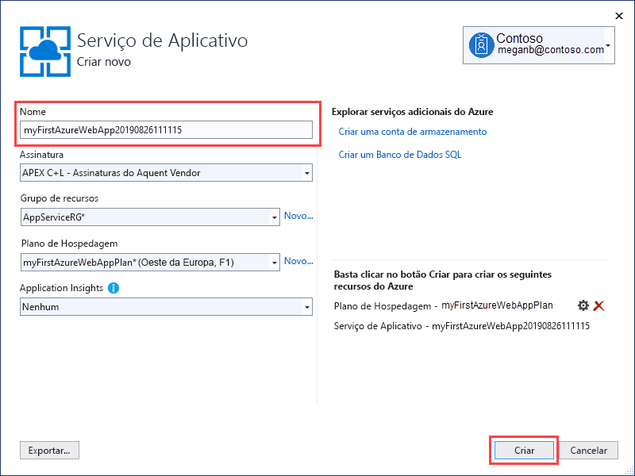
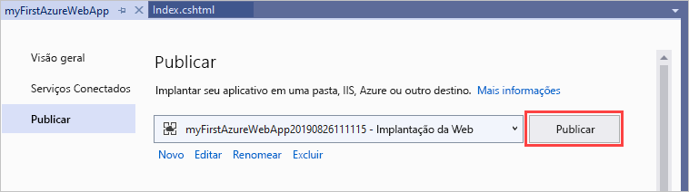
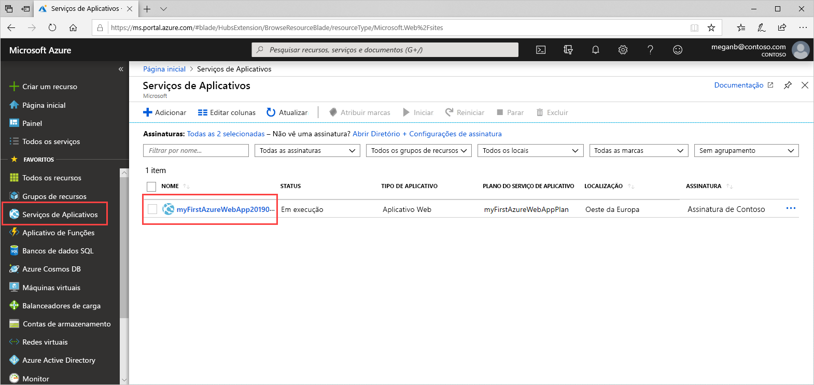
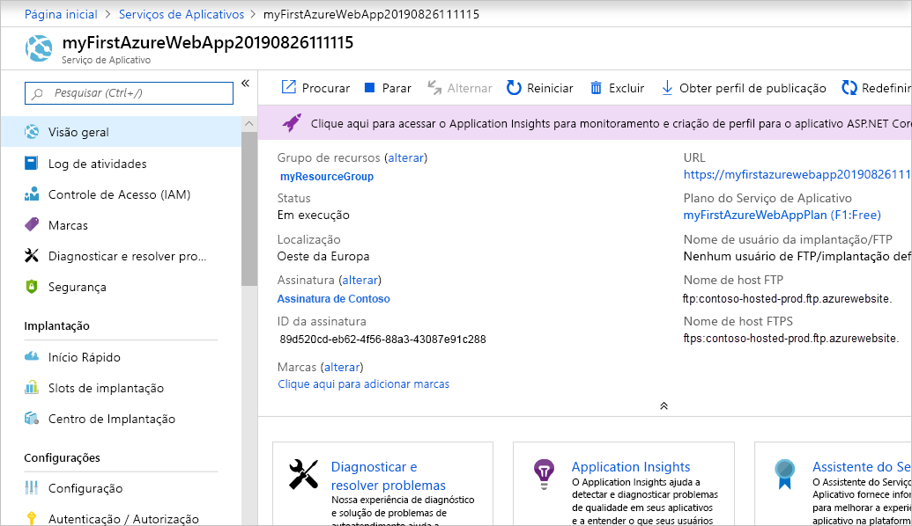

# <a name="create-an-aspnet-framework-web-app-in-azure"></a>Criar um aplicativo Web do ASP.NET Framework no Azure

O [Serviço de Aplicativo do Azure](overview.md) fornece um serviço de hospedagem na Web altamente escalonável e com aplicação automática de patches.

Este início rápido mostra como implantar seu primeiro aplicativo Web ASP.NET no Serviço de Aplicativo do Azure. Quando terminar, você terá um plano do Serviço de Aplicativo. Você também terá um aplicativo do Serviço de Aplicativo com um aplicativo Web implantado.

[!INCLUDE [quickstarts-free-trial-note](../../includes/quickstarts-free-trial-note.md)]

## <a name="prerequisites"></a>Pré-requisitos

Para concluir este tutorial, instale o <a href="https://www.visualstudio.com/downloads/" target="_blank">Visual Studio 2019</a> com a carga de trabalho do **ASP.NET e de desenvolvimento para a Web**.

Se você já instalou o Visual Studio 2019:

- Instale as atualizações mais recentes no Visual Studio selecionando **Ajuda** > **Verificar Atualizações**.
- Adicione a carga de trabalho selecionando **Ferramentas** > **Obter Ferramentas e Recursos**.

## Criar um aplicativo Web ASP.NET <a name="create-and-publish-the-web-app"></a>

Crie um aplicativo Web ASP.NET seguindo estas etapas:

1. Abra o Visual Studio e selecione **Criar novo projeto**.

1. Em **Criar novo projeto**, localize e escolha **Aplicativo Web ASP.NET (.NET Framework)** para C# e, em seguida, selecione **Avançar**.

1. Em **Configurar seu novo projeto**, dê ao aplicativo o nome _myFirstAzureWebApp_ e, em seguida, selecione, **Criar**.

   

1. Você pode implantar qualquer tipo de aplicativo Web ASP.NET no Azure. Para este início rápido, escolha o modelo **MVC**. 

1. Verifique se a autenticação está definida como **Sem Autenticação**. Selecione **Criar**.

   

1. No menu do Visual Studio, selecione **Depurar** > **Iniciar sem Depuração** para executar o aplicativo Web localmente.

   

## Publicar seu aplicativo Web <a name="launch-the-publish-wizard"></a>

1. No **Gerenciador de Soluções**, clique com o botão direito do mouse no projeto **myFirstAzureWebApp** e selecione **Publicar**.

1. Escolha **Serviço de Aplicativo** e selecione **Publicar**.

   

1. Em **Criar Novo Serviço de Aplicativo**, suas opções dependem de você já ter entrado no Azure e de ter uma conta do Visual Studio vinculada a uma conta do Azure. Selecione **Adicionar uma conta** ou **Entrar** para entrar em sua assinatura do Azure. Se você já estiver conectado, selecione a conta que deseja.

   > [!NOTE]
   > Se você já estiver conectado, não selecione **Criar** ainda.
   >
   >

   

   [!INCLUDE [resource group intro text](../../includes/resource-group.md)]

1. Para **Grupo de recursos**, selecione **Novo**.

1. Em **Nome do novo grupo de recursos**, insira *myResourceGroup* e selecione **OK**.

   [!INCLUDE [app-service-plan](../../includes/app-service-plan.md)]

1. Para **Plano de Hospedagem**, selecione **Novo**.

1. Na caixa de diálogo **Configurar Plano de Hospedagem**, insira os valores da tabela a seguir e selecione **OK**.

   | Configuração | Valor sugerido | DESCRIÇÃO |
   |-|-|-|
   |Plano do Serviço de Aplicativo| myAppServicePlan | O nome do plano do Serviço de Aplicativo. |
   | Location | Europa Ocidental | O datacenter onde o aplicativo Web está hospedado. |
   | Tamanho | Grátis | O [Tipo de preço](https://azure.microsoft.com/pricing/details/app-service/?ref=microsoft.com&utm_source=microsoft.com&utm_medium=docs&utm_campaign=visualstudio) determina os recursos de hospedagem. |

   

1. Em **Nome**, insira um nome de aplicativo exclusivo que inclua somente os caracteres válidos `a-z`, `A-Z`, `0-9` e `-`. Você pode aceitar o nome exclusivo gerado automaticamente. A URL do aplicativo Web é `http://<app_name>.azurewebsites.net`, em que `<app_name>` é o nome do aplicativo.

   

1. Clique em **Criar** para começar a criar os recursos do Azure.

Depois que o assistente é concluído, ele publica o aplicativo Web ASP.NET no Azure e, em seguida, inicia o aplicativo no navegador padrão.


O nome do aplicativo especificado na página **Criar Novo Serviço de Aplicativo** é usado como o prefixo da URL no formato `http://<app_name>.azurewebsites.net`.

**Parabéns!** Seu aplicativo Web ASP.NET está em execução no Serviço de Aplicativo do Azure.

## <a name="update-the-app-and-redeploy"></a>Atualizar o aplicativo e reimplantar

1. No **Gerenciador de Soluções**, em seu projeto, abra **Exibições** > **Home** > **Index.cshtml**.

1. Encontre o rótulo HTML `<div class="jumbotron">` próximo à parte superior e substitua o elemento inteiro pelo seguinte código:

   ```HTML
   <div class="jumbotron">
       <h1>ASP.NET in Azure!</h1>
       <p class="lead">This is a simple app that we’ve built that demonstrates how to deploy a .NET app to Azure App Service.</p>
   </div>
   ```

1. Para implantar novamente no Azure, clique com o botão direito do mouse no projeto **myFirstAzureWebApp**, no **Gerenciador de Soluções** e selecione **Publicar**.

1. Na página de resumo **Publicar**, selecione **Publicar**.

   

Quando a publicação está concluída, o Visual Studio inicia um navegador para a URL do aplicativo Web.


## <a name="manage-the-azure-app"></a>Gerenciar o aplicativo do Azure

1. Acesse o <a href="https://portal.azure.com" target="_blank">portal do Azure</a> para gerenciar o aplicativo Web.

1. No menu à esquerda, selecione **Serviços de Aplicativos** e, em seguida, selecione o nome do seu aplicativo do Azure.

   

   A página Visão Geral do seu aplicativo Web é exibida. Aqui, você pode executar tarefas básicas de gerenciamento como procurar, parar, iniciar, reiniciar e excluir.

   

   O menu à esquerda fornece páginas diferentes para configurar seu aplicativo.

## <a name="video"></a>Vídeo

Assista ao vídeo para ver este início rápido em ação e, depois, execute as etapas para publicar seu primeiro aplicativo .NET no Azure.

> [!VIDEO https://channel9.msdn.com/Shows/Azure-for-NET-Developers/Create-a-NET-app-in-Azure-Quickstart/player]

[!INCLUDE [Clean-up section](../../includes/clean-up-section-portal.md)]

## <a name="next-steps"></a>Próximas etapas

> [!div class="nextstepaction"]
> [ASP.NET com o Banco de dados SQL](app-service-web-tutorial-dotnet-sqldatabase.md)
