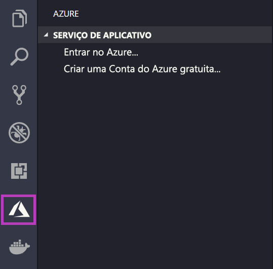
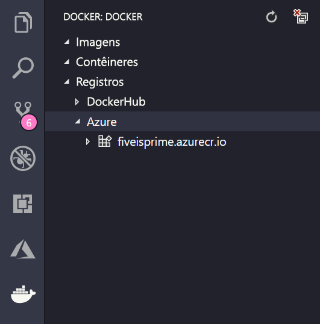

# <a name="deploy-to-azure-using-docker"></a>Implantar no Azure usando o Docker

O Serviço de Aplicativo no Linux fornece pilhas de aplicativos predefinidos em Linux com suporte para linguagens como .NET, PHP, Node.js e outras. Também é possível usar uma imagem personalizada do Docker para executar seu aplicativo Web em uma pilha de aplicativos que ainda não foi definida no Azure. Este guia de início rápido mostra como implantar uma imagem de um [ACR (Registro de Contêiner do Azure)](/azure/container-registry) para o Serviço de Aplicativo.

## <a name="prerequisites"></a>Pré-requisitos

* Uma [conta do Azure](https://azure.microsoft.com/free/?utm_source=campaign&utm_campaign=vscode-tutorial-docker-extension&mktingSource=vscode-tutorial-docker-extension)
* [Docker](https://www.docker.com/community-edition)
* [Visual Studio Code](https://code.visualstudio.com/)
* A [extensão do Serviço de Aplicativo do Azure para VS Code](vscode:extension/ms-azuretools.vscode-azureappservice). Você pode usar essa extensão para criar, gerenciar e implantar aplicativos Web Linux na PaaS (plataforma como serviço) do Azure.
* A [extensão do Docker para VS Code](vscode:extension/ms-azuretools.vscode-docker). Você pode usar essa extensão para simplificar o gerenciamento de imagens e comandos do Docker local e para implantar imagens de aplicativo criadas no Azure.

## <a name="create-an-image"></a>Criar uma imagem

Para concluir este guia de início rápido, você precisará de uma imagem de aplicativo Web adequada armazenada em um [Registro de Contêiner do Azure](/azure/container-registry). Siga as instruções em [Início rápido: Criar um registro de contêiner privado usando o portal do Azure](/azure/container-registry/container-registry-get-started-portal), mas use a imagem `mcr.microsoft.com/azuredocs/go` em vez da imagem `hello-world`.

> [!IMPORTANT]
> Certifique-se de definir a opção de **Usuário Administrador** como **Habilitar** ao criar o registro de contêiner. Você também pode defini-la na seção **Chaves de acesso** da página do registro no portal do Azure. Essa configuração é necessária para o acesso ao Serviço de Aplicativo.

## <a name="sign-in"></a>Entrar

Em seguida, inicie o VS Code e faça logon em sua conta do Azure usando a extensão do Serviço de Aplicativo. Para fazer isso, selecione o logotipo do Azure na Barra de Atividades, navegue até o gerenciador do **SERVIÇO DE APLICATIVO**, selecione **Entrar no Azure** e siga as instruções.



## <a name="check-prerequisites"></a>Verificar pré-requisitos

Agora, você pode verificar se tem todos os pré-requisitos instalados e configurados adequadamente.

No VS Code, você deverá ver o endereço de email do Azure na Barra de Status e sua assinatura no gerenciador do **SERVIÇO DE APLICATIVO**.

Em seguida, verifique se você tem o Docker instalado e em execução. O comando a seguir exibirá a versão do Docker se ela estiver em execução.

```bash
docker --version
```

Por fim, verifique se o Registro de Contêiner do Azure está conectado. Para fazer isso, selecione o logotipo do Docker na Barra de Atividade e, em seguida, navegue até **REGISTROS**.



## <a name="deploy-the-image-to-azure-app-service"></a>Implantar a imagem no Serviço de Aplicativo do Azure

Agora que tudo está configurado, você pode implantar sua imagem no [Serviço de Aplicativo do Azure](https://azure.microsoft.com/services/app-service/) diretamente do gerenciador de extensões do Docker.

Localize a imagem no nó **Registros** no gerenciador do **DOCKER** e expanda para mostrar suas marcações. Clique com o botão direito do mouse em uma tag e selecione **Implantar Imagem no Serviço de Aplicativo do Azure**.

Aqui, siga os prompts para escolher uma assinatura, um nome de aplicativo exclusivo globalmente, um Grupo de Recursos e um Plano do Serviço de Aplicativo. Escolha **B1 Básico** para o tipo de preço e uma região.

Após a implantação, seu aplicativo estará disponível em `http://<app name>.azurewebsites.net`.

Um **Grupo de Recursos** é uma coleção nomeada de todos os recursos do seu aplicativo no Azure. Por exemplo, um grupo de recursos pode conter uma referência a um site, um banco de dados e uma Função do Azure.

Um **Plano do Serviço de Aplicativo** define os recursos físicos que serão usados para hospedar seu site. Este guia de início rápido usa um plano de hospedagem **Básico** na infraestrutura **Linux**, o que significa que o site será hospedado em um computador Linux junto com outros sites. Se você começar com o plano **Básico**, poderá usar o portal do Azure para aumentá-lo para que o seu seja o único site em execução em um computador.

## <a name="browse-the-website"></a>Procurar no site

O painel **Saída** será aberto durante a implantação para indicar o status da operação. Quando a operação for concluída, localize o aplicativo criado no gerenciador do **SERVIÇO DE APLICATIVO**, clique nele com o botão direito do mouse e selecione **Procurar Site** para abrir o site no navegador.

> [!div class="nextstepaction"]
> [Encontrei um problema](https://www.research.net/r/PWZWZ52?tutorial=quickstart-docker&step=deploy-app)

## <a name="next-steps"></a>Próximas etapas

Parabéns, você concluiu com êxito este início rápido!

Em seguida, confira as outras extensões do Azure.

* [Cosmos DB](https://marketplace.visualstudio.com/items?itemName=ms-azuretools.vscode-cosmosdb)
* [Funções do Azure](https://marketplace.visualstudio.com/items?itemName=ms-azuretools.vscode-azurefunctions)
* [Ferramentas da CLI do Azure](https://marketplace.visualstudio.com/items?itemName=ms-vscode.azurecli)
* [Ferramentas do Azure Resource Manager](https://marketplace.visualstudio.com/items?itemName=msazurermtools.azurerm-vscode-tools)

Ou obtenha todas elas instalando o pacote de extensão [Ferramenta do Azure](https://marketplace.visualstudio.com/items?itemName=ms-vscode.vscode-node-azure-pack).
