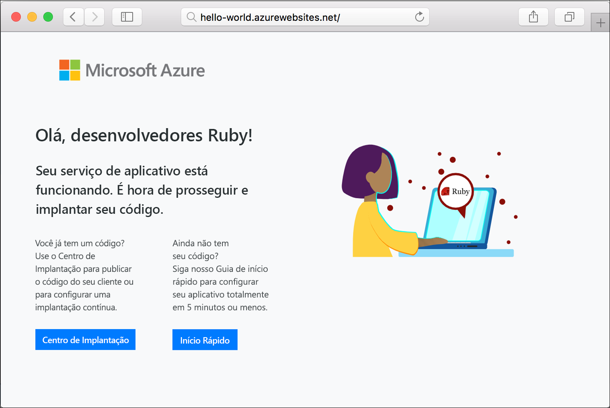

# <a name="create-a-ruby-on-rails-app-in-app-service-on-linux"></a>Criar um aplicativo Ruby on Rails com o Serviço de Aplicativo no Linux

O [Serviço de Aplicativo no Linux](app-service-linux-intro.md) fornece um serviço de hospedagem na Web altamente escalonável e com aplicação automática de patches usando o sistema operacional Linux. Este tutorial de início rápido mostra como implantar um aplicativo Ruby on Rails no Serviço de Aplicativo do Azure no Linux usando o [Cloud Shell](https://docs.microsoft.com/azure/cloud-shell/overview).

> [!NOTE]
> A pilha de desenvolvimento Ruby só dá suporte ao Ruby on Rails no momento. Caso deseje usar outra plataforma, como o Sinatra, ou uma [versão sem suporte do Ruby](app-service-linux-intro.md), você precisa [executá-lo em um contêiner personalizado](quickstart-docker-go.md).


[!INCLUDE [quickstarts-free-trial-note](../../../includes/quickstarts-free-trial-note.md)]

## <a name="prerequisites"></a>Pré-requisitos

* <a href="https://www.ruby-lang.org/en/documentation/installation/#rubyinstaller" target="_blank">Instalar o Ruby 2.6 ou superior</a>
* <a href="https://git-scm.com/" target="_blank">Instalar o Git</a>

## <a name="download-the-sample"></a>Baixar o exemplo

Em uma janela de terminal, execute o comando a seguir para clonar o repositório do aplicativo de exemplo para o computador local:

```bash
git clone https://github.com/Azure-Samples/ruby-docs-hello-world
```

## <a name="run-the-application-locally"></a>Executar o aplicativo localmente

Execute o aplicativo no local para ver como ele deve ficar quando o implantar no Azure. Abra uma janela do terminal, mude para o diretório `hello-world` e use o comando `rails server` para iniciar o servidor.

A primeira etapa é instalar os gems necessários. Um `Gemfile` está incluído no exemplo, portanto, basta executar o seguinte comando:

```bash
bundle install
```

Depois que o gems forem instalados, usaremos o empacotador para iniciar o aplicativo:

```bash
bundle exec rails server
```

Usando o navegador da Web, navegue até `http://localhost:3000` para testar o aplicativo localmente.


[!INCLUDE [Try Cloud Shell](../../../includes/cloud-shell-try-it.md)]

[!INCLUDE [Configure deployment user](../../../includes/configure-deployment-user.md)]

[!INCLUDE [Create resource group](../../../includes/app-service-web-create-resource-group-linux.md)]

[!INCLUDE [Create app service plan](../../../includes/app-service-web-create-app-service-plan-linux.md)]

## <a name="create-a-web-app"></a>Criar um aplicativo Web

[!INCLUDE [Create web app](../../../includes/app-service-web-create-web-app-ruby-linux-no-h.md)] 

Navegue até o aplicativo para ver seu aplicativo Web recém-criado com uma imagem interna. Substitua _&lt;nome do aplicativo>_ por um nome exclusivo do aplicativo web.

```bash
http://<app_name>.azurewebsites.net
```

Seu novo aplicativo Web deve ficar assim:



## <a name="deploy-your-application"></a>Implantar seu aplicativo

Execute os seguintes comandos para implantar o aplicativo local em seu aplicativo Web do Azure:

```bash
git remote add azure <Git deployment URL from above>
git push azure master
```

Confirme que as operações de implantação remota relatam êxito. Os comandos produzem uma saída semelhante ao texto a seguir:

```bash
remote: Using turbolinks 5.2.0
remote: Using uglifier 4.1.20
remote: Using web-console 3.7.0
remote: Bundle complete! 18 Gemfile dependencies, 78 gems now installed.
remote: Bundled gems are installed into `/tmp/bundle`
remote: Zipping up bundle contents
remote: .......
remote: ~/site/repository
remote: Finished successfully.
remote: Running post deployment command(s)...
remote: Deployment successful.
remote: App container will begin restart within 10 seconds.
To https://<app-name>.scm.azurewebsites.net/<app-name>.git
   a6e73a2..ae34be9  master -> master
```

Após a implantação ser concluída, aguarde cerca de 10 segundos para que o aplicativo Web seja reiniciado e, em seguida, navegue até ele e verifique os resultados.

```bash
http://<app-name>.azurewebsites.net
```


> [!NOTE]
> Enquanto o aplicativo estiver reiniciando, você observará o código de status HTTP `Error 503 Server unavailable` no navegador ou a página padrão `Hey, Ruby developers!`. Pode levar alguns minutos para que o aplicativo seja reiniciado completamente.
>

[!INCLUDE [Clean-up section](../../../includes/cli-script-clean-up.md)]

## <a name="next-steps"></a>Próximas etapas

> [!div class="nextstepaction"]
> [Tutorial: Ruby on Rails com o Postgres](tutorial-ruby-postgres-app.md)

> [!div class="nextstepaction"]
> [Configurar o aplicativo Ruby](configure-language-ruby.md)
