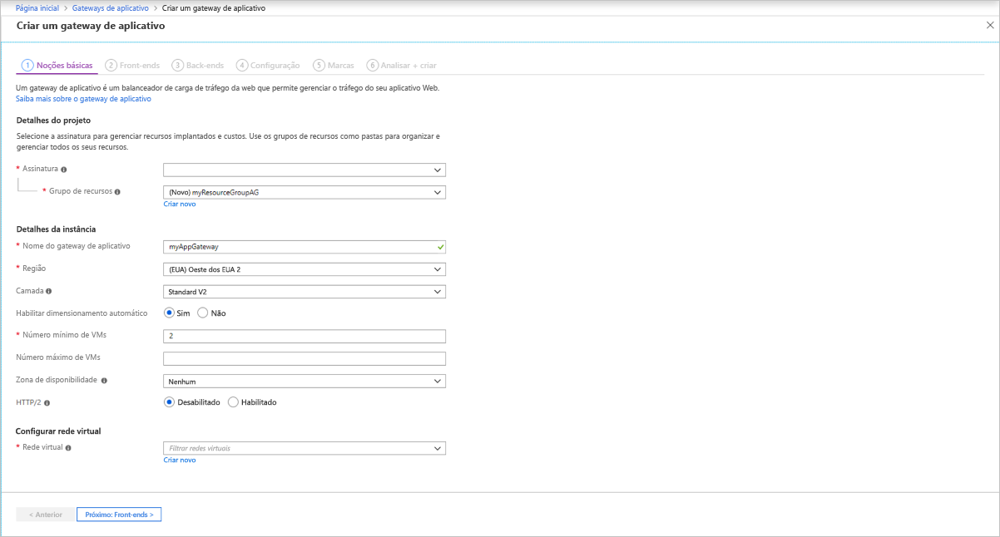
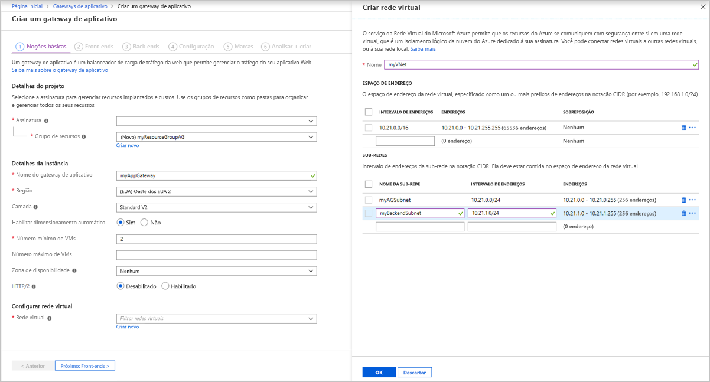
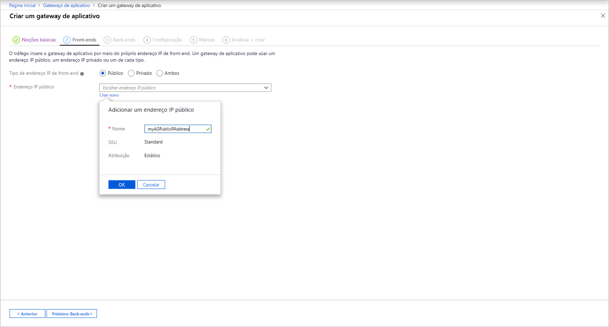
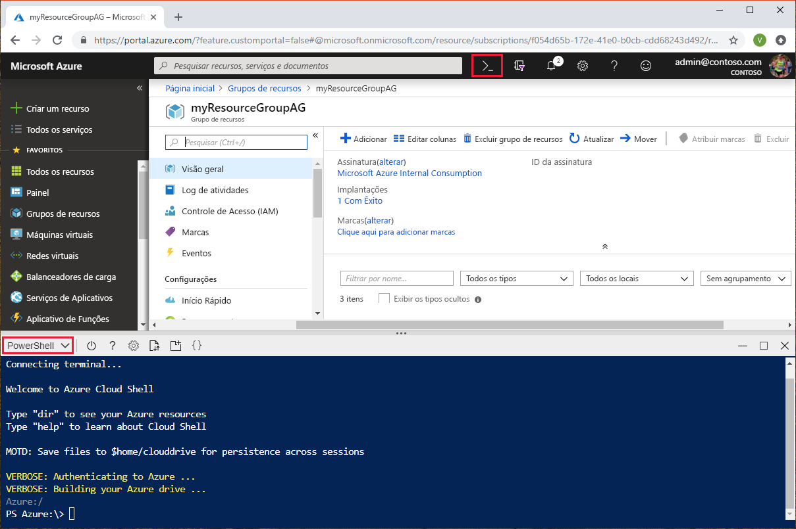

# <a name="tutorial-create-and-configure-an-application-gateway-to-host-multiple-web-sites-using-the-azure-portal"></a>Tutorial: Criar e configurar um gateway de aplicativo para hospedar vários sites web usando o portal do Azure.

Você pode usar o portal do Azure para configurar [a hospedagem de vários sites da Web](multiple-site-overview.md) ao criar um [gateway de aplicativo](overview.md). Neste tutorial, você define pools de endereço back-end usando máquinas virtuais. Em seguida, você configurará ouvintes e regras com base em domínios que possui para garantir que o tráfego da Web chegue aos servidores apropriados nos pools. Este tutorial presume que você possui vários domínios e usa exemplos do *www.contoso.com* e do *www.fabrikam.com*.

Neste tutorial, você aprenderá como:

> [!div class="checklist"]
> * Criar um Gateway de Aplicativo
> * Criar máquinas virtuais para servidores de back-end
> * Criar pools de back-end com os servidores de back-end
> * Criar ouvintes de back-end
> * Criar regras de roteamento
> * Criar um registro CNAME no seu domínio


Se você não tiver uma assinatura do Azure, crie uma [conta gratuita](https://azure.microsoft.com/free/?WT.mc_id=A261C142F) antes de começar.

## <a name="sign-in-to-azure"></a>Entrar no Azure

Entre no portal do Azure em [https://portal.azure.com](https://portal.azure.com)

## <a name="create-an-application-gateway"></a>Criar um Gateway de Aplicativo

1. Selecione **Criar um recurso** no menu esquerdo do portal do Azure. A janela **Novo** é exibida.

2. Selecione **Rede** e depois **Gateway de Aplicativo** na lista **em destaque**.

### <a name="basics-tab"></a>Guia Básico

1. Na página **Básico**, insira estes valores para as seguintes configurações de gateway de aplicativo:

   - **Grupo de recursos**: Selecione **myResourceGroupAG** para o grupo de recursos. Se ele não existir, selecione **Criar novo** para criá-lo.
   - **Nome do gateway de aplicativo**: Insira *myAppGateway* para o nome do gateway de aplicativo.

     

2.  Para que o Azure se comunique entre os recursos que você cria, ele precisa de uma rede virtual. Você pode criar uma nova rede virtual ou usar uma existente. Neste exemplo, você criará uma rede virtual ao mesmo tempo em que cria o gateway de aplicativo. As instâncias do Gateway de Aplicativo são criadas em sub-redes separadas. Crie duas sub-redes neste exemplo: uma para o gateway de aplicativo e outra para os servidores de back-end.

    Em **Configurar rede virtual**, selecione **Criar nova** para criar uma rede virtual. Na janela **Criar rede virtual** que é aberta, insira os seguintes valores para criar a rede virtual e duas sub-redes:

    - **Nome**: Insira *myVNet* para o nome da rede virtual.

    - **Nome da sub-rede** (sub-rede do Gateway de Aplicativo): A grade **Sub-redes** mostrará uma sub-rede chamada *Padrão*. Altere o nome dessa sub-rede para *myAGSubnet*.<br>A sub-rede de gateway de aplicativo pode conter apenas gateways de aplicativo. Nenhum outro recurso é permitido.

    - **Nome da sub-rede** (sub-rede do servidor de back-end): Na segunda linha da grade **Sub-redes**, insira *myBackendSubnet* na coluna **Nome da sub-rede**.

    - **Intervalo de endereços** (sub-rede do servidor de back-end): Na segunda linha da grade **Sub-redes**, insira um intervalo de endereços que não se sobreponha ao intervalo de endereços de *myAGSubnet*. Por exemplo, se o intervalo de endereços de *myAGSubnet* for 10.0.0.0/24, digite *10.0.1.0/24* para o intervalo de endereços de *myBackendSubnet*.

    Selecione **OK** para fechar a janela **Criar rede virtual** e salvar as configurações de rede virtual.

     
    
3. Na guia **Básico**, aceite os valores padrão para as outras configurações e selecione **Avançar: Front-ends**.

### <a name="frontends-tab"></a>Guia Front-ends

1. Na guia **Front-ends**, verifique se **Tipo de endereço IP do front-end** está definido como **Público**. <br>É possível configurar o IP de front-end como Público ou Privado, de acordo com o caso de uso. Neste exemplo, você escolherá um IP público de front-end.
   > [!NOTE]
   > Para a SKU do Gateway de Aplicativo v2, você só pode escolher a configuração de IP de front-end **Pública**. A configuração de IP de front-end privado não está habilitada para esta SKU v2.

2. Escolha **Criar novo** para o **Endereço IP público** e insira *myAGPublicIPAddress* para o nome do endereço IP público e, em seguida, selecione **OK**. 

     

3. Selecione **Avançar: Back-ends**.

### <a name="backends-tab"></a>Guia Back-ends

O pool de back-end é usado para encaminhar solicitações aos servidores back-end que atendem à solicitação. Os pools de back-end podem ser NICs, conjuntos de dimensionamento de máquinas virtuais, IPs públicos, IPs internos, FQDN (nomes de domínio totalmente qualificados) e back-ends multilocatário como o Serviço de Aplicativo do Azure. Neste exemplo, você criará um pool de back-end vazio com o gateway de aplicativo e, em seguida, adicionará destinos de back-end ao pool de back-end.

1. Na guia **Back-ends**, selecione **+ Adicionar um pool de back-end**.

2. Na janela **Adicionar um pool de back-end** que é aberta, insira os seguintes valores para criar um pool de back-end vazio:

    - **Nome**: Insira *contosoPool* para o nome do pool de back-end.
    - **Adicionar pool de back-end sem destinos**: Selecione **Sim** para criar um pool de back-end sem destinos. Você adicionará destinos de back-end depois de criar o gateway de aplicativo.

3. Na janela **Adicionar um pool de back-end**, selecione **Adicionar** para salvar a configuração do pool de back-end e retornar à guia **Back-ends**.
4. Agora, adicione outro pool de back-end chamado *fabrikamPool*.

     

4. Na guia **Back-ends**, selecione **Avançar: Configuração**.

### <a name="configuration-tab"></a>Guia Configuração

Na guia **Configuração**, você conectará os pools de front-end e de back-end que você criou usando uma regra de roteamento.

1. Selecione **Adicionar uma regra** na coluna **Regras de roteamento**.

2. Na janela **Adicionar uma regra de roteamento** que é aberta, insira *contosoRule* para o **Nome da regra**.

3. Uma regra de roteamento requer um ouvinte. Na guia **Ouvinte** na janela **Adicionar uma regra de roteamento**, insira os seguintes valores para o ouvinte:

    - **Nome do ouvinte**: Insira *contosoListener* para o nome do ouvinte.
    - **IP de front-end**: selecione **Público** para escolher o IP público que você criou para o front-end.

   Em **Configurações adicionais**:
   - **Tipo de ouvinte**: Vários sites
   - **Nome do host**: **www.contoso.com**

   Aceite os valores padrão para as outras configurações na guia **Ouvinte** e, em seguida, selecione a guia **Destinos de back-end** para configurar o restante da regra de roteamento.

   

4. Na guia **Destinos de back-end**, selecione **contosoPool** para o **Destino de back-end**.

5. Para a **Configuração de HTTP**, selecione **Criar novo** para criar uma configuração HTTP. A configuração HTTP determinará o comportamento da regra de roteamento. Na janela **Adicionar uma configuração de HTTP** que é aberta, insira *contosoHTTPSetting* para o **Nome da configuração de HTTP**. Aceite os valores padrão para as outras configurações na janela **Adicionar uma configuração de HTTP** e, em seguida, selecione **Adicionar** para retornar à janela **Adicionar uma regra de roteamento**. 

6. Na janela **Adicionar uma regra de roteamento**, selecione **Adicionar** para salvar a regra de roteamento e retornar para a guia **Configuração**.
7. Selecione **Adicionar uma regra** e adicione uma regra, ouvinte, destino de back-end e configuração de HTTP semelhantes para a Fabrikam.

     

7. Selecione **Avançar: Marcas** e, em seguida, **Avançar: Revisar + criar**.

### <a name="review--create-tab"></a>Guia Examinar + criar

Examine as configurações na guia **Examinar + criar** e selecione **Criar** para criar a rede virtual, o endereço IP público e o gateway de aplicativo. Pode levar vários minutos para que o Azure crie o gateway de aplicativo.

Aguarde até que a implantação seja concluída com êxito antes de passar para a próxima seção.

## <a name="add-backend-targets"></a>Adicionar destinos de back-end

Neste exemplo, você usará máquinas virtuais como o back-end de destino. Você pode criar máquinas virtuais ou usar as existentes. Você criará duas máquinas virtuais que o Azure usa como servidores de back-end para o gateway de aplicativo.

Para adicionar destinos de back-end, você vai:

1. Criar duas VMs, *contosoVM* e *fabrikamVM*, para serem usadas como servidores back-end.
2. Instale IIS nas máquinas virtuais para verificar se o gateway de aplicativo foi criado com êxito.
3. Adicione os servidores back-end aos pools de back-end.

### <a name="create-a-virtual-machine"></a>Criar uma máquina virtual

1. No portal do Azure, selecione **Criar um recurso**. A janela **Novo** é exibida.
2. Selecione **Computação** e, em seguida, selecione **Datacenter do Windows Server 2016** na lista **Popular**. A página **Criar uma máquina virtual** é exibida.<br>O Gateway de Aplicativo pode rotear o tráfego para qualquer tipo de máquina virtual usada no pool de back-end. Neste exemplo, você usa um Windows Server 2016 Datacenter.
3. Insira esses valores na guia **Noções básicas** para as seguintes configurações de máquina virtual:

    - **Grupo de recursos**: Selecione **myResourceGroupAG** para o nome do grupo de recursos.
    - **Nome da máquina virtual**: Insira *contosoVM* para o nome da máquina virtual.
    - **Nome de usuário**: Insira *azureuser* para o nome de usuário do administrador.
    - **Senha**: Insira *Azure123456!* para a senha de administrador.
4. Aceite os outros padrões e selecione **Próximo: Discos**.  
5. Aceite os padrões na guia **Discos** e selecione **Próximo: Rede**.
6. Na guia **Rede**, verifique se **myVNet** está selecionado para a **Rede virtual** e se a **Sub-rede** está definida como **myBackendSubnet**. Aceite os outros padrões e selecione **Próximo: Gerenciamento**.<br>O Gateway de Aplicativo pode comunicar-se com instâncias fora da rede virtual em que está, mas é necessário garantir que há conectividade IP.
7. Na guia **Gerenciamento**, defina **Diagnóstico de inicialização** como **Desligado**. Aceite os outros padrões e selecione **Revisar + criar**.
8. Na guia **Revisar + criar**, examine as configurações, corrija os erros de validação e selecione **Criar**.
9. Aguarde a criação da máquina virtual concluir antes de continuar.

### <a name="install-iis-for-testing"></a>Instalar IIS para teste

Neste exemplo, você instala IIS nas máquinas virtuais apenas para verificar se o Azure criou o gateway de aplicativo com êxito.

1. Abra o [PowerShell do Azure](https://docs.microsoft.com/azure/cloud-shell/quickstart-powershell). Para fazer isso, selecione **Cloud Shell** na barra de navegação superior do portal do Azure e selecione **PowerShell** na lista suspensa. 

    

2. Execute o comando a seguir para instalar o IIS na máquina virtual: 

    ```azurepowershell-interactive
    Set-AzVMExtension `
      -ResourceGroupName myResourceGroupAG `
      -ExtensionName IIS `
      -VMName contosoVM `
      -Publisher Microsoft.Compute `
      -ExtensionType CustomScriptExtension `
      -TypeHandlerVersion 1.4 `
      -SettingString '{"commandToExecute":"powershell Add-WindowsFeature Web-Server; powershell Add-Content -Path \"C:\\inetpub\\wwwroot\\Default.htm\" -Value $($env:computername)"}' `
      -Location EastUS
    ```

3. Crie uma segunda máquina virtual e instale o IIS usando as etapas que você concluiu anteriormente. Use *fabrikamVM* para o nome da máquina virtual e a configuração **VMName** do cmdlet **Set-AzVMExtension**.

### <a name="add-backend-servers-to-backend-pools"></a>Adicionar servidores back-end aos pools de back-end

1. Selecione **Todos os recursos** e, em seguida, **myAppGateway**.

2. Selecione **Pools de back-end** no menu esquerdo.

3. Selecione **contosoPool**.

4. Em **Destinos**, selecione **Máquina virtual** na lista suspensa.

5. Em **MÁQUINA VIRTUAL** e **INTERFACES DE REDE**, selecione a máquina virtual **contosoVM** e os respectivos adaptadores de rede associados nas listas suspensas.

    

6. Clique em **Salvar**.
7. Repita para adicionar o *fabrikamVM* e a interface ao *fabrikamPool*.

Aguarde a conclusão da implantação antes de prosseguir para a próxima etapa.

## <a name="create-a-www-a-record-in-your-domains"></a>Criar um registro A www em seus domínios

Depois de criar o gateway de aplicativo com seu endereço IP público, é possível obter o endereço IP e usá-lo para criar um registro A em seus domínios. 

1. Clique em **Todos os recursos** e, em seguida, clique em **myAGPublicIPAddress**.

    

2. Copie o endereço IP e use-o como o valor para um novo registro A *www* em seus domínios.

## <a name="test-the-application-gateway"></a>Testar o gateway de aplicativo

1. Digite seu nome de domínio na barra de endereços do navegador. Como http://www.contoso.com.

    

2. Altere o endereço para seu outro domínio e você verá algo parecido com o exemplo a seguir:

    

## <a name="clean-up-resources"></a>Limpar recursos

Quando não precisar mais dos recursos que você criou com o gateway de aplicativo, remova o grupo de recursos. Ao remover o grupo de recursos, você também remove o gateway de aplicativo e todos os recursos relacionados.

Para remover o grupo de recursos:

1. No menu esquerdo do portal do Azure, selecione **Grupos de recursos**.
2. Na página **Grupos de recursos**, pesquise por **myResourceGroupAG** na lista e, em seguida, selecione.
3. Na página **Grupo de recursos**, selecione **Excluir grupo de recursos**.
4. Insira *myResourceGroupAG* para **DIGITAR O NOME DO GRUPO DE RECURSOS** e selecione **Excluir**

## <a name="next-steps"></a>Próximas etapas

> [!div class="nextstepaction"]
> [Saiba mais sobre o que você pode fazer com o Gateway de Aplicativo do Azure](application-gateway-introduction.md)