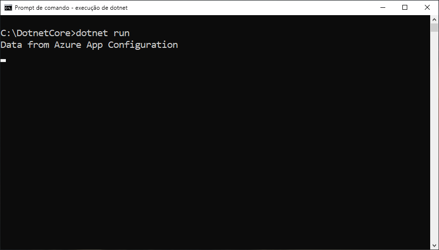

# <a name="tutorial-use-dynamic-configuration-in-a-net-core-app"></a>Tutorial: Usar configuração dinâmica em um aplicativo .NET Core

A biblioteca de clientes do .NET Core de Configuração de Aplicativos é compatível com a atualização de um conjunto de definições de configuração sob demanda sem fazer o aplicativo reiniciar. Isso pode ser implementado primeiro obtendo uma instância de `IConfigurationRefresher` entre as opções para o provedor de configuração e, em seguida, chamando `Refresh` nessa instância em qualquer lugar em seu código.

Para manter as configurações atualizadas e evitar o excesso de chamadas para o repositório de configurações, um cache é usado para cada configuração. Até que o valor armazenado em cache de uma configuração tenha expirado, a operação de atualização não atualizará o valor, mesmo quando o valor tiver sido alterado no repositório de configurações. O tempo de expiração padrão para cada solicitação é de 30 segundos, mas pode ser substituído, se necessário.

Este tutorial mostra como você pode implementar atualizações de configuração dinâmica no código. Ele se baseia no aplicativo introduzido nos inícios rápidos. Antes de continuar, primeiro conclua [Criar um aplicativo .NET Core com a Configuração de Aplicativos](./quickstart-dotnet-core-app.md).

Você pode usar qualquer editor de código para executar as etapas deste tutorial. [Visual Studio Code](https://code.visualstudio.com/) é uma opção excelente que está disponível nas plataformas Windows, macOS e Linux.

Neste tutorial, você aprenderá como:

> [!div class="checklist"]
> * Configure seu aplicativo para atualizar sua configuração com um repositório de configurações de aplicativos sob demanda.
> * Injetar a configuração mais recente nos controladores do aplicativo.

## <a name="prerequisites"></a>Pré-requisitos

Para realizar este tutorial, instale o [SDK do .NET Core](https://dotnet.microsoft.com/download).

[!INCLUDE [quickstarts-free-trial-note](../../includes/quickstarts-free-trial-note.md)]

## <a name="reload-data-from-app-configuration"></a>Recarregar os dados da Configuração de Aplicativo

Abra *Program.cs* e atualize o arquivo para especificar a configuração de atualização no método `AddAzureAppConfiguration` e disparar uma atualização manual usando o método `Refresh`.

```csharp
class Program
{
    private static IConfiguration _configuration = null;
    private static IConfigurationRefresher _refresher = null;

    static void Main(string[] args)
    {
        IConfigurationRefresher refresher = null;

        var builder = new ConfigurationBuilder();
        builder.AddAzureAppConfiguration(options =>
        {
            options.Connect(Environment.GetEnvironmentVariable("ConnectionString"))
                    .ConfigureRefresh(refresh =>
                    {
                        refresh.Register("TestApp:Settings:Message")
                               .SetCacheExpiration(TimeSpan.FromSeconds(10));
                    });
                    
                    _refresher = options.GetRefresher();
        });

        _configuration = builder.Build();
        PrintMessage().Wait();
    }

    private static async Task PrintMessage()
    {
        Console.WriteLine(_configuration["TestApp:Settings:Message"] ?? "Hello world!");

        // Wait for the user to press Enter
        Console.ReadLine();

        await _refresher.Refresh();
        Console.WriteLine(_configuration["TestApp:Settings:Message"] ?? "Hello world!");
    }
}
```

O método `ConfigureRefresh` é usado para especificar as configurações usadas para atualizar os dados de configuração com o repositório de configurações de aplicativos quando uma operação de atualização é disparada. Uma instância do `IConfigurationRefresher` pode ser recuperada chamando o método `GetRefresher` nas opções fornecidas ao método `AddAzureAppConfiguration` e o método `Refresh` nessa instância pode ser usado para disparar uma operação de atualização em qualquer lugar no seu código.
    
> [!NOTE]
> O tempo de expiração de cache padrão para um parâmetro de configuração é de 30 segundos, mas pode ser substituído chamando o método `SetCacheExpiration` no inicializador de opções passado como um argumento para o método `ConfigureRefresh`.

## <a name="build-and-run-the-app-locally"></a>Compilar e executar o aplicativo localmente

1. Defina uma variável de ambiente chamada **ConnectionString** e defina-a como a chave de acesso ao repositório de configurações de aplicativo. Se você usar o prompt de comando do Windows, execute o comando a seguir e reinicie o prompt de comando para permitir que a alteração entre em vigor:

        setx ConnectionString "connection-string-of-your-app-configuration-store"

    Se você usa o Windows PowerShell, execute o comando a seguir:

        $Env:ConnectionString = "connection-string-of-your-app-configuration-store"

    Se você usa macOS ou Linux, execute o comando a seguir:

        export ConnectionString='connection-string-of-your-app-configuration-store'

1. Execute o seguinte comando para compilar o aplicativo de console:

        dotnet build

1. Depois que a construção for concluída com êxito, execute o seguinte comando para executar o aplicativo localmente:

        dotnet run

    

1. Entre no [Portal do Azure](https://portal.azure.com). Selecione **Todos os recursos** e selecione a instância do repositório de configurações do aplicativo que você criou no início rápido.

1. Selecione **Gerenciador de Configurações** e atualize os valores das seguintes chaves:

    | Chave | Valor |
    |---|---|
    | TestApp:Settings:Message | Dados da Configuração de Aplicativos do Azure – Atualizados |

1. Pressione a tecla Enter para disparar uma atualização e imprimir o valor atualizado na janela do Prompt de Comando ou do PowerShell.

    
    
    > [!NOTE]
    > Uma vez que o tempo de expiração do cache foi definido como 10 segundos usando o método `SetCacheExpiration` ao especificar a configuração para a operação de atualização, o valor para a definição de configuração será atualizado apenas se pelo menos 10 segundos tiverem se passado desde a última atualização para essa configuração.

## <a name="clean-up-resources"></a>Limpar recursos

[!INCLUDE [azure-app-configuration-cleanup](../../includes/azure-app-configuration-cleanup.md)]

## <a name="next-steps"></a>Próximas etapas

Neste tutorial, você adicionou uma identidade de serviço gerenciada do Azure para simplificar o acesso à Configuração de Aplicativo e melhorar o gerenciamento de credenciais de seu aplicativo. Para saber mais sobre como usar a Configuração de Aplicativo, continue para ver as amostras da CLI do Azure.

> [!div class="nextstepaction"]
> [Exemplos de CLI](./cli-samples.md)
