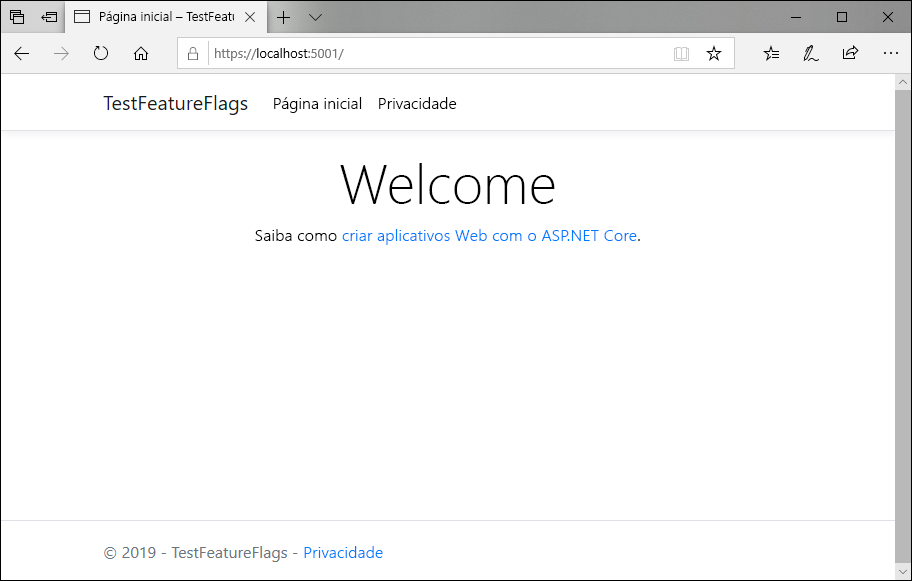
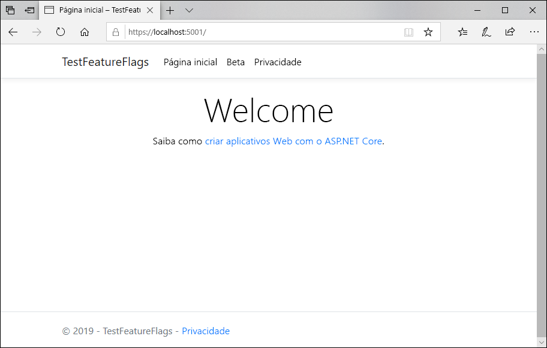

# <a name="quickstart-add-feature-flags-to-an-aspnet-core-app"></a>Início Rápido: Adicionar sinalizadores de recurso a um aplicativo ASP.NET Core

Neste início rápido, você incorpora a Configuração de Aplicativos do Azure a um aplicativo Web do ASP.NET Core para criar uma implementação de ponta a ponta do gerenciamento de recursos. Você pode usar o serviço de Configuração de Aplicativos para armazenar de forma centralizada todos os sinalizadores de recurso e controlar seus estados. 

As bibliotecas do Gerenciamento de Recursos do .NET Core estendem a estrutura com suporte abrangente para sinalizadores de recursos. Essas bibliotecas se baseiam no sistema de configuração do .NET Core. Elas são integradas diretamente à Configuração de Aplicativos por meio de seu provedor de configuração do .NET Core.

## <a name="prerequisites"></a>Pré-requisitos

- Assinatura do Azure - [criar uma gratuitamente](https://azure.microsoft.com/free/)
- [SDK do .Net Core](https://dotnet.microsoft.com/download).

## <a name="create-an-app-configuration-store"></a>Criar um repositório de Configuração de Aplicativos

[!INCLUDE [azure-app-configuration-create](../../includes/azure-app-configuration-create.md)]

6. Escolha **Gerenciador de Recursos** >  **+ Criar** para adicionar os seguintes sinalizadores de recursos:

    | Chave | Estado |
    |---|---|
    | Beta | Desativar |

## <a name="create-an-aspnet-core-web-app"></a>Criar um aplicativo Web ASP.NET Core

Você usa a [CLI (interface de linha de comando) do .NET Core](https://docs.microsoft.com/dotnet/core/tools/) para criar um novo projeto de aplicativo Web do MVC do ASP.NET Core. A vantagem de usar a CLI do .NET Core em vez do Visual Studio é que ela está disponível nas plataformas Windows, macOS e Linux.

1. Crie uma nova pasta para o seu projeto. Para este Início Rápido, nomeie-o *TestFeatureFlags*.

1. Na nova pasta, execute o seguinte comando para criar um novo projeto de aplicativo Web do MVC do ASP.NET Core:

   ```    
   dotnet new mvc
   ```

## <a name="add-secret-manager"></a>Adicionar o Gerenciador de Segredos

Adicione a [ferramenta Gerenciador de Segredos](https://docs.microsoft.com/aspnet/core/security/app-secrets) ao projeto. A ferramenta Gerenciador de Segredos armazena dados confidenciais para o trabalho de desenvolvimento fora da árvore do projeto. Essa abordagem ajuda a impedir o compartilhamento acidental de segredos do aplicativo no código-fonte.

1. Abra o arquivo *.csproj*.
1. Adicione um elemento `UserSecretsId`, conforme mostrado no exemplo a seguir e substitua o valor pelo seu próprio, que geralmente é um GUID:

    ```xml
    <Project Sdk="Microsoft.NET.Sdk.Web">

    <PropertyGroup>
        <TargetFramework>netcoreapp2.1</TargetFramework>
        <UserSecretsId>79a3edd0-2092-40a2-a04d-dcb46d5ca9ed</UserSecretsId>
    </PropertyGroup>

    <ItemGroup>
        <PackageReference Include="Microsoft.AspNetCore.App" />
        <PackageReference Include="Microsoft.AspNetCore.Razor.Design" Version="2.1.2" PrivateAssets="All" />
    </ItemGroup>

    </Project>
    ```

1. Salve o arquivo.

## <a name="connect-to-an-app-configuration-store"></a>Conectar um repositório de Configuração de Aplicativos

1. Adicione uma referência ao pacote NuGet `Microsoft.Azure.AppConfiguration.AspNetCore` executando o seguinte comando:

    ```
    dotnet add package Microsoft.Azure.AppConfiguration.AspNetCore --version 2.0.0-preview-009200001-7
    ```

1. Execute o seguinte comando para restaurar pacotes do projeto:

    ```
    dotnet restore
    ```

1. Adicione um segredo chamado **ConnectionStrings:AppConfig** ao Gerenciador de Segredos.

    Esse segredo contém a cadeia de conexão para acessar o repositório de Configuração de Aplicativos. Substitua o valor `<your_connection_string>` no seguinte comando pela cadeia de conexão do repositório de Configuração de Aplicativos.

    Este comando deve ser executado no mesmo diretório que o arquivo *.csproj*.

    ```
    dotnet user-secrets set ConnectionStrings:AppConfig <your_connection_string>
    ```

    Use o Gerenciador de Segredos apenas para testar o aplicativo Web localmente. Quando o aplicativo for implantado no [Serviço de Aplicativo do Azure](https://azure.microsoft.com/services/app-service), por exemplo, você usará uma configuração de aplicativo chamada **Cadeias de Conexão** no Serviço de Aplicativo em vez de armazenar a cadeia de conexão no Gerenciador de Segredos.

    Esse segredo é acessado com a API de Configuração de Aplicativos. Um sinal de dois pontos (:) funciona no nome da configuração com a API de Configuração de Aplicativos em todas as plataformas compatíveis. Consulte [Configuração por ambiente](https://docs.microsoft.com/aspnet/core/fundamentals/configuration).

1. Abra *Program.cs* e adicione uma referência ao provedor da Configuração de Aplicativos do .NET Core:

    ```csharp
    using Microsoft.Extensions.Configuration.AzureAppConfiguration;
    ```

1. Atualize o método `CreateWebHostBuilder` para usar a Configuração de Aplicativos chamando o método `config.AddAzureAppConfiguration()`.

    ```csharp
    public static IWebHostBuilder CreateWebHostBuilder(string[] args) =>
        WebHost.CreateDefaultBuilder(args)
            .ConfigureAppConfiguration((hostingContext, config) =>
            {
                var settings = config.Build();
                config.AddAzureAppConfiguration(options => {
                    options.Connect(settings["ConnectionStrings:AppConfig"])
                           .UseFeatureFlags();
                });
            })
            .UseStartup<Startup>();
    ```

1. Abra *Startup.cs* e adicione referências ao gerenciador de recursos do .NET Core:

    ```csharp
    using Microsoft.FeatureManagement;
    ```

1. Atualize o método `ConfigureServices` para adicionar suporte ao sinalizador de recursos chamando o método `services.AddFeatureManagement()`. Opcionalmente, você pode incluir qualquer filtro que será usado com sinalizadores de recursos chamando `services.AddFeatureFilter<FilterType>()`:

    ```csharp
    public void ConfigureServices(IServiceCollection services)
    {
        services.AddFeatureManagement();
    }
    ```

1. Atualize o método `Configure` para adicionar um middleware para permitir que os valores de sinalizador de recurso sejam atualizados a um intervalo recorrente enquanto o aplicativo Web ASP.NET Core continua recebendo solicitações.

    ```csharp
    public void Configure(IApplicationBuilder app, IHostingEnvironment env)
    {
        app.UseAzureAppConfiguration();
        app.UseMvc();
    }
    ```

1. Adicione um arquivo *MyFeatureFlags.cs*:

    ```csharp
    namespace TestFeatureFlags
    {
        public enum MyFeatureFlags
        {
            Beta
        }
    }
    ```

1. Adicione *BetaController.cs* ao diretório *Controllers*:

    ```csharp
    using Microsoft.AspNetCore.Mvc;
    using Microsoft.FeatureManagement;
    using Microsoft.FeatureManagement.Mvc;

    namespace TestFeatureFlags.Controllers
    {
        public class BetaController: Controller
        {
            private readonly IFeatureManager _featureManager;

            public BetaController(IFeatureManagerSnapshot featureManager)
            {
                _featureManager = featureManager;
            }

            [FeatureGate(MyFeatureFlags.Beta)]
            public IActionResult Index()
            {
                return View();
            }
        }
    }
    ```

1. Abra *_ViewImports.cshtml* no diretório *Views* e adicione o auxiliar de marca do gerenciador de recursos:

    ```html
    @addTagHelper *, Microsoft.FeatureManagement.AspNetCore
    ```

1. Abra *_Layout.cshtml* no diretório *Views*\\*Shared* e substitua o código de barra `<nav>` em `<body>` > `<header>` pelo seguinte código:

    ```html
    <nav class="navbar navbar-expand-sm navbar-toggleable-sm navbar-light bg-white border-bottom box-shadow mb-3">
        <div class="container">
            <a class="navbar-brand" asp-area="" asp-controller="Home" asp-action="Index">TestFeatureFlags</a>
            <button class="navbar-toggler" type="button" data-toggle="collapse" data-target=".navbar-collapse" aria-controls="navbarSupportedContent"
            aria-expanded="false" aria-label="Toggle navigation">
            <span class="navbar-toggler-icon"></span>
            </button>
            <div class="navbar-collapse collapse d-sm-inline-flex flex-sm-row-reverse">
                <ul class="navbar-nav flex-grow-1">
                    <li class="nav-item">
                        <a class="nav-link text-dark" asp-area="" asp-controller="Home" asp-action="Index">Home</a>
                    </li>
                    <feature name="Beta">
                    <li class="nav-item">
                        <a class="nav-link text-dark" asp-area="" asp-controller="Beta" asp-action="Index">Beta</a>
                    </li>
                    </feature>
                    <li class="nav-item">
                        <a class="nav-link text-dark" asp-area="" asp-controller="Home" asp-action="Privacy">Privacy</a>
                    </li>
                </ul>
            </div>
        </div>
    </nav>
    ```

1. Crie um diretório *Beta* em *Views* e adicione *Index.cshtml* a ele:

    ```html
    @{
        ViewData["Title"] = "Beta Home Page";
    }

    <h1>
        This is the beta website.
    </h1>
    ```

## <a name="build-and-run-the-app-locally"></a>Compilar e executar o aplicativo localmente

1. Para criar o aplicativo usando a CLI do .NET Core, execute o seguinte comando no shell de comando:

    ```
    dotnet build
    ```

1. Depois que a construção for concluída com êxito, execute o seguinte comando para executar o aplicativo Web localmente:

    ```
    dotnet run
    ```

1. Abra uma janela do navegador e vá para `https://localhost:5001`, que é a URL padrão do aplicativo Web hospedado localmente.

    

1. Entre no [Portal do Azure](https://portal.azure.com). Escolha **Todos os recursos** e escolha a instância do repositório de Configuração de Aplicativos que você criou no início rápido.

1. Escolha **Gerenciador de Recursos** e altere o estado da chave **Beta** para **Ativado**:

    | Chave | Estado |
    |---|---|
    | Beta | Por |

1. Atualize a página do navegador para ver as novas definições de configuração.

    

## <a name="clean-up-resources"></a>Limpar recursos

[!INCLUDE [azure-app-configuration-cleanup](../../includes/azure-app-configuration-cleanup.md)]

## <a name="next-steps"></a>Próximas etapas

Neste início rápido, você criou um novo repositório de Configuração de Aplicativos e o usou para gerenciar recursos em um aplicativo Web ASP.NET Core por meio das [bibliotecas do Gerenciamento de Recursos](https://go.microsoft.com/fwlink/?linkid=2074664).

- Saiba mais sobre o [gerenciamento de recursos](./concept-feature-management.md).
- [Gerenciar sinalizadores de recursos](./manage-feature-flags.md).
- [Usar sinalizadores de recursos em um aplicativo ASP.NET Core](./use-feature-flags-dotnet-core.md).
