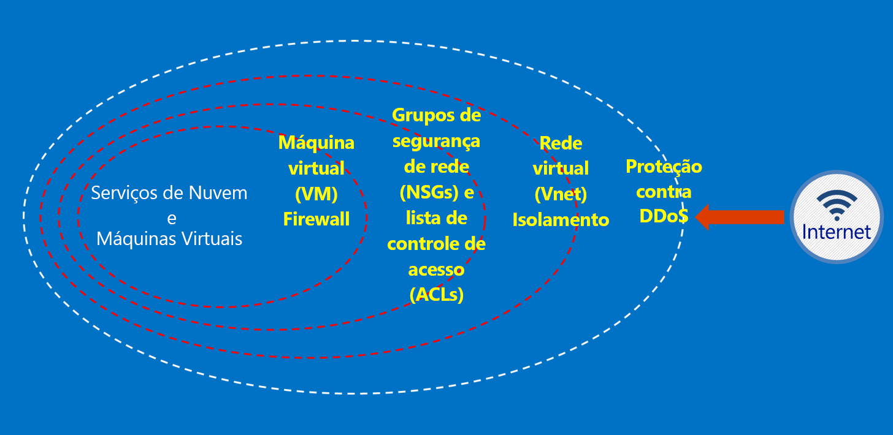

# O que é o Azure Austrália?

No 2014, o Azure foi iniciado na Austrália, com duas regiões; Leste da Austrália (Sydney) e Sudeste da Austrália (Melbourne). Em abril de 2018, Austrália Central e Austrália Central 2, duas novas regiões do Azure localizadas em Camberra, foram iniciadas. As regiões Austrália Central e Austrália Central 2 são projetadas intencionalmente para atender às necessidades da infraestrutura nacional crítica e governamental, além de oferecer conectividade e flexibilidade especiais para que você possa localizar seus sistemas ao lado da nuvem, com níveis de segurança e resiliência esperados apenas de redes classificadas como secretas. O Azure Austrália é uma plataforma para a transformação digital do governo e da infraestrutura nacional essencial – e é a única nuvem de missão crítica disponível na Austrália projetada especificamente para essas necessidades.

Há requisitos específicos do governo australiano para se conectar, consumir e operar no [Microsoft Azure Austrália](https://azure.microsoft.com/global-infrastructure/australia/) para sistemas e dados do governo australiano. Os recursos nesta página também fornecem diretrizes gerais aplicáveis a todos os clientes com um foco específico em configuração e operação seguras.

Consulte a página da Austrália do [Portal de Confiança do Serviço Microsoft](https://aka.ms/au-irap) para obter informações atuais sobre as avaliações do IRAP (Assessor Registrado para Segurança da Informação) do Azure Austrália, a certificação e a inclusão na CCSL (Lista de Serviços de Nuvem Certificados). Na página da Austrália, você também encontrará outros conselhos da Microsoft específicos para provedores de infraestrutura crítica e governamental.

## Princípios para a proteção de dados do cliente no Azure Austrália

O Azure Austrália oferece uma gama de recursos e serviços que você pode usar para criar soluções de nuvem para atender às suas necessidades de dados regulamentados/controlados. Uma solução de cliente compatível é simplesmente a implementação eficaz de funcionalidades prontas para uso do Azure Austrália, juntamente com uma prática de segurança de dados sólida.

Quando você hospeda uma solução no Azure Austrália, a Microsoft lida com muitos desses requisitos no nível de infraestrutura de nuvem.

O diagrama a seguir mostra o modelo de DiD (defesa em profundidade) do Azure. Por exemplo, a Microsoft fornece a infraestrutura de nuvem básica DDOS juntamente com funcionalidades do cliente, tais como dispositivos de segurança ou serviços DDoS Premium para necessidades de aplicativo específicas a um cliente.

Esses artigos descrevem os princípios fundamentais para proteger seus serviços e aplicativos, com diretrizes e melhores práticas sobre como aplicar esses princípios. Em outras palavras, como os clientes devem fazer uso inteligente do Azure Austrália para atender às obrigações e responsabilidades exigidas de uma solução que lida com informações governamentais confidenciais e classificadas.

Há duas categorias de documentação fornecida para as agências governamentais da Austrália que estão migrando para o Azure.

## Segurança no Azure Austrália

Identidade, controle de acesso baseado em função, proteção de dados por meio de criptografia e gerenciamento de direitos, monitoramento e controle de configuração efetivos são elementos fundamentais que você precisa implementar. Nesta seção, há uma série de artigos explicando as funcionalidades internas do Azure e como elas se relacionam com o ISM e o ASD Essential 8.

Esses artigos podem ser acessados por meio do menu em *Conceitos -> Segurança no Azure Austrália*.

## Gateways no Azure Austrália

Outra etapa importante para agências governamentais é o estabelecimento de funcionalidades de segurança do perímetro. Essas funcionalidades são chamadas de SIGs (gateways de Internet seguros) e, ao usar o Azure, é sua responsabilidade garantir que essas proteções estejam em vigor. A Microsoft não opera um SIG; no entanto, combinando nossos serviços de rede de borda que protegem todos os clientes e serviços específicos implantados em seu ambiente do Azure, você pode operar uma funcionalidade equivalente.

Esses artigos podem ser acessados por meio do menu em *Conceitos -> Gateways no Azure Austrália*.

## Próximas etapas

* Se o foco principal for proteger seus dados no Azure, comece com a [Segurança de Dados](secure-your-data.md)
* Se o foco da chave for criar um Gateway no Azure, comece com a [auditoria, o registro e a visibilidade do gateway](gateway-log-audit-visibility.md).
