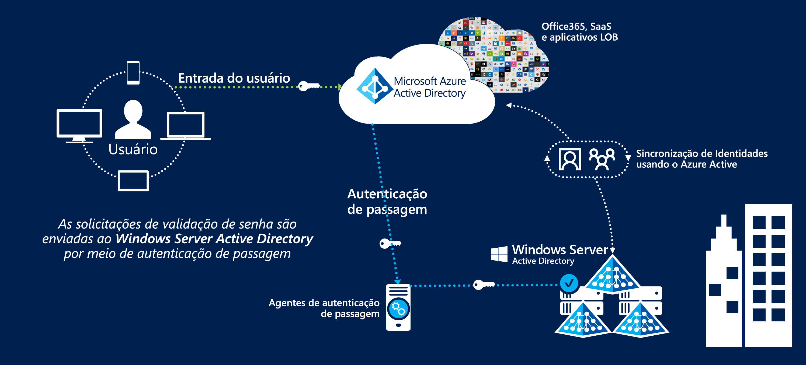
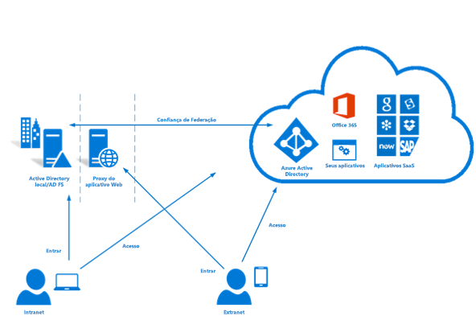

# Federação de identidade no Azure Austrália

O Gerenciamento e a Federação de Identidades com ofertas de Nuvem Pública é uma das primeiras etapas mais cruciais para usar a nuvem. O serviço do Azure Active Directory da Microsoft armazena informações do usuário para habilitar o acesso aos serviços de nuvem e é um pré-requisito para consumir outros serviços do Azure.

Este artigo aborda os principais pontos de design para implementar o Azure Active Directory, sincronizar usuários de um domínio do Active Directory Domain Services e implementar uma autenticação segura. O foco específico é colocado nas recomendações do ISM (Manual de Segurança da Informação) da Central de Segurança Cibernética australiana e dos Relatórios de Certificação do Azure.

A classificação das informações armazenadas no Azure Active Directory deve informar decisões sobre como elas foram criadas. O trecho a seguir é fornecido do [Relatório de Certificação da ACSC – Microsoft Azure](https://aka.ms/au-irap):

>**Relatório de Certificação da ACSC – Microsoft Azure** o Azure AD (Active Directory) deve ser configurado com os Serviços de Federação do Active Directory (AD FS) quando entidades da Comunidade classificam o uso e o conteúdo dos dados do Active Directory como PROTEGIDO. Embora os dados do Active Directory na classificação UDLM (Marcações Limitadoras de Disseminação NÃO CLASSIFICADA) não requeira federação, as entidades da Comunidade ainda podem implementar a federação para atenuar os riscos associados ao serviço que está sendo fornecido de fora da Austrália.

Assim, quais informações são sincronizadas e o mecanismo por meio do qual os usuários são autenticados são as duas principais preocupações abordadas aqui.

## Principais considerações sobre design

### Sincronização do usuário

Ao implantar o Azure AD Connect, há várias decisões que devem ser tomadas sobre os dados que serão sincronizados. O Azure AD Connect é baseado no Microsoft Identity Manager e oferece um conjunto de recursos robusto para [transformar](https://docs.microsoft.com/azure/active-directory/hybrid/how-to-connect-sync-best-practices-changing-default-configuration) dados entre diretórios.

Os Serviços de Consultoria da Microsoft podem ser envolvidos para fazer uma avaliação ADRAP do Windows Server Active Directory. O ADRAP auxilia a determinar os problemas que talvez precisem de correção antes de sincronizar-se ao Azure Active Directory. Os Contratos do Suporte Premier da Microsoft geralmente incluirão esse serviço.

A [ferramenta IDFix](https://docs.microsoft.com/office365/enterprise/install-and-run-idfix) examina se há problemas em seu domínio do Active Directory local antes de sincronizar-se ao Azure AD. O IDFix é uma primeira etapa importante antes de implementar o Azure AD Connect. Embora uma verificação do IDFix possa identificar um grande número de problemas, muitos deles podem ser resolvidos rapidamente com scripts ou solucionados usando transformações de dados no Azure AD Connect.

O Azure AD requer que os usuários tenham um domínio primário roteável externamente para habilitar a autenticação. Se o seu domínio tiver um sufixo UPN que não seja roteável externamente, será necessário definir a [ID de entrada alternativa](https://docs.microsoft.com/azure/active-directory/hybrid/plan-connect-userprincipalname) no AD Connect para o atributo de email do usuário. Os usuários entram nos serviços do Azure com o endereço de email em vez de usar suas credenciais de domínio.

No entanto, o sufixo UPN em contas de usuário também pode ser alterado usando ferramentas como o PowerShell; ele pode ter consequências imprevisíveis para outros sistemas conectados e não é mais considerado uma melhor prática.

Ao decidir quais atributos sincronizar ao Azure Active Directory, é mais seguro pressupor que todos eles são necessários. É raro um diretório conter dados PROTEGIDOS reais; no entanto, é recomendável realizar uma auditoria. Se dados PROTEGIDOS forem encontrados no diretório, avalie o impacto de omitir ou de transformar o atributo. Como um guia útil, há uma lista de atributos [exigidos](https://docs.microsoft.com/azure/active-directory/hybrid/reference-connect-sync-attributes-synchronized) pelos Serviços em Nuvem da Microsoft.

### Authentication

É importante entender as opções disponíveis e como elas podem ser usadas para manter os usuários finais seguros.
A Microsoft oferece [três soluções nativas](https://docs.microsoft.com/azure/active-directory/hybrid/plan-connect-user-signin) para autenticar usuários em relação ao Azure Active Directory:

* Sincronização de hash de senha – As senhas com hash do Active Directory Domain Services são sincronizadas pelo Azure AD Connect ao Azure Active Directory.
* [Autenticação de passagem](https://docs.microsoft.com/azure/active-directory/hybrid/how-to-connect-pta) – as senhas permanecem dentro do Active Directory Domain Services. Os usuários são autenticados em relação ao Active Directory Domain Services por meio de um agente. Nenhuma senha é armazenada no Azure AD.
* [SSO federado](https://docs.microsoft.com/azure/active-directory/hybrid/how-to-connect-fed-whatis) – o Azure Active Directory é federado com os Serviços de Federação do Active Directory (AD FS), durante a entrada, o Azure direciona os usuários para os Serviços de Federação do Active Directory (AD FS) autenticar. Nenhuma senha é armazenada no Azure AD.

A sincronização de hash de senha pode ser usada em cenários nos quais dados OFICIAIS confidenciais e abaixo estão sendo armazenados dentro do diretório. Os cenários nos quais os dados PROTEGIDOS estão sendo armazenados exigirão uma das duas opções restantes.

Todas essas opções dão suporte ao [Write-Back de Senha](https://docs.microsoft.com/azure/active-directory/authentication/concept-sspr-writeback), que o [Guia do Consumidor da ACSC](https://aka.ms/au-irap) recomenda desabilitar. No entanto, as organizações devem avaliar o risco de desabilitar o Write-back de Senha com relação aos ganhos de produtividade e ao menor esforço de suporte do uso de redefinições de senha self-service.

#### PTA (Autenticação de Passagem)

A Autenticação de Passagem foi liberada depois que a avaliação do IRAP foi concluída e, portanto, deve ser avaliada individualmente para determinar como a solução se ajusta ao perfil de risco de sua organização. A autenticação de Passagem é preferida em relação à Federação da Microsoft devido à postura de segurança aprimorada.

A Autenticação de Passagem apresenta vários fatores de design a serem considerados:

* O Agente de Autenticação de Passagem deve ser capaz de estabelecer conexões de saída com os Serviços em Nuvem da Microsoft.
* A instalação de mais de um agente para que o serviço esteja altamente disponível. Uma melhor prática é implantar de 3 a 12 agentes.
* Uma melhor prática é evitar instalar o agente diretamente em Controladores de Domínio do Active Directory. Por padrão, ao implantar o Azure AD Connect com a Autenticação de Passagem, ela instalará o agente no servidor do AD Connect.
* A Autenticação de Passagem é uma opção de manutenção mais baixa do que os Serviços de Federação do Active Directory (AD FS), porque ela não requer infraestrutura de servidor dedicado, gerenciamento de certificados ou regras de firewall de entrada.

#### ADFS (Serviços de Federação do Active Directory)

Os Serviços de Federação do Active Directory (AD FS) foram incluídos na avaliação do IRAP e foram aprovados para uso em ambientes PROTEGIDOS.

Os Serviços de Federação do Active Directory (AD FS) apresentam vários fatores de design que devem ser considerados:

* Os Serviços de Federação exigirão o ingresso de rede para tráfego HTTPS da Internet ou, no mínimo, dos pontos de extremidade de serviço da Microsoft.
* OS Serviço de Federação usam PKI e certificados, que exigem gerenciamento e renovação contínuos.
* Os Serviços de Federação devem ser implantados em servidores dedicados e exigirão a infraestrutura de rede relevante para torná-la seguramente acessível no âmbito externo.

### Autenticação Multifator (MFA)

A seção ISM na autenticação multifator recomenda implementá-la nos seguintes cenários com base em seu perfil de risco:

* Autenticar usuários padrão
* Autenticar contas privilegiadas
* Autenticar o acesso remoto dos usuários
* Usuários que executam ações privilegiadas

O Azure Active Directory oferece Autenticação Multifator que pode ser habilitada para todos os usuários ou para um subconjunto deles (por exemplo, apenas contas privilegiadas). A Microsoft também oferece uma solução chamada Acesso Condicional, que permite um controle mais granular sobre como a Autenticação Multifator é aplicada (por exemplo, apenas quando os usuários entram de intervalos de endereço IP remoto).

A Autenticação Multifator do Azure dá suporte às seguintes formas aceitáveis de validação do ISM:

* chamada telefônica
* Mensagem SMS
* Aplicativo Microsoft Authenticator
* Tokens de hardware com suporte

O Privileged Identity Management, um componente do Azure Active Directory, pode ser usado para impor o uso da autenticação multifator quando os usuários elevam suas permissões para atender à quarta recomendação.

## Próximas etapas

Examine o artigo sobre [Controles de Acesso Baseado em Função e Privileged Identity Management](role-privileged.md).
