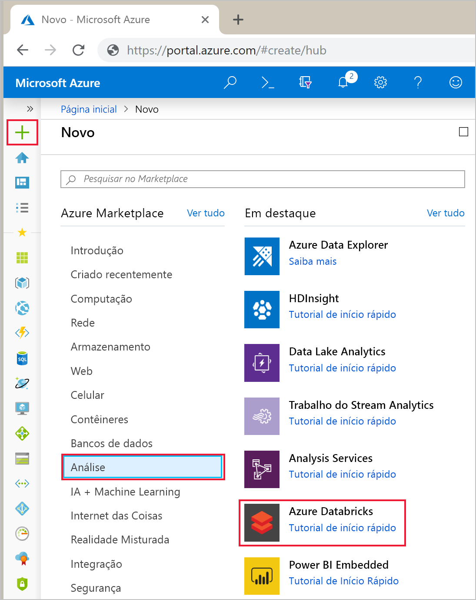
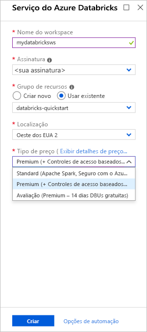
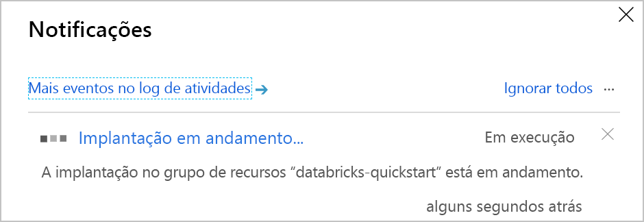
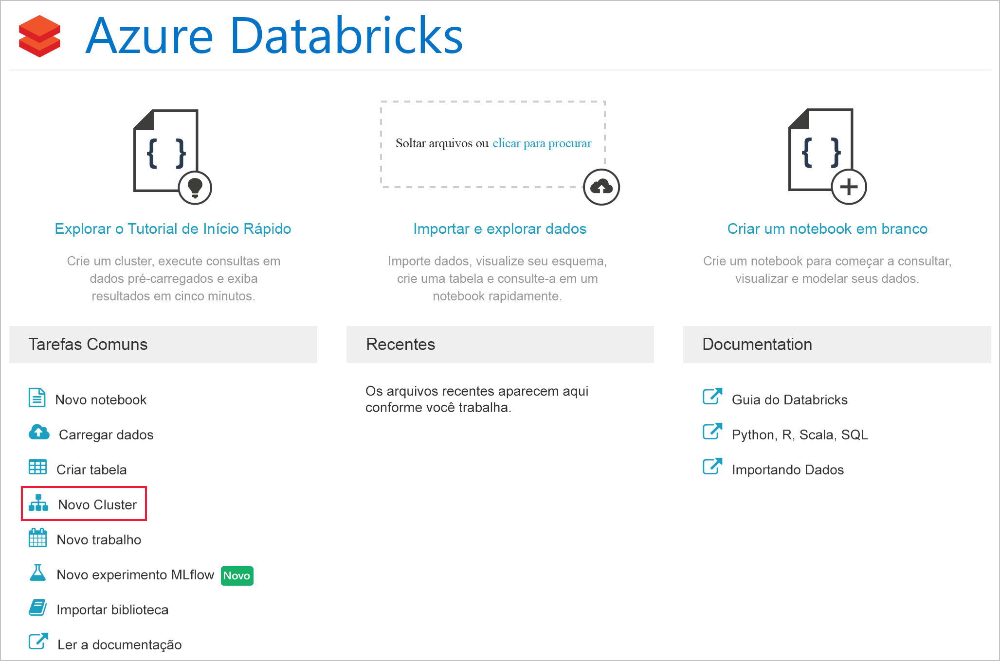
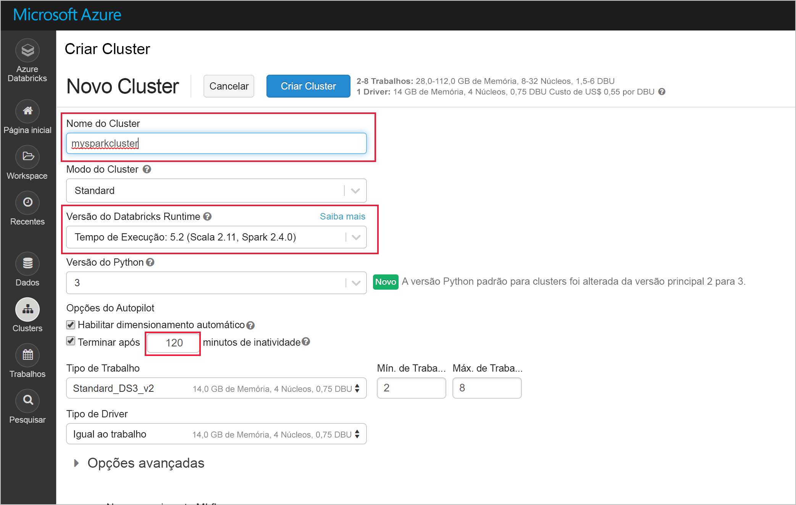
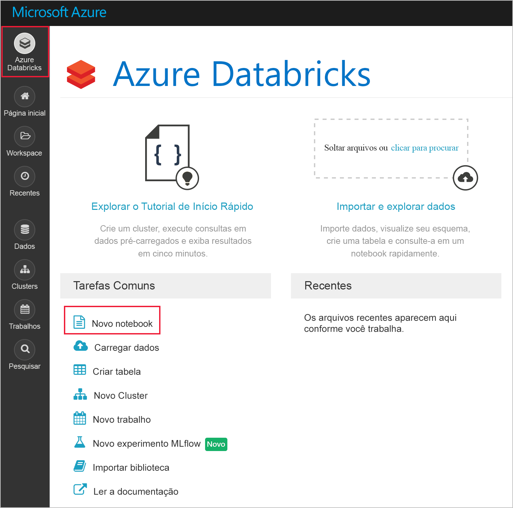
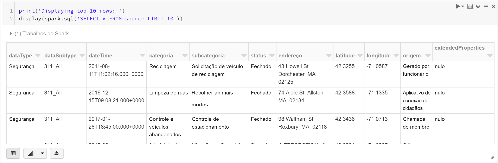
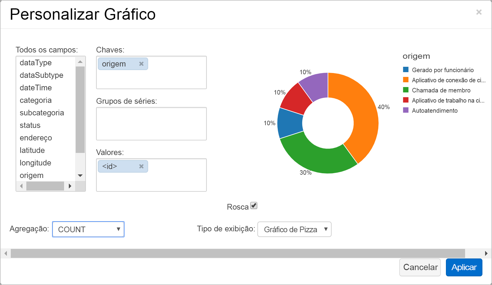

# <a name="quickstart-run-a-spark-job-on-azure-databricks-using-the-azure-portal"></a>Início Rápido: Executar um trabalho de Spark no Azure Databricks usando o portal do Azure

Neste início rápido, você usará o portal do Azure para criar um workspace do Azure Databricks com um cluster do Apache Spark. Você executará um trabalho no cluster e usará gráficos personalizados para produzir relatórios em tempo real com base nos dados de segurança de Boston.

## <a name="prerequisites"></a>Pré-requisitos

- Assinatura do Azure - [criar uma gratuitamente](https://azure.microsoft.com/free/)

## <a name="sign-in-to-the-azure-portal"></a>Entre no Portal do Azure

Entre no [Portal do Azure](https://portal.azure.com). Este tutorial não pode ser realizado usando a Assinatura de avaliação gratuita do Azure. Para usar uma conta gratuita para criar o cluster do Azure Databricks, antes de criar o cluster, vá até o seu perfil e altere sua assinatura para **pré-pago**. Para saber mais, confira [Conta gratuita do Azure](https://azure.microsoft.com/free/).

## <a name="create-an-azure-databricks-workspace"></a>Criar um workspace do Azure Databricks

Nesta seção, você deve cria um workspace do Azure Databricks usando o Portal do Azure.

1. No Portal do Azure, selecione **Criar um recurso** > **Análise** > **Azure Databricks**.

    

2. Em **Serviço do Azure Databricks**, forneça os valores para criar um workspace do Databricks.

    

    Forneça os seguintes valores:
    
    |Propriedade  |DESCRIÇÃO  |
    |---------|---------|
    |**Nome do workspace**     | Forneça um nome para seu workspace do Databricks        |
    |**Assinatura**     | Na lista suspensa, selecione sua assinatura do Azure.        |
    |**Grupo de recursos**     | Especifique se deseja criar um novo grupo de recursos ou usar um existente. Um grupo de recursos é um contêiner que mantém os recursos relacionados a uma solução do Azure. Para obter mais informações, consulte [Visão geral do Grupo de Recursos do Azure](../azure-resource-manager/resource-group-overview.md). |
    |**Localidade**     | Selecione **Oeste dos EUA 2**. Para outras regiões disponíveis, consulte [serviços do Azure por região](https://azure.microsoft.com/regions/services/).        |
    |**Tipo de preço**     |  Escolha entre o cluster **Standard**, **Premium** ou **Avaliação**. Para saber mais sobre essas camadas, confira [Página de preços do Databricks](https://azure.microsoft.com/pricing/details/databricks/).       |

    Selecione **Fixar no painel** e clique em **Criar**.

4. A criação do workspace leva alguns minutos. Durante a criação do espaço de trabalho, você pode exibir o status da implantação em **Notificações**.

    

## <a name="create-a-spark-cluster-in-databricks"></a>Criar um cluster Spark no Databricks

> [!NOTE]
> Para usar uma conta gratuita para criar o cluster do Azure Databricks, antes de criar o cluster, vá até o seu perfil e altere sua assinatura para **pré-pago**. Para saber mais, confira [Conta gratuita do Azure](https://azure.microsoft.com/free/).

1. No portal do Azure, vá para o workspace do Databricks que você criou e clique em **Inicializar Workspace**.

2. Você é redirecionado para o portal do Azure Databricks. No portal, clique em **Novo Cluster**.

    

3. Na página **Novo cluster**, forneça os valores para criar um cluster.

    

    Aceite todos os outros valores padrão que não sejam o seguinte:

   * Insira um nome para o cluster.
   * Neste artigo, crie um cluster com o tempo de execução **5.2**.
   * Verifique se você marcou a caixa de seleção **Terminar depois de \_\_ minutos de inatividade**. Forneça uma duração (em minutos) para encerrar o cluster caso ele não esteja sendo usado.
    
     Selecione **Criar cluster**. Quando o cluster está em execução, você pode anexar blocos de notas a ele e executar trabalhos do Spark.

Para obter mais informações sobre como criar clusters, consulte [Criar um cluster Spark no Azure Databricks](https://docs.azuredatabricks.net/user-guide/clusters/create.html).

## <a name="run-a-spark-sql-job"></a>Executar um trabalho SQL do Spark

Execute as seguintes tarefas para criar um notebook em Databricks, configurar o notebook para ler dados de Conjuntos de dados abertos do Azure e executar um trabalho SQL do Spark nos dados.

1. No painel esquerdo, escolha **Azure Databricks**. Nas **Tarefas Comuns**, escolha **Novo Notebook**.

    

2. Na caixa de diálogo **Criar Notebook**, insira um nome, escolha **Python** como a linguagem e escolha o cluster Spark criado anteriormente.

    

    Selecione **Criar**.

3. Nesta etapa, crie um DataFrame do Spark com Dados de Segurança de Boston dos [Conjuntos de Dados Abertos do Azure](https://azure.microsoft.com/services/open-datasets/catalog/boston-safety-data/#AzureDatabricks) e use o SQL para consultar os dados.

   O comando a seguir define as informações de acesso do armazenamento do Azure. Cole esse código do PySpark na primeira célula e use **Shift+Enter** para executar o código.

   ```python
   blob_account_name = "azureopendatastorage"
   blob_container_name = "citydatacontainer"
   blob_relative_path = "Safety/Release/city=Boston"
   blob_sas_token = r"?st=2019-02-26T02%3A34%3A32Z&se=2119-02-27T02%3A34%3A00Z&sp=rl&sv=2018-03-28&sr=c&sig=XlJVWA7fMXCSxCKqJm8psMOh0W4h7cSYO28coRqF2fs%3D"
   ```

   O comando a seguir permite que o Spark leia o armazenamento de Blobs remotamente. Cole esse código do PySpark na próxima célula e use **Shift+Enter** para executar o código.

   ```python
   wasbs_path = 'wasbs://%s@%s.blob.core.windows.net/%s' % (blob_container_name, blob_account_name, blob_relative_path)
   spark.conf.set('fs.azure.sas.%s.%s.blob.core.windows.net' % (blob_container_name, blob_account_name), blob_sas_token)
   print('Remote blob path: ' + wasbs_path)
   ```

   O comando a seguir cria um DataFrame. Cole esse código do PySpark na próxima célula e use **Shift+Enter** para executar o código.

   ```python
   df = spark.read.parquet(wasbs_path)
   print('Register the DataFrame as a SQL temporary view: source')
   df.createOrReplaceTempView('source')
   ```

4. Execute uma instrução SQL para retornar as 10 primeiras linhas de dados da exibição temporária chamada **fonte**. Cole esse código do PySpark na próxima célula e use **Shift+Enter** para executar o código.

   ```python
   print('Displaying top 10 rows: ')
   display(spark.sql('SELECT * FROM source LIMIT 10'))
   ```

5. Você verá uma saída tabular como mostrado na seguinte captura de tela (somente algumas colunas são mostradas):

    

6. Agora, crie uma representação visual desses dados para mostrar quantos eventos de segurança são relatados usando o aplicativo Citizens Connect e o City Worker App em vez de outras fontes. Na parte inferior da saída tabular, escolha o ícone de **Gráfico de barras** e clique em **Opções de plotagem**.

    

8. Em **Personalizar plotagem**, arraste e solte valores conforme mostrado na captura de tela.

    

   * Defina **Chaves** como **origem**.
   * Defina **Valores** como **<\id>** .
   * Definir **Agregação** como **CONTAGEM**.
   * Defina **Tipo de exibição** como **Gráfico de pizza**.

     Clique em **Aplicar**.

## <a name="clean-up-resources"></a>Limpar recursos

Depois de terminar o artigo, você poderá encerrar o cluster. Para isso, no workspace do Azure Databricks, no painel esquerdo, selecione **Clusters**. No cluster que deseja encerrar, mova o cursor sobre o botão de reticências na coluna **Ações** e selecione o ícone **Terminar**.


Se você não encerrar o cluster manualmente, ele será interrompido automaticamente, desde que você tenha selecionado a caixa de seleção **Terminar depois de \_\_ minutos de inatividade** ao criar o cluster. Nesse caso, o cluster é interrompido automaticamente se ficar inativo durante o tempo especificado.

## <a name="next-steps"></a>Próximas etapas

Neste artigo, você criou um cluster Spark no Azure Databricks e executou um trabalho do Spark usando os dados dos Conjuntos de dados abertos do Azure. Você também pode examinar [Fontes de dados do Spark](https://docs.azuredatabricks.net/spark/latest/data-sources/index.html) para saber como importar dados de outras fontes de dados para o Azure Databricks. Siga até o próximo artigo para saber como executar uma operação de ETL (extração, transformação e carregamento de dados) usando o Azure Databricks.

> [!div class="nextstepaction"]
>[Extrair, transformar e carregar dados usando o Azure Databricks](databricks-extract-load-sql-data-warehouse.md)
