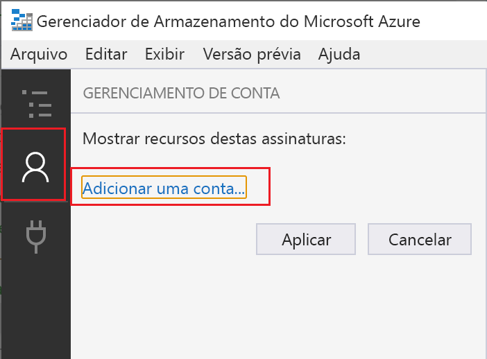
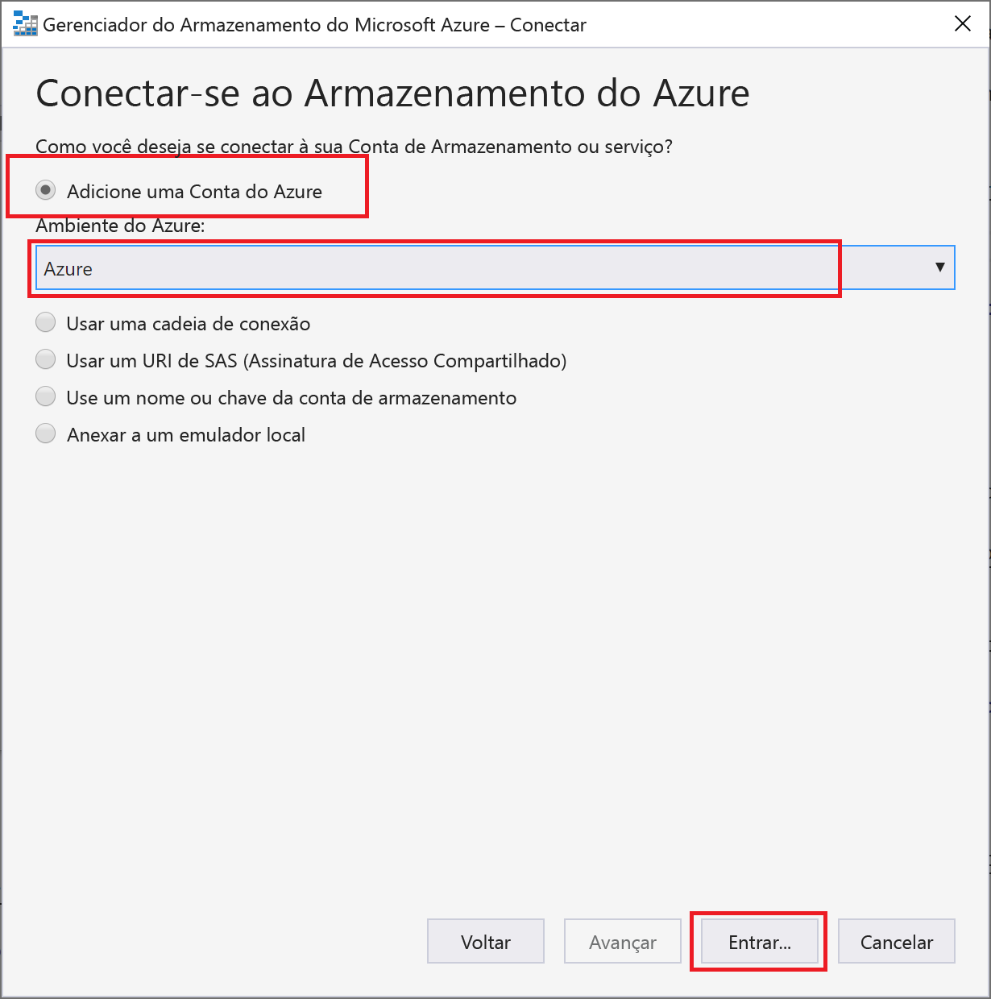
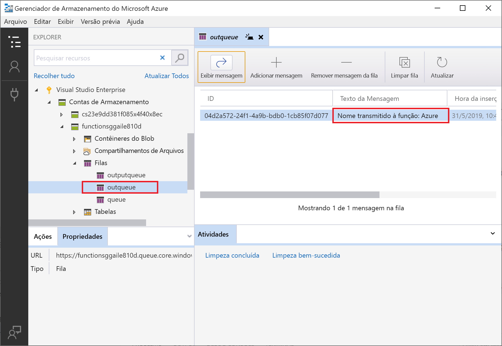
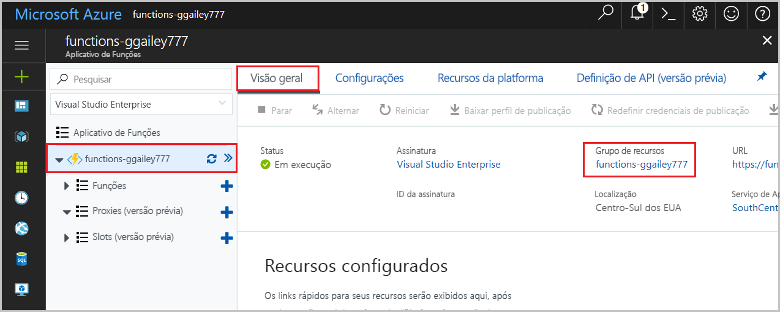

# <a name="connect-functions-to-azure-storage-using-visual-studio-code"></a>Conectar funções ao Armazenamento do Azure usando o Visual Studio Code

O Azure Functions permite conectar funções aos serviços do Azure e a outros recursos sem precisar escrever seu próprio código de integração. Essas *associações*, que representam a entrada e a saída, são declaradas na definição de função. Dados de associações são fornecidos à função como parâmetros. Um gatilho é um tipo especial de associação de entrada. Embora uma função tenha apenas um gatilho, ela pode ter várias associações de entrada e de saída. Para saber mais, confira [Conceitos de gatilhos e de associações do Azure Functions](functions-triggers-bindings.md).

Este artigo mostra como usar Visual Studio Code para conectar a função criada no [artigo de início rápido anterior](functions-create-first-function-vs-code.md) ao Armazenamento do Azure. A associação de saída que você adiciona a essa função escreve dados da solicitação HTTP em uma mensagem na fila. 

A maioria das associações requer uma cadeia de conexão armazenada que o Functions usa para acessar o serviço vinculado. Para facilitar, use a Conta de armazenamento que você criou com o seu aplicativo de funções. A conexão com essa conta já está armazenada em uma configuração de aplicativo chamada `AzureWebJobsStorage`.  

## <a name="prerequisites"></a>Pré-requisitos

Antes de iniciar este artigo, você deve atender aos seguintes requisitos:

* Instale a [extensão de Armazenamento do Azure para o Visual Studio Code](https://marketplace.visualstudio.com/items?itemName=ms-azuretools.vscode-azurestorage).
* Instale o [Gerenciador de Armazenamento do Azure](https://storageexplorer.com/). O Gerenciador de Armazenamento é uma ferramenta que você usará para examinar as mensagens da fila geradas pela associação de saída. O Gerenciador de Armazenamento tem suporte em sistemas operacionais baseados em macOS, Windows e Linux.
* Instale [ferramentas de CLI do .NET Core](https://docs.microsoft.com/dotnet/core/tools/?tabs=netcore2x) (somente projetos C#).
* Conclua as etapas na [parte 1 do início rápido do Visual Studio Code](functions-create-first-function-vs-code.md). 

Este artigo pressupõe que você já esteja conectado à sua assinatura do Azure do Visual Studio Code. Você pode entrar executando `Azure: Sign In` na paleta de comandos. 

## <a name="download-the-function-app-settings"></a>Baixar as configurações do aplicativo de funções

No [artigo de início rápido anterior](functions-create-first-function-vs-code.md), você criou um aplicativo de funções no Azure, juntamente com a Conta de armazenamento necessária. A cadeia de conexão dessa conta é armazenada com segurança nas configurações do aplicativo no Azure. Neste artigo, você escreverá mensagens em uma Fila de armazenamento na mesma conta. Para se conectar à sua Conta de armazenamento ao executar a função localmente, é necessário baixar as configurações do aplicativo para o arquivo local.settings.json. 

1. Pressione a tecla F1 para abrir a paleta de comandos, pesquise e execute o comando `Azure Functions: Download Remote Settings....`. 

1. Escolha o aplicativo de função que você criou no artigo anterior. Selecione **Sim para todos** para substituir as configurações locais existentes. 

    > [!IMPORTANT]  
    > Como ela contém segredos, o arquivo local.settings.json nunca é publicado e é excluído do controle do código-fonte.

1. Copie o valor `AzureWebJobsStorage`, que é a chave do valor da cadeia de conexão da Conta de armazenamento. Use esta conexão para verificar se a associação de saída funciona conforme o esperado.

## <a name="register-binding-extensions"></a>Registrar as extensões de associação

Como está usando uma associação de saída Armazenamento de Filas, você precisa ter a extensão de associações de Armazenamento instalada antes de executar o projeto. 

### <a name="javascript"></a>JavaScript

[!INCLUDE [functions-extension-bundles](../../includes/functions-extension-bundles.md)]

### <a name="c-class-library"></a>Biblioteca de classes C\#

Com exceção dos gatilhos de timer e HTTP, as associações são implementadas como pacotes de extensão. Execute o comando [dotnet add package](/dotnet/core/tools/dotnet-add-package) a seguir na janela Terminal para adicionar o pacote de extensão Armazenamento ao seu projeto.

```bash
dotnet add package Microsoft.Azure.WebJobs.Extensions.Storage --version 3.0.4
```

Agora, você pode adicionar a associação de saída do armazenamento ao seu projeto.

## <a name="add-an-output-binding"></a>Adicionar uma associação de saída

No Functions, cada tipo de associação requer que um `direction`, `type` e um `name` exclusivo seja definido no arquivo functions.json. A maneira como você define esses atributos depende do idioma do seu aplicativo de função.

### <a name="javascript"></a>JavaScript

Atributos de associação são definidos diretamente no arquivo function.json. Dependendo do tipo de associação, outras propriedades podem ser necessárias. A [configuração de saída da fila](functions-bindings-storage-queue.md#output---configuration) descreve os campos obrigatórios para uma associação de fila do Armazenamento do Azure. A extensão facilita a inclusão de associações no arquivo function.json. 

Para criar uma associação, clique com o botão direito do mouse (Ctrl+clique no macOS) no arquivo `function.json` na pasta HttpTrigger e escolha **Adicionar associação...** . Siga os prompts para definir as seguintes propriedades de associação para a nova associação:

| Prompt | Valor | DESCRIÇÃO |
| -------- | ----- | ----------- |
| **Selecionar direção de associação** | `out` | A associação é uma associação de saída. |
| **Selecionar associação com direção...** | `Azure Queue Storage` | A associação é uma associação de fila do Armazenamento do Azure. |
| **O nome usado para identificar essa associação em seu código** | `msg` | Nome que identifica o parâmetro de associação referenciado em seu código. |
| **A fila à qual a mensagem será enviada** | `outqueue` | O nome da fila na qual a associação escreve. Quando o *queueName* não existe, a associação o cria no primeiro uso. |
| **Selecione a configuração de "local.setting.json"** | `AzureWebJobsStorage` | O nome de uma configuração de aplicativo que contém a cadeia de conexão da Conta de armazenamento. A configuração `AzureWebJobsStorage` contém a cadeia de conexão para a Conta de armazenamento criada com o aplicativo de funções. |

Uma associação é incluída na matriz `bindings` no seu arquivo function.json, que agora deve se parecer com o seguinte exemplo:

```json
{
   ...

  "bindings": [
    {
      "authLevel": "function",
      "type": "httpTrigger",
      "direction": "in",
      "name": "req",
      "methods": [
        "get",
        "post"
      ]
    },
    {
      "type": "http",
      "direction": "out",
      "name": "$return"
    },
    {
      "type": "queue",
      "direction": "out",
      "name": "msg",
      "queueName": "outqueue",
      "connection": "AzureWebJobsStorage"
    }
  ]
}
```

### <a name="c-class-library"></a>Biblioteca de classes C\#

Em um projeto de biblioteca de classe C#, as associações são definidas como atributos de associação no método de função. O arquivo function.json é então gerado automaticamente com base nesses atributos.

Abra o arquivo de projeto HttpTrigger.cs e adicione a seguinte instrução `using`:

```cs
using Microsoft.Azure.WebJobs.Extensions.Storage;
```

Adicione o seguinte parâmetro à definição do método `Run`:

```cs
[Queue("outqueue"),StorageAccount("AzureWebJobsStorage")] ICollector<string> msg
```

O parâmetro `msg` é um tipo `ICollector<T>`, que representa uma coleção de mensagens que são gravadas em uma associação de saída quando a função é concluída. Nesse caso, a saída é uma fila de armazenamento denominada `outqueue`. A cadeia de conexão para a Conta de armazenamento é definida pelo `StorageAccountAttribute`. Esse atributo indica a configuração que contém a cadeia de conexão da Conta de armazenamento e pode ser aplicada no nível de classe, método ou parâmetro. Nesse caso, você poderia omitir `StorageAccountAttribute` porque já está usando a conta de armazenamento padrão.

A definição do método Executar deve agora se parecer com o seguinte:  

```cs
[FunctionName("HttpTrigger")]
public static async Task<IActionResult> Run(
    [HttpTrigger(AuthorizationLevel.Function, "get", "post", Route = null)] HttpRequest req, 
    [Queue("outqueue"),StorageAccount("AzureWebJobsStorage")] ICollector<string> msg, ILogger log)
```

## <a name="add-code-that-uses-the-output-binding"></a>Adicionar o código que usa a associação de saída

Depois que a associação é definida, você pode usar o `name` da associação para acessá-la como um atributo na assinatura de função. Ao usar uma associação de saída, não é necessário usar o código do SDK do Armazenamento do Azure para se autenticar, para obter uma referência de fila ou para escrever dados. O tempo de execução do Functions e a associação de saída da fila fazem essas tarefas para você.

### <a name="javascript"></a>JavaScript

Adicione código que usa a associação de saída `msg` no objeto `context.bindings` para criar uma mensagem da fila. Adicione esse código antes da instrução `context.res`.

```javascript
// Add a message to the Storage queue.
context.bindings.msg = "Name passed to the function: " + 
(req.query.name || req.body.name);
```

Neste ponto, sua função deve ser a seguinte:

```javascript
module.exports = async function (context, req) {
    context.log('JavaScript HTTP trigger function processed a request.');

    if (req.query.name || (req.body && req.body.name)) {
        // Add a message to the Storage queue.
        context.bindings.msg = "Name passed to the function: " + 
        (req.query.name || req.body.name);
        context.res = {
            // status: 200, /* Defaults to 200 */
            body: "Hello " + (req.query.name || req.body.name)
        };
    }
    else {
        context.res = {
            status: 400,
            body: "Please pass a name on the query string or in the request body"
        };
    }
};
```

### <a name="c"></a>C\#

Adicionar código que usa a associação de saída no objeto `msg` para criar uma mensagem da fila. Adicione este código antes do método retornar.

```cs
if (!string.IsNullOrEmpty(name))
{
    // Add a message to the output collection.
    msg.Add(string.Format("Name passed to the function: {0}", name));
}
```

Neste ponto, sua função deve ser a seguinte:

```cs
[FunctionName("HttpTrigger")]
public static async Task<IActionResult> Run(
    [HttpTrigger(AuthorizationLevel.Function, "get", "post", Route = null)] HttpRequest req, 
    [Queue("outqueue"),StorageAccount("AzureWebJobsStorage")] ICollector<string> msg, ILogger log)
{
    log.LogInformation("C# HTTP trigger function processed a request.");

    string name = req.Query["name"];

    string requestBody = await new StreamReader(req.Body).ReadToEndAsync();
    dynamic data = JsonConvert.DeserializeObject(requestBody);
    name = name ?? data?.name;

    if (!string.IsNullOrEmpty(name))
    {
        // Add a message to the output collection.
        msg.Add(string.Format("Name passed to the function: {0}", name));
    }
    return name != null
        ? (ActionResult)new OkObjectResult($"Hello, {name}")
        : new BadRequestObjectResult("Please pass a name on the query string or in the request body");
}
```

[!INCLUDE [functions-run-function-test-local-vs-code](../../includes/functions-run-function-test-local-vs-code.md)]

Uma nova fila denominada **outqueue** é criada na sua conta de armazenamento pelo tempo de execução do Functions quando a associação de saída é usada pela primeira vez. Você usará o Gerenciador de Armazenamento para verificar se a fila foi criada junto com a nova mensagem.

### <a name="connect-storage-explorer-to-your-account"></a>Conectar o Gerenciador de Armazenamento à sua conta

Ignore esta seção se você já instalou o Gerenciador de Armazenamento do Azure e o conectou à sua conta do Azure.

1. Execute a ferramenta [Gerenciador de Armazenamento do Azure], selecione o ícone de conexão à esquerda e selecione **Adicionar uma conta**.

    

1. Na caixa de diálogo **Conectar**, escolha **Adicionar uma conta do Azure**, escolha seu **Ambiente do Azure** e selecione **Entrar...** . 

    

Depois de entrar na sua conta, você verá todas as assinaturas do Azure associadas à ela.

### <a name="examine-the-output-queue"></a>Examinar a fila de saída

1. No Visual Studio Code, pressione a tecla F1 para abrir a paleta de comandos, em seguida, procure e execute o comando `Azure Storage: Open in Storage Explorer` e escolha o nome da sua conta de armazenamento. Sua conta de armazenamento é aberta no Gerenciador de Armazenamento do Azure.  

1. Expanda o nó **Filas** e selecione a fila denominada **outqueue**. 

   A fila contém a mensagem que a associação de saída de fila criou quando você executou a função disparada por HTTP. Se você tiver invocado a função com o valor `name` padrão do *Azure*, a mensagem da fila será *Nome transmitido à função: Azure*.

    

1. Execute a função novamente, envie outra solicitação e você verá uma nova mensagem na fila.  

Agora, chegou a hora de republicar o aplicativo de funções atualizado no Azure.

## <a name="redeploy-and-test-the-updated-app"></a>Reimplementar e testar o aplicativo atualizado

1. No Visual Studio Code, pressione F1 para abrir a paleta de comandos. Na paleta de comandos, pesquise e selecione `Azure Functions: Deploy to function app...`.

1. Escolha o aplicativo de funções que você criou no primeiro artigo. Como você está reimplementando seu projeto para o mesmo aplicativo, selecione **Implantar** para descartar o aviso de substituição de arquivos.

1. Após a conclusão da implantação, você poderá usar novamente o cURL ou um navegador para testar a função reimplementada. Como antes, acrescente a cadeia de consulta `&name=<yourname>` à URL, como no seguinte exemplo:

    ```bash
    curl https://myfunctionapp.azurewebsites.net/api/httptrigger?code=cCr8sAxfBiow548FBDLS1....&name=<yourname>
    ```

1. Novamente, [Examinar a Mensagem da fila de armazenamento](#examine-the-output-queue) para verificar se a associação de saída gera novamente uma nova mensagem na fila.

## <a name="clean-up-resources"></a>Limpar recursos

Os *Recursos* no Azure se referem a aplicativos de funções, funções, contas de armazenamento e assim por diante. Eles são agrupados em *grupos de recursos*, e você pode excluir tudo junto ao excluir o grupo.

Você criou recursos para concluir esses guias de início rápido. Você pode ser cobrado por esses recursos, dependendo do [status de conta](https://azure.microsoft.com/account/) e [preços do serviço](https://azure.microsoft.com/pricing/). Caso não precise mais dos recursos, é possível excluí-los desta maneira:

1. No Visual Studio Code, pressione F1 para abrir a paleta de comandos. Na paleta de comandos, pesquise e selecione `Azure Functions: Open in portal`.

1. Escolha seu aplicativo de funções e pressione Enter. A página do aplicativo de funções é aberta no [portal do Azure](https://portal.azure.com).

1. Na guia **Visão geral**, selecione o link nomeado em **Grupo de Recursos**.

    

1. Na página **Grupo de recursos**, examine a lista de recursos incluídos e verifique se eles são aqueles que deseja excluir.
 
1. Selecione **Excluir grupo de recursos** e siga as instruções.

   A exclusão poderá levar alguns minutos. Ao ser concluída, uma notificação será exibida por alguns segundos. Também é possível selecionar o ícone de sino na parte superior da página para exibir a notificação.

## <a name="next-steps"></a>Próximas etapas

Você atualizou sua função disparada por HTTP para gravar dados em uma Fila de armazenamento. Para saber mais sobre o desenvolvimento de funções, confira [Desenvolver Funções do Azure usando o Visual Studio Code](functions-develop-vs-code.md).

Em seguida, você deve habilitar o monitoramento do Application Insights para seu aplicativo de funções:

> [!div class="nextstepaction"]
> [Habilitar a integração do Application Insights](functions-monitoring.md#manually-connect-an-app-insights-resource)

[Gerenciador de Armazenamento do Azure]: https://storageexplorer.com/
