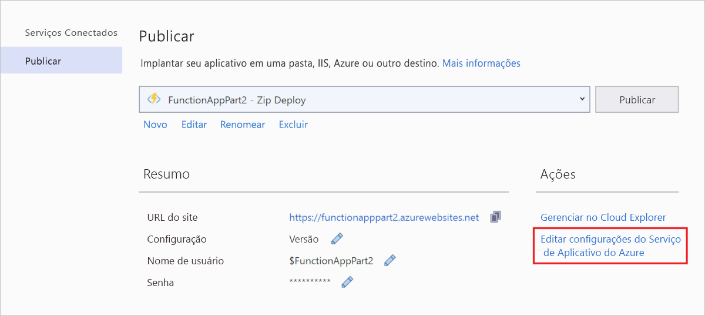

# <a name="connect-functions-to-azure-storage-using-visual-studio"></a>Conectar funções ao Armazenamento do Azure usando o Visual Studio

O Azure Functions permite conectar funções aos serviços do Azure e a outros recursos sem precisar escrever seu próprio código de integração. Essas conexões predefinidas são chamadas de *associações*. As associações permitem que uma função use os serviços do Azure e outros recursos como entrada e saída para uma função.

A execução da função é iniciada por um único *gatilho*. Um gatilho é um tipo especial de associação de entrada. Embora uma função tenha apenas um gatilho, ela pode ter várias associações de entrada e de saída. Para saber mais, confira [Conceitos de gatilhos e de associações do Azure Functions](functions-triggers-bindings.md).

Este artigo mostra como usar Visual Studio para conectar a função criada no [artigo de Início Rápido anterior] do Armazenamento do Azure. A associação de saída que você adiciona a essa função escreve dados da solicitação HTTP em uma mensagem na fila. 

A maioria das associações requer uma cadeia de conexão armazenada que o Functions usa para acessar o serviço vinculado. Para facilitar, use a Conta de armazenamento que você criou com o seu aplicativo de funções. A conexão com essa conta já está armazenada em uma configuração de aplicativo chamada `AzureWebJobsStorage`.  

## <a name="prerequisites"></a>Pré-requisitos

Antes de iniciar este artigo, você deve: 

 - Concluir a [parte 1 do Início Rápido do Visual Studio][./functions-create-first-function-vs-code.md]. 

- Entrar na assinatura do Azure do Visual Studio

## <a name="download-the-function-app-settings"></a>Baixar as configurações do aplicativo de funções

No [artigo de início rápido anterior](functions-create-first-function-vs-code.md), você criou um aplicativo de funções no Azure, juntamente com a Conta de armazenamento necessária. A cadeia de conexão dessa conta é armazenada com segurança nas configurações do aplicativo no Azure. Neste artigo, você escreverá mensagens em uma Fila de armazenamento na mesma conta. Para se conectar à Conta de armazenamento ao executar a função localmente, é necessário baixar as configurações do aplicativo para o arquivo *local.settings.json*. 

1. No **Gerenciador de Soluções**, clique com o botão direito do mouse no nome do projeto e selecione **Publicar**. 

1. Em **Ações**, selecione **Editar Configurações do Serviço de Aplicativo do Azure**. 

    

1. Em **AzureWebJobsStorage**, copie o valor da cadeia de caracteres **Remote** para **Local** e, em seguida, selecione **OK**. 

A associação de armazenamento, que usa a configuração `AzureWebJobsStorage` para a conexão, agora pode se conectar ao armazenamento de filas ao executar localmente.

## <a name="register-binding-extensions"></a>Registrar as extensões de associação

Como está usando uma associação de saída Armazenamento de Filas, você precisa ter a extensão de associações de armazenamento instalada antes de executar o projeto. Com exceção dos gatilhos de timer e HTTP, as associações são implementadas como pacotes de extensão. 

1. No menu **Ferramentas** selecione **Gerenciador de Pacotes NuGet** > **Console do Gerenciador de Pacotes**. 

1. No console, execute o comando [Install-Package](/nuget/tools/ps-ref-install-package) a seguir para instalar as extensões de armazenamento:

    ```Command
    Install-Package Microsoft.Azure.WebJobs.Extensions.Storage -Version 3.0.6
    ````

Agora, você pode adicionar a associação de saída do armazenamento ao seu projeto.

## <a name="add-an-output-binding"></a>Adicionar uma associação de saída

[!INCLUDE [functions-add-storage-binding-csharp-library](../../includes/functions-add-storage-binding-csharp-library.md)]

## <a name="add-code-that-uses-the-output-binding"></a>Adicionar o código que usa a associação de saída

Depois que a associação é definida, você pode usar o `name` da associação para acessá-la como um atributo na assinatura de função. Ao usar uma associação de saída, não é necessário usar o código do SDK do Armazenamento do Azure para se autenticar, para obter uma referência de fila ou para escrever dados. O tempo de execução do Functions e a associação de saída da fila fazem essas tarefas para você.

[!INCLUDE [functions-add-storage-binding-csharp-library-code](../../includes/functions-add-storage-binding-csharp-library-code.md)]

## <a name="run-the-function-locally"></a>Executar a função localmente

[!INCLUDE [functions-run-function-test-local-vs](../../includes/functions-run-function-test-local-vs.md)]

Uma nova fila denominada `outqueue` é criada na conta de armazenamento pelo tempo de execução do Functions quando a associação de saída é usada pela primeira vez. Você usará o Cloud Explorer para verificar se a fila foi criada junto com a nova mensagem.

## <a name="examine-the-output-queue"></a>Examinar a fila de saída

1. No menu **Exibir** no Visual Studio, selecione **Cloud Explorer**.

1. No **Cloud Explorer**, expanda sua assinatura do Azure e **Contas de Armazenamento** e, em seguida, expanda a conta de armazenamento usada pela função. Se você não conseguir se lembrar do nome da conta de armazenamento, verifique a configuração da cadeia de conexão `AzureWebJobsStorage` no arquivo *local.settings.json*.  

1. Expanda o nó **Filas** e clique duas vezes na fila chamada **subfila** para exibir o conteúdo dela no Visual Studio. 

   A fila contém a mensagem que a associação de saída de fila criou quando você executou a função disparada por HTTP. Se você tiver invocado a função com o valor `name` padrão do *Azure*, a mensagem da fila será *Nome transmitido à função: Azure*.

    

1. Execute a função novamente, envie outra solicitação e você verá uma nova mensagem na fila.  

Agora, chegou a hora de republicar o aplicativo de funções atualizado no Azure.

## <a name="redeploy-and-verify-the-updated-app"></a>Reimplementar e verificar o aplicativo atualizado

1. Em **Gerenciador de Soluções**, clique com o botão direito do mouse no projeto, selecione **Publicar** e, em seguida, escolha **Publicar** para republicar o projeto no Azure.

1. Após a conclusão da implantação, você poderá usar o navegador novamente para testar a função reimplementada. Assim como antes, acrescente a cadeia de caracteres de consulta `&name=<yourname>` à URL.

1. Novamente, [Examinar a Mensagem da fila de armazenamento](#examine-the-output-queue) para verificar se a associação de saída gera novamente uma nova mensagem na fila.

## <a name="clean-up-resources"></a>Limpar recursos

[!INCLUDE [Clean-up resources](../../includes/functions-quickstart-cleanup.md)]

## <a name="next-steps"></a>Próximas etapas

Você atualizou sua função disparada por HTTP para gravar dados em uma Fila de armazenamento. Para saber mais sobre o desenvolvimento do Functions, confira [Desenvolver o Azure Functions usando o Visual Studio](functions-develop-vs.md).

Em seguida, você deve habilitar o monitoramento do Application Insights para seu aplicativo de funções:

> [!div class="nextstepaction"]
> [Habilitar a integração do Application Insights](functions-monitoring.md#manually-connect-an-app-insights-resource)

[Azure Storage Explorer]: https://storageexplorer.com/
[artigo de Início Rápido anterior]: functions-create-your-first-function-visual-studio.md
