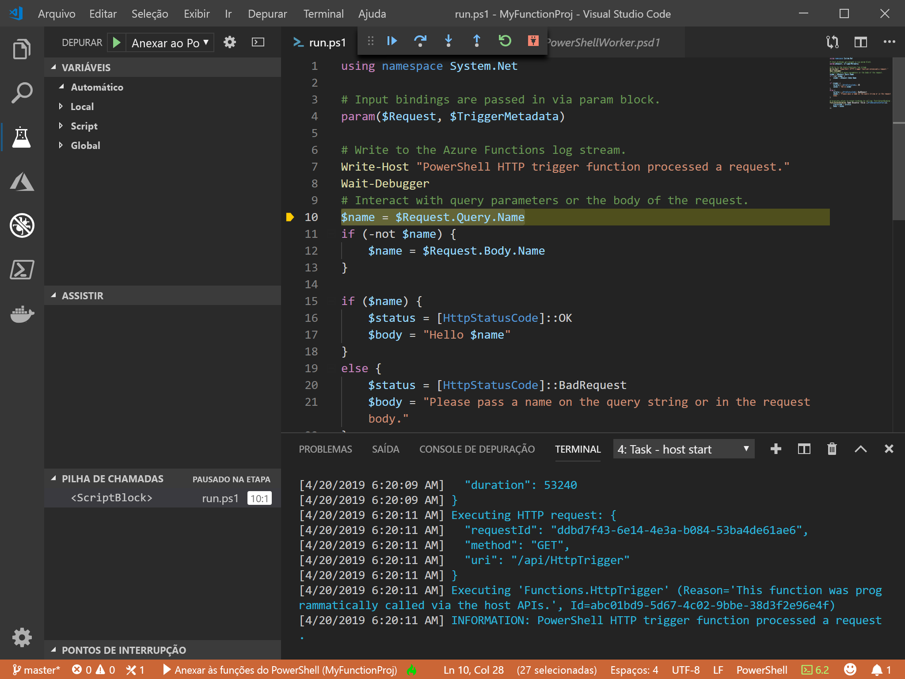
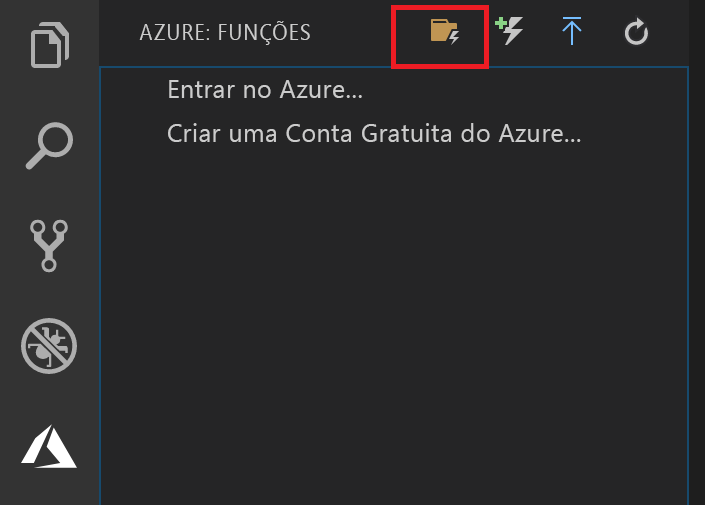
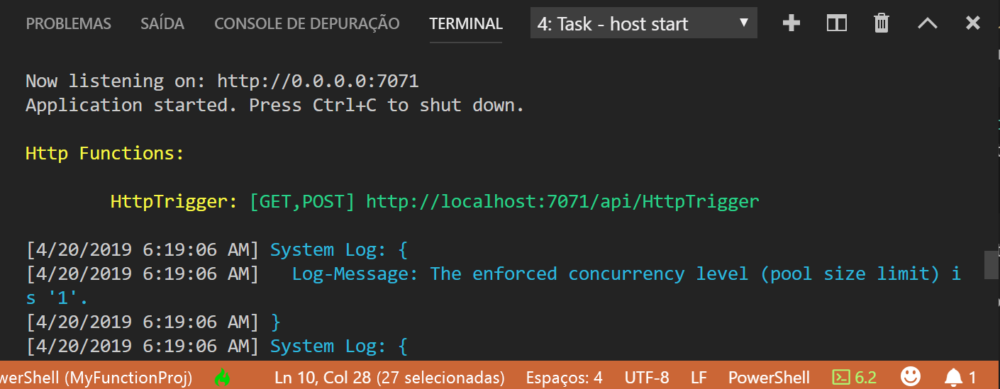

# <a name="create-your-first-powershell-function-in-azure-preview"></a>Criar sua primeira função do PowerShell no Azure (versão prévia)

[!INCLUDE [functions-powershell-preview-note](../../includes/functions-powershell-preview-note.md)]

Este artigo de Início Rápido explica como criar sua primeira função [sem servidor](https://azure.com/serverless) do PowerShell usando o Visual Studio Code.



Você usará a [Extensão Azure Functions para Visual Studio Code] para criar uma função do PowerShell localmente e, em seguida, implantá-la em um novo aplicativo de funções no Azure. Atualmente, a extensão está em versão prévia. Para obter mais informações, consulte a página da extensão [Extensão Azure Functions para Visual Studio Code].

> [!NOTE]  
> No momento, o suporte do PowerShell para a [extensão do Azure Functions][extensão azure functions para visual studio code] está desabilitado por padrão. A habilitação do suporte do PowerShell é uma das etapas deste artigo.

As etapas a seguir são compatíveis com macOS, Windows e sistemas operacionais baseados em Linux.

## <a name="prerequisites"></a>Pré-requisitos

Para concluir este guia de início rápido:

* Instale o [PowerShell Core](/powershell/scripting/install/installing-powershell-core-on-windows)

* Instale o [Visual Studio Code](https://code.visualstudio.com/) em uma das [plataformas compatíveis](https://code.visualstudio.com/docs/supporting/requirements#_platforms). 

* Instale a [extensão do PowerShell para Visual Studio Code](https://marketplace.visualstudio.com/items?itemName=ms-vscode.PowerShell).

* Instale o [SDK do .NET Core 2.2 e posterior](https://www.microsoft.com/net/download) (necessário para o Azure Functions Core Tools e disponível em todas as plataformas compatíveis).

* Instale a versão 2.x do [Azure Functions Core Tools](functions-run-local.md#v2).

* Você também precisará de uma assinatura ativa do Azure.

[!INCLUDE [quickstarts-free-trial-note](../../includes/quickstarts-free-trial-note.md)]

[!INCLUDE [functions-install-vs-code-extension](../../includes/functions-install-vs-code-extension.md)] 

## <a name="create-a-function-app-project"></a>Crie um projeto de aplicativo de funções

O modelo de projeto do Azure Functions no Visual Studio Code cria um projeto que pode ser publicado em um aplicativo de funções no Azure. Um aplicativo de funções permite a você agrupar funções como uma unidade lógica para o gerenciamento, implantação e compartilhamento de recursos. 

1. No Visual Studio Code, selecione o logotipo do Azure para exibir a área **Azure: Functions** e, em seguida, selecione o ícone Criar Projeto.

    

1. Escolha uma localização para seu workspace do projeto do Functions e escolha **Selecionar**.

    > [!NOTE]
    > Este artigo foi projetado para ser concluídas fora de um workspace. Nesse caso, não selecione uma pasta de projeto que faz parte de um workspace.

1. Selecione o **PowerShell (versão prévia)** como a linguagem do projeto de aplicativo de funções e, em seguida **Azure Functions v2**.

1. Escolha **Gatilho HTTP** como o modelo para sua primeira função, use `HTTPTrigger` como o nome da função e, em seguida, escolha um nível de autorização igual a **Função**.

    > [!NOTE]
    > O nível de autorização **Função** exige um valor de [chave de função](functions-bindings-http-webhook.md#authorization-keys) ao chamar o ponto de extremidade da função no Azure. Isso dificulta para outras pessoas chamarem a função.

1. Quando solicitado, escolha **Adicionar ao workspace**.

O Visual Studio Code cria o projeto de aplicativo de funções do PowerShell em um novo workspace. Esse projeto contém os arquivos de configuração [host.json](functions-host-json.md) e [local.settings.json](functions-run-local.md#local-settings-file), que se aplicam a toda a função no projeto. Esse [projeto do PowerShell](functions-reference-powershell.md#folder-structure) é o mesmo que um aplicativo de funções em execução no Azure.

## <a name="run-the-function-locally"></a>Executar a função localmente

O Azure Functions Core Tools é integrado ao Visual Studio Code para permitir que você execute e depure um projeto do Azure Functions localmente.  

1. Para depurar a função, insira uma chamada ao cmdlet [`Wait-Debugger`] no código da função antes de anexar o depurador e, em seguida, pressione F5 para iniciar o projeto de aplicativo de funções e anexar o depurador. A saída do Core Tools é exibida no painel **Terminal**.

1. No painel **Terminal**, copie o ponto de extremidade de URL da sua função disparada por HTTP.

    

1. Acrescente a cadeia de consulta `?name=<yourname>` a essa URL e, em seguida, use `Invoke-RestMethod` para executar a solicitação da seguinte maneira:

    ```powershell
    PS > Invoke-RestMethod -Method Get -Uri http://localhost:7071/api/HttpTrigger?name=PowerShell
    Hello PowerShell
    ```

    Você também pode executar a solicitação GET em um navegador.

    Quando você chama o ponto de extremidade do HttpTrigger sem passar um parâmetro `name` como um parâmetro de consulta ou no corpo, a função retorna um erro 500. Quando você examinar o código em run.ps1, verá que esse erro ocorre por design.

1. Para interromper a depuração, pressione Shift + F5.

Após verificar se a função foi executada corretamente no computador local, é hora de publicar o projeto no Azure.

> [!NOTE]
> Lembre-se de remover todas as chamadas a `Wait-Debugger` antes de publicar suas funções no Azure. 

> [!NOTE]
> A criação de um aplicativo de funções no Azure apenas solicitará o nome do aplicativo de funções. Defina azureFunctions.advancedCreation como verdadeiro para inserir todos os outros valores.

[!INCLUDE [functions-publish-project-vscode](../../includes/functions-publish-project-vscode.md)]

## <a name="test"></a>Executar a função no Azure

Para verificar se a função publicada é executada no Azure, execute o comando do PowerShell a seguir, substituindo o parâmetro `Uri` pela URL da função HTTPTrigger da etapa anterior. Como antes, acrescente a cadeia de consulta `&name=<yourname>` à URL, como no seguinte exemplo:

```powershell
PS > Invoke-WebRequest -Method Get -Uri "https://glengatest-vscode-powershell.azurewebsites.net/api/HttpTrigger?code=nrY05eZutfPqLo0som...&name=PowerShell"

StatusCode        : 200
StatusDescription : OK
Content           : Hello PowerShell
RawContent        : HTTP/1.1 200 OK
                    Content-Length: 16
                    Content-Type: text/plain; charset=utf-8
                    Date: Thu, 25 Apr 2019 16:01:22 GMT

                    Hello PowerShell
Forms             : {}
Headers           : {[Content-Length, 16], [Content-Type, text/plain; charset=utf-8], [Date, Thu, 25 Apr 2019 16:01:22 GMT]}
Images            : {}
InputFields       : {}
Links             : {}
ParsedHtml        : mshtml.HTMLDocumentClass
RawContentLength  : 16
```

## <a name="next-steps"></a>Próximas etapas

Você usou o Visual Studio Code para criar um aplicativo de funções do PowerShell com uma função simples disparada por HTTP. Talvez você também deseje saber mais sobre [como depurar uma função do PowerShell localmente](functions-debug-powershell-local.md) usando o Azure Functions Core Tools. Confira o [guia do desenvolvedor do PowerShell do Azure Functions](functions-reference-powershell.md).

> [!div class="nextstepaction"]
> [Habilitar a integração do Application Insights](functions-monitoring.md#manually-connect-an-app-insights-resource)

[Azure portal]: https://portal.azure.com
[Azure Functions Core Tools]: functions-run-local.md
[Extensão Azure Functions para Visual Studio Code]: https://marketplace.visualstudio.com/items?itemName=ms-azuretools.vscode-azurefunctions
[`Wait-Debugger`]: /powershell/module/microsoft.powershell.utility/wait-debugger?view=powershell-6
