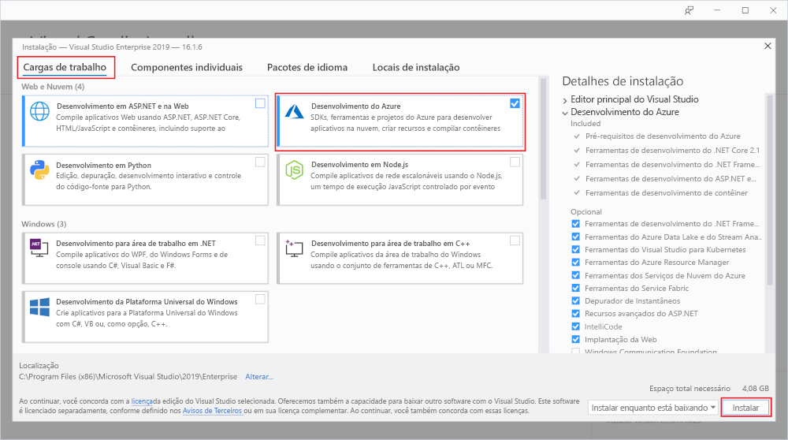

# Criar sua primeira função usando o Visual Studio

O Azure Functions lhe permite executar seu código em um ambiente [sem servidor](https://azure.microsoft.com/solutions/serverless/) sem que seja preciso primeiro criar uma VM ou publicar um aplicativo Web.

Neste artigo, você aprenderá a usar o Visual Studio 2019 para criar e testar localmente uma função “olá, mundo” e publicá-la no Azure. Este início rápido foi criado para o Visual Studio 2019. Ao criar um projeto do Functions usando o Visual Studio 2017, é necessário instalar primeiro as [ferramentas de Azure Functions mais recentes](functions-develop-vs.md#check-your-tools-version).

## Pré-requisitos

Para concluir este tutorial, é necessário instalar primeiro o [Visual Studio 2019](https://azure.microsoft.com/downloads/). Garanta que a carga de trabalho de **desenvolvimento do Azure** também seja instalada.

[!INCLUDE [quickstarts-free-trial-note](../../includes/quickstarts-free-trial-note.md)]

## Crie um projeto de aplicativo de funções

[!INCLUDE [Create a project using the Azure Functions template](../../includes/functions-vstools-create.md)]

O Visual Studio cria um projeto e uma classe que contém o código clichê do tipo de função do gatilho HTTP. O atributo `FunctionName` no método define o nome da função, que é `HttpTrigger` por padrão. O atributo `HttpTrigger` especifica que a função é disparada por uma solicitação HTTP. O código padronizado envia uma resposta HTTP que inclui um valor do corpo de solicitação ou da cadeia de consulta.

É possível estender as funcionalidades de sua função usando associações de entrada e de saída aplicando os atributos adequados ao método. Para obter mais informações, consulte a seção [Gatilhos e associações](functions-dotnet-class-library.md#triggers-and-bindings) da [referência do desenvolvedor C# do Azure Functions](functions-dotnet-class-library.md).

Agora que você criou o seu projeto de função e uma função disparada por HTTP, poderá testá-la em seu computador local.

## Executar a função localmente

O Visual Studio integra-se ao Azure Functions Core Tools para que você possa testar suas funções localmente usando o tempo de execução completo do Functions.  

[!INCLUDE [functions-run-function-test-local-vs](../../includes/functions-run-function-test-local-vs.md)]

Após verificar se a função foi executada corretamente no computador local, é hora de publicar o projeto no Azure.

## Publicar o projeto no Azure

Você deve ter um aplicativo de funções em sua assinatura do Azure antes de publicar seu projeto. A publicação do Visual Studio cria um aplicativo de funções para você na primeira vez que você publica seu projeto.

[!INCLUDE [Publish the project to Azure](../../includes/functions-vstools-publish.md)]

## Testar sua função no Azure

1. Copie a URL base do aplicativo de funções da página de perfil de publicação. Substitua a parte `localhost:port` da URL que você usou ao testar a função localmente pela nova URL base. Como anteriormente, acrescente o valor de cadeia de consulta `?name=<YOUR_NAME>` a essa URL e execute a solicitação.

    A URL que chama a função HTTP disparada deve ser no seguinte formato:

        http://<APP_NAME>.azurewebsites.net/api/<FUNCTION_NAME>?name=<YOUR_NAME> 

2. Cole essa nova URL para a solicitação HTTP na barra de endereços do navegador. O exemplo a seguir mostra a resposta no navegador à solicitação GET remota retornada pela função:

    

## Próximas etapas

Você usou o Visual Studio para criar e publicar um aplicativo de funções C# no Azure com uma função disparada por HTTP simples. Para saber mais sobre como desenvolver funções como bibliotecas de classes do .NET, consulte [Referência do desenvolvedor de C# do Azure Functions](functions-dotnet-class-library.md).

> [!div class="nextstepaction"]
> [Adicionar uma associação de fila do Armazenamento do Azure à sua função](functions-add-output-binding-storage-queue-vs.md)
