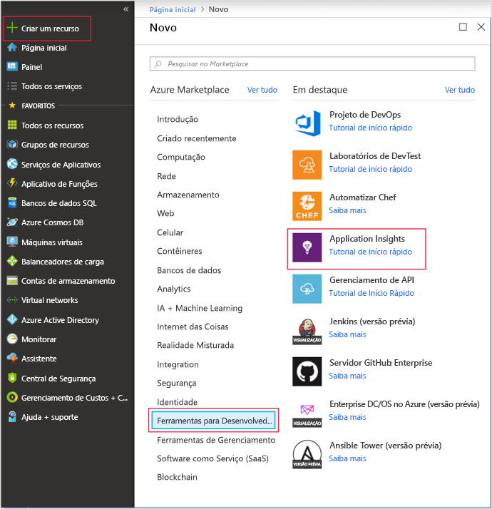
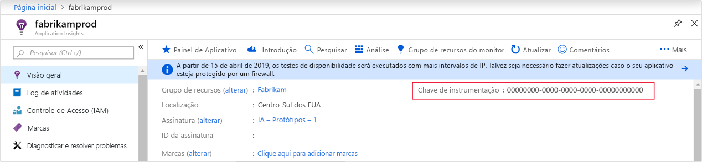
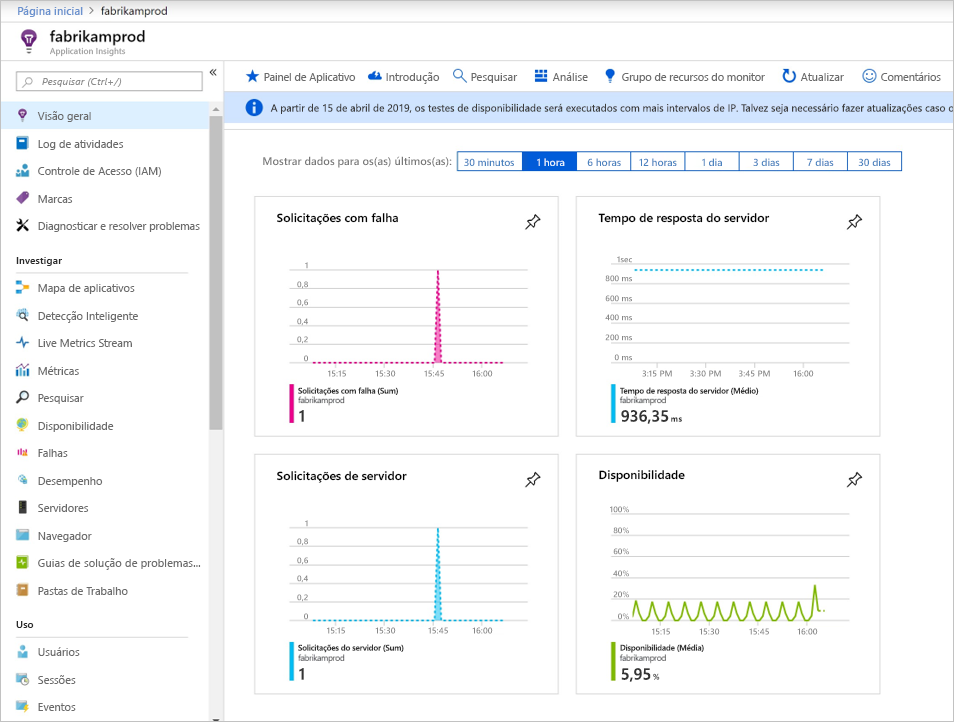
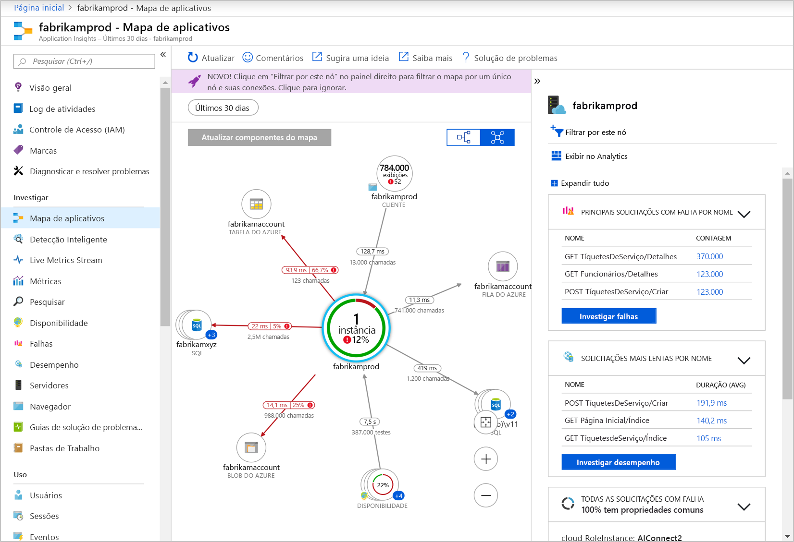
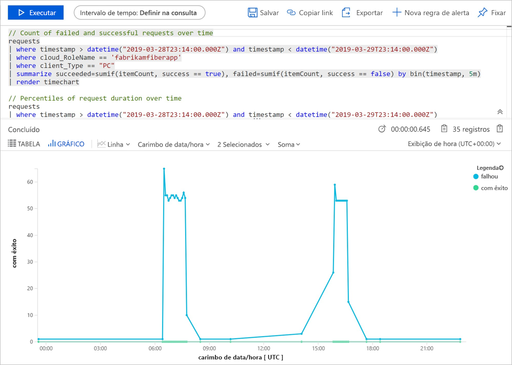
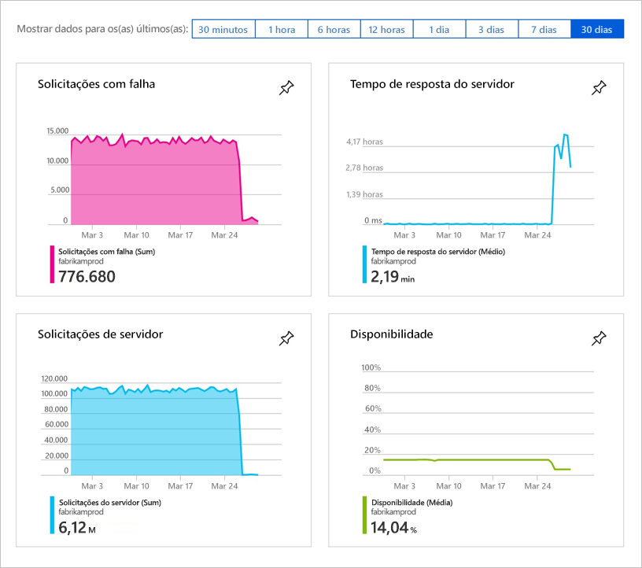
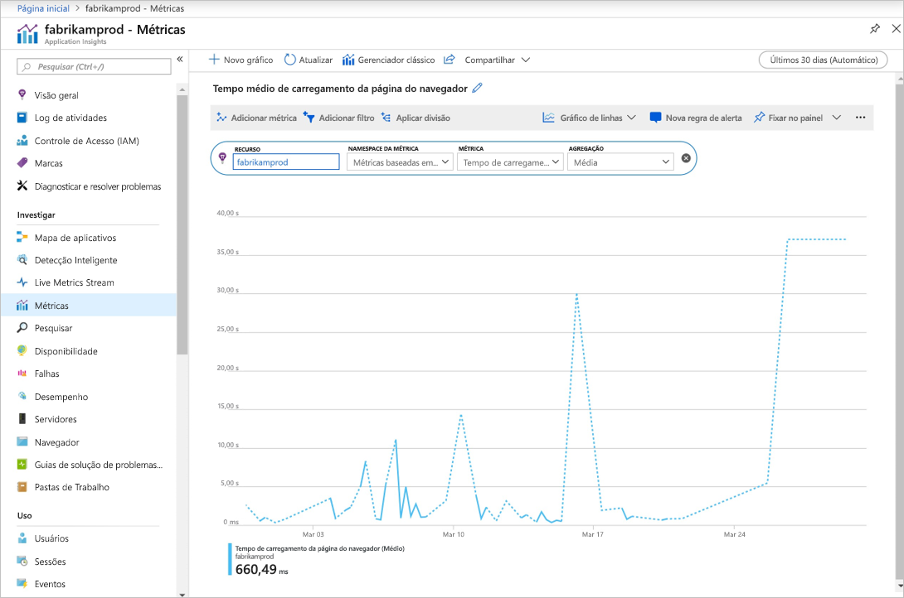

# <a name="start-monitoring-your-nodejs-web-application"></a>Começar a monitorar o aplicativo Web Node.js

Com o Azure Application Insights, você pode monitorar facilmente o aplicativo Web quanto à sua disponibilidade, desempenho e uso. Você também pode identificar e diagnosticar erros rapidamente em seu aplicativo sem esperar que um usuário os relate. Com a versão 0.20 do SDK em diante você pode monitorar pacotes comuns de terceiros, incluindo MongoDB, MySQL e Redis.

Este guia de início rápido lhe ajuda a adicionar o SDK do Application Insights versão 0.22 para Node.js a um aplicativo Web Node.js existente.

## <a name="prerequisites"></a>Pré-requisitos

Para concluir este guia de início rápido:

- Você precisará de uma assinatura do Azure e de um aplicativo Web Node.js existente.

Se você não tiver um aplicativo Web Node.js, você poderá criar um seguindo o [guia de início rápido Criar um aplicativo Web Node.js](https://docs.microsoft.com/azure/app-service/app-service-web-get-started-nodejs).

Se você não tiver uma assinatura do Azure, crie uma conta [gratuita](https://azure.microsoft.com/free/) antes de começar.

## <a name="sign-in-to-the-azure-portal"></a>Entre no Portal do Azure

Entre no [Portal do Azure](https://portal.azure.com/).

## <a name="enable-application-insights"></a>Habilitar o Application Insights

O Application Insights pode coletar dados de telemetria de qualquer aplicativo conectado à Internet, independentemente de ele estar sendo executado localmente ou na nuvem. Use as etapas a seguir para começar a exibir esses dados.

1. Selecione **Criar um recurso** > **Ferramentas de desenvolvedor** > **Application Insights**.

   

   > [!NOTE]
   >Se esta for a primeira vez criando um recurso do Application Insights, você pode aprender mais no documento [Criar um recurso do Application Insights](https://docs.microsoft.com/azure/azure-monitor/app/create-new-resource).

   Uma página de configuração é exibida. Use a tabela a seguir para preencher os campos de entrada. 

    | Configurações        | Valor           | DESCRIÇÃO  |
   | ------------- |:-------------|:-----|
   | **Nome**      | Valor Globalmente Exclusivo | Nome que identifica o aplicativo que você está monitorando |
   | **Tipo de Aplicativo** | Aplicativo Node.js | O tipo do aplicativo que você está monitorando |
   | **Localidade** | Leste dos EUA | Escolher uma localização perto de você ou perto onde seu aplicativo está hospedado |

2. Selecione **Criar**.

## <a name="configure-app-insights-sdk"></a>Configurar o SDK do Application Insights

1. Selecione **Visão Geral** e copie a **Chave de Instrumentação** do aplicativo.

   

2. Adicione o SDK do Application Insights para Node.js ao aplicativo. Da pasta raiz do seu aplicativo, execute:

   ```bash
   npm install applicationinsights --save
   ```

3. Edite o primeiro arquivo .js do seu aplicativo e adicione as duas linhas abaixo à parte superior do script. Se você estiver usando o [aplicativo de início rápido do Node.js](https://docs.microsoft.com/azure/app-service/app-service-web-get-started-nodejs), você deverá modificar o arquivo index.js. Substitua &lt;instrumentation_key&gt; pela chave de instrumentação do seu aplicativo. 

   ```JavaScript
   const appInsights = require('applicationinsights');
   appInsights.setup('<instrumentation_key>').start();
   ```

4. Reinicie o aplicativo.

> [!NOTE]
> Leva 3 a 5 minutos para que os dados comecem a aparecer no portal. Se esse aplicativo é um aplicativo de teste de baixo tráfego, tenha em mente que a maioria das métricas só são capturadas quando há operações ou solicitações ativas ocorrendo.

## <a name="start-monitoring-in-the-azure-portal"></a>Iniciar o monitoramento no Portal do Azure

1. Agora você pode reabrir a página **Visão Geral** do Application Insights no Portal do Azure, na qual você recuperou sua chave de instrumentação, para exibir detalhes sobre o seu aplicativo em execução atualmente.

   

2. Selecione **Mapa do aplicativo** para obter um layout visual das relações de dependência entre os componentes do aplicativo. Cada componente mostra KPIs como alertas, desempenho, falhas e carregamento.

   

3. Selecione o ícone **Análise do Aplicativo**  **Exibir no Analytics**.  Isso abre a **Análise do Application Insights**, que fornece uma linguagem de consulta avançada para analisar todos os dados coletados pelo Application Insights. Nesse caso, uma consulta que renderiza a contagem de solicitações como um gráfico é gerada para você. Você pode escrever suas próprias consultas para analisar outros dados.

   

4. Volte para a página **Visão geral** e examine os gráficos KPI.  Esse painel fornece estatísticas sobre a integridade do aplicativo, incluindo o número de solicitações de entrada, a duração dessas solicitações e as falhas que ocorrem.

   

   Para habilitar o gráfico **Tempo de Carregamento da Exibição de Página** para popular usando dados de **telemetria do lado do cliente**, adicione esse script a cada página que você desejar acompanhar:

   ```HTML
   <!-- 
   To collect user behavior analytics tools about your application, 
   insert the following script into each page you want to track.
   Place this code immediately before the closing </head> tag,
   and before any other scripts. Your first data will appear 
   automatically in just a few seconds.
   -->
   <script type="text/javascript">
     var appInsights=window.appInsights||function(config){
       function i(config){t[config]=function(){var i=arguments;t.queue.push(function(){t[config].apply(t,i)})}}var t={config:config},u=document,e=window,o="script",s="AuthenticatedUserContext",h="start",c="stop",l="Track",a=l+"Event",v=l+"Page",y=u.createElement(o),r,f;y.src=config.url||"https://az416426.vo.msecnd.net/scripts/a/ai.0.js";u.getElementsByTagName(o)[0].parentNode.appendChild(y);try{t.cookie=u.cookie}catch(p){}for(t.queue=[],t.version="1.0",r=["Event","Exception","Metric","PageView","Trace","Dependency"];r.length;)i("track"+r.pop());return i("set"+s),i("clear"+s),i(h+a),i(c+a),i(h+v),i(c+v),i("flush"),config.disableExceptionTracking||(r="onerror",i("_"+r),f=e[r],e[r]=function(config,i,u,e,o){var s=f&&f(config,i,u,e,o);return s!==!0&&t["_"+r](config,i,u,e,o),s}),t
       }({
           instrumentationKey:"<insert instrumentation key>"
       });
       
       window.appInsights=appInsights;
       appInsights.trackPageView();
   </script>
   ```

5. À esquerda, selecione **Métricas**. Use o Metrics Explorer para investigar a integridade e o uso do recurso. Selecione **Adicionar novo gráfico** para criar exibições personalizadas adicionais ou **Editar** para modificar a altura, a paleta de cores, os agrupamentos, as métricas e os tipos de gráficos existentes. Por exemplo, crie um gráfico que exibe o tempo médio de carregamento de página do navegador selecionando "Tempo de carregamento de página do navegador" no menu suspenso das métricas e "Média" da agregação. Para saber mais sobre o Azure Metrics Explorer, acesse [Introdução ao Azure Metrics Explorer](../../azure-monitor/platform/metrics-getting-started.md).

   

Para saber mais sobre como monitorar o Node.js, confira a [documentação adicional do Node.js do Application Insights](../../azure-monitor/app/nodejs.md).

## <a name="clean-up-resources"></a>Limpar recursos

Quando você terminar de testar, poderá excluir o grupo de recursos e todos os recursos relacionados. Para isso, siga as etapas abaixo.

1. No menu à esquerda no portal do Azure, selecione **Grupos de recursos** e, em seguida, selecione **myResourceGroup**.
2. Na página do grupo de recursos, selecione **Excluir**, insira **myResourceGroup** na caixa de texto e, em seguida, selecione **Excluir**.

## <a name="next-steps"></a>Próximas etapas

> [!div class="nextstepaction"]
> [Localizar e diagnosticar problemas de desempenho](https://docs.microsoft.com/azure/application-insights/app-insights-analytics)
