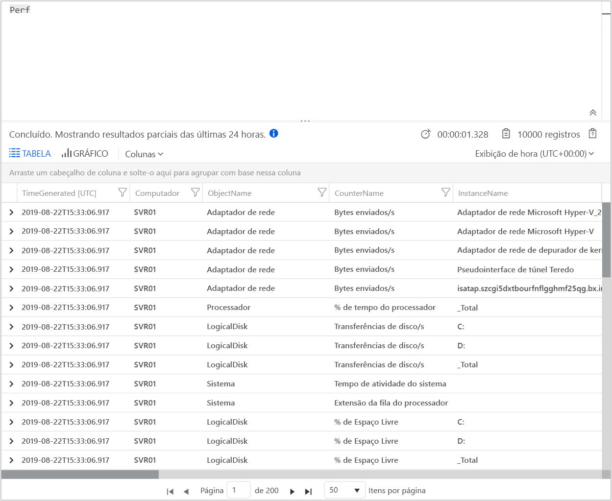

# Coletar dados de um computador Windows em um ambiente híbrido com o Azure Monitor

O [Azure Monitor](../overview.md) pode coletar dados diretamente dos computadores Windows físicos ou virtuais em seu ambiente em um único workspace do Log Analytics para correlação e análise detalhadas. A instalação do [agente do Log Analytics](../platform/log-analytics-agent.md) permite que o Azure Monitor colete dados de um datacenter ou de outro ambiente de nuvem. Este guia de início rápido mostra como configurar e coletar dados do computador Windows com algumas etapas simples. Para saber mais sobre VMs do Windows no Microsoft Azure, confira o tópico [Coletar dados sobre máquinas virtuais do Azure](../../azure-monitor/learn/quick-collect-azurevm.md).  

Para entender a configuração com suporte, confira os tópicos [Suporte para sistemas operacionais Windows](../../azure-monitor/platform/log-analytics-agent.md#supported-windows-operating-systems) e [Configuração de firewall de rede](../../azure-monitor/platform/log-analytics-agent.md#network-firewall-requirements).
 
Se você não tiver uma assinatura do Azure, crie uma [conta gratuita](https://azure.microsoft.com/free/?WT.mc_id=A261C142F) antes de começar.

## Entre no portal do Azure

Entre no Portal do Azure em [https://portal.azure.com](https://portal.azure.com). 

## Criar um workspace

1. No portal do Azure, clique em **Todos os serviços**. Na lista de recursos, digite **Log Analytics**. Quando você começa a digitar, a lista é filtrada com base em sua entrada. Pesquise **Espaços de trabalho do Log Analytics**.

       

2. Selecione **Criar** e, em seguida, selecione opções para os seguintes itens:

   * Forneça um nome para o novo **Espaço de Trabalho do Log Analytics**, como *DefaultLAWorkspace*.  
   * Selecione uma **Assinatura** a vincular escolhendo uma na lista suspensa, se a selecionada por padrão não é adequada.
   * Para **Grupo de Recursos**, selecione um grupo de recursos existente que contém uma ou mais máquinas virtuais do Azure.  
   * Selecione o **Local** no qual as VMs serão implantadas.  Para obter mais informações, consulte em quais [regiões o Log Analytics está disponível](https://azure.microsoft.com/regions/services/).
   * Se você estiver criando um workspace em uma nova assinatura feita depois de 2 de abril de 2018, ele usará o plano de preços *por GB* e a opção de selecionar um tipo de preço não estará disponível.  Se você estiver criando um workspace para uma assinatura existente feita antes de 2 de abril ou uma assinatura associada a uma inscrição de EA existente, selecione seu tipo de preço preferido.  Para obter mais informações sobre os tipos específicos, consulte [Detalhes de preço do Log Analytics](https://azure.microsoft.com/pricing/details/log-analytics/).
  
         

3. Depois de fornecer as informações necessárias no painel do **workspace do Log Analytics**, selecione **OK**.  

Enquanto as informações são verificadas e o workspace é criado, você pode acompanhar seu progresso no menu **Notificações**. 

## Obter a ID e a chave do workspace

Antes de instalar o agente do Log Analytics para Windows (também denominado MMA (Microsoft Monitoring Agent)), você precisa da ID do workspace e da chave do workspace do Log Analytics. O assistente de instalação exige essas informações para configurar adequadamente o agente e garantir que ele possa se comunicar com o Azure Monitor.  

1. No canto superior esquerdo do portal do Azure, selecione **Todos os serviços**. Na caixa de pesquisa, insira **Log Analytics**. A lista filtra com base em sua entrada, à medida que você digita. Escolha **workspaces do Log Analytics**.

2. Na lista de espaços de trabalho do Log Analytics, selecione o espaço de trabalho criado anteriormente. Você deve ter atribuído a ele o nome de **DefaultLAWorkspace**.

3. Selecione **Configurações avançadas**:

    
  
4. Selecione **Fontes Conectadas** e depois **Servidores Windows**.

5. Copie os valores à direita de **ID do workspace** e **Chave primária**. Cole-os em seu editor de preferência.

## Instalar o agente para Windows

As etapas a seguir servem para instalar e configurar o agente do Log Analytics no Microsoft Azure e no Azure Governamental. Você usará o programa de instalação do Microsoft Monitoring Agent para instalar o agente no computador.

1. Dando continuidade do conjunto anterior de etapas, vá até a página **Servidores Windows** e selecione a versão de **Download do Agente do Windows** que você deseja baixar. Selecione a versão adequada da arquitetura do processador do sistema operacional Windows.

2. Execute a Instalação para instalar o agente no seu computador.

3. Sobre o **boas-vindas** página, selecione **próxima**.

4. Na página **Termos de Licença**, leia a licença e selecione **Aceito**.

5. Na página **Pasta de Destino**, altere ou mantenha a pasta de instalação padrão e selecione **Avançar**.

6. Na página **Opções de configuração do agente**, conecte o agente ao Azure Log Analytics e selecione **Avançar**.

7. Na página do **Azure Log Analytics**, faça o seguinte:

   1. Cole a **ID do workspace** e a **Chave do workspace (chave primária)** que você copiou anteriormente. Caso o computador esteja subordinado a um espaço de trabalho do Log Analytics no Azure Governamental, selecione **Azure US Government** na lista do **Azure Cloud**.  
   2. Caso o computador precise se comunicar por meio de um servidor proxy ao serviço Log Analytics, selecione **Avançado** e forneça a URL e o número da porta do servidor proxy. Caso o servidor proxy exija autenticação, digite o nome de usuário e a senha para se autenticar com o servidor proxy, e selecione **Avançar**.  

8. Depois de adicionar as definições de configuração, selecione **Avançar**:

    

9. Na página **Pronto para Instalar**, examine suas escolhas e selecione **Instalar**.

10. Na página **Configuração concluída com êxito**, selecione **Concluir**.

Após concluir o processo de instalação e configuração, o Microsoft Monitoring Agent é exibido no Painel de Controle. Você pode examinar sua configuração e verificar se o agente está conectado ao workspace do Log Analytics. Quando está conectado, o agente exibe a seguinte mensagem na guia do **Azure Log Analytics**: **O Microsoft Monitoring Agent se conectou com êxito ao serviço de Log Analytics da Microsoft.**   

## Coletar dados de desempenho e eventos

O Azure Monitor pode coletar os eventos especificados dos logs de eventos do Windows e de contadores de desempenho para análise e geração de relatórios de longo prazo. Além disso, o recurso pode realizar uma ação quando detectar uma condição específica. Siga estas etapas para configurar a coleta de eventos do log de eventos do Windows e de vários contadores de desempenho comuns para começar.  

1. No canto superior esquerdo do portal do Azure, selecione **Mais serviços**. Na caixa de pesquisa, insira **Log Analytics**. A lista filtra com base em sua entrada, à medida que você digita. Escolha **workspaces do Log Analytics**.

2. Selecione **Configurações avançadas**:

    
 
3. Selecione **Dados** e, em seguida, **Logs de Eventos do Windows**.  

4. Para adicionar um novo log de eventos, digite o nome do log. Digite **Sistema** e, em seguida, selecione o sinal de adição ( **+** ).  

5. Selecione as severidades **Erro** e **Aviso** na tabela.

6. No início da página, selecione **Salvar**.

7. Selecione **Contadores de Desempenho do Windows** para habilitar a coleta de contadores de desempenho em um computador Windows.

8. Quando configura os contadores de desempenho do Windows para um novo espaço de trabalho do Log Analytics pela primeira vez, você tem a opção de criar rapidamente vários contadores comuns. Todas as opções são listadas com uma caixa de seleção ao lado de cada uma delas:

    .
    
    Selecione **Adicionar os contadores de desempenho selecionados**. Os contadores são adicionados e predefinidos com um intervalo de amostragem de coleta de dez segundos.

9. No início da página, selecione **Salvar**.

## Exibir dados coletados

Agora que você habilitou a coleta de dados, vamos executar uma pesquisa de logs simples para visualizar alguns dados do computador de destino.  

1. No workspace selecionado, no painel esquerdo, selecione **Logs**.

2. Na página de consulta de logs, digite `Perf` no editor de consulta e selecione **Executar**.
 
    

    Por exemplo, a consulta na imagem a seguir retornou 10 mil registros de desempenho. Os resultados serão significativamente menores.

    

## Limpar recursos

Quando não for mais necessário, você poderá remover o agente do computador e excluir o espaço de trabalho do Log Analytics.  

Para remover o agente, faça o seguinte:

1. Abra o Painel de Controle.

2. Abra **Programas e Recursos**.

3. Em **Programas e Recursos**, selecione **Microsoft Monitoring Agent** e selecione **Desinstalar**.

Para excluir o espaço de trabalho do Log Analytics criado anteriormente, selecione-o; em seguida, vá até a página de recursos e selecione **Excluir**:

## Próximas etapas

Agora que já está coletando dados operacionais e de desempenho do computador Windows, você pode facilmente começar a explorar, analisar e atuar em relação aos dados coletados *gratuitamente*.  

Para saber como exibir e analisar os dados, prossiga para o tutorial:

> [!div class="nextstepaction"]
> [Exibir ou analisar dados no Log Analytics](tutorial-viewdata.md)
