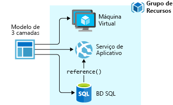
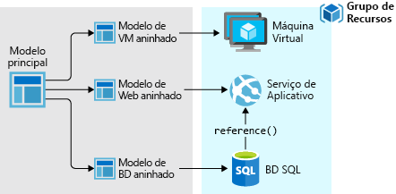
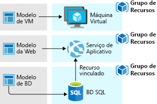

# <a name="azure-resource-manager-templates"></a>Modelos do Azure Resource Manager

Com Azure Resource Manager, você pode criar modelos que definem o que deseja implantar no Azure. O modelo é um arquivo JavaScript Object Notation (JSON) que contém a infraestrutura e a configuração da sua solução do Azure. Usando um modelo, você pode implantar a solução repetidamente em todo seu ciclo de vida e com a confiança de que seus recursos serão implantados em um estado consistente.

O modelo usa a sintaxe declarativa, que permite que você declare o que pretende implantar sem precisar escrever a sequência de comandos de programação para criá-lo. No modelo, você especifica os recursos a serem implantados e as propriedades desses recursos.

## <a name="benefits-of-resource-manager-templates"></a>Benefícios dos modelos do Resource Manager

Os modelos do Resource Manager fornecem vários benefícios:

* Você pode implantar, gerenciar e monitorar todos os recursos da sua solução como um grupo em vez de tratá-los individualmente.

* Você pode implantar a solução repetidamente em todo seu ciclo de vida de desenvolvimento e com a confiança de que seus recursos serão implantados em um estado consistente.

* Você pode gerenciar sua infraestrutura por meio de modelos declarativos em vez de scripts.

* Você pode definir as dependências entre os recursos para que eles sejam implantados na ordem correta.

As sugestões a seguir ajudarão você a aproveitar ao máximo o Gerenciador de Recursos quando estiver trabalhando com suas soluções.

* Defina e implante a sua infraestrutura através de sintaxe declarativa em modelos do Gerenciador de Recursos, e não de comandos imperativos.

* Defina todas as etapas de implantação e configuração no modelo. Você não deve ter nenhuma etapa manual para configurar sua solução.

* Execute comandos imperativos para gerenciar os recursos, como iniciar ou interromper um aplicativo ou máquina.

* Siga [as práticas recomendadas de Azure Resource Manager modelo](template-best-practices.md).

## <a name="template-deployment-process"></a>Processo de Implantação de modelo

Quando você implanta um modelo, o Resource Manager analisa o modelo e converte sua sintaxe em operações da API REST. Ele envia essas operações para os provedores de recursos apropriados. Por exemplo, quando o Gerenciador de Recursos recebe um modelo com a seguinte definição de recurso:

```json
"resources": [
  {
    "apiVersion": "2016-01-01",
    "type": "Microsoft.Storage/storageAccounts",
    "name": "mystorageaccount",
    "location": "westus",
    "sku": {
      "name": "Standard_LRS"
    },
    "kind": "Storage",
    "properties": {
    }
  }
]
```

Converte a definição para a seguinte operação de API REST, que é enviada para o provedor de recursos Microsoft.Storage:

```HTTP
PUT
https://management.azure.com/subscriptions/{subscriptionId}/resourceGroups/{resourceGroupName}/providers/Microsoft.Storage/storageAccounts/mystorageaccount?api-version=2016-01-01
REQUEST BODY
{
  "location": "westus",
  "properties": {
  }
  "sku": {
    "name": "Standard_LRS"
  },
  "kind": "Storage"
}
```

## <a name="template-structure"></a>Estrutura de modelo

Como você define grupos de recursos e modelos é de sua responsabilidade e de como você deseja gerenciar a sua solução. Por exemplo, você pode implantar seu aplicativo de três camadas por meio de um único modelo para um único grupo de recursos.



Mas, você não precisa definir toda a sua infraestrutura em um único modelo. Muitas vezes, faz sentido dividir seus requisitos de implantação em um conjunto de modelos com destinação e fins específicos. Você pode reutilizar esses modelos facilmente para soluções diferentes. Para implantar uma solução específica, você deve criar um modelo mestre que vincule todos os modelos necessários. A imagem a seguir mostra como implantar uma solução de três camadas com o modelo pai que inclui três modelos aninhados.



Ao prever suas camadas com ciclos de vida separados, você pode implantar os três níveis para separar grupos de recursos. Observe que os recursos ainda podem ser vinculados aos recursos em outros grupos de recursos.



Para obter informações sobre modelos aninhados, confira [Usando modelos vinculados com o Azure Resource Manager](resource-group-linked-templates.md).

O Azure Resource Manager analisa as dependências para garantir que os recursos sejam criados na ordem correta. Se um recurso depende de um valor de outro recurso (como uma máquina virtual que precisa de uma conta de armazenamento para discos), você pode definir uma dependência. Para saber mais, confira [Definindo as dependências nos modelos do Gerenciador de Recursos do Azure](resource-group-define-dependencies.md).

Você também pode usar o modelo para atualizações de infraestrutura. Por exemplo, você pode adicionar um recurso à sua solução e adicionar regras de configuração para os recursos que já foram implantados. Se o modelo definir um recurso que já existe, o Resource Manager atualizará o recurso existente em vez de criar um novo.

O Gerenciador de Recursos fornece extensões para cenários que precisam de operações adicionais, como a instalação de um software específico que não está incluído na configuração. Se você já estiver usando um serviço de gerenciamento de configuração, como DSC, Chef ou Puppet, poderá continuar trabalhando com esse serviço usando as extensões. Para obter informações sobre extensões de máquina virtual, confira [Sobre recursos e extensões de máquina virtual](../virtual-machines/windows/extensions-features.md?toc=%2fazure%2fvirtual-machines%2fwindows%2ftoc.json).

Quando você cria uma solução no Portal, ela inclui automaticamente um modelo de implantação. Você não precisa criar seu modelo do zero, pois é possível iniciar com o modelo da sua solução e personalizá-lo para atender às suas necessidades específicas. Para obter uma amostra, confira [Início Rápido: Crie e implante modelos do Azure Resource Manager usando o portal do Azure](./resource-manager-quickstart-create-templates-use-the-portal.md). Você também pode recuperar um modelo de um grupo de recursos existente exportando o estado atual do grupo de recursos ou exibindo o modelo usado para determinada implantação. A exibição do [modelo exportado](./manage-resource-groups-portal.md#export-resource-groups-to-templates) é uma maneira útil de saber mais sobre a sintaxe do modelo.

Finalmente, o modelo se torna parte do código-fonte do seu aplicativo. Você pode adicioná-lo ao repositório de código-fonte e atualizá-lo conforme a evolução de seu aplicativo. Você pode editar o modelo com o Visual Studio.

## <a name="next-steps"></a>Próximas etapas

Para obter mais informações sobre arquivos de modelo, consulte [entender a estrutura e a sintaxe de modelos de Azure Resource Manager](resource-group-authoring-templates.md).

Depois de definir o modelo, você está pronto para implantar os recursos para o Azure. Para implantar os recursos, confira:

* [Implantar recursos com modelos do Resource Manager e o Azure PowerShell](resource-group-template-deploy.md)
* [Implantar recursos com modelos do Resource Manager e a CLI do Azure](resource-group-template-deploy-cli.md)
* [Implantar recursos com modelos do Resource Manager e o portal do Azure](resource-group-template-deploy-portal.md)
* [Implantar recursos com modelos do Resource Manager e a API REST do Resource Manager](resource-group-template-deploy-rest.md)

