# <a name="creating-and-deploying-azure-resource-groups-through-visual-studio"></a>Criação e implantação de grupos de recurso do Azure por meio do Visual Studio

Com o Visual Studio, você pode criar um projeto que implementa sua infraestrutura e o código no Azure. Por exemplo, você pode implantar o host da Web, o site da Web e o código para o site da Web. O Visual Studio fornece muitos modelos iniciais diferentes para implantar cenários comuns. Neste artigo, você implanta um aplicativo Web.  

Este artigo mostra como usar o [Visual Studio 2019 ou posterior com as cargas de trabalho de desenvolvimento do Azure e ASP.NET instaladas](/visualstudio/install/install-visual-studio?view=vs-2019). Se você usar o Visual Studio 2017, sua experiência será basicamente a mesma.

## <a name="create-azure-resource-group-project"></a>Criar um projeto do Grupo de Recursos do Azure

Nesta seção, você cria um projeto do Grupo de Recursos do Azure com um modelo do **Aplicativo Web**.

1. No Visual Studio, escolha **Arquivo**, **Novo** e **Projeto**. Selecione o modelo de projeto **Grupo de Recursos do Azure** e **Avançar**.

    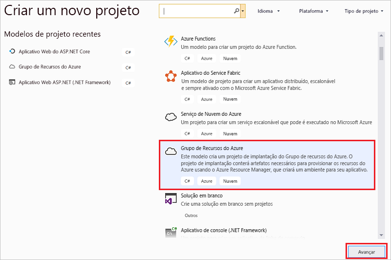

1. Dê um nome ao seu projeto. As outras configurações padrão provavelmente não precisam ser modificadas, mas é bom revisá-las para verificar se funcionam para seu ambiente. Ao terminar, selecione **Criar**.

    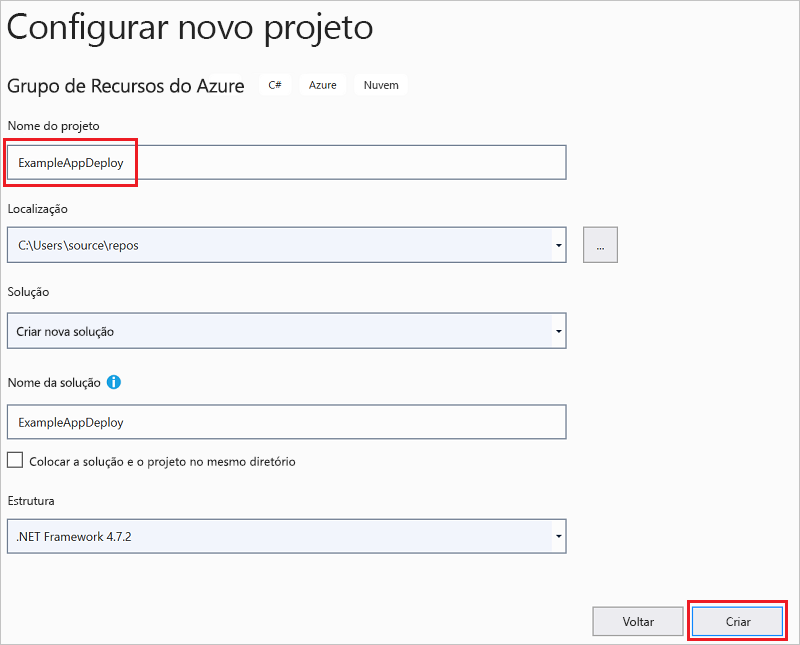

1. Escolha o modelo que você deseja implantar no Azure Resource Manager. Observe que há várias opções diferentes com base no tipo de projeto que você deseja implantar. Para os fins deste artigo, escolha o modelo **Aplicativo Web** e **OK**.

    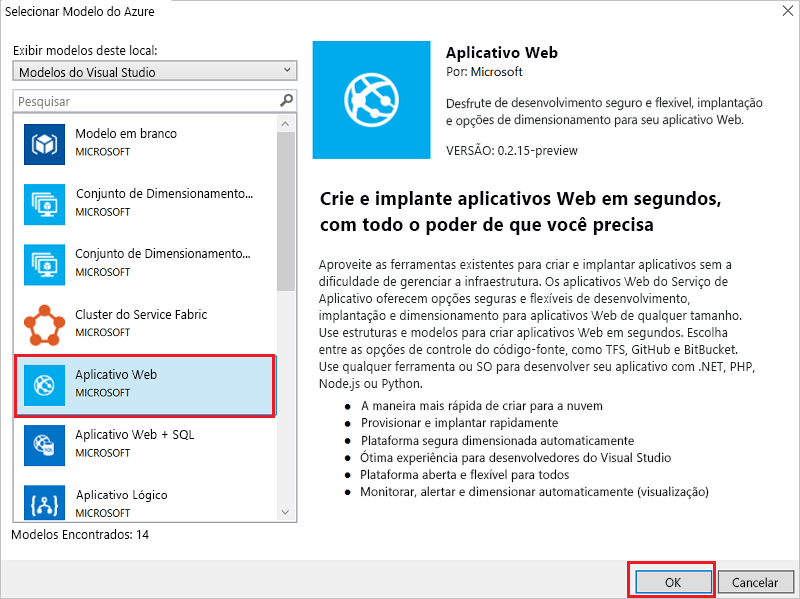

    O modelo que você escolhe é apenas um ponto de partida. Você pode adicionar e remover os recursos para atender a seu cenário.

1. O Visual Studio cria um projeto de implantação do grupo de recursos para o aplicativo Web. Para ver os arquivos do seu projeto, examine o nó no projeto de implantação.

    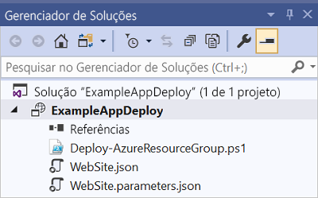

    Como você escolheu o modelo de aplicativo Web, os seguintes arquivos serão exibidos:

   | Nome do arquivo | DESCRIÇÃO |
   | --- | --- |
   | Deploy-AzureResourceGroup.ps1 |Um script do PowerShell que executa comandos do PowerShell a implantar para o Azure Resource Manager. O Visual Studio usa esse script do PowerShell para implantar seu modelo. |
   | WebSite.json |O modelo do Resource Manager que define a infraestrutura que você deseja implantar no Azure e os parâmetros que você pode fornecer durante a implantação. Também define as dependências entre os recursos para que o Resource Manager implante-os na ordem correta. |
   | WebSite.parameters.json |Um arquivo de parâmetros que contém os valores necessários ao modelo. Você passa os valores do parâmetro para personalizar cada implantação. |

    Todos os projetos de implantação do grupo de recursos do Azure contêm esses arquivos básicos. Outros projetos podem conter arquivos adicionais para dar suporte a outras funcionalidades.

## <a name="customize-resource-manager-template"></a>Personalizar o modelo do Resource Manager

É possível personalizar um projeto de implantação modificando os modelos do Resource Manager que descrevem os recursos que você deseja implantar. Para saber mais sobre os elementos do modelo do Gerenciador de Recursos, confira [Criando modelos do Azure Resource Manager](resource-group-authoring-templates.md).

1. Para trabalhar no seu modelo, abra o **WebSite.json**.

1. O editor do Visual Studio fornece ferramentas para ajudá-lo a editar o modelo do Resource Manager. A janela **Estrutura de Tópicos JSON** facilita ver os elementos definidos no modelo.

   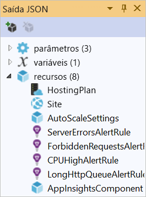

1. Selecione um elemento na estrutura de tópicos para ir até essa parte do modelo.

   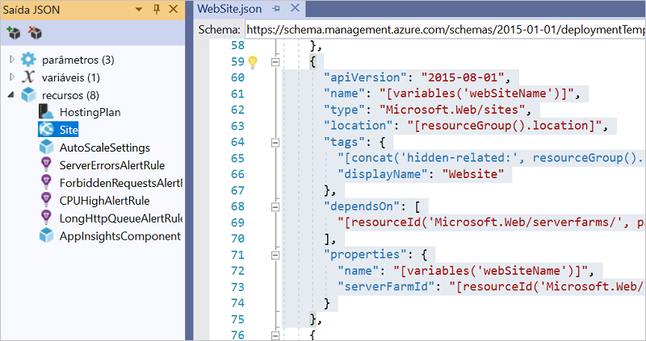

1. Você pode adicionar um recurso selecionando o botão **Adicionar Recurso** na parte superior da janela Estrutura de Tópicos JSON ou clicando com o botão direito em **recursos** e selecionando **Adicionar Novo Recurso**.

   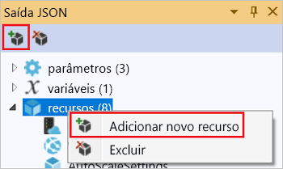

1. Selecione **Conta de Armazenamento** e forneça um nome a ela. Forneça um nome que não tenha mais de 11 caracteres e contenha apenas números e letras minúsculas.

   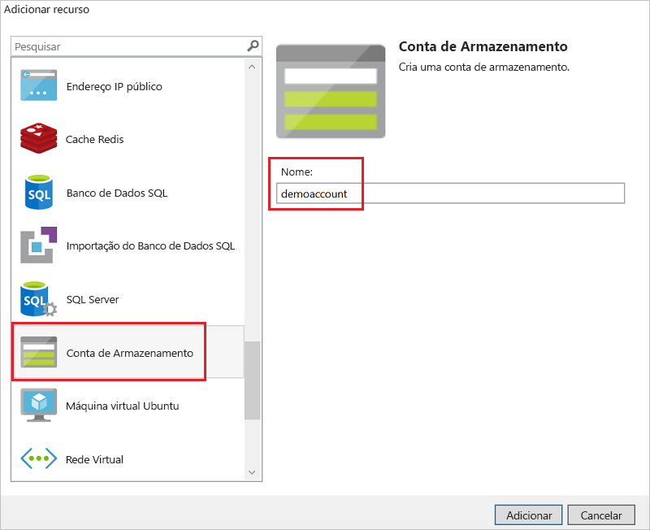

1. Observe que não só foi adicionado o recurso, mas também um parâmetro para o tipo da conta de armazenamento e uma variável para o nome da conta de armazenamento.

   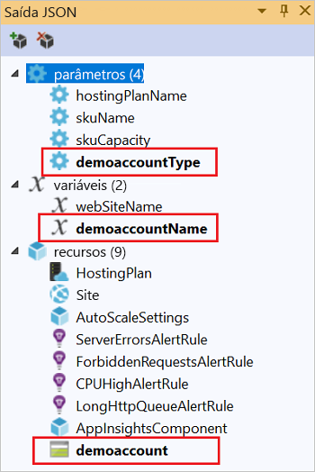

1. O parâmetro para o tipo de conta de armazenamento é predefinido com tipos permitidos e um tipo padrão. Você pode deixar esses valores ou editá-los para seu cenário. Se você não quiser permitir que alguém implante uma conta de armazenamento **Premium_LRS** com esse modelo, remova-o dos tipos permitidos.

   ```json
   "demoaccountType": {
     "type": "string",
     "defaultValue": "Standard_LRS",
     "allowedValues": [
       "Standard_LRS",
       "Standard_ZRS",
       "Standard_GRS",
       "Standard_RAGRS"
     ]
   }
   ```

1. O Visual Studio também fornece o intellisense para ajudá-lo a entender as propriedades que estão disponíveis ao editar o modelo. Por exemplo, para editar as propriedades de seu plano do Serviço de Aplicativo, navegue até o recurso **HostingPlan** e adicione um valor para as **propriedades**. Observe que o intellisense mostra os valores disponíveis e fornece uma descrição desse valor.

   

   Você pode definir **numberOfWorkers** como 1 e salvar o arquivo.

   ```json
   "properties": {
     "name": "[parameters('hostingPlanName')]",
     "numberOfWorkers": 1
   }
   ```

1. Abra o arquivo **WebSite.parameters.json**. Você usa o arquivo de parâmetros para passar valores durante a implantação que personalizam o recurso que está sendo implantado. Dê um nome ao plano de hospedagem e salve o arquivo.

   ```json
   {
     "$schema": "https://schema.management.azure.com/schemas/2015-01-01/deploymentParameters.json#",
     "contentVersion": "1.0.0.0",
     "parameters": {
       "hostingPlanName": {
         "value": "demoHostPlan"
       }
     }
   }
   ```

## <a name="deploy-project-to-azure"></a>Implantar projeto no Azure

Agora, você está pronto para implantar seu projeto em um grupo de recursos.

Por padrão, o script do PowerShell (Deploy-AzureResourceGroup.ps1) no projeto usa o módulo AzureRM. Se você ainda tiver o módulo AzureRM instalado e deseja continuar usando-o, será possível usar esse script padrão. Com esse script, é possível usar a interface do Visual Studio para implantar sua solução.

No entanto, se você já migrou para o novo [módulo Az](/powershell/azure/new-azureps-module-az), será preciso adicionar um novo script ao seu projeto. Para adicionar um script que usa o módulo Az, copie o script [Deploy-AzTemplate.ps1](https://github.com/Azure/azure-quickstart-templates/blob/master/Deploy-AzTemplate.ps1) e adicione-o ao seu projeto. Para usar esse script para implantação, você deve executá-lo de um console do PowerShell, em vez de usar a interface de implantação do Visual Studio.

As duas abordagens são mostradas neste artigo. Este artigo refere-se ao script padrão como o script do módulo AzureRM e ao novo script como o script do módulo Az.

### <a name="az-module-script"></a>Script do módulo Az

Para o script do módulo Az, abra um console do PowerShell e execute:

```powershell
.\Deploy-AzTemplate.ps1 -ArtifactStagingDirectory . -Location centralus -TemplateFile WebSite.json -TemplateParametersFile WebSite.parameters.json
```

### <a name="azurerm-module-script"></a>Script do módulo AzureRM

Para o script do módulo AzureRM, use o Visual Studio:

1. No menu de atalho do nó do projeto de implantação, escolha **Implantar** > **Novo**.

    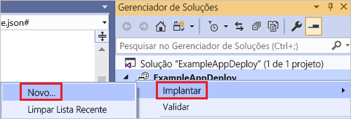

1. A caixa de diálogo **Implantar no Grupo de Recursos** é exibida. Na caixa suspensa de **Grupo de recursos**, escolha um grupo de recursos existente ou crie um novo. Selecione **Implantar**.

    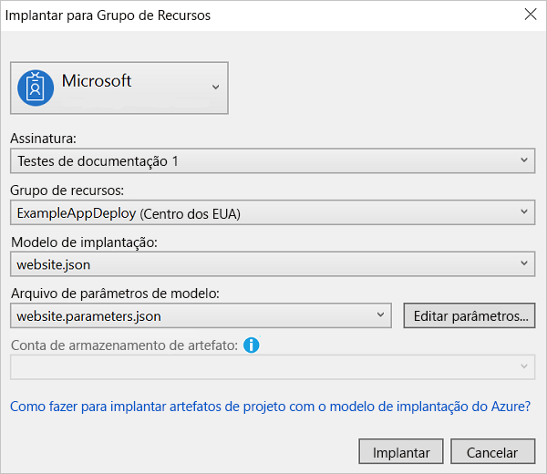

1. Nas janelas de **Saída**, confira o status da implantação. Quando a implantação tiver sido concluída, a última mensagem indicará uma implantação bem-sucedida com algo semelhante a:

   ```output
   18:00:58 - Successfully deployed template 'website.json' to resource group 'ExampleAppDeploy'.
   ```

## <a name="view-deployed-resources"></a>Exibir recursos implantados

Vamos verificar os resultados.

1. Em um navegador, abra o [Portal do Azure](https://portal.azure.com/) e entre em sua conta. Para ver o grupo de recursos, selecione **Grupos de recursos** e o grupo de recursos implantado.

1. Você verá todos os recursos implantados. Observe que o nome da conta de armazenamento não é exatamente o que você especificou ao adicionar esse recurso. A conta de armazenamento deve ser exclusiva. O modelo adiciona automaticamente uma cadeia de caracteres ao nome fornecido a fim de criar um nome exclusivo.

    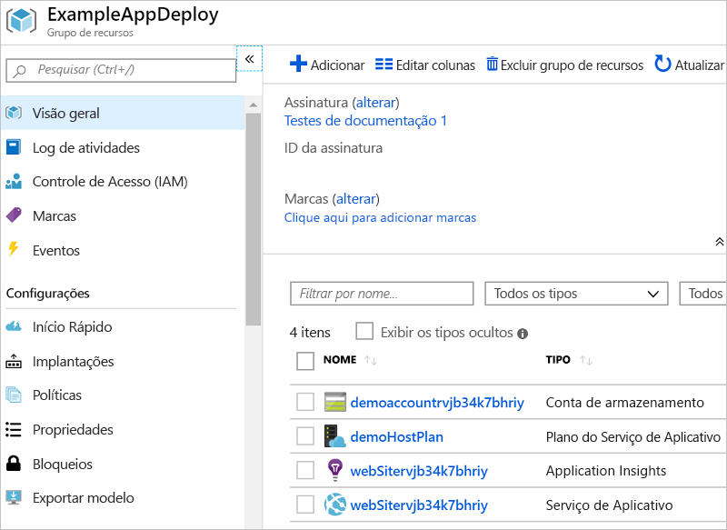

## <a name="add-code-to-project"></a>Adicionar código ao projeto

Neste ponto, você implantou a infraestrutura de seu aplicativo, mas não há nenhum código real implantado com o projeto.

1. Adicione esse projeto à sua solução do Visual Studio. Clique com o botão direito na solução e selecione **Adicionar** > **Novo Projeto**.

    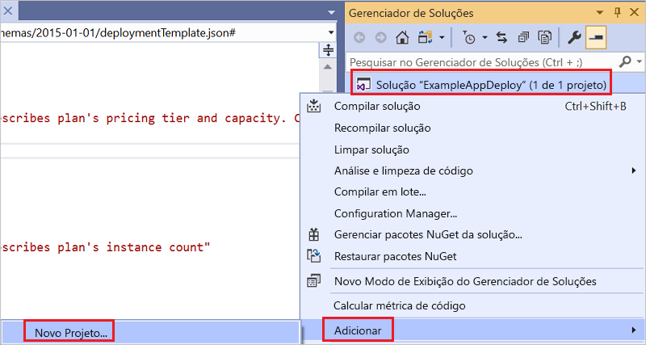

1. Adicione um **Aplicativo Web ASP.NET Core**.

    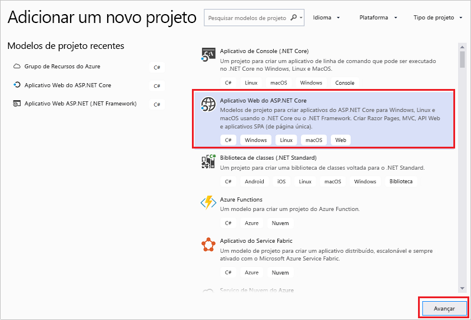

1. Dê um nome ao seu aplicativo Web e, em seguida, selecione **Criar**.

    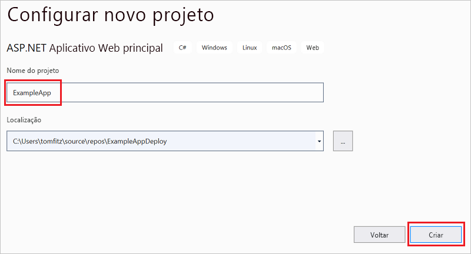

1. Selecione **Aplicativo Web** e **Criar**.

    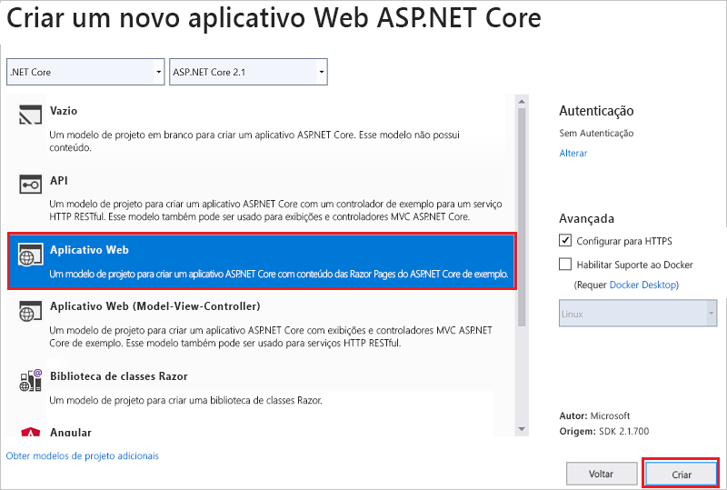

1. Depois que o Visual Studio criar seu aplicativo Web, você poderá ver os dois projetos na solução.

    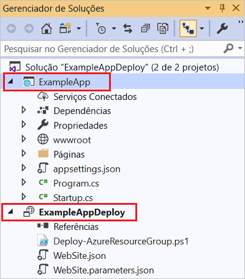

1. Agora, você precisa certificar-se de que seu projeto de grupo de recursos esteja ciente do novo projeto. Volte ao seu projeto de grupo de recursos (ExampleAppDeploy). Clique com botão direito do mouse em **Referências** e selecione **Adicionar Referência**.

    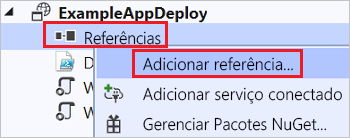

1. Selecione o projeto de aplicativo Web que você criou.

   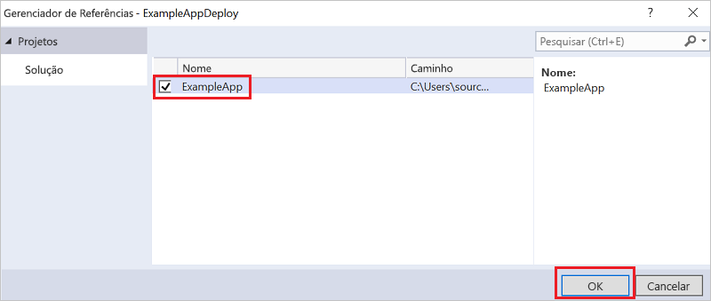

   Adicionando uma referência, você vincula o projeto do aplicativo Web ao projeto do grupo de recursos e define automaticamente algumas propriedades. Confira essas propriedades na janela **Propriedades** da referência. A opção **Incluir Caminho do Arquivo** contém o caminho onde o pacote é criado. Observe a pasta (ExampleApp) e o arquivo (package.zip). Você precisa saber esses valores porque os fornece como parâmetros ao implantar o aplicativo.

   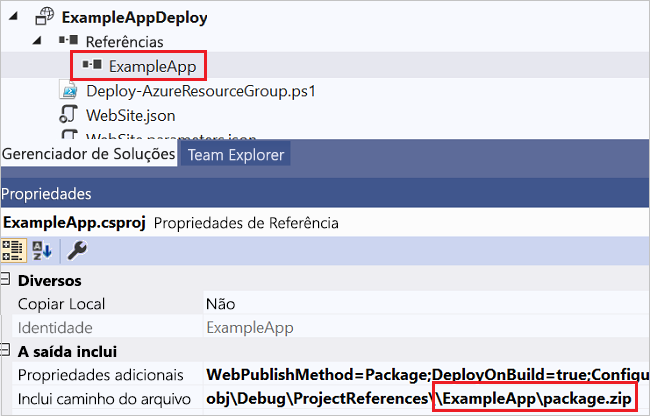

1. Volte para o seu modelo (WebSite.json) e adicione um recurso ao modelo.

    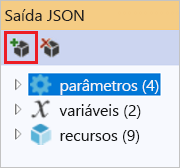

1. Dessa vez, selecione **Implantação da Web para aplicativos Web**. 

    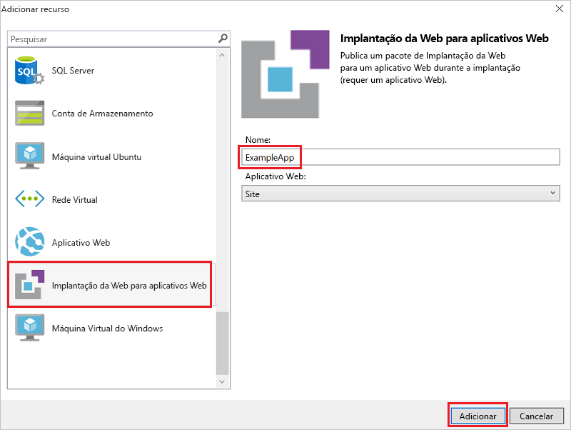

   Salve o modelo.

1. Existem alguns parâmetros novos no seu modelo. Eles foram adicionados na etapa anterior. Você não precisa fornecer valores para **_artifactsLocation** ou **_artifactsLocationSasToken**, pois esses valores são gerados automaticamente. No entanto, você deve definir o nome de arquivo e pasta para o caminho que contém o pacote de implantação. Os nomes desses parâmetros terminam com **PackageFolder** e **PackageFileName**. A primeira parte do nome é o nome do recurso Implantação da Web que você adicionou. Neste artigo, eles são denominados **ExampleAppPackageFolder** e **ExampleAppPackageFileName**. 

   Abra **Website.parameters.json** e defina esses parâmetros para os valores que você viu nas propriedades da referência. Defina **ExampleAppPackageFolder** para o nome da pasta. Defina **ExampleAppPackageFileName** para o nome do arquivo zip.

   ```json
   {
     "$schema": "https://schema.management.azure.com/schemas/2015-01-01/deploymentParameters.json#",
     "contentVersion": "1.0.0.0",
     "parameters": {
       "hostingPlanName": {
         "value": "demoHostPlan"
       },
       "ExampleAppPackageFolder": {
         "value": "ExampleApp"
       },
       "ExampleAppPackageFileName": {
         "value": "package.zip"
       }
     }
   }
   ```

## <a name="deploy-code-with-infrastructure"></a>Implantar código com infraestrutura

Como você adicionou código ao projeto, a implantação é um pouco diferente dessa vez. Durante a implantação, você prepara artefatos do seu projeto em um lugar que o Resource Manager possa acessar. Os artefatos são preparados para uma conta de armazenamento.

### <a name="az-module-script"></a>Script do módulo Az

Será preciso fazer uma pequena alteração no seu modelo se você estiver usando o script do módulo Az. Esse script adiciona uma barra "/" ao local dos artefatos, mas seu modelo não espera essa barra. Abra o WebSite.json e encontre as propriedades para a extensão MSDeploy. Ele tem uma propriedade chamada **packageUri**. Remova a barra entre o local dos artefatos e a pasta do pacote.

Sua aparência deve ser parecida com esta:

```json
"packageUri": "[concat(parameters('_artifactsLocation'), parameters('ExampleAppPackageFolder'), '/', parameters('ExampleAppPackageFileName'), parameters('_artifactsLocationSasToken'))]",
```

Observe que no exemplo anterior não há `'/',` entre **parameters('_artifactsLocation')** e **parameters('ExampleAppPackageFolder')** .

Recompile o projeto. Compilar o projeto garante que os arquivos que precisam ser implantados sejam adicionados à pasta de preparo.

Agora, abra um console do PowerShell e execute:

```powershell
.\Deploy-AzTemplate.ps1 -ArtifactStagingDirectory .\bin\Debug\staging\ExampleAppDeploy -Location centralus -TemplateFile WebSite.json -TemplateParametersFile WebSite.parameters.json -UploadArtifacts -StorageAccountName <storage-account-name>
```

### <a name="azurerm-module-script"></a>Script do módulo AzureRM

Para o script do módulo AzureRM, use o Visual Studio:

1. Para reimplantar, escolha **Implantar** e o grupo de recursos implantado anteriormente.

    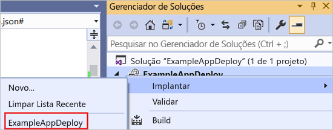

1. Selecione a conta de armazenamento que você implantou com esse grupo de recursos para a **Conta de armazenamento de artefato**.

   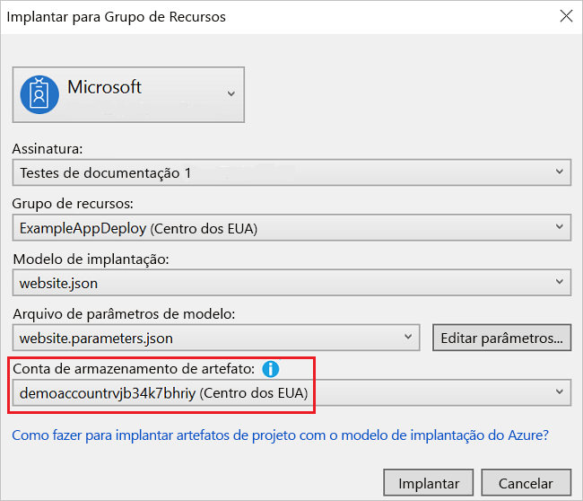

## <a name="view-web-app"></a>Exibir aplicativo Web

1. Após a conclusão da implantação, selecione seu aplicativo Web no portal. Clique na URL para navegar até o site.

   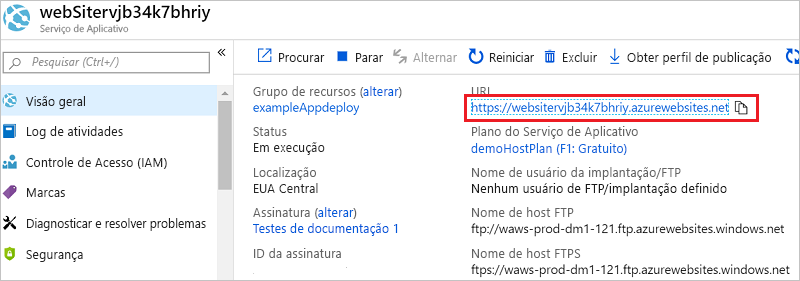

1. Observe que você implantou o aplicativo ASP.NET padrão com êxito.

   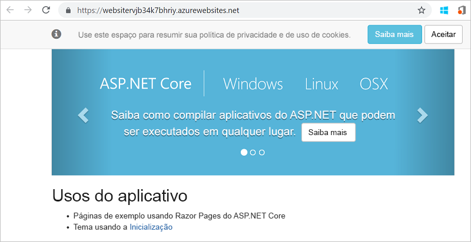

## <a name="add-operations-dashboard"></a>Adicionar painel de operações

Você não está limitado apenas aos recursos disponíveis por meio da interface do Visual Studio. Você pode personalizar sua implantação adicionando um recurso personalizado ao seu modelo. Para mostrar a adição de um recurso, adicione um painel operacional para gerenciar o recurso implantado.

1. Abra o arquivo WebSite.json e adicione o JSON a seguir após o recurso da conta de armazenamento, mas antes do `]` de fechamento da seção de recursos.

   ```json
    ,{
      "properties": {
        "lenses": {
          "0": {
            "order": 0,
            "parts": {
              "0": {
                "position": {
                  "x": 0,
                  "y": 0,
                  "colSpan": 4,
                  "rowSpan": 6
                },
                "metadata": {
                  "inputs": [
                    {
                      "name": "resourceGroup",
                      "isOptional": true
                    },
                    {
                      "name": "id",
                      "value": "[resourceGroup().id]",
                      "isOptional": true
                    }
                  ],
                  "type": "Extension/HubsExtension/PartType/ResourceGroupMapPinnedPart"
                }
              },
              "1": {
                "position": {
                  "x": 4,
                  "y": 0,
                  "rowSpan": 3,
                  "colSpan": 4
                },
                "metadata": {
                  "inputs": [],
                  "type": "Extension[azure]/HubsExtension/PartType/MarkdownPart",
                  "settings": {
                    "content": {
                      "settings": {
                        "content": "__Customizations__\n\nUse this dashboard to create and share the operational views of services critical to the application performing. To customize simply pin components to the dashboard and then publish when you're done. Others will see your changes when you publish and share the dashboard.\n\nYou can customize this text too. It supports plain text, __Markdown__, and even limited HTML like images  and <a href='https://azure.microsoft.com' target='_blank'>links</a> that open in a new tab.\n",
                        "title": "Operations",
                        "subtitle": "[resourceGroup().name]"
                      }
                    }
                  }
                }
              }
            }
          }
        },
        "metadata": {
          "model": {
            "timeRange": {
              "value": {
                "relative": {
                  "duration": 24,
                  "timeUnit": 1
                }
              },
              "type": "MsPortalFx.Composition.Configuration.ValueTypes.TimeRange"
            }
          }
        }
      },
      "apiVersion": "2015-08-01-preview",
      "name": "[concat('ARM-',resourceGroup().name)]",
      "type": "Microsoft.Portal/dashboards",
      "location": "[resourceGroup().location]",
      "tags": {
        "hidden-title": "[concat('OPS-',resourceGroup().name)]"
      }
    }
   ```

1. Reimplante seu projeto.

1. Depois que a implantação for concluída, exiba o painel no portal. Selecione **Painel** e escolha o que você implantou.

   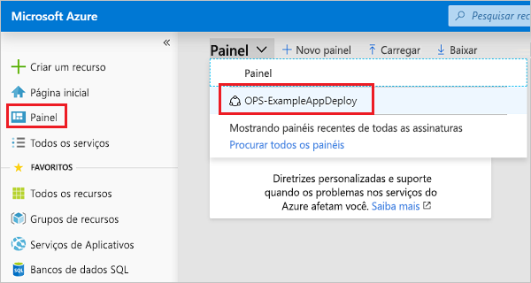

1. Você vê o painel personalizado.

   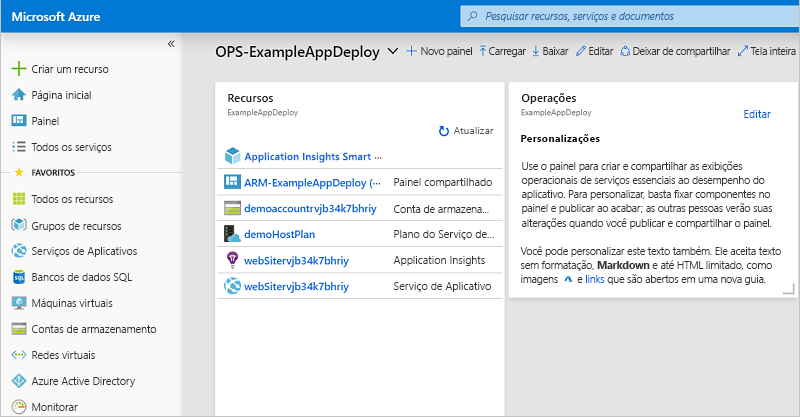

É possível gerenciar o acesso ao painel usando grupos RBAC. Você também pode personalizar a aparência do painel após a implantação. No entanto, se você reimplantar o grupo de recursos, o painel será redefinido para o estado padrão em seu modelo. Para saber mais sobre a criação de painéis, consulte [Criar programaticamente os painéis do Azure](../azure-portal/azure-portal-dashboards-create-programmatically.md).

## <a name="clean-up-resources"></a>Limpar recursos

Quando os recursos do Azure já não forem necessários, limpe os recursos implantados excluindo o grupo de recursos.

1. No portal do Azure, selecione **Grupos de recursos** no menu à esquerda.

1. Selecione o nome do grupo de recursos.

1. Escolha **Excluir grupo de recursos** no menu superior.

## <a name="next-steps"></a>Próximas etapas

Neste início rápido, você aprendeu a criar e implantar modelos usando o Visual Studio. O próximo tutorial mostra como localizar as informações de referência de modelo para que você possa criar uma conta de armazenamento criptografada do Azure.

> [!div class="nextstepaction"]
> [Criar uma conta de armazenamento criptografada](./resource-manager-tutorial-create-encrypted-storage-accounts.md)
