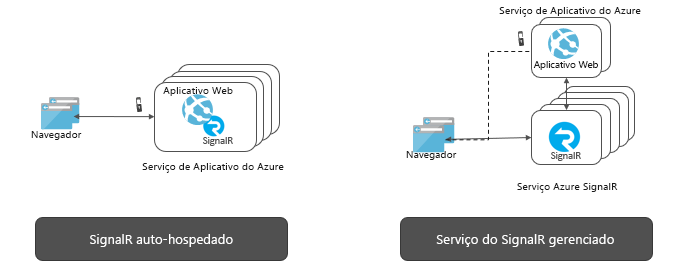

# O que é o Serviço do Azure SignalR?

O Azure SignalR Service simplifica o processo de adição da funcionalidade Web em tempo real aos aplicativos por HTTP. Essa funcionalidade em tempo real permite que o serviço envie por push atualizações de conteúdo a clientes conectados, como um aplicativo móvel ou Web de página única. Como resultado, os clientes são atualizados sem a necessidade de sondar o servidor, ou enviar novas solicitações HTTP para atualizações.

Este artigo fornece uma visão geral do Azure SignalR Service.

## Para que o Azure SignalR Service é usado?

Qualquer cenário que exija o envio de dados do servidor para o cliente em tempo real pode usar o Serviço Azure SignalR.

Os recursos em tempo real tradicionais que costumam exigir a sondagem pelo servidor também podem usar o Serviço Azure SignalR.

O Serviço Azure SignalR foi usado em vários setores e serve para qualquer tipo de aplicativo que exija atualizações de conteúdo em tempo real. Listamos alguns bons exemplos de uso do Serviço Azure SignalR:

* **Atualizações de dados de alta frequência:** jogos, votação, pesquisa, leilão.
* **Painéis e monitoramento:** painel da empresa, dados do mercado financeiro, atualização instantânea de vendas, placar de jogos com vários jogadores e monitoramento de IoT.
* **Chat:** sala de chat ao vivo, chatbot, atendimento ao cliente online, assistente de compras em tempo real, mensagens de texto, chat em jogos e assim por diante.
* **Localização no mapa em tempo real:** acompanhamento logístico, acompanhamento do status de entrega, atualizações de status de transporte, aplicativos com GPS.
* **Anúncios direcionados em tempo real:** anúncios e ofertas por push em tempo real personalizados, anúncios interativos.
* **Aplicativos de colaboração:** coautoria, aplicativos de quadro de comunicações e software de reunião em equipe.
* **Notificações por push:** redes sociais, emails, jogos, alertas de viagem.
* **Transmissão em tempo real:** transmissão de áudio/vídeo ao vivo, legenda ao vivo, tradução, transmissão de eventos/notícias.
* **IoT e dispositivos conectados:** métricas de IoT em tempo real, controle remoto, status em tempo real e rastreamento de localização.
* **Automação:** acionamento em tempo real de eventos upstream.

## Quais são os benefícios do uso do Serviço Azure SignalR?

**Baseado em padrão:**

O SignalR fornece uma abstração sobre várias técnicas usadas para criar aplicativos Web em tempo real. [WebSockets](https://wikipedia.org/wiki/WebSocket) é o transporte ideal, mas outras técnicas, como [SSE (Eventos enviados pelo servidor)](https://wikipedia.org/wiki/Server-sent_events) e Sondagem Longa são usadas quando outras opções não estão disponíveis. O SignalR detecta e inicializa automaticamente o transporte apropriado com base nos recursos com suporte no cliente e no servidor.

**Suporte nativo do ASP.NET Core:**

O Serviço SignalR fornece uma experiência de programação nativa com o ASP.NET Core e o ASP.NET. O desenvolvimento de um novo aplicativo do SignalR com o Serviço SignalR ou a migração de um aplicativo baseado em SignalR existente para o Serviço SignalR exige pouco esforço.
O Serviço SignalR também oferece suporte ao novo recurso do ASP.NET Core: o Blazor do lado do servidor.

**Suporte ao cliente amplo:**

O Serviço SignalR funciona com uma ampla gama de clientes, como navegadores da Web e de dispositivos móveis, aplicativos de área de trabalho, aplicativos móveis, processo de servidor, dispositivos IoT e consoles de jogos. O Serviço SignalR oferece SDKs em linguagens diferentes. Além dos SDKs do ASP.NET Core ou do ASP.NET C# nativos, o Serviço SignalR também fornece o SDK do cliente JavaScript para habilitar clientes da Web e muitas estruturas em JavaScript. Também há suporte para o SDK do cliente Java para aplicativos Java, incluindo aplicativos nativos Android. O Serviço SignalR oferece suporte à API REST e pode atuar sem servidor por meio de integrações com o Azure Functions e com a Grade de Eventos.

**Lidar com conexões de cliente em grande escala:**

O Serviço SignalR foi projetado para aplicativos em grande escala em tempo real. O Serviço SignalR permite que várias instâncias funcionem em conjunto a fim de dimensionar para milhões de conexões de cliente. O serviço também oferece suporte a várias regiões globais para fins de recuperação de desastre, alta disponibilidade ou fragmentação.

**Remover a carga para auto-hospedar o SignalR:**

Em comparação com aplicativos auto-hospedados do SignalR, a mudança para o Serviço SignalR eliminará a necessidade de gerenciamento de backplanes que lidam com o dimensionamento e as conexões de cliente. O serviço totalmente gerenciado também simplifica os aplicativos Web e economiza custos com hospedagem. O Serviço SignalR oferece alcance global, data center e rede da mais alta qualidade, pode ser dimensionado para milhões de conexões, garante o SLA e, ao mesmo tempo, fornece todo o grau de conformidade e segurança padrão do Azure.

**Oferecer APIs avançadas para padrões de mensagens diferentes:**

O Serviço SignalR permite que o servidor envie mensagens para uma conexão específica, para todas as conexões ou para um subconjunto de conexões que pertence a um usuário específico ou que foi colocado em um grupo aleatório.

## Como usar o Azure SignalR Service

Há muitas maneiras diferentes de programar com o Serviço Azure SignalR, como alguns dos exemplos listados abaixo:

- **[Dimensionar um aplicativo SignalR do ASP.NET Core](signalr-concept-scale-aspnet-core.md)**  – integre o Azure SignalR Service com um aplicativo SignalR do ASP.NET Core para escalar horizontalmente centenas de milhares de conexões.
- **[Criar aplicativos em tempo real sem servidor](signalr-concept-azure-functions.md)** – use a integração do Azure Functions com o SignalR Service para criar aplicativos em tempo real sem servidor em linguagens como JavaScript, C# e Java.
- **[Enviar mensagens do servidor para clientes por meio da API REST](https://github.com/Azure/azure-signalr/blob/dev/docs/rest-api.md)** – o Azure SignalR Service fornece a API REST para habilitar aplicativos para publicar mensagens a clientes conectados com o SignalR Service, em qualquer linguagem de programação compatível com REST.