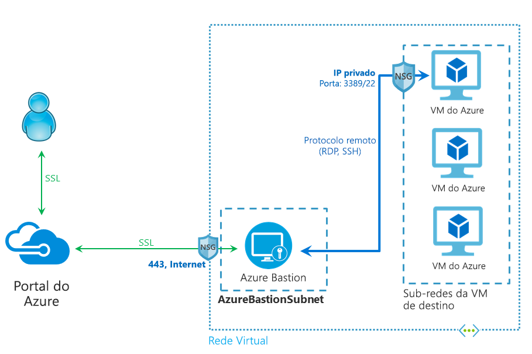

# O que é o Azure Bastion? (Visualização)

O serviço Azure Bastion é um novo serviço de PaaS, totalmente gerenciado pela plataforma e provisionado dentro de sua rede virtual. Ele fornece conectividade de RDP/SSH contínua e segura a suas máquinas virtuais, diretamente no portal do Azure, usando SSL. Quando você se conecta usando o Azure Bastion, suas máquinas virtuais não precisam de um endereço IP público.

 O Bastion fornece conectividade segura de RDP e SSH a todas as VMs na rede virtual em que é provisionado. O uso do Azure Bastion protege suas máquinas virtuais de expor as portas RDP/SSH ao mundo externo, ao mesmo tempo em que fornece acesso seguro usando RDP/SSH. Com o Azure Bastion, você se conecta à máquina virtual diretamente do portal do Azure. Não é preciso um cliente, agente ou software adicional.

> [!IMPORTANT]
> Essa versão prévia pública é fornecida sem um SLA e não deve ser usada para cargas de trabalho de produção. Determinados recursos podem não ter suporte, podem ter restrição ou podem não estar disponíveis em todos os locais do Azure. Veja os [Termos de Uso Adicionais para Visualizações do Microsoft Azure](https://azure.microsoft.com/support/legal/preview-supplemental-terms/) para obter detalhes.
>

## Arquitetura

O Azure Bastion é implantado em sua rede virtual e, uma vez implantado, fornece a experiência segura de RDP/SSH para todas as máquinas virtuais em sua rede virtual. Após você provisionar um serviço do Azure Bastion em sua rede virtual, a experiência de RDP/SSH é disponibilizada para todas as suas VMs na mesma rede virtual. A implantação é feita por rede virtual, não por assinatura/conta ou máquina virtual.

RDP e SSH são alguns dos meios fundamentais pelos quais você pode se conectar às suas cargas de trabalho em execução no Azure. A exposição de portas RDP/SSH pela Internet não é desejada e é vista como uma superfície de ameaça significativa. Isso costuma ocorrer devido a vulnerabilidades de protocolo. Para conter essa superfície de ameaça, você pode implantar hosts de bastiões (também conhecidos como jump-servers) no lado público de sua rede de perímetro. Os servidores de hosts de bastião são projetados e configurados para resistir a ataques. Os servidores de bastião também fornecem conectividade RDP e SSH às cargas de trabalho situadas atrás do bastião, bem como dentro da rede.

Esta figura mostra a arquitetura de uma implantação do Azure Bastion. Neste diagrama:

* O host Bastion é implantado na rede virtual.
* O usuário se conecta ao portal do Azure usando qualquer navegador HTML5.
* O usuário seleciona a máquina virtual a qual se conectar.
* Com um único clique, a sessão RDP/SSH é aberta no navegador.
* Nenhum IP público é necessário na VM do Azure.

## Principais recursos

Os seguintes recursos estão disponíveis para teste durante a versão prévia pública:

* **RDP e SSH diretamente no portal do Azure:** Você pode obter acesso direto à sessão RDP e SSH no portal do Azure usando uma experiência perfeita de único clique.
* **Sessão remota sobre SSL e passagem de firewall para RDP/SSH:** O Azure Bastion usa um cliente Web baseado em HTML5 que é automaticamente transmitido para seu dispositivo local, para que você obtenha sua sessão RDP/SSH sobre SSL na porta 443, permitindo que você cruze firewalls corporativos com segurança.
* **Não é necessário IP público na VM do Azure:** O Azure Bastion abre a conexão RDP/SSH com sua máquina virtual do Azure usando IP privado em sua VM. Você não precisa de um IP público na sua máquina virtual.
* **Sem problemas de gerenciamento de NSGs:** O Azure Bastion é um serviço PaaS de plataforma totalmente gerenciado do Azure que é protegido internamente para fornecer conectividade RDP/SSH segura. Não é preciso aplicar qualquer NSG na sub-rede do Azure Bastion. Como o Azure Bastion se conecta às suas máquinas virtuais por IP privado, você pode configurar seus NSGs para permitir somente o RDP/SSH do Azure Bastion. Isso acaba com o trabalho de gerenciar NSGs cada vez que você precisa se conectar com segurança às suas máquinas virtuais.
* **Proteção contra a varredura de porta:** Como você não precisa expor suas máquinas virtuais à Internet pública, suas VMs são protegidas contra a varredura de portas por usuários invasores e mal-intencionados localizados fora de sua rede virtual.
* **Protege contra explorações de dia zero. Proteção em um único lugar:** o Azure Bastion é um serviço de PaaS totalmente gerenciado por plataforma. Como ele reside no perímetro de sua rede virtual, você não precisa se preocupar em proteger cada uma das máquinas virtuais da sua rede virtual. A plataforma do Azure protege contra explorações de dia zero, mantendo o Azure Bastion protegido e sempre atualizado para você.

## Perguntas frequentes

[!INCLUDE [Bastion FAQ](../../includes/bastion-faq-include.md)]

## Próximas etapas

* [Criar um recurso de host do Azure Bastion](bastion-create-host-portal.md).
* Saiba mais sobre alguns dos outros principais [recursos de rede](../networking/networking-overview.md) do Azure.
