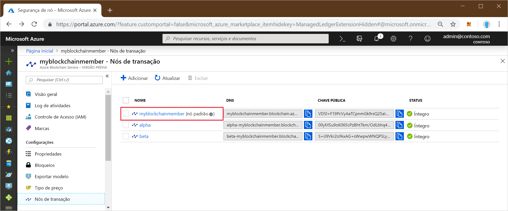
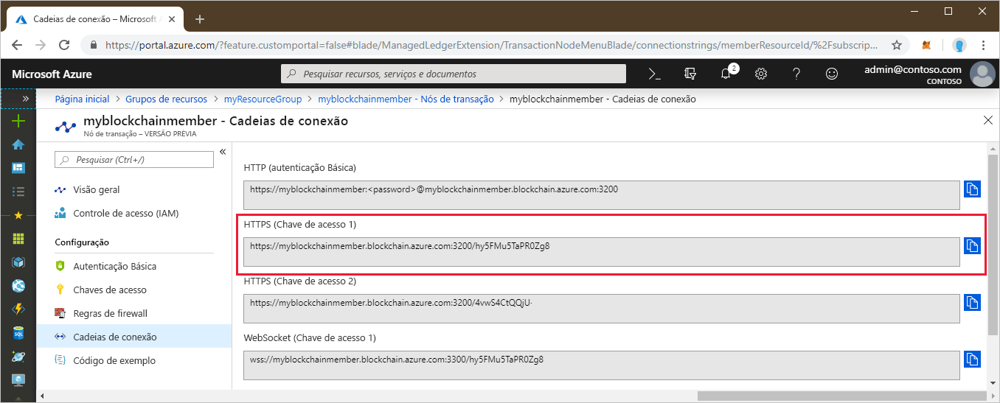

# <a name="quickstart-use-geth-to-connect-to-a-transaction-node"></a>Início Rápido: Usar o Geth para se conectar a um nó de transação

O Geth é um cliente do Go Ethereum que pode ser usado para anexação a uma instância do Geth em um nó de transação do serviço Azure Blockchain.

[!INCLUDE [quickstarts-free-trial-note](../../../includes/quickstarts-free-trial-note.md)]

## <a name="prerequisites"></a>Pré-requisitos

* Instalar o [Geth](https://github.com/ethereum/go-ethereum/wiki/geth)
* Concluir [Início Rápido: Criar um membro do blockchain usando o portal do Azure](create-member.md) ou [Início Rápido: Criar um membro do blockchain do Azure Blockchain Service usando a CLI do Azure](create-member-cli.md)

## <a name="get-the-geth-connection-string"></a>Obter a cadeia de conexão do Geth

Encontre a cadeia de conexão do Geth no portal do Azure.

1. Entre no [Portal do Azure](https://portal.azure.com).
1. Navegue para o membro do serviço Azure Blockchain. Selecione **Nós de transação** e o link do nó de transação padrão.

    

1. Selecione **Cadeias de conexão**.
1. Copie a cadeia de conexão de **HTTPS (Chave de acesso 1)** . Você precisará do comando para a próxima seção.

    

## <a name="connect-to-geth"></a>Conectar-se ao Geth

1. Abra um prompt de comando ou shell.
1. Use o subcomando attach do Geth para se anexar à instância em execução do Geth no nó de transação. Cole a cadeia de conexão como um argumento para o subcomando attach. Por exemplo,

    ```
    geth attach <connection string>
    ```

1. Depois que estiver conectado ao console do Ethereum do nó de transação, você poderá chamar a API do Dapp JavaScript do web3 ou a API do administrador.

    Por exemplo, use a API a seguir para descobrir a chainId.

    ```bash
    admin.nodeInfo.protocols.istanbul.config.chainId
    ```

    Neste exemplo, a chainId é 297.

    

1. Para se desconectar do console, digite `exit`.

## <a name="next-steps"></a>Próximas etapas

Neste Início Rápido, você usou o cliente Geth para se anexar a uma instância do Geth em um nó de transação do serviço Azure Blockchain. Experimente o próximo tutorial para usar o Azure Blockchain Development Kit para Ethereum e Truffle para criar, implantar e executar uma função de contrato inteligente por uma transação.

> [!div class="nextstepaction"]
> [Use o Visual Studio Code para criar e implantar contratos inteligentes](send-transaction.md)