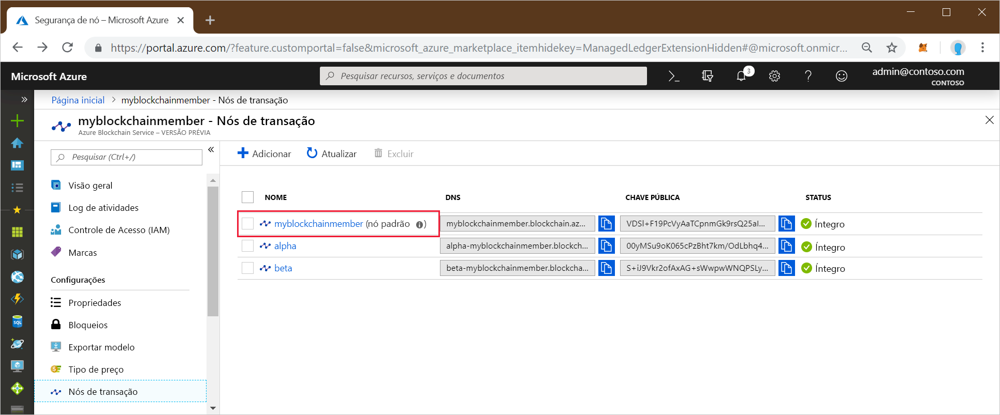
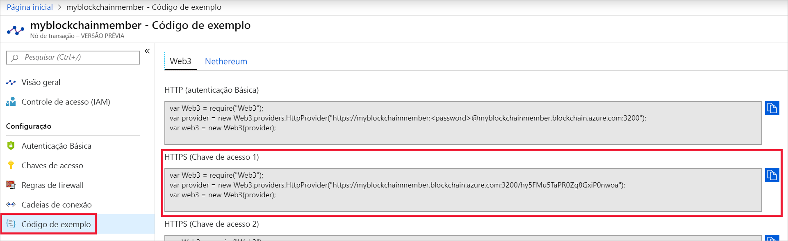

# <a name="quickstart-use-truffle-to-connect-to-an-azure-blockchain-service-network"></a>Início Rápido: Usar o Truffle para se conectar a uma rede do serviço Azure Blockchain

O Truffle é um ambiente de desenvolvimento de blockchain que pode ser usado para se conectar a um nó do serviço Azure Blockchain.

[!INCLUDE [quickstarts-free-trial-note](../../../includes/quickstarts-free-trial-note.md)]

## <a name="prerequisites"></a>Pré-requisitos

* [Criar um membro do Azure Blockchain](create-member.md)
* Instale o [Truffle](https://github.com/trufflesuite/truffle). O Truffle exige a instalação de várias ferramentas, incluindo [Node.js](https://nodejs.org) e [Git](https://git-scm.com/book/en/v2/Getting-Started-Installing-Git).
* Instale o [Python 2.7.15](https://www.python.org/downloads/release/python-2715/). O Python é necessário para o Web3.

## <a name="create-truffle-project"></a>Criar um projeto do Truffle

1. Abra um prompt de comando ou o shell do Node.js.
1. Altere o diretório para o local em que deseja criar o diretório do projeto do Truffle.
1. Crie um diretório para o projeto e altere o caminho para o novo diretório. Por exemplo,

    ``` bash
    mkdir truffledemo
    cd truffledemo
    ```

1. Inicialize o projeto do Truffle.

    ``` bash
    truffle init
    ```

1. Instale o web3 da API de JavaScript do Ethereum na pasta do projeto. Atualmente, a versão do web3 1.0.0-beta.37 é obrigatória.

    ``` bash
    npm install web3@1.0.0-beta.37
    ```

    Você poderá receber avisos do npm durante a instalação.

1. Inicie o console de desenvolvimento interativo do Truffle.

    ``` bash
    truffle develop
    ```

    O Truffle cria um blockchain de desenvolvimento local e fornece um console interativo.

## <a name="connect-to-transaction-node"></a>Conectar-se ao nó de transação

Usaremos o *Web3* para se conectar ao nó de transação. Obtenha a cadeia de conexão do *Web3* no portal do Azure.

1. Entre no [Portal do Azure](https://portal.azure.com).
1. Navegue para o membro do serviço Azure Blockchain. Selecione **Nós de transação** e o link do nó de transação padrão.

    

1. Selecione **Código de Exemplo > Web3**.
1. Copie o JavaScript de **HTTPS (Chave de acesso 1)** . Você precisará do código para o console de desenvolvimento interativo do Truffle.

    

1. Cole o código JavaScript da etapa anterior no console de desenvolvimento interativo do Truffle. O código criará um objeto web3 que é conectado ao nó de transação do serviço Azure Blockchain.

    Saída de exemplo:

    ```bash
    truffle(develop)> var Web3 = require("Web3");
    truffle(develop)> var provider = new Web3.providers.HttpProvider("https://myblockchainmember.blockchain.azure.com:3200/hy5FMu5TaPR0Zg8GxiPwned");
    truffle(develop)> var web3 = new Web3(provider);
    ```

    Você pode chamar métodos no objeto **web3** para interagir com o nó de transação.

1. Chame o método **getBlockNumber** para retornar o número de bloco atual.

    ```bash
    web3.eth.getBlockNumber();
    ```

    Saída de exemplo:

    ```bash
    truffle(develop)> web3.eth.getBlockNumber();
    18567
    ```
1. Saia do console de desenvolvimento do Truffle.

    ```bash
    .exit
    ```

## <a name="next-steps"></a>Próximas etapas

Neste Início Rápido, você criou um projeto do Truffle para se conectar ao nó de transação padrão do serviço Azure Blockchain.

Experimente o próximo tutorial para usar o Truffle para enviar uma transação à rede de blockchain do consórcio.

> [!div class="nextstepaction"]
> [Enviar uma transação](send-transaction.md)