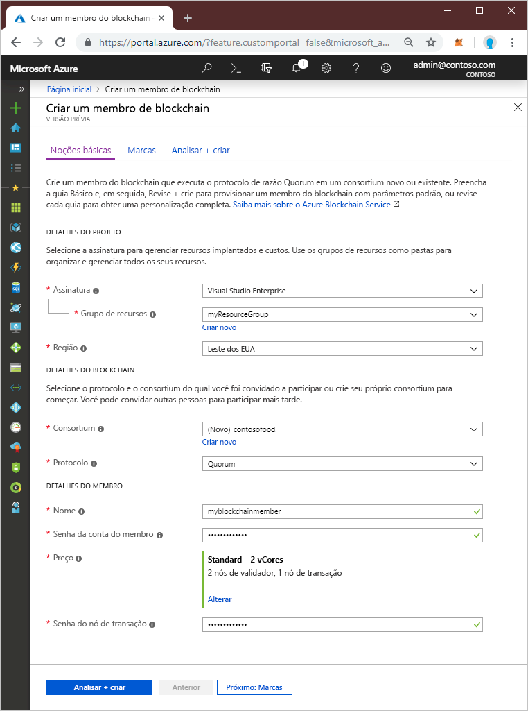
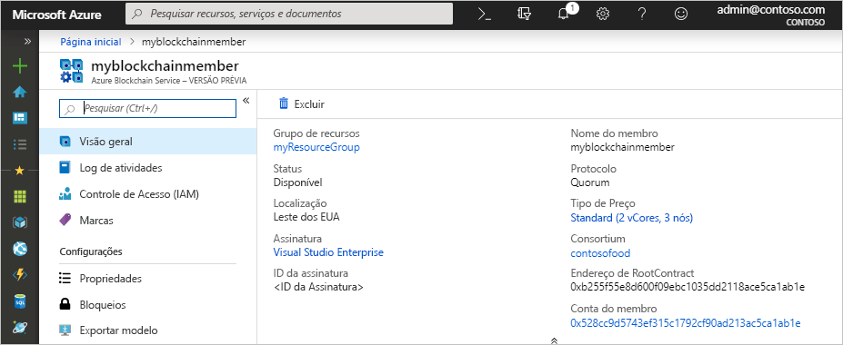

# Início Rápido: Criar um serviço Azure Blockchain usando o portal do Azure

O serviço Azure Blockchain é uma plataforma de blockchain na qual você pode executar sua lógica de negócios em um contrato inteligente. Este Início Rápido mostra como começar por meio da criação de um razão gerenciado usando o portal do Azure.

[!INCLUDE [quickstarts-free-trial-note](../../../includes/quickstarts-free-trial-note.md)]

## Criar um razão gerenciado

O serviço Azure Blockchain é criado com um conjunto definido de recursos de computação e armazenamento.

1. Entre no [Portal do Azure](https://portal.azure.com).
1. Selecione **Criar um recurso** no canto superior esquerdo do portal do Azure.
1. Selecione **Blockchain** > **Serviço Azure Blockchain**.
1. Conclua o modelo.

    

    Configuração | DESCRIÇÃO
    --------|------------
    Membro do Blockchain | Escolha um nome exclusivo que identifique o membro do serviço Azure Blockchain. O nome do membro do blockchain só pode conter letras minúsculas e números. O primeiro caractere precisa ser uma letra. O valor precisa ter entre 2 e 20 caracteres.
    Assinatura | Selecione a assinatura do Azure que deseja usar para o serviço. Se você tem várias assinaturas, escolha a assinatura na qual recebe a cobrança do recurso.
    Grupo de recursos | Um novo nome do grupo de recursos ou um existente de sua assinatura.
    Região | A localização precisa ser a mesma para todos os membros do consórcio.
    Senha da conta de membro | A senha da conta do membro é usada para criptografar a chave privada para a conta do Ethereum criada para o membro. Use a conta do membro e a senha da conta do membro para o gerenciamento do consórcio.
    Nome do consórcio | Para um novo consórcio, insira um nome exclusivo. Se estiver ingressando em um consórcio por meio de um convite, o valor será o consórcio no qual você está ingressando.
    DESCRIÇÃO | Descrição do consórcio.
    Protocolo |  A versão prévia dá suporte ao protocolo do Quorum.
    Preços | A configuração de nó do novo serviço. Selecione **Padrão**. 2 nós de validador e 1 nó de transação são a configuração padrão.
    Senha do nó de transação | A senha do nó de transação padrão do membro. Use a senha para a autenticação básica ao se conectar ao ponto de extremidade público do nó de transação padrão do membro do blockchain.

1. Selecione **Criar** para provisionar o serviço. O provisionamento leva cerca de 10 minutos.
1. Selecione **Notificações** na barra de ferramentas para monitorar o processo de implantação.
1. Após a implantação, navegue para o membro do blockchain.

Selecione **Visão Geral** e exiba as informações básicas sobre seu serviço, incluindo o endereço do RootContract e a conta de membro.

## Limpar recursos

Você pode usar o membro criado para o próximo Início Rápido ou tutorial. Quando eles não forem mais necessários, você poderá excluir os recursos excluindo o grupo de recursos `myResourceGroup` criado pelo serviço Azure Blockchain.

Para excluir o grupo de recursos:

1. No portal do Azure, navegue até **Grupo de recursos** no painel de navegação esquerdo e selecione o grupo de recursos que você deseja excluir.
2. Selecione **Excluir grupo de recursos**. Verifique a exclusão digitando o nome do grupo de recursos e selecione **Excluir**.

## Próximas etapas

> [!div class="nextstepaction"]
> [Usar o MetaMask para se conectar e implantar um contrato inteligente](connect-metamask.md)