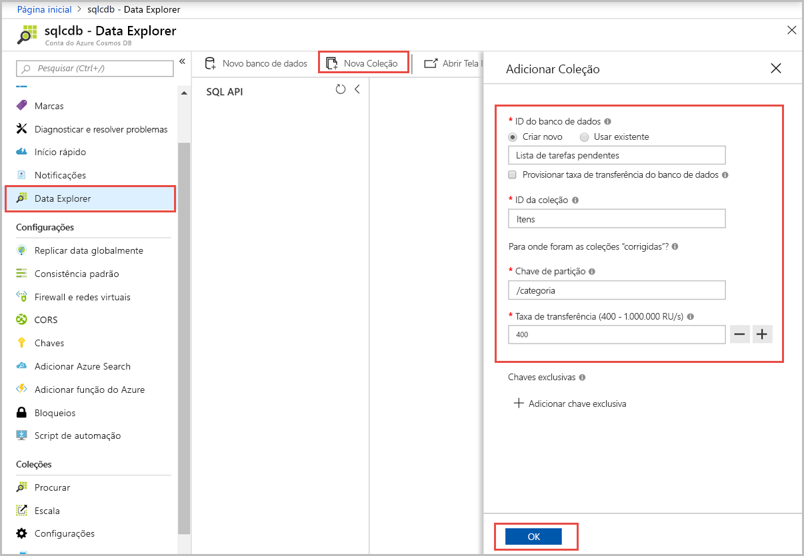
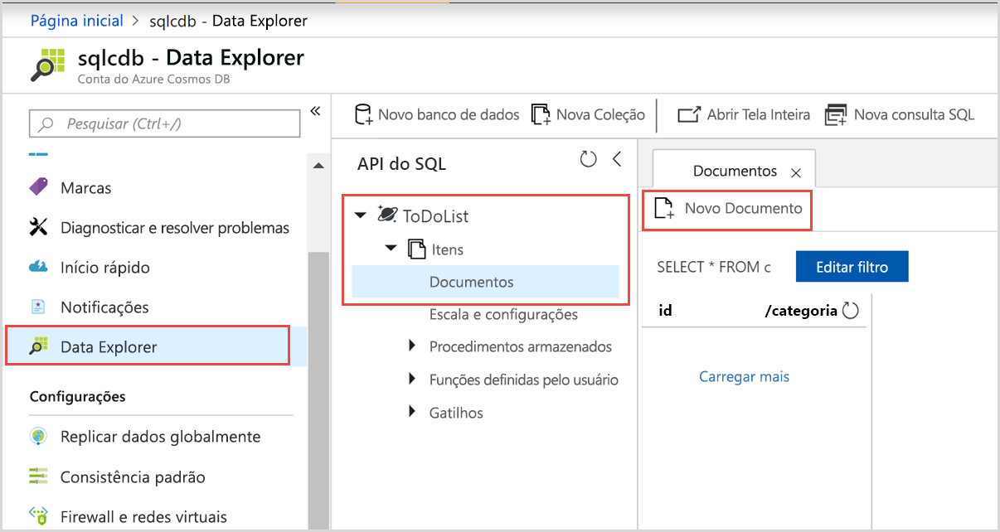
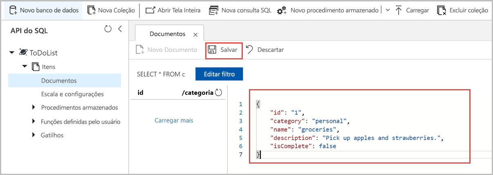

# <a name="quickstart-create-an-azure-cosmos-account-container-and-items-with-the-azure-portal"></a>Início Rápido: Criar uma conta, contêiner e itens do Azure Cosmos com o portal do Azure

> [!div class="op_single_selector"]
> * [Portal do Azure](create-cosmosdb-resources-portal.md)
> * [.NET](create-sql-api-dotnet.md)
> * [Java](create-sql-api-java.md)
> * [Node.js](create-sql-api-nodejs.md)
> * [Python](create-sql-api-python.md)
> * [Xamarin](create-sql-api-xamarin-dotnet.md)
>  

O Azure Cosmos DB é o serviço de banco de dados multimodelo distribuído globalmente da Microsoft. É possível usar o Azure Cosmos DB para criar e consultar rapidamente bancos de dados de chave/valor, bancos de dados de documentos e bancos de dados de grafo. Todos se beneficiam de recursos de escala horizontal e distribuição global no núcleo do Azure Cosmos DB. 

Este início rápido demonstra como usar o portal do Azure para criar uma conta de [API de SQL](sql-api-introduction.md) do Azure Cosmos DB, criar uma coleção e um banco de dados de documentos e adicionar dados à coleção. 

## <a name="prerequisites"></a>Pré-requisitos

Uma assinatura do Azure ou uma conta de avaliação gratuita do Azure Cosmos DB
- [!INCLUDE [quickstarts-free-trial-note](../../includes/quickstarts-free-trial-note.md)] 

- [!INCLUDE [cosmos-db-emulator-docdb-api](../../includes/cosmos-db-emulator-docdb-api.md)]  

<a id="create-account"></a>
## <a name="create-an-azure-cosmos-db-account"></a>Criar uma conta do Azure Cosmos DB

[!INCLUDE [cosmos-db-create-dbaccount](../../includes/cosmos-db-create-dbaccount.md)]

<a id="create-collection-database"></a>
## <a name="add-a-database-and-a-collection"></a>Adicionar um banco de dados e uma coleção 

Você pode usar o Data Explorer no portal do Azure para criar um banco de dados e uma coleção. 

1.  Selecione **Data Explorer** no painel de navegação à esquerda na página de sua conta do Azure Cosmos DB e, em seguida, selecione **Novo Contêiner**. 
    
    Talvez seja necessário rolar a página para a direita para ver a janela **Adicionar Contêiner**.
    
    
    
1.  No painel **Adicionar contêiner**, insira as configurações da nova coleção.
    
    |Configuração|Valor sugerido|DESCRIÇÃO
    |---|---|---|
    |**ID do banco de dados**|ToDoList|Insira *ToDoList* como o nome para o novo banco de dados. Os nomes dos banco de dados devem conter de 1 a 255 caracteres e não podem conter `/, \\, #, ?` nem um espaço à direita. Marque a opção **Provisionar a produtividade do banco de dados**; ela permite que você compartilhe a produtividade provisionada para o banco de dados em todos os contêineres no banco de dados. Essa opção também ajuda na economia de custo. |
    |**Taxa de transferência**|400|Deixe a taxa de transferência em 400 unidades de solicitação por segundo (RU/s). Se quiser reduzir a latência, você poderá escalar verticalmente a taxa de transferência mais tarde.| 
    |**ID do contêiner**|Itens|Insira *Itens* como o nome da nova coleção. As IDs da coleção possuem os mesmos requisitos de caractere que os nomes de bancos de dados.|
    |**Chave de partição**| /category| O exemplo descrito neste artigo usa */category* como a chave de partição.|

    
    Não adicione **Chaves exclusivas** para este exemplo. Chaves exclusivas permitem que você adicione uma camada de integridade de dados ao banco de dados garantindo a exclusividade de um ou mais valores por chave de partição. Para obter mais informações, veja [Chaves exclusivas no Azure Cosmos DB](unique-keys.md).
    
1.  Selecione **OK**. O Data Explorer exibe o novo banco de dados e o contêiner que você criou.

## <a name="add-data-to-your-database"></a>Adicionar dados a seu banco de dados

Adicione dados a seu novo banco de dados usando o Data Explorer.

1. No **Data Explorer**, expanda o banco de dados **ToDoList** e, em seguida, expanda o contêiner **Itens**. Em seguida, selecione **Itens** e, em seguida, selecione **Novo Item**. 
   
   
   
1. Adicione a seguinte estrutura ao documento no lado direito do painel **Documentos**:

     ```json
     {
         "id": "1",
         "category": "personal",
         "name": "groceries",
         "description": "Pick up apples and strawberries.",
         "isComplete": false
     }
     ```

1. Clique em **Salvar**.
   
   
   
1. Selecione **Novo Documento** novamente e crie e salve um outro documento com uma única `id` e quaisquer outras propriedades e valores desejados. Os documentos podem ter qualquer estrutura, pois o Azure Cosmos DB não impõe nenhum esquema a seus dados.

## <a name="query-your-data"></a>Consultar seus dados

[!INCLUDE [cosmos-db-create-sql-api-query-data](../../includes/cosmos-db-create-sql-api-query-data.md)] 

## <a name="clean-up-resources"></a>Limpar recursos

[!INCLUDE [cosmosdb-delete-resource-group](../../includes/cosmos-db-delete-resource-group.md)]

## <a name="next-steps"></a>Próximas etapas

Neste início rápido, você aprendeu a criar uma conta do Azure Cosmos DB, como criar um banco de dados e contêiner usando o Data Explorer. Agora, é possível importar outros dados para sua conta do Azure Cosmos DB. 

> [!div class="nextstepaction"]
> [Importar dados no Azure Cosmos DB](import-data.md)