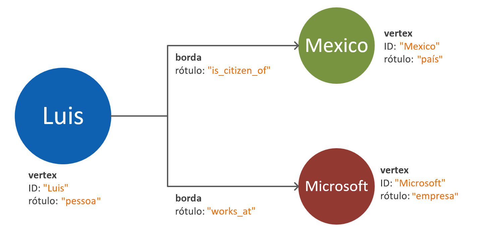
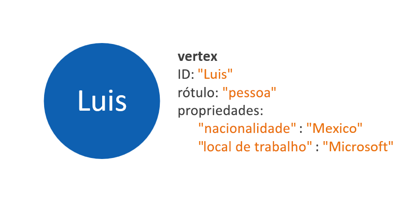
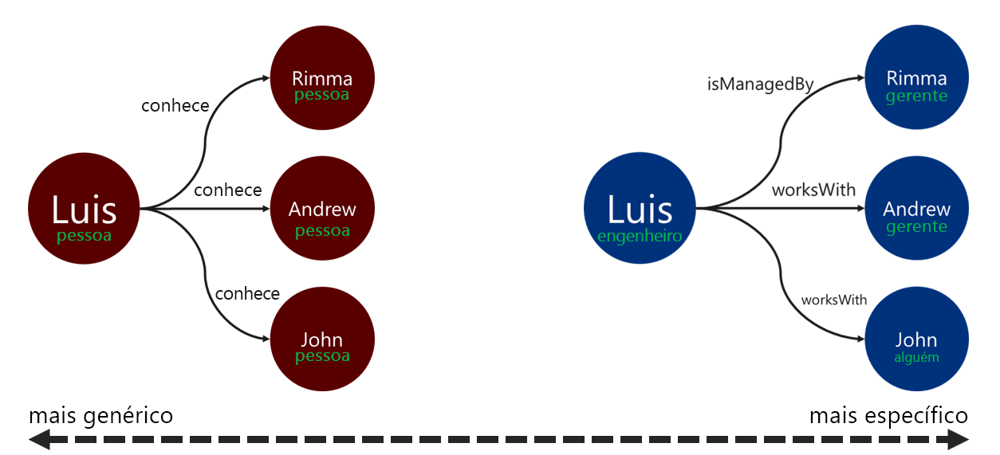

# Modelagem de dados de grafo da API do Gremlin do Azure Cosmos DB

O documento a seguir foi desenvolvido para fornecer recomendações de modelagem de dados de grafo. Esta etapa é essencial para garantir a escalabilidade e o desempenho de um sistema de banco de dados de grafo conforme os dados evoluem. Um modelo de dados eficiente é especialmente importante com grafos em grande escala.

## Requisitos

O processo descrito neste guia se baseia nas seguintes suposições:
 * As **entidades** no espaço de problema são identificadas. Essas entidades destinam-se a serem consumidas _atomicamente_ para cada solicitação. Em outras palavras, o sistema de banco de dados não foi projetado para recuperar os dados de uma única entidade em várias solicitações de consulta.
 * Há um entendimento dos **requisitos de leitura e gravação** do sistema de banco de dados. Esses requisitos orientarão as otimizações necessárias para o modelo de dados de grafo.
 * Os princípios do [padrão de grafo de propriedade do Apache Tinkerpop](http://tinkerpop.apache.org/docs/current/reference/#graph-computing) são bem compreendidos.

## Quando é necessário ter um banco de dados de grafo?

Uma solução de banco de dados de grafo pode ser aplicada de forma ideal se as entidades e as relações em um domínio de dados tem uma das seguintes características: 

* As entidades são **altamente conectadas** por meio de relações descritivas. O benefício desse cenário é o fato de que as relações são persistidas no armazenamento.
* Há **relações cíclicas** ou **entidades autorreferenciadas**. Esse padrão geralmente é um desafio ao usar bancos de dados relacionais ou de documentos.
* Há **relações que evoluem dinamicamente** entre as entidades. Esse padrão é especialmente aplicável a dados hierárquicos ou com estrutura de árvore com muitos níveis.
* Há **relações muitos para muitos** entre as entidades.
* Há **requisitos de gravação e leitura nas entidades e nas relações**. 

Se os critérios acima forem atendidos, será provável que uma abordagem de banco de dados de grafo fornecerá vantagens para **complexidade da consulta**, **escalabilidade do modelo de dados** e **desempenho de consulta**.

A próxima etapa é determinar se o grafo será usado para fins analíticos ou transacionais. Se o grafo se destinar a ser usado para cargas de trabalho de processamento de dados e cálculo intensivos, valerá a pena explorar o [conector do Spark do Cosmos DB](https://docs.microsoft.com/azure/cosmos-db/spark-connector) e o uso da [biblioteca do GraphX](https://spark.apache.org/graphx/). 

## Como usar objetos de grafo

O [padrão de grafo de propriedade do Apache Tinkerpop](http://tinkerpop.apache.org/docs/current/reference/#graph-computing) define dois tipos de objetos: **Vértices** e **Bordas**. 

Estas são as melhores práticas para as propriedades nos objetos de grafo:

| Objeto | Propriedade | Type | Observações |
| --- | --- | --- |  --- |
| Vértice | ID | string | Imposto com exclusividade por partição. Se um valor não for fornecido após a inserção, um GUID gerado automaticamente será armazenado. |
| Vértice | label | string | Essa propriedade é usada para definir o tipo de entidade representado pelo vértice. Se um valor não for fornecido, um valor padrão "vértice" será usado. |
| Vértice | properties | Cadeia de caracteres, booliano, numérico | Uma lista de propriedades separadas armazenadas como pares chave-valor em cada vértice. |
| Vértice | partition key | Cadeia de caracteres, booliano, numérico | Essa propriedade define em que local o vértice e suas bordas de saída serão armazenados. Leia mais sobre o [particionamento de grafo](graph-partitioning.md). |
| Microsoft Edge | ID | string | Imposto com exclusividade por partição. Gerado automaticamente por padrão. Geralmente, as bordas não precisam ser recuperadas exclusivamente por uma ID. |
| Microsoft Edge | label | string | Essa propriedade é usada para definir o tipo de relação existente entre dois vértices. |
| Microsoft Edge | properties | Cadeia de caracteres, booliano, numérico | Uma lista de propriedades separadas armazenadas como pares chave-valor em cada borda. |

> [!NOTE]
> As bordas não exigem um valor de chave de partição, pois seu valor é atribuído automaticamente com base no vértice de origem. Saiba mais no artigo [Particionamento de grafo](graph-partitioning.md).

## Diretrizes de modelagem de entidade e relação

Veja a seguir um conjunto de diretrizes para abordar a modelagem de dados de um banco de dados de grafo da API do Gremlin do Azure Cosmos DB. Essas diretrizes pressupõem que haja uma definição existente de um domínio de dados e consultas para ele.

> [!NOTE]
> As etapas descritas abaixo são apresentadas como recomendações. O modelo final deve ser avaliado e testado antes de sua consideração como pronto para produção. Além disso, as recomendações abaixo são específicas à implementação da API do Gremlin do Azure Cosmos DB. 

### Como modelar vértices e propriedades 

A primeira etapa de um modelo de dados de grafo é mapear cada entidade identificada para um **objeto de vértice**. Um mapeamento um-para-um de todas as entidades para vértices deve ser uma etapa inicial e estar sujeito a alterações.

Uma armadilha comum é mapear propriedades de uma única entidade como vértices separados. Considere o exemplo abaixo, em que a mesma entidade é representada de duas maneiras diferentes:

* **Propriedades baseadas em vértice**: Nessa abordagem, a entidade usa três vértices separados e duas bordas para descrever suas propriedades. Embora essa abordagem possa reduzir a redundância, ela aumenta a complexidade do modelo. Um aumento na complexidade do modelo pode resultar em latência adicionada, complexidade da consulta e custo de computação. Esse modelo também pode apresentar desafios no particionamento.

* **Vértices inseridos na propriedade**: Essa abordagem aproveita a lista de pares chave-valor para representar todas as propriedades da entidade em um vértice. Ela fornece complexidade reduzida do modelo, o que leva a consultas mais simples e travessias mais econômicas.

> [!NOTE]
> Os exemplos acima mostram um modelo de grafo simplificado para mostrar apenas a comparação entre as duas formas de dividir as propriedades da entidade.

O padrão **vértices inseridos na propriedade** geralmente oferece uma abordagem com melhor desempenho e mais escalonável. A abordagem padrão para um novo modelo de dados de grafo deve tender a assumir esse padrão.

No entanto, há cenários em que a referência a uma propriedade pode oferecer vantagens. Por exemplo: se a propriedade referenciada for atualizada com frequência. O uso de um vértice separado para representar uma propriedade que é constantemente alterada minimizará a quantidade de operações de gravação exigidas pela atualização.

### Modelagem de relação com sentidos de borda

Depois que os vértices são modelados, as bordas podem ser adicionadas para indicar as relações entre eles. O primeiro aspecto que precisa ser avaliado é a **direção da relação**. 

Os objetos de borda têm uma direção padrão que é seguida por uma travessia ao usar a função `out()` ou `outE()`. O uso dessa direção natural resulta em uma operação eficiente, pois todos os vértices são armazenados com suas bordas de saída. 

No entanto, a travessia na direção oposta de uma borda, usando a função `in()`, sempre resultará em uma consulta entre partições. Saiba mais sobre o [particionamento de grafo](graph-partitioning.md). Se uma travessia constante é necessária usando a função `in()`, recomendamos adicionar bordas em ambos os sentidos.

Você pode determinar a direção da borda usando os predicados `.to()` ou `.from()` para a etapa `.addE()` do Gremlin. Ou usando a [biblioteca BulkExecutor para a API do Gremlin](bulk-executor-graph-dotnet.md).

> [!NOTE]
> Os objetos de borda têm uma direção por padrão.

### Rotulagem de relação

O uso de rótulos de relação descritivos pode melhorar a eficiência das operações de resolução de borda. Esse padrão pode ser aplicado das seguintes maneiras:
* Use termos não genéricos para rotular uma relação.
* Associe o rótulo do vértice de origem ao rótulo do vértice de destino com o nome da relação.

Quanto mais específico o rótulo que o atravessador usará para filtrar as bordas, melhor. Essa decisão também pode ter um impacto significativo no custo da consulta. Você pode avaliar o custo da consulta a qualquer momento [usando a etapa executionProfile](graph-execution-profile.md).

## Próximas etapas: 
* Confira a lista de [etapas do Gremlin](gremlin-support.md) compatíveis.
* Saiba mais sobre o [particionamento de banco de dados de grafo](graph-partitioning.md) para lidar com grafos em grande escala.
* Avalie suas consultas do Gremlin usando a [etapa Perfil de Execução](graph-execution-profile.md).
