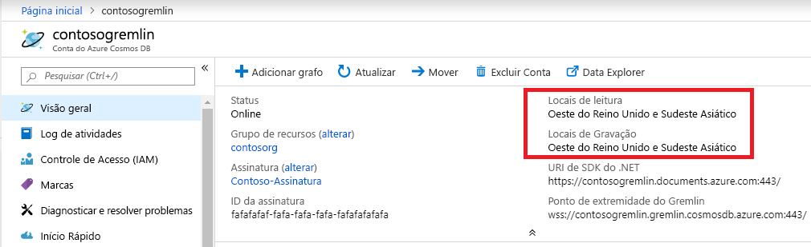

# <a name="regional-endpoints-for-azure-cosmos-db-graph-account"></a>Pontos de extremidade regionais para a conta de grafo do Azure Cosmos DB
O banco de dados de grafo do Azure Cosmos DB é [distribuído globalmente](distribute-data-globally.md) para que os aplicativos possam usar vários pontos de extremidade de leitura. Aplicativos que precisam de acesso de gravação em vários locais devem habilitar a funcionalidade de [vários mestres](how-to-multi-master.md).

Motivos para escolher mais de uma região:
1. **Escalabilidade de leitura horizontal** – conforme a carga do aplicativo aumenta, pode ser prudente rotear o tráfego de leitura para diferentes regiões do Azure.
2. **Latência mais baixa** – você pode reduzir a sobrecarga de latência de rede de cada passagem roteando o tráfego de leitura e gravação para a região do Azure mais próxima.

O requisito de **residência de dados** é atendido definindo a política do Azure Resource Manager na conta do Cosmos DB. O cliente pode limitar as regiões nas quais o Cosmos DB replica dados.

## <a name="traffic-routing"></a>Roteamento de tráfego

O mecanismo de banco de dados de grafo do Cosmos DB está em execução em várias regiões, cada uma das quais contém vários clusters. Cada cluster tem centenas de computadores. O CNAME DNS da conta de grafo do Cosmos DB *accountname.gremlin.cosmos.azure.com* resolve para o DNS um registro de um cluster. Um único endereço IP de um balanceador de carga oculta a topologia interna do cluster.

Um registro CNAME DNS regional é criado para cada região da conta de grafo do Cosmos DB. O formato do ponto de extremidade regional é *accountname-region.gremlin.cosmos.azure.com*. O segmento de região do ponto de extremidade regional é obtido removendo todos os espaços do nome da [região do Azure](https://azure.microsoft.com/global-infrastructure/regions). Por exemplo, a região `"East US 2"` para a conta de banco de dados global `"contoso"` teria um CNAME DNS *contoso-eastus2.gremlin.cosmos.azure.com*

O cliente do TinkerPop Gremlin foi criado para funcionar com um único servidor. O aplicativo pode usar o CNAME DNS gravável global para o tráfego de leitura e gravação. Os aplicativos com reconhecimento de região devem usar o ponto de extremidade regional para tráfego de leitura. Use o ponto de extremidade regional para o tráfego de gravação somente se a região específica estiver configurada para aceitar gravações. 

> [!NOTE]
> O mecanismo de grafo do Cosmos DB pode aceitar a operação de gravação na região de leitura efetuando o tráfego de proxy para a região de gravação. Não é recomendável enviar gravações para regiões somente leitura, pois isso aumenta a latência de passagem e está sujeita a restrições no futuro.

O CNAME da conta do banco de dados global sempre aponta para uma região de gravação válida. Durante o failover no lado do servidor da região de gravação, o Cosmos DB atualiza o CNAME da conta do banco de dados global para apontar para uma nova região. Se o aplicativo não puder manipular o roteamento de tráfego após o failover, ele deverá usar o CNAME DNS da conta de banco de dados global.

> [!NOTE]
> O Cosmos DB não roteia o tráfego com base na proximidade geográfica do chamador. Cabe a cada aplicativo selecionar a região correta de acordo com suas necessidades exclusivas.

## <a name="portal-endpoint-discovery"></a>Descoberta do ponto de extremidade do portal

A maneira mais fácil de obter a lista de regiões para a conta de grafo do Azure Cosmos DB é a folha visão geral no portal do Azure. Ela funcionará para aplicativos que não alteram regiões com frequência ou que têm uma maneira de atualizar a lista por meio da configuração do aplicativo.



O exemplo a seguir demonstra os princípios gerais de acesso ao ponto de extremidade Gremlin regional. O aplicativo deve considerar o número de regiões às quais enviará o tráfego e o número de clientes Gremlin correspondentes a serem instanciados.

```csharp
// Example value: Central US, West US and UK West. This can be found in the overview blade of you Azure Cosmos DB Gremlin Account. 
// Look for Write Locations in the overview blade. You can click to copy and paste.
string[] gremlinAccountRegions = new string[] {"Central US", "West US" ,"UK West"};
string gremlinAccountName = "PUT-COSMOSDB-ACCOUNT-NAME-HERE";
string gremlinAccountKey = "PUT-ACCOUNT-KEY-HERE";
string databaseName = "PUT-DATABASE-NAME-HERE";
string graphName = "PUT-GRAPH-NAME-HERE";

foreach (string gremlinAccountRegion in gremlinAccountRegions)
{
  // Convert preferred read location to the form "[acountname]-[region].gremlin.cosmos.azure.com".
  string regionalGremlinEndPoint = $"{gremlinAccountName}-{gremlinAccountRegion.ToLowerInvariant().Replace(" ", string.Empty)}.gremlin.cosmos.azure.com";

  GremlinServer regionalGremlinServer = new GremlinServer(
    hostname: regionalGremlinEndPoint, 
    port: 443,
    enableSsl: true,
    username: "/dbs/" + databaseName + "/colls/" + graphName,
    password: gremlinAccountKey);

  GremlinClient regionalGremlinClient = new GremlinClient(
    gremlinServer: regionalGremlinServer,
    graphSONReader: new GraphSON2Reader(),
    graphSONWriter: new GraphSON2Writer(),
    mimeType: GremlinClient.GraphSON2MimeType);
}
```

## <a name="sdk-endpoint-discovery"></a>Descoberta do ponto de extremidade do SDK

O aplicativo pode usar o [SDK do Azure Cosmos DB](sql-api-sdk-dotnet.md) para descobrir locais de leitura e gravação para a conta de grafo. Esses locais podem mudar a qualquer momento por meio da reconfiguração manual no lado do servidor ou do failover automático.

O SDK do TinkerPop Gremlin não tem uma API para descobrir região do Azure de conta de banco de dados de grafo do Cosmos DB. Aplicativos que precisam de descoberta de ponto de extremidade de runtime precisam hospedar 2 SDKs separados no espaço de processo.

```csharp
// Depending on the version and the language of the SDK (.NET vs Java vs Python)
// the API to get readLocations and writeLocations may vary.
IDocumentClient documentClient = new DocumentClient(
    new Uri(cosmosUrl),
    cosmosPrimaryKey,
    connectionPolicy,
    consistencyLevel);

DatabaseAccount databaseAccount = await cosmosClient.GetDatabaseAccountAsync();

IEnumerable<DatabaseAccountLocation> writeLocations = databaseAccount.WritableLocations;
IEnumerable<DatabaseAccountLocation> readLocations = databaseAccount.ReadableLocations;

// Pick write or read locations to construct regional endpoints for.
foreach (string location in readLocations)
{
  // Convert preferred read location to the form "[acountname]-[region].gremlin.cosmos.azure.com".
  string regionalGremlinEndPoint = location
    .Replace("http:\/\/", string.Empty)
    .Replace("documents.azure.com:443/", "gremlin.cosmos.azure.com");
  
  // Use code from the previous sample to instantiate Gremlin client.
}
```

## <a name="next-steps"></a>Próximas etapas
* [Como gerenciar o controle de contas de banco de dados](how-to-manage-database-account.md) no Azure Cosmos DB
* [Alta disponibilidade](high-availability.md) no Azure Cosmos DB
* [Distribuição global com o Azure Cosmos DB – nos bastidores](global-dist-under-the-hood.md)
* [Exemplos da CLI do Azure para o Azure Cosmos DB](cli-samples.md)
