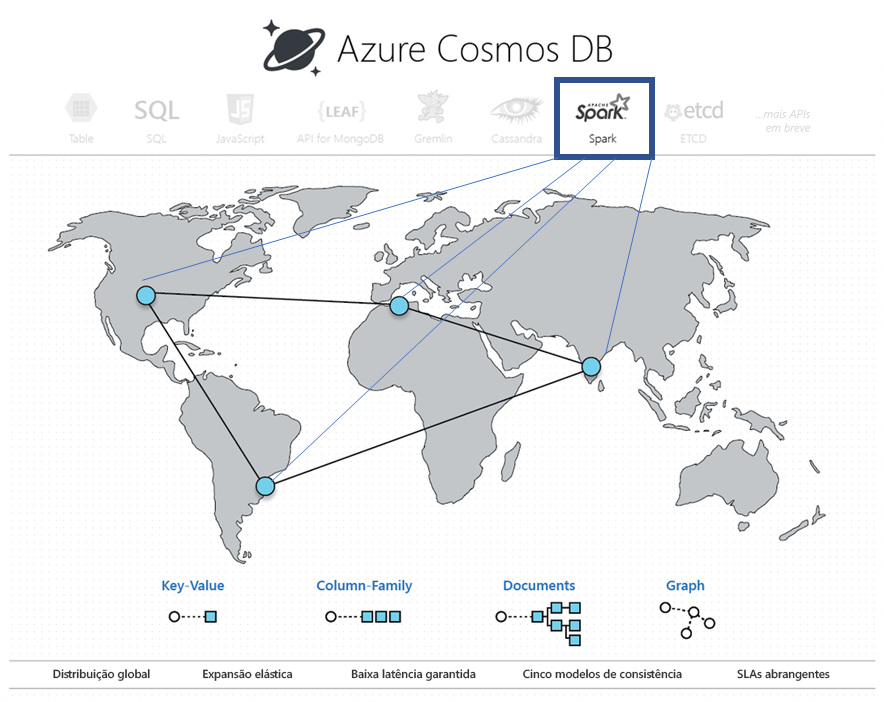
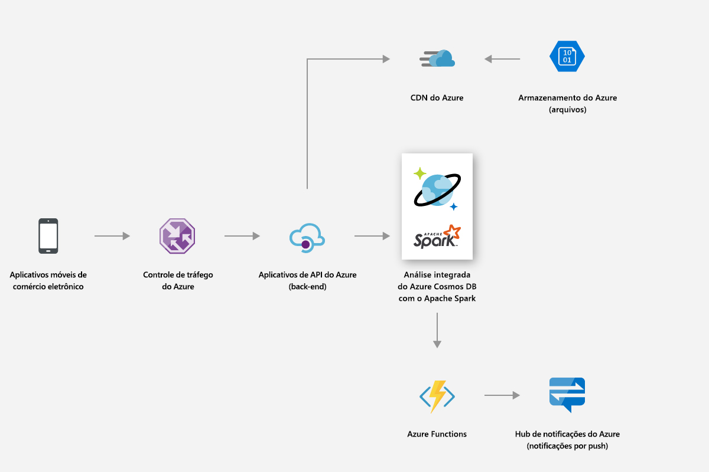
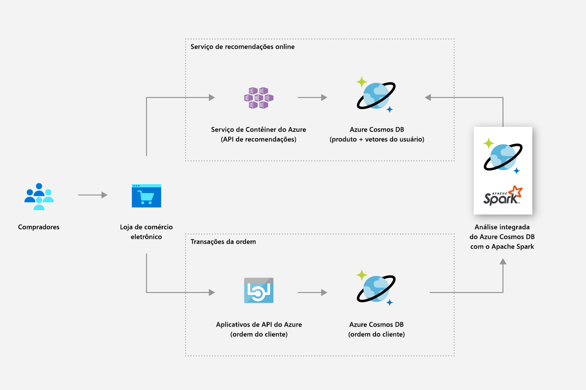
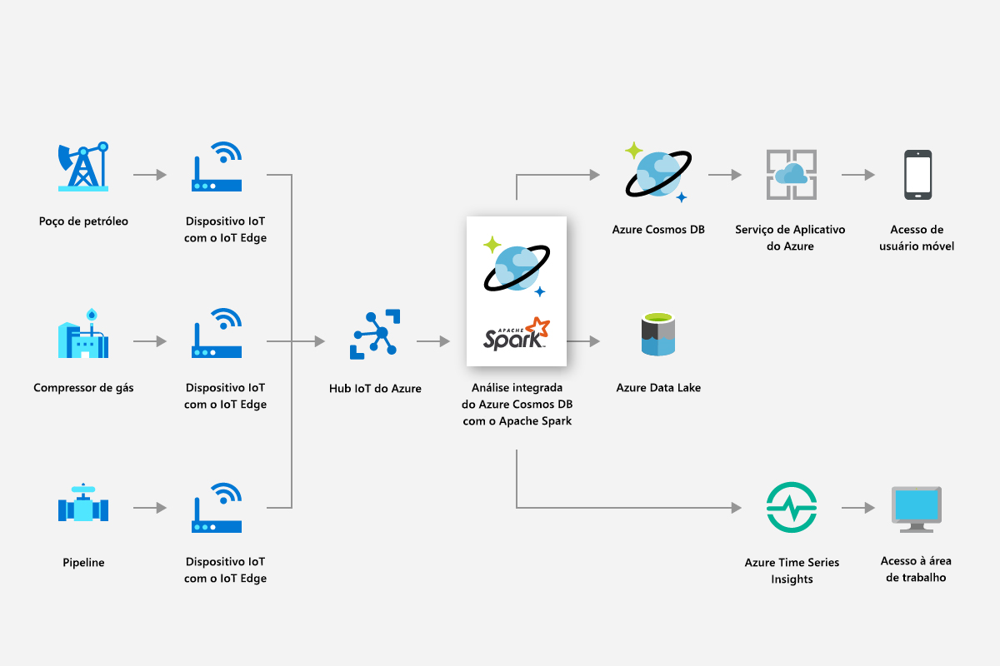
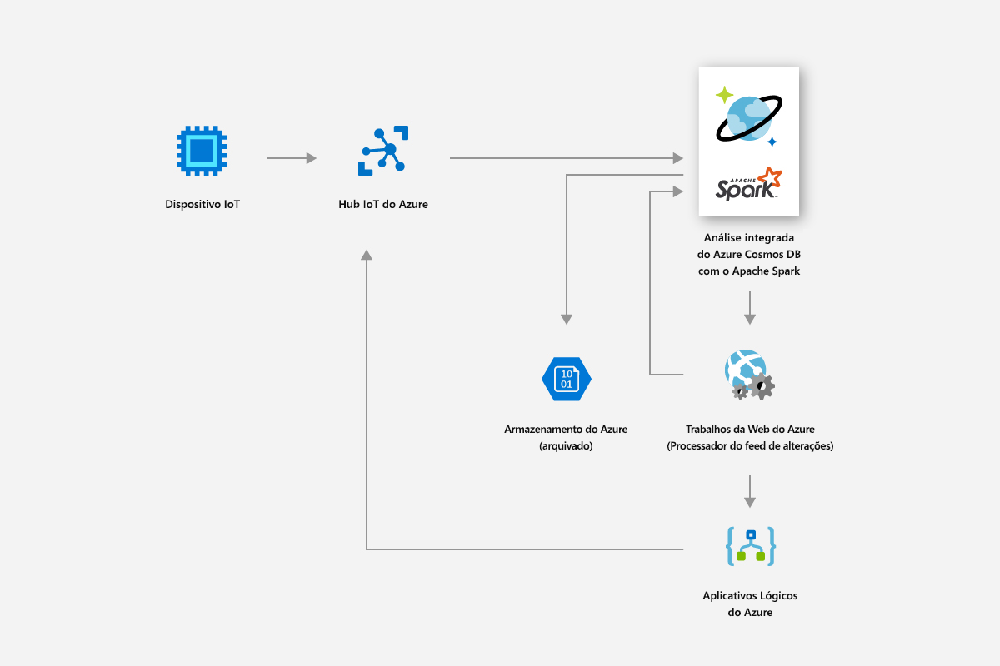
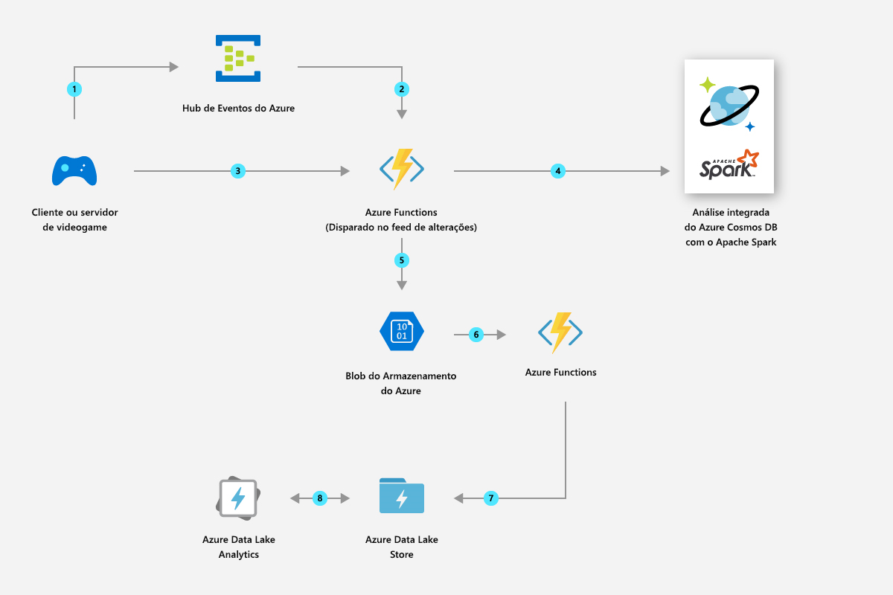

# Análise operacional interna no Azure Cosmos DB com o Apache Spark (versão prévia) 

O suporte interno para o Apache Spark no Azure Cosmos DB permite que você execute uma análise no Apache Spark de seus dados armazenados em uma conta do Azure Cosmos. Ele fornece o suporte nativo para que os trabalhos do Apache Spark sejam executados diretamente nos bancos de dados do Cosmos distribuídos globalmente. Com esses recursos, os desenvolvedores, engenheiros de dados e os cientistas de dados podem usar o Azure Cosmos DB como uma plataforma de dados flexível, escalonável e de alto desempenho para executar as cargas de trabalho **OLTP e OLAP/HTAP**. 

A computação do Spark está automaticamente disponível em todas as regiões do Azure associadas à sua conta do Azure Cosmos. Os trabalhos de Spark usam a funcionalidade de vários mestre do Azure Cosmos DB e podem gravar ou consultar as réplicas locais de cada região. 

> [!NOTE]
> Atualmente, o suporte interno para o Apache Spark no Azure Cosmos DB está em versão prévia limitada. Para inscrever-se para a versão prévia, navegue até a [página de inscrição para a versão prévia](https://portal.azure.com/?feature.customportal=false#create/Microsoft.DocumentDB). 

O suporte do Apache Spark no Azure Cosmos DB oferece os seguintes benefícios:

* É possível obter o melhor tempo à análise de dados e usuários distribuídos geograficamente.

* É possível simplificar a arquitetura da solução e diminuir o [Custo Total de Propriedade](total-cost-ownership.md) (TCO). O sistema terá o menor número de componentes de processamento de dados e evitará qualquer movimentação de dados desnecessária entre eles.

* Cria uma [segurança](secure-access-to-data.md), [conformidade](compliance.md) e o limite de auditoria que abrange todos os dados em gerenciamento.

* Fornece análises “sempre ativas” ou [altamente disponíveis](high-availability.md) do usuário final que contam com SLAs rigorosos.

 
Usando o suporte do Apache Spark no Azure Cosmos DB, você pode criar e implantar soluções, como modelos de aprendizado profundo e IA, análise preditiva, recomendações, IoT, cliente 360, detecção de fraudes, sentimento do texto e análise da sequência de cliques. Essas soluções funcionam diretamente em seus dados do Azure Cosmos DB.

É possível configurar o lote e trabalho ETL de streaming no Azure Cosmos DB, sem ter que sair do serviço de banco de dados ou de serviços de computação adicionais. Você pode dimensionar elasticamente o ambiente de computação quando você precisa realizar o trabalho ETL e reduzi-lo novamente quando o trabalho é concluído.

O suporte do Apache Spark no Azure Cosmos DB oferece suporte interno do Machine Learning nos tempos de execução do Apache Spark. Os tempos de execução incluem Spark MLLib, Microsoft Machine Learning para Apache Spark, Azure Machine Learning e Serviços Cognitivos. Com esses recursos, os cientistas de dados, engenheiros de dados e analistas de dados podem criar e operacionalizar os modelos de machine learning diretamente no Azure Cosmos DB, em uma fração de tempo e com baixo custo.

## Principais benefícios

### Análises operacionais de baixa latência distribuídas globalmente

Com o Apache Spark no banco de dados distribuído globalmente do Azure Cosmos, agora você pode obter tempo de insight rapidamente em todo o mundo. O Azure Cosmos DB possibilita **análise operacional de baixa latência distribuída globalmente** em escala elástica com três técnicas principais:

* Uma vez que seu banco de dados do Azure Cosmos é distribuído globalmente, todos os dados são ingeridos localmente, onde se encontram os produtores de dados (por exemplo, os usuários). As consultas são atendidas em relação às réplicas locais mais próximas de produtores e consumidores de dados, independentemente de onde estejam localizados no mundo. 

* Todas as suas consultas analíticas são executadas diretamente nos dados armazenados indexados dentro de partições de dados precisar de nenhuma movimentação de dados desnecessários. 

* Como o Apache Spark é colocado com o Azure Cosmos DB, menos traduções intermediárias e movimentações de dados ocorrem, resultando em um melhor desempenho e escalabilidade.

### Experiência unificada sem servidor para o Apache Spark

Como um banco de dados multimodelo, o Azure Cosmos DB agora expande seu suporte para APIs OSS, fornecendo uma **experiência sem servidor unificada para o Apache Spark** com chave-valor, documento, grafo, modelos de dados da família de coluna. Modelos de dados diferentes têm suporte usando o MongoDB, Cassandra, Gremlin, Etcd e APIs do SQL, todos operando nos mesmos dados subjacentes. 

Com o suporte do Apache Spark no Azure Cosmos DB, você pode dar suporte nativo a aplicativos escritos em Scala, Python e Java e usar várias bibliotecas diretamente integradas para SQL. Essas bibliotecas incluem ([Spark SQL](https://spark.apache.org/sql/)), machine learning (Apache Spark [MLlib](https://spark.apache.org/mllib/)), processamento de streaming ([Streaming Estruturado do Apache Spark](https://spark.apache.org/streaming/)) e o processamento de grafos (Spark [GraphFrames]( https://docs.databricks.com/spark/latest/graph-analysis/graphframes/user-guide-python.html)). Essas ferramentas facilitam usar o Apache Spark para uma série de casos de uso. Não é necessário lidar com o gerenciamento do Apache Spark ou clusters do Apache Spark. É possível usar as APIs do Apache Spark e **notebooks Jupyter** para análise e API do SQL ou qualquer uma das APIs OSS NoSQL, como Cassandra para processamento transacional nos mesmos dados subjacentes ao mesmo tempo.

### Sem gerenciamento de esquema ou de índice

Ao contrário dos bancos de dados analíticos tradicionais, com o Azure Cosmos DB, os engenheiros e cientistas de dados não precisam mais lidar com o esquema complicado e o gerenciamento de índice. O mecanismo de banco de dados no Azure Cosmos DB não exige gerenciamento explícito de esquema ou índice e é capaz de indexar automaticamente todos os dados ingeridos para servir as consultas do Apache Spark rapidamente. 

### Opções de consistência

Como os trabalhos do Apache Spark são executados nas partições de dados do seu banco de dados Azure Cosmos, as consultas apresentaram as [cinco opções de consistência bem definidas](consistency-levels.md). Esses modelos de consistência oferecem a flexibilidade de escolher consistência estrita para fornecer os resultados mais precisos para algoritmos de machine learning sem comprometer a latência e a alta disponibilidade. 

### SLAs abrangentes

Os trabalhos do Apache Spark terão os benefícios do Azure Cosmos DB como líder abrangente do setor [SLAs](https://azure.microsoft.com/support/legal/sla/documentdb/v1_1/) (99,999) sem sobrecarga de gerenciamento de clusters separados do Apache Spark. Esses SLAs abrangem a taxa de transferência, latência no 99 º percentil, consistência e alta disponibilidade. 

### Cargas de trabalho mistas

A integração do Apache Spark no Azure Cosmos DB associa a separação transacional e analítica, que tem sido um dos pontos problemáticos importantes do cliente ao criar aplicativos nativos de nuvem em escala global. 

## Cenários de suporte ao Spark do Azure Cosmos DB

### Varejo e bens de consumo

Você pode usar o suporte ao Spark no Azure Cosmos DB para fornecer recomendações e ofertas em tempo real. Você pode ajudar os clientes a descobrir os itens de que eles precisam com personalização e recomendações de produtos em tempo real.

* Você pode usar o suporte interno ao Machine Learning fornecido pelo tempo de execução do Apache Spark para gerar recomendações em tempo real em todos os catálogos de produtos.

* Você pode fazer a mineração com um clique de dados de fluxo, de compra e do cliente para fornecer recomendações direcionadas que promovem valor por todo o tempo de vida.

* Usando o recurso de distribuição global do Azure Cosmos DB, grandes volumes de dados do produto que são distribuídos entre regiões podem ser analisados em milissegundos.

* Você pode obter insights rapidamente para os usuários e dados distribuídos geograficamente. Você pode melhorar a taxa de conversão das promoções oferecendo o anúncio certo ao usuário correto, no momento exato.

* Você pode aproveitar a funcionalidade de streaming interna do Spark para enriquecer dados ao vivo, combinando-os com os dados estáticos do cliente. Dessa forma, você pode fornecer anúncios mais personalizados e direcionados em tempo real, dentro do contexto daquilo que os clientes estão fazendo.

A imagem a seguir mostra como o suporte ao Spark no Azure Cosmos DB é usado para otimizar o preço e as promoções:

A imagem a seguir mostra como o suporte ao Spark no Azure Cosmos DB é usado no mecanismo de recomendação em tempo real:

### Manufatura e IoT

A plataforma de análise interna do Azure Cosmos DB permite que você habilite a análise em tempo real de dados de IoT de milhões de dispositivos em escala global. Você pode realizar inovações modernas como prever padrões meteorológicos, análise preditiva e otimizações de energia.

* Usando o Azure Cosmos DB, você pode fazer a mineração de dados como métricas de ativos em tempo real e fatores meteorológicos e, em seguida, aplicar análise de grade inteligente para otimizar o desempenho de dispositivos conectados no campo. A Análise de grade inteligente é a chave para controlar os custos operacionais, melhorar a confiabilidade da grade e fornecer serviços de energia personalizados aos consumidores.

A imagem a seguir mostra como o suporte ao Spark no Azure Cosmos DB é usado para ler métricas de dispositivos IoT e aplicar a análise de grade inteligente:

### Manutenção preditiva

* A manutenção de ativos, como compactadores usados em pequenas plataformas de perfuração, para uso em plataformas de águas profundas é um esforço complexo. Esses ativos estão localizados em todo o mundo e geram petabytes de dados. Usando Azure Cosmos DB, você pode criar um pipeline de dados preditivos de ponta a ponta que usa o streaming do Spark para processar grandes quantidades de dados de telemetria de sensor, peças de ativos armazenados e mapeamentos de sensor.

* Você pode criar e implantar modelos de machine learning para prever falhas de ativos antes que elas ocorram e emitir ordens de trabalho de manutenção em caráter preventivo.

A imagem a seguir mostra como o suporte ao Spark no Azure Cosmos DB é usado para criar um sistema de manutenção preditiva:

A imagem a seguir mostra como o suporte ao Spark no Azure Cosmos DB é usado para criar um sistema de diagnóstico de veículo em tempo real:

### Jogos

* Com o suporte interno ao Spark, o Azure Cosmos DB permite que você crie, dimensione e implante com facilidade modelos de análise avançada e modelos de machine learning em questão de minutos, a fim de criar a melhor experiência de jogos possível.

* Você pode analisar o player, a compra e os dados comportamentais para criar ofertas personalizadas relevantes a fim de obter elevadas taxas de conversão.

* Usando o aprendizado de máquina do Spark, você pode analisar e obter insights sobre dados de telemetria de jogos. Você pode diagnosticar e evitar lentidão no tempo de carregamento e problemas no jogo.

A imagem a seguir mostra como o suporte ao Spark no Azure Cosmos DB é usado na análise de jogos:

## Suporte interno para Jupyter notebooks

O Azure Cosmos DB dá suporte a Blocos de notas do Jupyter internos para todas as APIs, como Cassandra, MongoDB, SQL, Gremlin e Table. Os blocos de notas do Jupyter são executados em contas do Azure Cosmos e aprimoram a experiência do desenvolvedor. O suporte interno para notebook para todas as APIs e modelos de dados do Azure Cosmos DB permite que você execute consultas de forma interativa. Você também pode executar modelos de aprendizado de máquina e analisar os dados armazenados nos bancos de dados Azure Cosmos. Com a experiência do Jupyter notebook, você pode analisar os dados armazenados, compilar e treinar modelos de aprendizado de máquina e executar inferência nos dados no portal do Azure, conforme mostrado na imagem a seguir:

## Próximas etapas

* Para saber mais sobre os benefícios do Azure Cosmos DB, consulte o artigo de [visão geral](introduction.md).
* [Introdução à API do Azure Cosmos DB para MongoDB](mongodb-introduction.md)
* [Introdução à API do Cassandra no Azure Cosmos DB](cassandra-introduction.md)
* [Introdução à API do Gremlin no Azure Cosmos DB](graph-introduction.md)
* [Introdução à API de Tabela no Azure Cosmos DB](table-introduction.md)

