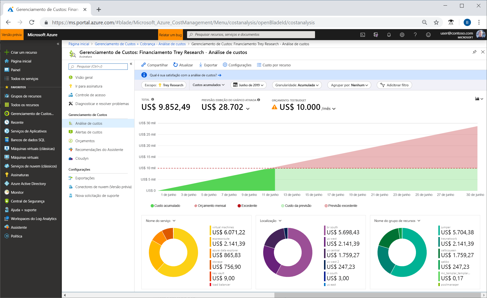
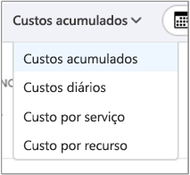
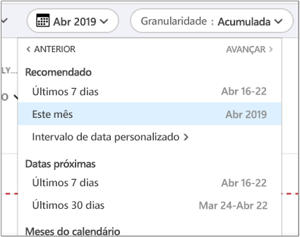
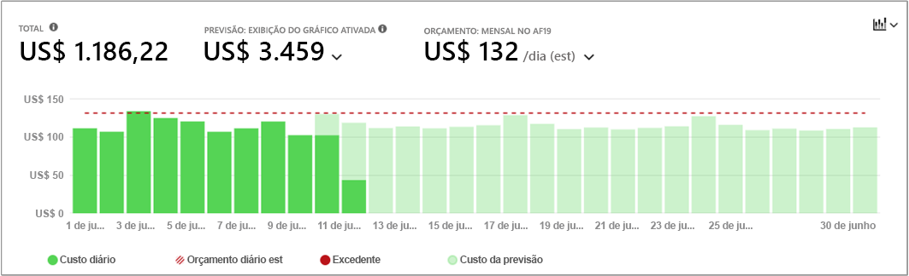
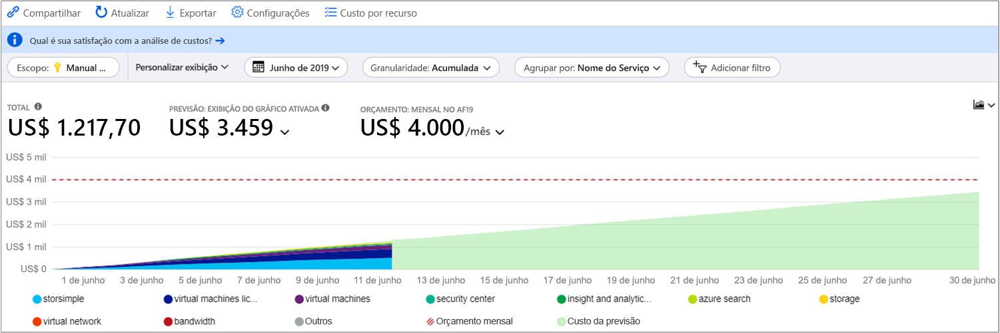
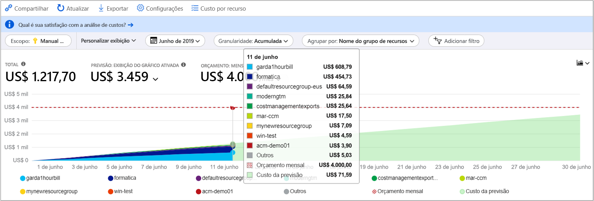
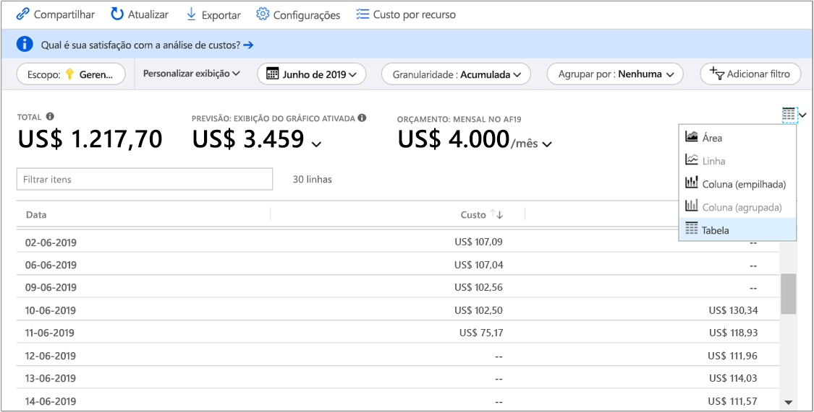

# Início Rápido: Explorar e analisar os custos com análise de custo

Antes de poder controlar e otimizar adequadamente seus custos do Azure, você precisa entender onde os custos se originaram em sua organização. Também é útil saber quanto dinheiro seus serviços custam e em apoio a quais ambientes e sistemas. A visibilidade em todo o espectro de custos é fundamental para entender com precisão os padrões de gastos da organização. Os padrões de gastos podem ser usados para impor mecanismos de controle de custos, como orçamentos.

Neste início rápido, você usa a análise de custo para explorar e analisar seus custos organizacionais. Você pode visualizar os custos agregados por organização para entender onde os custos ocorrem ao longo do tempo e identificar tendências de gastos. Você pode visualizar os custos acumulados ao longo do tempo para estimar as tendências de custo mensais, trimestrais ou mesmo anuais em comparação a um orçamento. Um orçamento ajuda a fornecer aderência às restrições financeiras. E um orçamento é usado para visualizar os custos diários ou mensais para isolar as irregularidades de gastos. E, então, você pode baixar dados do relatório atual para análise posterior ou para usar em um sistema externo.

Neste guia de início rápido, você aprende a:

- Examine os custos de análise de custo
- Personalizar as exibições de custo
- Baixar dados de análise de custo

## Pré-requisitos

A análise de custo dá suporte a diferentes tipos de conta do Azure. Para exibir a lista completa dos tipos de contas compatíveis, confira [Entender os dados do Gerenciamento de Custos](understand-cost-mgt-data.md). Para exibir os dados de custo, você precisará de, pelo menos, acesso de leitura em sua conta do Azure.

Para clientes do [EA (Contrato Enterprise)](https://azure.microsoft.com/pricing/enterprise-agreement/), é necessário ter, pelo menos, acesso de leitura a um ou mais dos escopos a seguir para exibir os dados de custo.

- Conta de cobrança
- department
- Conta de registro
- Grupo de gerenciamento
- Assinatura
- Grupo de recursos

Para saber mais sobre como atribuir acesso aos dados de Gerenciamento de Custos, consulte [Atribuir acesso aos dados](assign-access-acm-data.md).

## Entrar no Azure

- Entre no Portal do Azure em https://portal.azure.com.

## Examine os custos de análise de custo

Para examinar os custos de análise de custo, abra o escopo no portal do Azure e selecione **Análise de custo** no menu. Por exemplo, navegue até **Inscrições**, selecione uma assinatura na lista e, em seguida, selecione **Análise de custo** no menu. Use o item **Escopo** para alterar para um escopo diferente na análise de custo. Para obter mais informações sobre escopos, consulte [Entender e trabalhar com escopos](understand-work-scopes.md).

O escopo que você seleciona é usado em todo o Gerenciamento de Custos para fornecer a consolidação de dados e para controlar o acesso a informações de custo. Ao usar escopos, você não faz multisseleção. Em vez disso, selecione um escopo mais amplo em que os outros fiquem acumulados e, em seguida, filtre os escopos aninhados de que você precisa. É importante compreender essa abordagem, pois algumas pessoas podem não ter acesso a um escopo pai único, que abranja vários escopos aninhados.

A visão inicial da análise de custos inclui as seguintes áreas:

**Total** - Mostra o custo total do mês atual.

**Orçamento** - Mostra o limite de gastos planejados para o escopo selecionado, se disponível.

**Custo acumulado**: mostra o total de gastos diários agregados, a partir do início do mês. Depois que você [criar um orçamento](tutorial-acm-create-budgets.md) para sua conta de faturamento ou assinatura, poderá ver rapidamente sua tendência de gastos em relação ao orçamento. Passe o mouse sobre uma data para visualizar o custo acumulado desse dia.

**Gráficos dinâmicos (donut)** - Fornecem dinâmicos pivots, dividindo o custo total por um conjunto comum de propriedades padrão. Eles mostram do maior ao menor custo para o mês atual. Você pode alterar gráficos dinâmicos a qualquer momento selecionando um pivô diferente. Os custos são categorizados por: serviço (categoria do medidor), localização (região) e escopo filho por padrão. Por exemplo, contas de inscrição em contas de faturamento, grupos de recursos em assinaturas e recursos em grupos de recursos.

## Personalizar as exibições de custo

A análise de custo tem quatro modos de exibição internos, otimizados para os objetivos mais comuns:

Visualizar | Responder a perguntas como...
--- | ---
Custo acumulado | Quanto gastei até o momento neste mês? Será permanecer dentro do meu orçamento?
Custo diário | Houve algum aumento nos custos diários nos últimos 30 dias?
Custo por serviço | Como meu uso mensal variou nas últimas três faturas?
Custo por recurso | Quais recursos custam mais até o momento neste mês?

No entanto, existem muitos casos em que você precisa de uma análise mais profunda. A personalização começa no topo da página, com a seleção da data.

Análise de custo mostra os dados para o mês atual por padrão. Use o seletor de data para alternar para os intervalos de datas comuns rapidamente. Alguns exemplos incluem os últimos sete dias, último mês, ano atual ou um intervalo de datas personalizado. As assinaturas para pagamento conforme o uso também incluem os intervalos de datas com base em seu período de cobrança, que não está associado ao mês do calendário, como o período de cobrança atual ou a última fatura. Use os links **<ANTERIOR** e **PRÓXIMO>** na parte superior do menu para saltar para o período anterior ou seguinte, respectivamente. Por exemplo, **<ANTERIOR** alternará dos últimos sete dias para 8 a 14 dias atrás e, em seguida, 15 a 21 dias atrás.

A análise de custo mostra **custos acumulados** por padrão. Os custos acumulados incluem todos os custos para cada dia mais os dias anteriores, para uma visão em constante crescimento de seus custos diários agregados. Essa visualização é otimizada para mostrar como você está tendendo contra um orçamento para o período selecionado.

Há também a visualização **diária** mostrando os custos para cada dia. O modo de exibição de diário não mostra uma tendência de crescimento. A exibição é projetada para mostrar irregularidades como picos de custos ou quedas diárias. Se você tiver selecionado um orçamento, a visualização diária também mostrará uma estimativa do orçamento diário. Quando seus custos diários estão consistentemente acima do orçamento diário estimado, você pode esperar que ultrapasse seu orçamento mensal. O orçamento diário estimado é simplesmente um meio de ajudar você a visualizar seu orçamento em um nível inferior. Quando você tem flutuações nos custos diários, a comparação do orçamento diário estimado com o orçamento mensal é menos precisa.

Em geral, você pode esperar ver dados ou notificações para os recursos consumidos dentro de 8 a 12 horas.

**Agrupar por** propriedades comuns para dividir os custos e identificar os principais colaboradores. Para agrupar por marcas de recurso, por exemplo, selecione a chave de marca pela qual deseja agrupar. Os custos estão divididos por cada valor de marca, com um segmento extra para recursos sem essa marca aplicada.

A maioria dos [recursos do Azure permitem marcas](../azure-resource-manager/tag-support.md), no entanto, algumas marcas não estão disponíveis no Gerenciamento de Custos e Cobrança. Além disso, não há suporte para marcas do grupo de recursos. O Gerenciamento de Custos é compatível apenas com marcas de recurso a partir da data em que as marcas são aplicadas diretamente ao recurso. Assista ao vídeo [How to review tag policies with Azure Cost Management](https://www.youtube.com/watch?v=nHQYcYGKuyw) (Como revisar as políticas de marcação com o Gerenciamento de Custos do Azure) para saber mais sobre como usar a política de marcação do Azure a fim de melhorar a visibilidade dos dados de custo.

Aqui está uma exibição dos custos de serviço do Azure para uma exibição do último mês.

Gráficos dinâmicos sob os gráficos principais exibem diferentes agrupamentos para dar uma visão mais ampla dos custos gerais para o período de tempo e filtros selecionados. Selecione uma propriedade ou uma marca para exibir os custos agregados em qualquer dimensão.

A imagem anterior mostra nomes de grupos de recursos. Embora você possa agrupar por marca para exibir os custos totais por marca, a exibição de todas as marcas por recurso ou grupo de recursos não está disponível nenhum dos modos de exibição de análise de custo.

Ao agrupar os custos segundo um atributo específico, os 10 principais colaboradores de custo são mostrados, do mais alto para o mais baixo. Se houver mais de 10, os nove principais colaboradores de custo serão mostrados com um grupo **Outros**, que abrange todos os grupos restantes juntos. Ao agrupar por marcas, você também poderá ver um grupo **Sem marca** para custos sem a chave de marca aplicada. Os custos **Sem marca** aparecem sempre por último, mesmo que os custos sem marca sejam maiores do que os com marca. Os custos sem marca farão parte da categoria **Outros** se houver 10 ou mais valores de marca.

As máquinas virtuais *Clássicas*, as redes e os recursos de armazenamento não compartilham dados detalhados de cobrança. Eles são mesclados como **Serviços clássicos** quando os custos são agrupados.

Você pode exibir o conjunto de dados completo de qualquer exibição. As seleções ou os filtros aplicados afetam os dados apresentados. Para ver o conjunto de dados completo, clique na lista **tipo de gráfico** e, em seguida, clique na exibição **Tabela**.

## Baixar dados de análise de custo

Você pode **Fazer o download** de informações da análise de custo para gerar um arquivo CSV para todos os dados mostrados atualmente no portal do Azure. Quaisquer filtros ou agrupamentos aplicados são incluídos no arquivo. Dados subjacentes para o topo O gráfico total que não é exibido ativamente está incluído no arquivo CSV.

## Próximas etapas

Avance para o primeiro tutorial para aprender como criar e gerenciar orçamentos.

> [!div class="nextstepaction"]
> [Crie e gerencie orçamentos](tutorial-acm-create-budgets.md)
