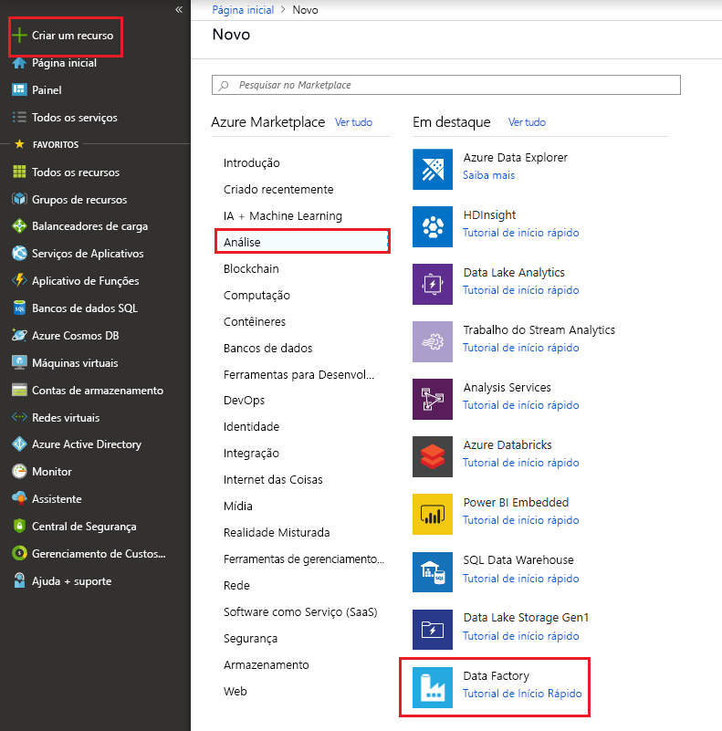

# Copiar dados do Azure Data Lake Storage Gen1 para Gen2 com o Azure Data Factory

O Azure Data Lake Storage Gen2 é um conjunto de recursos dedicados à análise de Big Data, criado no [armazenamento de Blobs do Azure](../storage/blobs/storage-blobs-introduction.md). Ele permite que você faça interface com seus dados usando os paradigmas de sistema de arquivos e armazenamento de objetos.

Se você estiver usando atualmente o Azure Data Lake Store Gen1, você pode avaliar a nova funcionalidade do Gen2 ao copiar dados do Data Lake Store Gen1 para o Gen2 usando o Azure Data Factory.

O Azure Data Factory é um serviço de integração de dados baseado em nuvem completamente gerenciado. É possível usar o serviço para preencher o Data Lake com dados de um conjunto avançado de armazenamentos de dados locais e baseados em nuvem e economizar tempo ao compilar as soluções de análise. Para obter uma lista detalhada de conectores com suporte, consulte a tabela de [Suporte para repositórios de dados](copy-activity-overview.md#supported-data-stores-and-formats).

O Azure Data Factory oferece uma solução de movimentação de dados gerenciados de expansão. Devido à arquitetura de expansão do ADF, é possível ingerir dados com alta taxa de transferência. Para obter detalhes, consulte [Desempenho da atividade de cópia](copy-activity-performance.md).

Este artigo descreve como usar a ferramenta Copiar Dados do Data Factory para copiar dados do _Azure Data Lake Store Gen1_ no _Azure Data Lake Store Gen2_. Você pode seguir as etapas semelhantes para copiar dados de outros tipos de armazenamentos de dados.

## Pré-requisitos

* Assinatura do Azure: Se você não tiver uma assinatura do Azure, crie uma [conta gratuita](https://azure.microsoft.com/free/) antes de começar.
* Conta do Azure Data Lake Store Gen1 contendo dados.
* Conta de Armazenamento do Azure com o Data Lake Storage Gen2 habilitado: Se você não tiver uma conta de armazenamento [criar uma conta](https://ms.portal.azure.com/#create/Microsoft.StorageAccount-ARM).

## Criar uma data factory

1. No menu à esquerda, selecione **Criar um recurso** > **Dados + Análise** > **Data Factory**:
   
   

2. Na página **Novo data factory**, forneça os valores para os campos que estão mostrados na imagem a seguir: 
      
   
 
    * **Nome**: Insira um nome globalmente exclusivo para o Azure Data Factory. Se você receber o erro "Nome do Data factory \"LoadADLSDemo\" não está disponível," digite um nome diferente para o data factory. Por exemplo, use o nome _**seunome**_**ADFTutorialDataFactory**. Tente criar o data factory novamente. Para ver as regras de nomenclatura de artefatos do Data Factory, confira [Regras de nomenclatura do Data Factory](naming-rules.md).
    * **Assinatura**: Selecione a assinatura do Azure para criar o Data Factory. 
    * **Grupo de recursos**: Selecione um grupo de recursos existente na lista suspensa ou selecione a opção **Criar novo** e insira o nome de um grupo de recursos. Para saber mais sobre grupos de recursos, consulte [Usando grupos de recursos para gerenciar recursos do Azure](../azure-resource-manager/resource-group-overview.md).  
    * **Versão**: Selecione **V2**.
    * **Localização**: Selecione o local para o data factory. Somente os locais com suporte são exibidos na lista suspensa. Os armazenamentos de dados que são usados pela data factory podem estar em outros locais e regiões. 

3. Selecione **Criar**.
4. Após a conclusão da criação, vá para o seu data factory. Você verá a home page **Data Factory** conforme mostrado na imagem a seguir: 
   
   

   Selecione o bloco **Autor & Monitor** para iniciar o aplicativo de integração de dados em uma guia separada.

## Carregar dados no Azure Data Lake Store Gen2

1. Na página **Introdução**, selecione o bloco **Copy Data** para iniciar a ferramenta Copy Data: 

   
2. Na página **Propriedades**, especifique Copy Data, especifique **CopyFromADLSGen1ToGen2** para o campo **Nome da tarefa** e clique em **Avançar**:

    
3. Na página **Armazenamento de dados de origem**, clique em **+Criar nova conexão**:

    
    
    Selecione **Azure Data Lake Store Gen1** na galeria de conectores e selecione **Continuar**
    
    
    
4. Na página **Especificar conexão do Azure Data Lake Store Gen1**, siga as seguintes etapas:
   1. Selecione o Data Lake Storage Gen1 para o nome da conta e especifique ou valide o **Locatário**.
   2. Clique em **Testar conectividade** para validar as configurações e selecione **Concluir**.
   3. Você verá uma nova conexão ser criada. Selecione **Avançar**.
   
   > [!IMPORTANT]
   > Neste passo a passo, você deve usar uma identidade gerenciada para recursos do Azure para autenticar o Data Lake Storage Gen1. Verifique se você concedeu as permissões corretas no Azure Data Lake Store Gen1 ao MSI seguindo [essas instruções](connector-azure-data-lake-store.md#managed-identity).
   
   
      
5. Na página **Escolher arquivo de entrada ou pasta** página, navegue até a pasta e o arquivo que você deseja copiar. Selecione a pasta/arquivo, selecione **Escolher**:

    

6. Especifique o comportamento da cópia, marcando as opções **Copiar arquivos recursivamente** e **Cópia binária**. Selecione **Avançar**:

    
    
7. Na página **Armazenamento de dados de destino**, clique em **+ Criar nova conexão**, selecione **Azure Data Lake Storage Gen2** e **Continuar**:

    

8. Na página **Especificar conexão do Azure Data Lake Store Gen2**, siga as seguintes etapas:

   1. Selecione a conta do Data Lake Store Gen2 compatível na lista suspensa "Nome da conta de armazenamento".
   2. Selecione **Concluir** para criar a conexão. Em seguida, selecione **Avançar**.
   
   

9. No **escolha o arquivo de saída ou a pasta** , insira **copyfromadlsgen1** como o nome da pasta de saída e selecione **próxima**. ADF criará o sistema de arquivos ADLS Gen2 correspondente e as subpastas como durante a cópia se ele não existir.

    

10. Na página **Configurações**, selecione **Avançar** para usar as configurações padrão.

11. Na página **Resumo**, examine as configurações e selecione **Avançar**:

    
12. Na **Página de implantação**, selecione **Monitorar** para monitorar o pipeline:

    
13. Observe que a guia **Monitor** à esquerda é selecionada automaticamente. A coluna **Ações** inclui links para exibir detalhes da execução da atividade e executar o pipeline novamente:

    

14. Para exibir as execuções de atividade associadas com a execução do pipeline, selecione o link **Exibir as Execuções de Atividade** na coluna **Ações**. Há apenas uma atividade (atividade de cópia) no pipeline, assim, você vê apenas uma entrada. Para voltar à exibição de execuções de pipeline, selecione o link **Pipelines** na parte superior. Selecione **Atualizar** para atualizar a lista. 

    

15. Para monitorar os detalhes de execução de cada atividade de cópia, selecione o link **Detalhes** (imagem de óculos) em **Ações** na exibição de monitoramento de atividade. Você pode monitorar detalhes como o volume de dados copiados da fonte para o coletor, taxa de transferência de dados, etapas de execução com duração correspondente e configurações usadas:

    

16. Verifique se os dados são copiados para a conta do Data Lake Store Gen2.

## Práticas recomendadas

Para avaliar a atualização do armazenamento do Azure Data Lake (ADLS) Gen1 para Gen2 em geral, consulte [atualizar suas soluções de análise de big data do Gen1 de armazenamento do Azure Data Lake para o armazenamento do Azure Data Lake Gen2](../storage/blobs/data-lake-storage-upgrade.md). As seções a seguir apresentam as práticas recomendadas de como usar o ADF para atualização de dados do Gen1 para Gen2.

### Partição de dados para cópia de dados históricos

- Se o tamanho total de dados no ADLS Gen1 for menor que **30TB** e o número de arquivos é menor que **1 milhão**, você pode copiar todos os dados em execução de atividade de cópia única.
- Se você tiver um tamanho maior de dados a serem copiados, ou você quiser flexibilidade para gerenciar a migração de dados em lotes e tornar cada um deles concluída dentro de uma janela de tempo específico, são sugeridas para particionar os dados, nesse caso, ela também pode reduzir o risco de qualquer iss inesperado UE.

Um PoC (prova de conceito) é altamente recomendável para verificar a solução de ponta a ponta e testar a taxa de transferência de cópia em seu ambiente. Etapas principais de fazer a prova de conceito: 

1. Criar um pipeline do ADF com atividade de cópia única para copiar vários TBs de dados do ADLS Gen1 para Gen2 ADLS para obter uma linha de base de desempenho de cópia, começando com [unidades de integração de dados (DIUs)](copy-activity-performance.md#data-integration-units) como 128. 
2. Com base na taxa de transferência de cópia que obter na etapa 1 #, calcule o tempo estimado necessário para a migração de dados inteiro. 
3. (Opcional) Criar uma tabela de controle e definir o filtro de arquivo para particionar os arquivos a serem migrados. A forma de particionar os arquivos da seguinte maneira: 

    - Particionado por nome de pasta ou nome de pasta com o filtro curinga (sugerido) 
    - Particionados por hora da última modificação do arquivo 

### S de armazenamento e largura de banda de rede 

Você pode controlar a simultaneidade de trabalhos de cópia do ADF que ler dados do ADLS Gen1 e Gen2 ADLS, gravação de dados para que você possa gerenciar o uso de e/s de armazenamento para não afetar o trabalho de negócios normais no ADLS Gen1 durante a migração.

### Permissões 

No Data Factory [ADLS Gen1 conector](connector-azure-data-lake-store.md) dá suporte a entidade de serviço e a identidade gerenciada para autenticações de recursos do Azure; [ADLS Gen2 conector](connector-azure-data-lake-storage.md) dá suporte a conta, chave de entidade de serviço e identidade gerenciada para autenticações de recursos do Azure. Para tornar o Data Factory capaz de navegar e copiar de que todos os arquivos/ACLs conforme necessário, verifique se que você alto concedeu permissões suficientes para a conta que você fornece acesso/ler/gravar todos os arquivos e define ACLs se você optar por. Sugerir para concedê-lo como a função super usuário/proprietário durante o período de migração. 

### Preservar as ACLs do Data Lake Storage Gen1

Se você deseja replicar as ACLs, juntamente com os arquivos de dados ao atualizar do Data Lake armazenamento Gen1 para Gen2, consulte [preservar ACLs do Data Lake armazenamento Gen1](connector-azure-data-lake-storage.md#preserve-acls-from-data-lake-storage-gen1). 

### Cópia incremental 

Várias abordagens podem ser usadas para carregar apenas os arquivos novos ou atualizados do ADLS Gen1:

- Carregar arquivos novos ou atualizados por tempo particionado pasta ou nome de arquivo, por exemplo, / 2019/05/13 / *;
- Carregar arquivos novos ou atualizados por LastModifiedDate;
- Identificar arquivos novos ou atualizados por qualquer ferramenta de terceiros 3ª/solução e, em seguida, passar o nome de arquivo ou pasta para o pipeline do ADF por meio do parâmetro ou um tabela/arquivo.  

A frequência apropriada para fazer o carregamento incremental depende do número total de arquivos no ADLS Gen1 e o volume de arquivo novo ou atualizado para ser carregado sempre.  

## Próximas etapas

> [!div class="nextstepaction"]
> [Visão geral da atividade de cópia](copy-activity-overview.md)
> [conector do Azure Data Lake armazenamento Gen1](connector-azure-data-lake-store.md)
> [conector do armazenamento do Azure Data Lake Gen2](connector-azure-data-lake-storage.md)