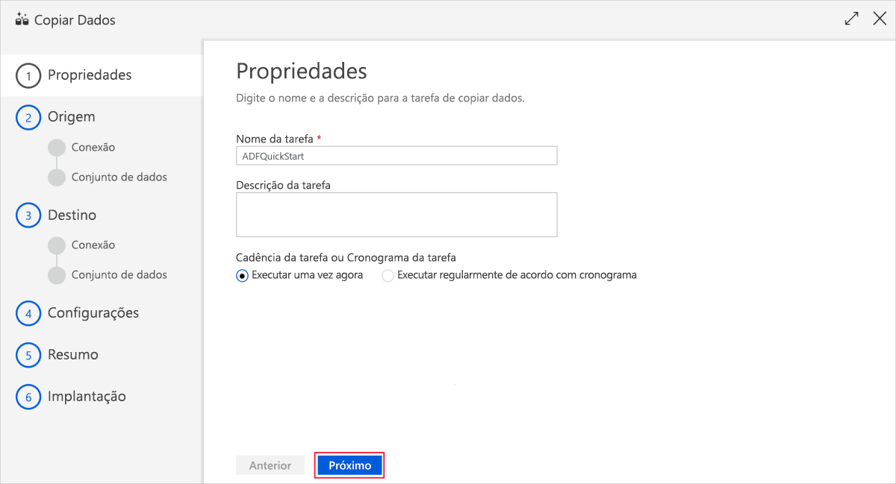
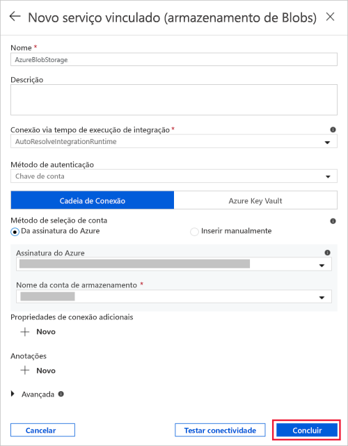
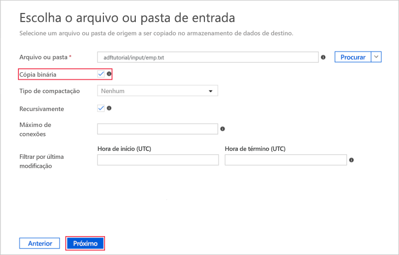
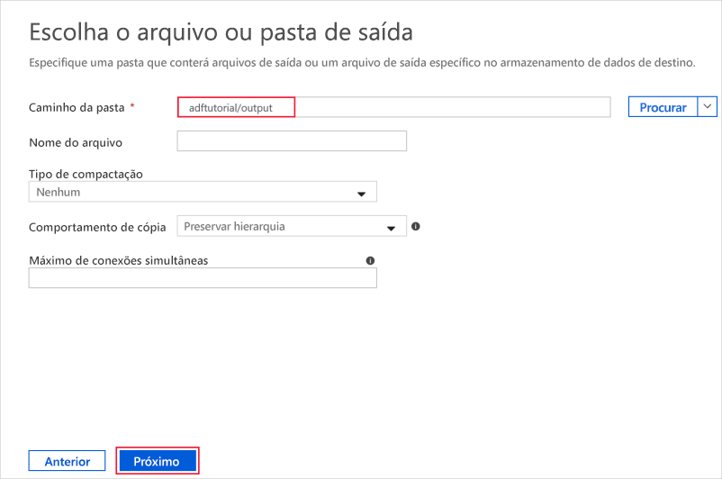
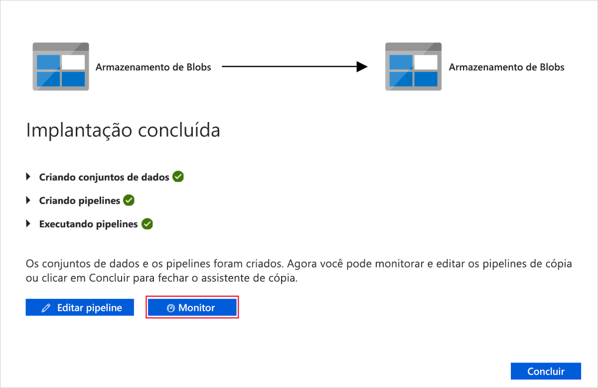

# Início Rápido: Use a ferramenta Copy Data para copiar dados

> [!div class="op_single_selector" title1="Selecione a versão do serviço Data Factory que está sendo usada:"]
> * [Versão 1](v1/data-factory-copy-data-from-azure-blob-storage-to-sql-database.md)
> * [Versão atual](quickstart-create-data-factory-copy-data-tool.md)

Neste guia de início rápido, você usa o Portal do Azure para criar um data factory. Em seguida, você usa a ferramenta Copy Data para criar um pipeline que copia dados de uma pasta no armazenamento de Blobs do Azure para outra pasta. 

> [!NOTE]
> Se você for novo no Azure Data Factory, confira a [Introdução ao Azure Data Factory](data-factory-introduction.md) antes de fazer este guia de início rápido. 

[!INCLUDE [data-factory-quickstart-prerequisites](../../includes/data-factory-quickstart-prerequisites.md)] 

## Criar uma data factory

1. Iniciar o navegador da Web **Microsoft Edge** ou **Google Chrome**. Atualmente, a interface do usuário do Data Factory tem suporte apenas nos navegadores da Web Microsoft Edge e Google Chrome.
1. Vá para o [Portal do Azure](https://portal.azure.com). 
1. Selecione **Criar recurso** no menu à esquerda, depois **Análise** e, por fim, **Data Factory**. 
   
   
1. Na página **Novo data factory**, insira **ADFTutorialDataFactory** no campo **Nome**. 
 
   O nome do Azure Data Factory deve ser *globalmente exclusivo*. Se você visualizar o seguinte erro, altere o nome de data factory (por exemplo, **&lt;yourname&gt;ADFTutorialDataFactory**) e tente criar novamente. Para ver as regras de nomenclatura para artefatos do Data Factory consulte o artigo [Data Factory - regras de nomenclatura](naming-rules.md).
  
   
1. Para **Assinatura**, selecione a assinatura do Azure na qual você deseja criar o data factory. 
1. Para o **Grupo de Recursos**, use uma das seguintes etapas:
     
   - Selecione **Usar existente** e selecione um grupo de recursos existente na lista. 
   - Selecione **Criar novo**e insira o nome de um grupo de recursos.   
         
   Para saber mais sobre grupos de recursos, consulte [Usando grupos de recursos para gerenciar recursos do Azure](../azure-resource-manager/resource-group-overview.md).  
1. Para **Versão**, selecione **V2**.
1. Em **Local**, selecione uma localização para o data factory.

   A lista mostra somente os locais aos quais o Data Factory dá suporte e em que os metadados do Azure Data Factory serão armazenados. Os armazenamentos de dados associados (como o Armazenamento do Azure e o Banco de Dados SQL do Azure) e os serviços de computação (como o Azure HDInsight) usados pelo Data Factory podem ser executados em outras regiões.

1. Selecione **Criar**.

1. Após a criação, a página do **Data Factory** será exibida. Clique no bloco **Criar e Monitorar** para iniciar o aplicativo de interface do usuário (IU) do Azure Data Factory em uma guia separada.
   
   

## Iniciar a ferramenta Copy Data

1. Na página de **Introdução**, selecione o bloco **Copy Data** para iniciar a ferramenta Copy Data. 

   

1. Na página **Propriedades** da ferramenta de Cópia de dados, você pode especificar um nome para o pipeline e sua descrição e, depois, selecionar **Avançar**. 

   
1. Na página **Configurações do armazenamento de dados**, conclua as seguintes etapas:

    a. Clique em **+ Criar nova conexão** para adicionar uma conexão.

    b. Selecione **Armazenamento de Blobs do Azure** na galeria e, em seguida, selecione **Continuar**.

    c. Na página **Novo Serviço Vinculado (Armazenamento de Blobs do Azure)** , especifique um nome para o serviço vinculado. Selecione a conta de armazenamento na lista **Nome da conta de armazenamento**, teste a conexão e, em seguida, selecione **Concluir**. 

   

    d. Selecione o serviço vinculado recém-criado como fonte e, em seguida, clique em **Avançar**.

1. Na página **Escolha o arquivo de entrada ou a pasta**, execute as seguintes etapas:

   a. Clique em **Navegar** para navegar até a pasta **adftutorial/input**, selecione o arquivo **emp.txt** e, em seguida, clique em **Escolher**. 

   d. Marque a caixa de seleção **Cópia binária** para copiar o arquivo no estado em que se encontra e, em seguida, selecione **Avançar**. 

   

1. Na página **Armazenamento de dados de destino**, selecione o serviço vinculado do **Armazenamento de Blobs do Azure** que você criou e selecione **Avançar**. 

1. Na página **Escolher o arquivo ou a pasta de saída**, insira **adftutorial/output** no caminho de pasta e, em seguida, selecione **Avançar**. 

    

1. Na página **Configurações**, selecione **Avançar** para usar as configurações padrão. 

1. Na página **Resumo**, revise todas as configurações e selecione **Avançar**. 

1. Na página **Implantação concluída**, selecione **Monitor** para monitorar o pipeline que você criou. 

    

1. O aplicativo alterna para a guia **Monitor**. Confira o status do pipeline nesta guia. Selecione **Atualizar** para atualizar a lista. 
    
1. Selecione o link **Exibir execuções de atividade** na coluna **Ações**. O pipeline tem apenas uma atividade do tipo **Cópia**. 
    
1. Para exibir detalhes sobre a operação de cópia, selecione **Detalhes** (imagem de óculos) na coluna **Ações**. Para obter detalhes sobre as propriedades, confira [Visão geral da atividade de cópia](copy-activity-overview.md).

1. Verifique que o arquivo **emp.txt** foi criado na pasta de **saída** do contêiner **adftutorial**. O serviço Data Factory cria a pasta de saída automaticamente caso ela não exista. 

1. Alterne para a guia **Autor** acima da guia **Monitor** no painel esquerdo para que você possa editar serviços vinculados, conjuntos de dados e pipelines. Para saber mais sobre editá-los na IU do Data Factory, consulte [Criar um Data Factory usando o portal do Azure](quickstart-create-data-factory-portal.md).

## Próximas etapas
O pipeline neste exemplo copia dados de uma localização para outra em um Armazenamento de Blobs do Azure. Percorra os [tutoriais](tutorial-copy-data-portal.md) para saber mais sobre o uso do Data Factory em mais cenários. 