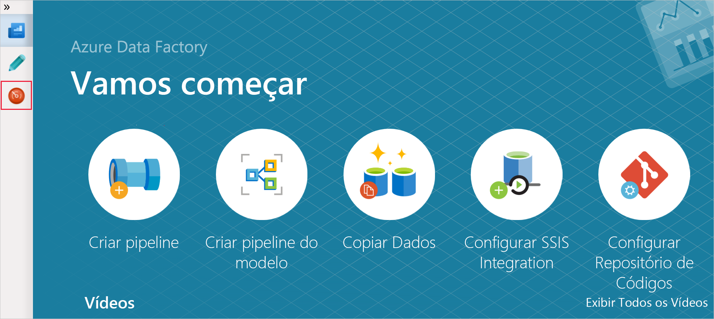
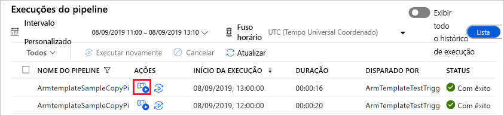
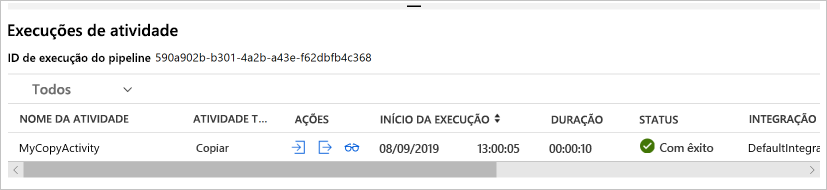

# <a name="tutorial-create-an-azure-data-factory-using-azure-resource-manager-template"></a>Tutorial: Criar um Azure data factory usando um modelo do Azure Resource Manager

> [!div class="op_single_selector" title1="Selecione a versão do serviço Data Factory que você está usando:"]
> * [Versão 1](v1/data-factory-build-your-first-pipeline-using-arm.md)
> * [Versão atual](quickstart-create-data-factory-resource-manager-template.md)

Este início rápido descreve como usar um modelo do Azure Resource Manager para criar um data factory do Azure. O pipeline que você criar nesse data factory **copia** dados de uma pasta para outra em um Armazenamento de Blobs do Azure. Para obter um tutorial sobre como **transformar** dados usando o Azure Data Factory, confira [Tutorial: Transformar dados usando o Spark](transform-data-using-spark.md).

> [!NOTE]
> Este artigo não fornece uma introdução detalhada do serviço Data Factory. Para obter uma introdução do serviço do Azure Data Factory, consulte [Introdução ao Azure Data Factory](introduction.md).

[!INCLUDE [data-factory-quickstart-prerequisites](../../includes/data-factory-quickstart-prerequisites.md)]

### <a name="azure-powershell"></a>Azure PowerShell

[!INCLUDE [updated-for-az](../../includes/updated-for-az.md)]

Instale os módulos mais recentes do Azure PowerShell seguindo as instruções em [Como instalar e configurar o Azure PowerShell](/powershell/azure/install-Az-ps).

## <a name="resource-manager-templates"></a>Modelos do Gerenciador de Recursos

Para saber mais sobre modelos do Azure Resource Manager, confira [Criar modelos do Azure Resource Manager](../azure-resource-manager/resource-group-authoring-templates.md).

A seção a seguir fornece o modelo do Resource Manager completo para definir entidades de Data Factory de modo que você possa percorrer o tutorial rapidamente e testar o modelo. Para entender como cada entidade de Data Factory é definida, consulte a seção [Entidades de Data Factory no modelo](#data-factory-entities-in-the-template).

Para saber mais sobre a sintaxe JSON e as propriedades de recursos do Data Factory em um modelo, confira [Tipos de recurso de Microsoft.DataFactory](/azure/templates/microsoft.datafactory/allversions).

## <a name="data-factory-json"></a>JSON do Data Factory

Crie um arquivo JSON chamado **ADFTutorialARM.json** na pasta **C:\ADFTutorial** (crie a pasta ADFTutorial caso ela ainda não exista) com o seguinte conteúdo:

```json
{  
    "$schema":"http://schema.management.azure.com/schemas/2015-01-01/deploymentTemplate.json#",
    "contentVersion":"1.0.0.0",
    "parameters":{  
        "dataFactoryName":{  
            "type":"string",
            "metadata":"Data Factory Name"
        },
        "dataFactoryLocation":{  
            "type":"string",
            "defaultValue":"East US",
            "metadata":{  
                "description":"Location of the data factory. Currently, only East US, East US 2, and West Europe are supported. "
            }
        },
        "storageAccountName":{  
            "type":"string",
            "metadata":{  
                "description":"Name of the Azure storage account that contains the input/output data."
            }
        },
        "storageAccountKey":{  
            "type":"securestring",
            "metadata":{  
                "description":"Key for the Azure storage account."
            }
        },
        "triggerStartTime": {
            "type": "string",
            "metadata": {
                "description": "Start time for the trigger."
            }
        },
        "triggerEndTime": {
            "type": "string",
            "metadata": {
                "description": "End time for the trigger."
            }
        }
    },      
    "variables":{  
        "factoryId":"[concat('Microsoft.DataFactory/factories/', parameters('dataFactoryName'))]"
    },
    "resources":[  
        {  
            "name":"[parameters('dataFactoryName')]",
            "apiVersion":"2018-06-01",
            "type":"Microsoft.DataFactory/factories",
            "location":"[parameters('dataFactoryLocation')]",
            "identity":{  
                "type":"SystemAssigned"
            },
            "resources":[  
                {  
                    "name":"[concat(parameters('dataFactoryName'), '/ArmtemplateStorageLinkedService')]",
                    "type":"Microsoft.DataFactory/factories/linkedServices",
                    "apiVersion":"2018-06-01",
                    "properties":{  
                        "annotations":[  

                        ],
                        "type":"AzureBlobStorage",
                        "typeProperties":{  
                            "connectionString":"[concat('DefaultEndpointsProtocol=https;AccountName=',parameters('storageAccountName'),';AccountKey=',parameters('storageAccountKey'))]"
                        }
                    },
                    "dependsOn":[  
                        "[parameters('dataFactoryName')]"
                    ]
                },
                {  
                    "name":"[concat(parameters('dataFactoryName'), '/ArmtemplateTestDatasetIn')]",
                    "type":"Microsoft.DataFactory/factories/datasets",
                    "apiVersion":"2018-06-01",
                    "properties":{  
                        "linkedServiceName":{  
                            "referenceName":"ArmtemplateStorageLinkedService",
                            "type":"LinkedServiceReference"
                        },
                        "annotations":[  

                        ],
                        "type":"Binary",
                        "typeProperties":{  
                            "location":{  
                                "type":"AzureBlobStorageLocation",
                                "fileName":"emp.txt",
                                "folderPath":"input",
                                "container":"adftutorial"
                            }
                        }
                    },
                    "dependsOn":[  
                        "[parameters('dataFactoryName')]",
                        "[concat(variables('factoryId'), '/linkedServices/ArmtemplateStorageLinkedService')]"
                    ]
                },
                {  
                    "name":"[concat(parameters('dataFactoryName'), '/ArmtemplateTestDatasetOut')]",
                    "type":"Microsoft.DataFactory/factories/datasets",
                    "apiVersion":"2018-06-01",
                    "properties":{  
                        "linkedServiceName":{  
                            "referenceName":"ArmtemplateStorageLinkedService",
                            "type":"LinkedServiceReference"
                        },
                        "annotations":[  

                        ],
                        "type":"Binary",
                        "typeProperties":{  
                            "location":{  
                                "type":"AzureBlobStorageLocation",
                                "folderPath":"output",
                                "container":"adftutorial"
                            }
                        }
                    },
                    "dependsOn":[  
                        "[parameters('dataFactoryName')]",
                        "[concat(variables('factoryId'), '/linkedServices/ArmtemplateStorageLinkedService')]"
                    ]
                },
                {  
                    "name":"[concat(parameters('dataFactoryName'), '/ArmtemplateSampleCopyPipeline')]",
                    "type":"Microsoft.DataFactory/factories/pipelines",
                    "apiVersion":"2018-06-01",
                    "properties":{  
                        "activities":[  
                            {  
                                "name":"MyCopyActivity",
                                "type":"Copy",
                                "dependsOn":[  

                                ],
                                "policy":{  
                                    "timeout":"7.00:00:00",
                                    "retry":0,
                                    "retryIntervalInSeconds":30,
                                    "secureOutput":false,
                                    "secureInput":false
                                },
                                "userProperties":[  

                                ],
                                "typeProperties":{  
                                    "source":{  
                                        "type":"BinarySource",
                                        "storeSettings":{  
                                            "type":"AzureBlobStorageReadSettings",
                                            "recursive":true
                                        }
                                    },
                                    "sink":{  
                                        "type":"BinarySink",
                                        "storeSettings":{  
                                            "type":"AzureBlobStorageWriteSettings"
                                        }
                                    },
                                    "enableStaging":false
                                },
                                "inputs":[  
                                    {  
                                        "referenceName":"ArmtemplateTestDatasetIn",
                                        "type":"DatasetReference",
                                        "parameters":{  

                                        }
                                    }
                                ],
                                "outputs":[  
                                    {  
                                        "referenceName":"ArmtemplateTestDatasetOut",
                                        "type":"DatasetReference",
                                        "parameters":{  

                                        }
                                    }
                                ]
                            }
                        ],
                        "annotations":[  

                        ]
                    },
                    "dependsOn":[  
                        "[parameters('dataFactoryName')]",
                        "[concat(variables('factoryId'), '/datasets/ArmtemplateTestDatasetIn')]",
                        "[concat(variables('factoryId'), '/datasets/ArmtemplateTestDatasetOut')]"
                    ]
                },
                {  
                    "name":"[concat(parameters('dataFactoryName'), '/ArmTemplateTestTrigger')]",
                    "type":"Microsoft.DataFactory/factories/triggers",
                    "apiVersion":"2018-06-01",
                    "properties":{  
                        "annotations":[  

                        ],
                        "runtimeState":"Started",
                        "pipelines":[  
                            {  
                                "pipelineReference":{  
                                    "referenceName":"ArmtemplateSampleCopyPipeline",
                                    "type":"PipelineReference"
                                },
                                "parameters":{  

                                }
                            }
                        ],
                        "type":"ScheduleTrigger",
                        "typeProperties":{  
                            "recurrence":{  
                                "frequency":"Hour",
                                "interval":1,
                                "startTime":"[parameters('triggerStartTime')]",
                                "endTime":"[parameters('triggerEndTime')]",
                                "timeZone":"UTC"
                            }
                        }
                    },
                    "dependsOn":[  
                        "[parameters('dataFactoryName')]",
                        "[concat(variables('factoryId'), '/pipelines/ArmtemplateSampleCopyPipeline')]"
                    ]
                }
            ]
        }
    ]
}
```
## <a name="parameters-json"></a>Parâmetros JSON

Crie um arquivo JSON chamado **ADFTutorialARM-Parameters.json** que contenha os parâmetros para o modelo do Azure Resource Manager.

> [!IMPORTANT]
> - Especifique o nome e a chave da conta de armazenamento do Azure para os parâmetros **storageAccountName** e **storageAccountKey** nesse arquivo de parâmetro. Você criou o contêiner adftutorial e carregou o arquivo de exemplo (emp.txt) na pasta de entrada nesse armazenamento de blobs do Azure.
> - Especifique um nome global exclusivo para o data factory para o parâmetro **dataFactoryName**. Por exemplo:  ARMTutorialFactoryJohnDoe11282017.
> - Para **triggerStartTime**, especifique o dia atual no formato: `2019-09-08T00:00:00`.
> - Para **triggerEndTime**, especifique o próximo dia no formato: `2019-09-09T00:00:00`. Você também pode verificar a hora UTC atual e especificar a próxima um ou duas horas como a hora de término. Por exemplo, se a hora UTC agora for 1h32, especifique `2019-09-09:03:00:00` como a hora de término. Nesse caso, o gatilho executa o pipeline duas vezes (às 2h e às 3h).

```json
{  
    "$schema":"https://schema.management.azure.com/schemas/2015-01-01/deploymentParameters.json#",
    "contentVersion":"1.0.0.0",
    "parameters":{  
        "dataFactoryName":{  
            "value":"<datafactoryname>"
        },
        "dataFactoryLocation":{  
            "value":"East US"
        },
        "storageAccountName":{  
            "value":"<yourstorageaccountname>"
        },
        "storageAccountKey":{  
            "value":"<yourstorageaccountkey>"
        },
        "triggerStartTime":{  
            "value":"2019-09-08T11:00:00"
        },
        "triggerEndTime":{  
            "value":"2019-09-08T14:00:00"
        }
    }
}
```

> [!IMPORTANT]
> Você pode ter arquivos JSON de parâmetros separados para desenvolvimento, teste e ambientes de produção que pode usar com o mesmo modelo JSON do Data Factory. Usando um script do PowerShell, você pode automatizar a implantação de entidades de Data Factory nesses ambientes.

## <a name="deploy-data-factory-entities"></a>Implantar entidades de data factory

No PowerShell, execute o comando a seguir para implantar entidades do Data Factory em seu grupo de recursos (nesse caso, use ADFTutorialResourceGroup como exemplo) usando o modelo do Resource Manager criado anteriormente neste início rápido.

```powershell
New-AzResourceGroupDeployment -Name MyARMDeployment -ResourceGroupName ADFTutorialResourceGroup -TemplateFile C:\ADFTutorial\ADFTutorialARM.json -TemplateParameterFile C:\ADFTutorial\ADFTutorialARM-Parameters.json
```

Você verá uma saída semelhante ao exemplo a seguir:

```console
DeploymentName          : MyARMDeployment
ResourceGroupName       : ADFTutorialResourceGroup
ProvisioningState       : Succeeded
Timestamp               : 9/8/2019 10:52:29 AM
Mode                    : Incremental
TemplateLink            : 
Parameters              : 
                          Name                   Type                       Value     
                          =====================  =========================  ==========
                          dataFactoryName        String                     <data factory name>
                          dataFactoryLocation    String                     East US   
                          storageAccountName     String                     <storage account name>
                          storageAccountKey      SecureString                         
                          triggerStartTime       String                     9/8/2019 11:00:00 AM
                          triggerEndTime         String                     9/8/2019 2:00:00 PM
                          
Outputs                 : 
DeploymentDebugLogLevel : 
```

## <a name="start-the-trigger"></a>Iniciar o gatilho

O modelo implanta as seguintes entidades de Data Factory:

- Serviço vinculado de armazenamento do Azure
- Conjuntos de dados binários (entrada e saída)
- Pipeline com uma atividade de cópia
- Gatilho para disparar o pipeline

O gatilho implantado está no estado interrompido. Uma das maneiras de iniciar o gatilho é usar o cmdlet do PowerShell **Start-AzDataFactoryV2Trigger**. O procedimento a seguir fornece as etapas detalhadas:

1. Na janela do PowerShell, crie uma variável para conter o nome do grupo de recursos. Copie o seguinte comando na janela do PowerShell e pressione ENTER. Se você tiver especificado um nome de grupo de recursos diferente para o comando New-AzResourceGroupDeployment, atualize o valor aqui.

    ```powershell
    $resourceGroupName = "ADFTutorialResourceGroup"
    ```
2. Crie uma variável para conter o nome do data factory. Especifique o mesmo nome que você especificou no arquivo ADFTutorialARM-Parameters.json.

    ```powershell
    $dataFactoryName = "<yourdatafactoryname>"
    ```
3. Defina uma variável para o nome do gatilho. O nome do gatilho está codificada no arquivo de modelo do Resource Manager (ADFTutorialARM.json).

    ```powershell
    $triggerName = "ArmTemplateTestTrigger"
    ```
4. Obtenha o **status do gatilho** executando o seguinte comando do PowerShell depois de especificar o nome de seu data factory e do gatilho:

    ```powershell
    Get-AzDataFactoryV2Trigger -ResourceGroupName $resourceGroupName -DataFactoryName $dataFactoryName -Name $triggerName
    ```

    Veja o exemplo de saída:

    ```json

    TriggerName       : ArmTemplateTestTrigger
    ResourceGroupName : ADFTutorialResourceGroup
    DataFactoryName   : ADFQuickstartsDataFactory0905
    Properties        : Microsoft.Azure.Management.DataFactory.Models.ScheduleTrigger
    RuntimeState      : Stopped
    ```
    
    Observe que o estado do tempo de execução do gatilho é **Parado**.
5. **Iniciar o gatilho**. O gatilho executa o pipeline definido no modelo na hora. Ou seja, se você executou esse comando às 14h25, o gatilho executará o pipeline às 15h pela primeira vez. Em seguida, ele executa o pipeline a cada hora até a hora de término especificada para o gatilho.

    ```powershell
    Start-AzDataFactoryV2Trigger -ResourceGroupName $resourceGroupName -DataFactoryName $dataFactoryName -TriggerName $triggerName
    ```
    
    Veja o exemplo de saída:
    
    ```console
    Confirm
    Are you sure you want to start trigger 'ArmTemplateTestTrigger' in data factory 'ARMFactory1128'?
    [Y] Yes  [N] No  [S] Suspend  [?] Help (default is "Y"): y
    True
    ```
6. Confirme que o gatilho foi iniciado executando novamente o comando Get-AzDataFactoryV2Trigger.

    ```powershell
    Get-AzDataFactoryV2Trigger -ResourceGroupName $resourceGroupName -DataFactoryName $dataFactoryName -TriggerName $triggerName
    ```
    
    Veja o exemplo de saída:
    
    ```console
    TriggerName       : ArmTemplateTestTrigger
    ResourceGroupName : ADFTutorialResourceGroup
    DataFactoryName   : ADFQuickstartsDataFactory0905
    Properties        : Microsoft.Azure.Management.DataFactory.Models.ScheduleTrigger
    RuntimeState      : Started
    ```

## <a name="monitor-the-pipeline"></a>Monitorar o Pipeline

1. Após o logon no [portal do Azure](https://portal.azure.com/), clique em **Todos os serviços**, pesquise com uma palavra-chave como **data fa** e selecione **Data factories**.

2. Na página **Data Factories**, clique no data factory que você criou. Se for necessário, filtre a lista com o nome de seu data factory.

3. Na página Data Factory, clique no bloco **Criar e Monitorar**.

4. Na página **Vamos começar**, selecione a **guia Monitorar**.  

    > [!IMPORTANT]
    > Você verá as execuções de pipeline somente por hora (por exemplo: 4h, 5h, 6h etc.). Clique em **Atualizar** na barra de ferramentas para atualizar a lista quando o tempo atingir a próxima hora.

5. Clique no link **Exibir Execuções de Atividade** na coluna **Ações**.

    

6. Você vê as execuções de atividade associadas à execução do pipeline. Neste início rápido, o pipeline tem apenas uma atividade do tipo: Cópia. Portanto, você vê uma execução para essa atividade.

    
7. Clique no link **Saída** na coluna Ações. Veja a saída da operação de cópia em uma janela **Saída**. Clique no botão maximizar para ver a saída completa. Você pode minimizar a janela de saída ou fechá-la.

8. Interrompa o gatilho quando vir uma execução bem-sucedida/com falha. O gatilho executa o pipeline uma vez por hora. O pipeline copia o mesmo arquivo da pasta de entrada para a pasta de saída para cada execução. Para interromper o gatilho, execute o seguinte comando na janela do PowerShell.
    
    ```powershell
    Stop-AzDataFactoryV2Trigger -ResourceGroupName $resourceGroupName -DataFactoryName $dataFactoryName -Name $triggerName
    ```

[!INCLUDE [data-factory-quickstart-verify-output-cleanup.md](../../includes/data-factory-quickstart-verify-output-cleanup.md)]

## <a name="data-factory-entities-in-the-template"></a> Definições JSON para entidades

As seguintes entidades de Data Factory são definidas no modelo JSON:

- [Serviço vinculado de armazenamento do Azure](#azure-storage-linked-service)
- [Conjunto de dados de entrada binário](#binary-input-dataset)
- [Conjunto de dados de saída binário](#binary-output-dataset)
- [Pipeline com a Atividade de cópia](#data-pipeline)
- [Gatilho](#trigger)

#### <a name="azure-storage-linked-service"></a>Serviço vinculado de armazenamento do Azure

O AzureStorageLinkedService vincula sua conta do armazenamento do Azure ao data factory. Você criou um contêiner e carregou dados nessa conta de armazenamento como parte dos pré-requisitos. Especifique o nome e a chave da sua conta de armazenamento do Azure nesta seção. Consulte [Serviço vinculado de Armazenamento do Azure](connector-azure-blob-storage.md#linked-service-properties) para obter detalhes sobre os propriedades JSON usadas para definir um serviço vinculado de armazenamento do Azure.

```json
{  
    "name":"[concat(parameters('dataFactoryName'), '/ArmtemplateStorageLinkedService')]",
    "type":"Microsoft.DataFactory/factories/linkedServices",
    "apiVersion":"2018-06-01",
    "properties":{  
        "annotations":[  

        ],
        "type":"AzureBlobStorage",
        "typeProperties":{  
            "connectionString":"[concat('DefaultEndpointsProtocol=https;AccountName=',parameters('storageAccountName'),';AccountKey=',parameters('storageAccountKey'))]"
        }
    },
    "dependsOn":[  
        "[parameters('dataFactoryName')]"
    ]
}
```

A connectionString usa os parâmetros storageAccountName e storageAccountKey. Os valores para esses parâmetros são passados pelo uso de um arquivo de configuração. A definição também usa variáveis: azureStorageLinkedService e dataFactoryName definidos no modelo.

#### <a name="binary-input-dataset"></a>Conjunto de dados de entrada binário

O serviço vinculado do Armazenamento do Azure especifica a cadeia de conexão que o serviço Data Factory usa no tempo de execução para se conectar à sua conta do Armazenamento do Azure. Na definição de Conjunto de dados binários, especifique os nomes do contêiner de blob, da pasta e do arquivo que contém os dados de entrada. Confira [Propriedades do conjunto de dados binário](format-binary.md#dataset-properties) para obter detalhes sobre as propriedades JSON usadas para definir um conjunto de dados binário.

```json
{  
    "name":"[concat(parameters('dataFactoryName'), '/ArmtemplateTestDatasetIn')]",
    "type":"Microsoft.DataFactory/factories/datasets",
    "apiVersion":"2018-06-01",
    "properties":{  
        "linkedServiceName":{  
            "referenceName":"ArmtemplateStorageLinkedService",
            "type":"LinkedServiceReference"
        },
        "annotations":[  

        ],
        "type":"Binary",
        "typeProperties":{  
            "location":{  
                "type":"AzureBlobStorageLocation",
                "fileName":"emp.txt",
                "folderPath":"input",
                "container":"adftutorial"
            }
        }
    },
    "dependsOn":[  
        "[parameters('dataFactoryName')]",
        "[concat(variables('factoryId'), '/linkedServices/ArmtemplateStorageLinkedService')]"
    ]
}
```

#### <a name="binary-output-dataset"></a>Conjunto de dados de saída binário

Você pode especificar o nome da pasta no Armazenamento de Blobs do Azure que contém os dados copiados da pasta de entrada. Confira [Propriedades do conjunto de dados binário](format-binary.md#dataset-properties) para obter detalhes sobre as propriedades JSON usadas para definir um conjunto de dados binário.

```json
{  
    "name":"[concat(parameters('dataFactoryName'), '/ArmtemplateTestDatasetOut')]",
    "type":"Microsoft.DataFactory/factories/datasets",
    "apiVersion":"2018-06-01",
    "properties":{  
        "linkedServiceName":{  
            "referenceName":"ArmtemplateStorageLinkedService",
            "type":"LinkedServiceReference"
        },
        "annotations":[  

        ],
        "type":"Binary",
        "typeProperties":{  
            "location":{  
                "type":"AzureBlobStorageLocation",
                "folderPath":"output",
                "container":"adftutorial"
            }
        }
    },
    "dependsOn":[  
        "[parameters('dataFactoryName')]",
        "[concat(variables('factoryId'), '/linkedServices/ArmtemplateStorageLinkedService')]"
    ]
}
```

#### <a name="data-pipeline"></a>Pipeline de dados

Você define um pipeline que copia os dados de um conjunto de dados binário para outro conjunto de dados binário. Confira [JSON de Pipeline](concepts-pipelines-activities.md#pipeline-json) para obter descrições dos elementos JSON usados para definir um pipeline neste exemplo.

```json
{  
    "name":"[concat(parameters('dataFactoryName'), '/ArmtemplateSampleCopyPipeline')]",
    "type":"Microsoft.DataFactory/factories/pipelines",
    "apiVersion":"2018-06-01",
    "properties":{  
        "activities":[  
            {  
                "name":"MyCopyActivity",
                "type":"Copy",
                "dependsOn":[  

                ],
                "policy":{  
                    "timeout":"7.00:00:00",
                    "retry":0,
                    "retryIntervalInSeconds":30,
                    "secureOutput":false,
                    "secureInput":false
                },
                "userProperties":[  

                ],
                "typeProperties":{  
                    "source":{  
                        "type":"BinarySource",
                        "storeSettings":{  
                            "type":"AzureBlobStorageReadSettings",
                            "recursive":true
                        }
                    },
                    "sink":{  
                        "type":"BinarySink",
                        "storeSettings":{  
                            "type":"AzureBlobStorageWriteSettings"
                        }
                    },
                    "enableStaging":false
                },
                "inputs":[  
                    {  
                        "referenceName":"ArmtemplateTestDatasetIn",
                        "type":"DatasetReference",
                        "parameters":{  

                        }
                    }
                ],
                "outputs":[  
                    {  
                        "referenceName":"ArmtemplateTestDatasetOut",
                        "type":"DatasetReference",
                        "parameters":{  

                        }
                    }
                ]
            }
        ],
        "annotations":[  

        ]
    },
    "dependsOn":[  
        "[parameters('dataFactoryName')]",
        "[concat(variables('factoryId'), '/datasets/ArmtemplateTestDatasetIn')]",
        "[concat(variables('factoryId'), '/datasets/ArmtemplateTestDatasetOut')]"
    ]
}
```

#### <a name="trigger"></a>Gatilho

Defina um disparador que executa o pipeline uma vez por hora. O gatilho implantado está no estado interrompido. Inicie o gatilho usando o cmdlet **Start-AzDataFactoryV2Trigger**. Para obter mais informações sobre gatilhos, consulte o artigo [Gatilhos e execução de pipeline](concepts-pipeline-execution-triggers.md#triggers).

```json
{  
    "name":"[concat(parameters('dataFactoryName'), '/ArmTemplateTestTrigger')]",
    "type":"Microsoft.DataFactory/factories/triggers",
    "apiVersion":"2018-06-01",
    "properties":{  
        "annotations":[  

        ],
        "runtimeState":"Started",
        "pipelines":[  
            {  
                "pipelineReference":{  
                    "referenceName":"ArmtemplateSampleCopyPipeline",
                    "type":"PipelineReference"
                },
                "parameters":{  

                }
            }
        ],
        "type":"ScheduleTrigger",
        "typeProperties":{  
            "recurrence":{  
                "frequency":"Hour",
                "interval":1,
                "startTime":"[parameters('triggerStartTime')]",
                "endTime":"[parameters('triggerEndTime')]",
                "timeZone":"UTC"
            }
        }
    },
    "dependsOn":[  
        "[parameters('dataFactoryName')]",
        "[concat(variables('factoryId'), '/pipelines/ArmtemplateSampleCopyPipeline')]"
    ]
}
```

## <a name="reuse-the-template"></a>Reutilizar o modelo

No tutorial, você criou um modelo para definir entidades de Data Factory e um modelo para passar valores para parâmetros. Para usar o mesmo modelo para implantar as entidades de Data Factory em ambientes diferentes, você cria um arquivo de parâmetro para cada ambiente e usa-o ao implantar esse ambiente.

Exemplo:

```powershell
New-AzResourceGroupDeployment -Name MyARMDeployment -ResourceGroupName ADFTutorialResourceGroup -TemplateFile ADFTutorialARM.json -TemplateParameterFile ADFTutorialARM-Parameters-Dev.json

New-AzResourceGroupDeployment -Name MyARMDeployment -ResourceGroupName ADFTutorialResourceGroup -TemplateFile ADFTutorialARM.json -TemplateParameterFile ADFTutorialARM-Parameters-Test.json

New-AzResourceGroupDeployment -Name MyARMDeployment -ResourceGroupName ADFTutorialResourceGroup -TemplateFile ADFTutorialARM.json -TemplateParameterFile ADFTutorialARM-Parameters-Production.json
```

Observe que o primeiro comando usa o arquivo de parâmetro para o ambiente de desenvolvimento, outro para o ambiente de teste e um terceiro para o ambiente de produção.

Também é possível reutilizar o modelo para executar tarefas repetidas. Por exemplo, crie vários data factories com um ou mais pipelines que implementem a mesma lógica, mas cada data factory usa contas de armazenamento do Azure diferentes. Nesse cenário, você usa o mesmo modelo no mesmo ambiente (desenvolvimento, teste ou produção) com arquivos de parâmetros diferentes para criar data factories.

## <a name="next-steps"></a>Próximas etapas

O pipeline nessa amostra copia dados de uma localização para outra em um Armazenamento de Blobs do Azure. Percorra os [tutoriais](tutorial-copy-data-dot-net.md) para saber mais sobre o uso do Data Factory em mais cenários.
