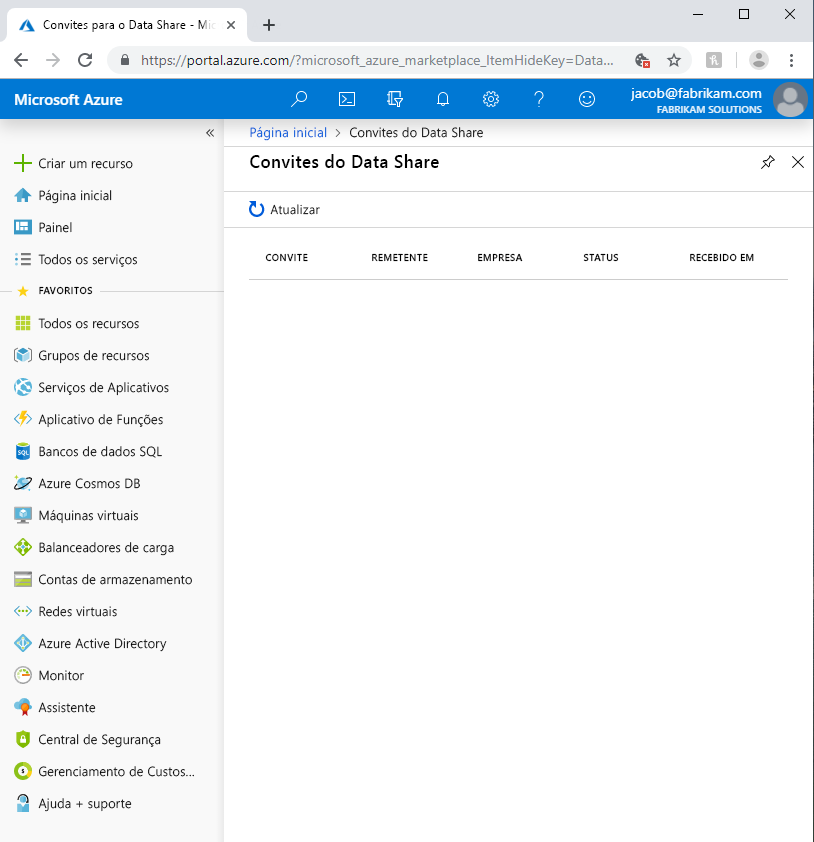
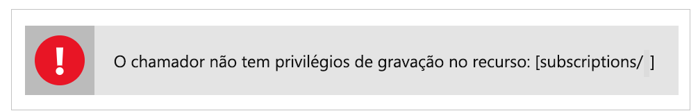

# Solucionar problemas comuns na versão prévia do Azure Data Share

Este artigo mostra como solucionar problemas comuns na versão prévia do Azure Data Share. 

## Convites do Azure Data Share 

Em alguns casos, quando um novo usuário clica em **Aceitar Convite** no convite de email enviado, pode ser apresentada a ele uma lista de convites vazia. 

O erro acima é um problema conhecido com o serviço e está sendo tratado. Como solução alternativa, siga as etapas abaixo. 

1. No portal do Azure, navegue até **Assinaturas**
1. Selecione a assinatura que você está usando para o Azure Data Share
1. Clique em **Provedores de Recursos**
1. Pesquise Microsoft.DataShare
1. Clique em **Registrar**

Você precisará ter a [função de RBAC do Colaborador do Azure](https://docs.microsoft.com/azure/role-based-access-control/built-in-roles#contributor) para concluir estas etapas. 

Se ainda não vir um convite para compartilhamento de dados, entre em contato com seu provedor de dados e verifique se ele enviou o convite para seu endereço de email de logon do Azure, e *não* para seu alias de email. 

> [!IMPORTANT]
> Se você já tiver aceitado um convite do Azure Data Share e saído do serviço antes de configurar o armazenamento, siga as instruções detalhadas no guia de instruções [Configurar um mapeamento de conjunto de dados](how-to-configure-mapping.md) para saber como concluir a configuração de seu compartilhamento de dados recebido e começar a receber dados. 

## Erro ao criar ou receber um novo Data Share

"Erro: A operação retornou um código de status inválido, 'BadRequest'"

"Erro: AuthorizationFailed"

"Erro: atribuição de função à conta de armazenamento"

Se você receber qualquer um dos erros acima ao criar um novo compartilhamento de dados ou receber um novo compartilhamento de dados, haverá permissões insuficientes para a conta de armazenamento. A permissão necessária é *Microsoft.Authorization/atribuições de função/gravação*, que existe na função de proprietário de armazenamento ou pode ser atribuída a uma função personalizada. Mesmo que você tenha criou a conta de armazenamento, isso NÃO o torna automaticamente o proprietário dessa conta. Siga estas etapas para permitir a si mesmo a função de proprietário da conta de armazenamento. Como alternativa, uma função personalizada pode ser criada com essa permissão à qual você pode adicionar a si próprio.  

1. Vá até a conta de Armazenamento no portal do Azure
1. Selecione **Controle de Acesso (IAM)**
1. Clique em **Adicionar**
1. Adicione a si mesmo como proprietário.

## Próximas etapas

Para saber como iniciar o compartilhamento de dados, continue com o tutorial sobre como [compartilhar seus dados](share-your-data.md).

