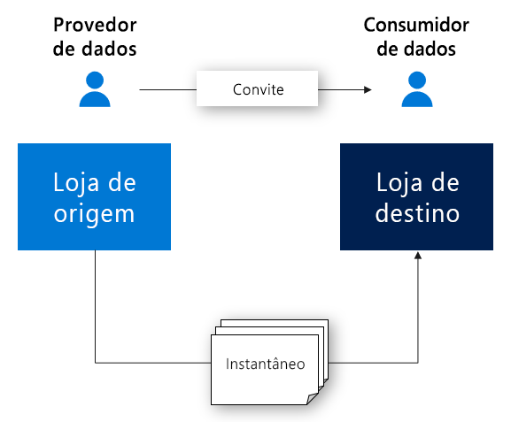

# O que é o Azure Data Share (versão prévia)?

No mundo de hoje, os dados são exibidos como um ativo estratégico essencial que muitas organizações precisam compartilhar de modo simples e seguro com seus clientes e parceiros. Há muitas maneiras de que os clientes fazerem isso hoje, incluindo por meio de FTP, email e APIs, para mencionar algumas. As organizações podem facilmente perder o controle de com quem elas o compartilharam seus dados. Compartilhar dados por meio de FTP ou a própria infraestrutura de API costuma ser caro de provisionar e administrar. Há sobrecarga de gerenciamento associada ao uso desses métodos de compartilhamento em grande escala. 

Muitas organizações precisam responsabilizar-se pelos dados compartilhados. Além da responsabilidade, muitas organizações gostariam de poder controlar, gerenciar e monitorar todo o compartilhamento de dados de uma maneira simples. No mundo de hoje, em que os dados devem continuar a crescer em um ritmo exponencial, as organizações precisam de uma maneira simples de compartilhar Big Data. Os clientes exigem os dados mais atualizados para garantir que possam obter insights em tempo hábil.

O Azure Data Share (versão prévia) permite que as organizações compartilhem dados de modo simples e seguro com vários clientes e parceiros. Em apenas alguns cliques, você pode provisionar uma nova conta de compartilhamento de dados, adicionar conjuntos de dados e convidar seus clientes e parceiros para o compartilhamento de dados. Provedores de dados estão sempre no controle dos dados que compartilharam. O Azure Data Share facilita o gerenciamento e o monitoramento de quais dados foram compartilhados, quando e por quem. 

Um provedor de dados pode se manter no controle de como seus dados são tratados especificando termos de uso para seu compartilhamento de dados. O consumidor de dados deve aceitar esses termos antes de poder receber os dados. Os provedores de dados podem especificar a frequência com que seus consumidores de dados recebem atualizações. O acesso a novas atualizações pode ser revogado a qualquer momento pelo provedor de dados. 

O Azure Data Share ajuda a aprimorar os insights tornando fácil combinar dados de terceiros para enriquecer os cenários de IA e análise. Use facilmente o poder das ferramentas de análise do Azure para facilmente preparar, processar e analisar os dados compartilhados usando o Azure Data Share. 

O provedor de dados e o consumidor de dados precisam ter uma assinatura do Azure para compartilhar e receber dados. Se você não tiver uma assinatura do Azure, crie uma [conta gratuita](https://azure.microsoft.com/free/).

## Cenários para o Azure Data Share

O Azure Data Share pode ser usado em vários setores diferentes. Por exemplo, um varejista talvez queira compartilhar dados recentes de ponto de vendas com seus fornecedores. Usando o Azure Data Share, um varejista pode configurar um compartilhamento de dados contendo dados do ponto de vendas para todos os fornecedores e compartilhar vendas por hora ou por dia. 

O Azure Data Share também pode ser usado para estabelecer um mercado de dados para um setor específico. Por exemplo, um governo ou uma instituição de pesquisa que compartilha regularmente dados anônimos sobre o crescimento da população com terceiros. 

Outro caso de uso do Azure Data Share é estabelecer um consórcio de dados. Por exemplo, várias instituições de pesquisa diferentes podem compartilhar dados com um único órgão confiável. Os dados são analisados, agregados ou processados usando ferramentas de análise do Azure e, em seguida, compartilhados com as partes interessadas. 

## Como ele funciona

O Azure Data Share usa uma abordagem de compartilhamento baseada em instantâneo, em que os dados passam da assinatura do Azure do provedor de dados e chegam à assinatura do Azure do consumidor de dados. Como um provedor de dados, você provisiona um compartilhamento de dados e convida destinatários para ele. Os consumidores de dados recebem um convite para o compartilhamento de dados por email. Depois que um consumidor de dados aceita o convite, ele pode disparar um instantâneo completo dos dados que compartilhou com ele. Esses dados são recebidos na conta de armazenamento dos consumidores de dados. Os consumidores de dados podem receber atualizações regulares incrementais dos dados compartilhados com eles para que sempre tenham a versão mais recente dos dados. 

Os provedores de dados podem oferecer a seus consumidores de dados atualizações incrementais aos dados compartilhados com eles por meio de um agendamento de instantâneo. Agendas de instantâneo são oferecidas por hora ou por dia. Quando um consumidor de dados aceita e configura o compartilhamento de dados, ele pode assinar uma agenda de instantâneo. Isso é útil em cenários em que os dados compartilhados são atualizados regularmente e o consumidor de dados precisa dos dados mais atualizados. 

Quando um consumidor de dados aceita um compartilhamento de dados, ele é capaz de receber os dados em uma conta de armazenamento de sua escolha. Por exemplo, se o provedor de dados compartilhar dados usando o Armazenamento de Blobs do Azure, o consumidor de dados poderá receber esses dados no Azure Data Lake Storage. 

## Principais recursos

O Azure Data Share permite aos provedores de dados:

* Compartilhar dados do Armazenamento do Azure e do Azure Data Lake Storage com clientes e parceiros fora da organização

* Manter o controle de com quem você compartilhou seus dados

* Com que frequência os consumidores de dados estão recebendo atualizações para seus dados

* Permitir que seus clientes efetuem pull da versão mais recente dos seus dados conforme necessário ou permitir que recebam automaticamente as alterações incrementais aos seus dados a um intervalo definido por você

O Azure Data Share permite aos consumidores de dados: 

* Exibir uma descrição do tipo de dados que estão sendo compartilhados

* Exibir os termos de uso para os dados

* Aceitar ou rejeitar um convite do Azure Data Share

* Disparar um instantâneo completo ou incremental de um Data Share que uma organização compartilhou com você

* Assinar um Data Share para receber a cópia mais recente dos dados por meio da cópia de instantâneo incremental

* Aceitar dados compartilhados com você em uma conta do Armazenamento de Blobs do Azure ou do Azure Data Lake Gen2

Todas as principais funcionalidades listadas acima têm suporte por meio do Azure ou por meio das APIs REST. Para obter mais detalhes sobre como usar o Azure Data Share por meio de APIs REST, confira nossa documentação de referência. 

## Segurança

O Azure Data Share aproveita a segurança subjacente oferecida pelo Azure para proteger dados em repouso e em trânsito. Os dados são criptografados em repouso, quando isso é compatível suporte com mecanismo de armazenamento subjacente. Os dados também são criptografados em trânsito. Os metadados sobre um compartilhamento de dados também são criptografados em repouso e em trânsito. 

Controles de acesso podem ser definidos no nível do recurso do Azure Data Share para garantir que sejam acessados por pessoas autorizadas. 

O Azure Data Share aproveita as Identidades Gerenciadas para Recursos do Azure (anteriormente conhecidas como MSIs) para o gerenciamento automático de identidades no Azure Active Directory. As identidades gerenciadas para Recursos do Azure são usadas para acesso às contas de armazenamento que estão sendo usados para compartilhamento de dados. Não há troca de credenciais entre um provedor de dados e um consumidor de dados. Para saber mais, confira a página [Identidades gerenciadas para recursos do Azure](https://docs.microsoft.com/azure/active-directory/managed-identities-azure-resources/services-support-managed-identities). 

## Regiões com suporte

Para obter uma lista de regiões do Azure que disponibilizam o Azure Data Share, confira a página [produtos disponíveis por região](https://azure.microsoft.com/global-infrastructure/services/) e pesquise pelo Azure Data Share. 

O Azure Data Share não armazena, ele próprio, todos os dados. Os dados são armazenados nas contas de armazenamento subjacentes que estão sendo compartilhadas. Por exemplo, se um produtor de dados armazena seus dados em uma conta do Azure Data Lake Storage localizada no Oeste dos EUA, é lá que dados são armazenados. Se ele estiver compartilhando dados com uma conta de Armazenamento do Azure localizada no Oeste da Europa, os dados serão transferidos diretamente para a conta de Armazenamento do Azure no Oeste da Europa. 

O serviço do Azure Data Share não precisa estar disponível em sua região para aproveitar o serviço. Por exemplo, se você tiver dados armazenados em uma conta de Armazenamento do Azure localizada em uma região em que o Azure Data Share ainda não está disponível, ainda poderá aproveitar o serviço para compartilhar seus dados. 

## Próximas etapas

Para saber como iniciar o compartilhamento de dados, continue com o tutorial sobre como [compartilhar seus dados](share-your-data.md).
